Hola otra vez, vamos a resolver otra máquina de [Dockerlabs](https://dockerlabs.es/#/), en este caso la máquina se llama BorazuwarahCTF y es una de la categoría más fácil de Dockerlabs de [El Pingüino de Mario](https://www.youtube.com/channel/UCGLfzfKRUsV6BzkrF1kJGsg).

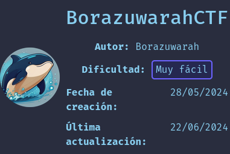

---------------------------------------------------------------------------------------------------------------------------------------------------

Sin más que añadir vamos a ello, como siempre empezaremos por descargar la máquina y realizar su instalación, recordad que funcionan mediante docker por lo que estaremos creando un contenedor en nuestra máquina local en el que se almacenará la máquina víctima.

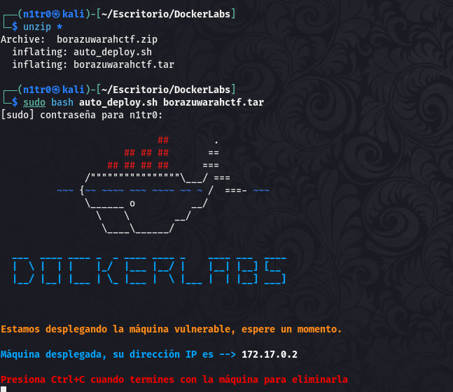

Empezaremos realizando un ping a la máquina para verificar su correcto funcionamiento, al hacerlo vemos que tiene un TTL de 64, lo que significa que la máquina objetivo usa un sistema operativo Linux.

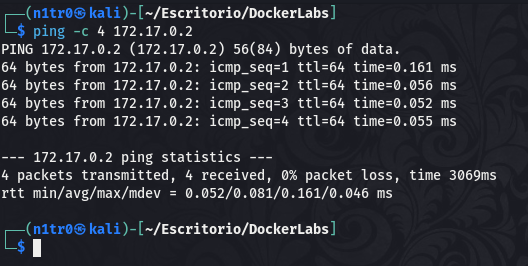

Como vemos, la máquina funciona correctamente y podemos empezar con el proceso de enumeración de la misma, vamos a ello.

# Enumeración

Lo primero que haremos para enumerar esta máquina será realizar un escaneo básico de puertos para identificar cuáles están abiertos.

```sudo nmap -p- --min-rate 5000 172.17.0.2 -Pn -n -oN escaneo```

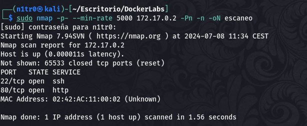

Identificamos dos puertos abiertos, el 22 y el 80, haciendo referencia a servicios SSH y HTTP respectivamente. De cualquier forma realizaremos un escaneo más exhaustivo para lanzar scripts básicos de reconocimiento y tratar de enumerar las versiones de los mismos.

```sudo nmap -p 22,80 -sCV 172.17.0.2 -Pn -n -oN escaneoSC```

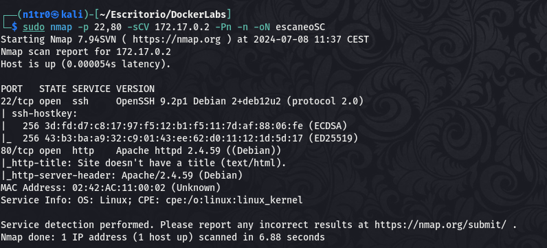

No encontramos nada demasiado interesante, vamos a acceder al puerto 80 para ver qué podemos encontrarnos y a ver si encontramos algo que nos sirva para acceder al sistema, vamos allá.

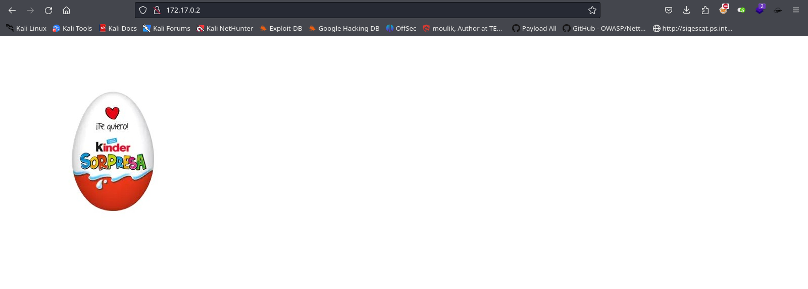

Qué bonito, no me lo esperaba xD 

En el código fuente no encontramos nada así que vamos a fuzzear para tratar de enumerar directorios y archivos que estén ocultos.

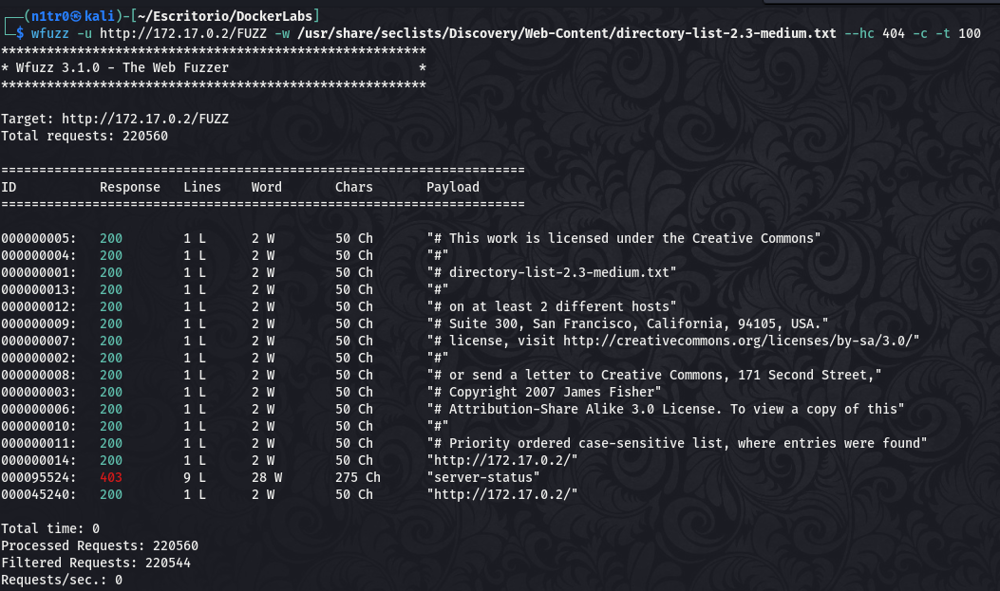

No parece que haya nada que se nos escape, también miramos las tecnologías utilizadas por la web y no hay nada que llame nuestra atención. 

Lo único que ha sido destacable hasta el momento ha sido la imagen que nos daba la bienvenida una vez que entrábamos al servicio web, vamos a descargarla en nuestra máquina y a intentar extraer los metadatos en busca de algo que podamos rascar.

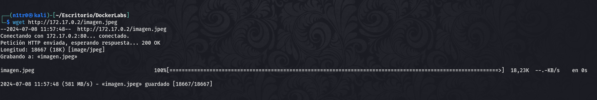

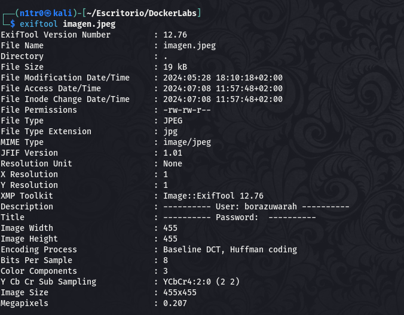

# Explotación

Parece que aquí sí podemos encontrar algo que nos permite aumentar el vector de ataque. Encontramos un usuario en la descripción de la imagen, y si recordamos el escaneo de puertos tenemos el puerto 22 abierto, sabiendo estas dos cosas podemos lanzar un ataque de fuerza bruta al servicio SSH para lograr obtener un inicio de sesión exitoso y conseguir así nuestro primer acceso.

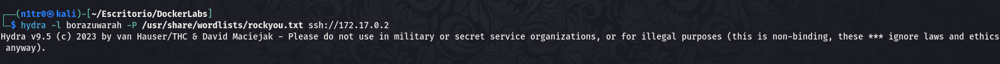

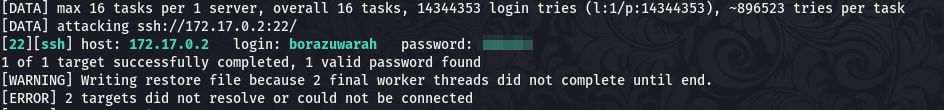

Tenemos las credenciales del usuario, vamos a conectarnos por SSH.

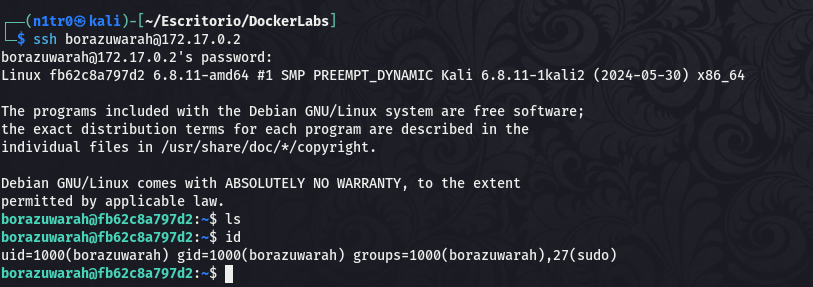

Estamos dentro y hemos logrado nuestro primer acceso, vamos a buscar la forma de elevar nuestros privilegios.


# Post-Explotación

Una vez estamos dentro enumeraremos nuestros permisos para ver si tenemos alguna forma de elevar privilegios y comprometer por completo el sistema. Usaremos el comando ```sudo -l``` para ver qué comandos puede usar nuestro usuario como root.

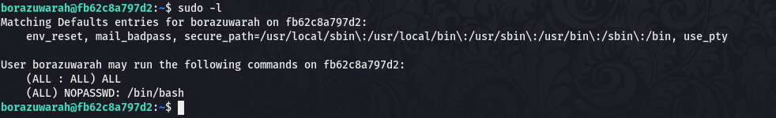

Vemos que el usuario puede usar bash como root, este es uno de los permisos más peligrosos ya que nos da la capacidad de directamente abrir una shell como el usuario root y comprometer por completo el sistema.

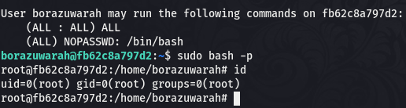

Con el comando ```sudo bash -p``` podemos obtener esta shell y tenemos el control total sobre la máquina habiendo completado el reto. 

Espero que os haya gustado mucho y nos vemos en la siguiente :)


