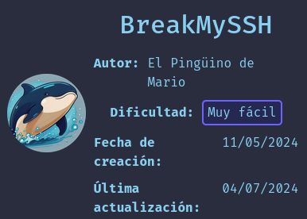
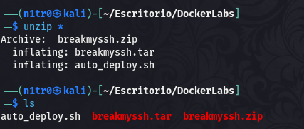
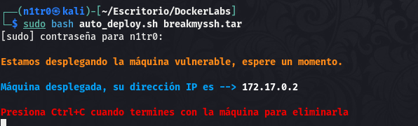
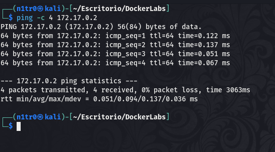
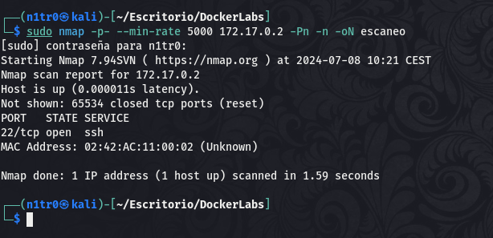
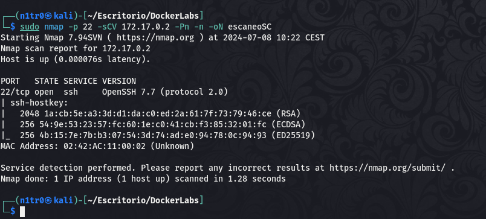
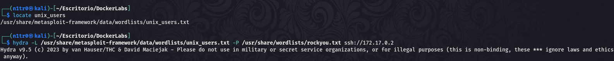
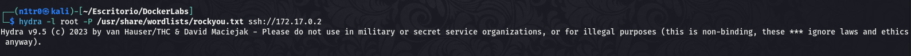
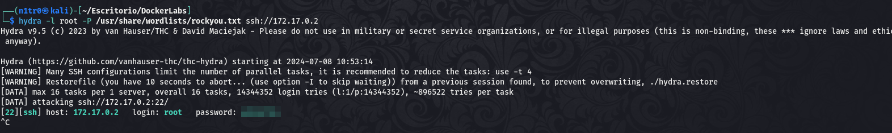
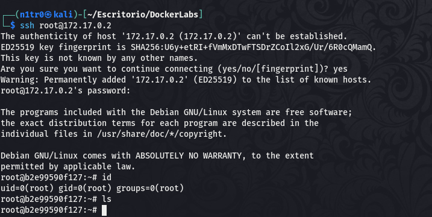

Hola otra vez, vamos a resolver otra máquina de [Dockerlabs](https://dockerlabs.es/#/), en este caso la máquina se llama BreakMySSH y es una de la categoría más fácil de Dockerlabs de [El Pingüino de Mario](https://www.youtube.com/channel/UCGLfzfKRUsV6BzkrF1kJGsg). 



---------------------------------------------------------------------------------------------------------------------------------------------------

Sin más que añadir vamos a ello, como siempre empezaremos por descargar la máquina y realizar su instalación, recordad que funcionan mediante docker por lo que estaremos creando un contenedor en nuestra máquina local en el que se almacenará la máquina víctima.





Empezaremos realizando un ping a la máquina para verificar su correcto funcionamiento, al hacerlo vemos que tiene un TTL de 64, lo que significa que la máquina objetivo usa un sistema operativo Linux.



Como vemos, la máquina funciona correctamente y podemos empezar con el proceso de enumeración de la misma, vamos a ello.

# Enumeración

Lo primero que haremos para enumerar esta máquina será realizar un escaneo básico de puertos para identificar cuáles están abiertos.

```sudo nmap -p- --min-rate 5000 172.17.0.2 -Pn -n -oN escaneo```



Vemos únicamente el puerto 22 abierto, vamos a hacer un escaneo más exhaustivo para lanzar algunos scripts básicos de reconocimiento y tratar de enumerar las versiones del servicio que se encuentre en este puerto.

```sudo nmap -p 22 -sCV 172.17.0.2 -Pn -n -oN escaneoSC```



# Explotación

No encontramos nada interesante por lo que lo único que se nos puede ocurrir en este caso es lanzar un ataque de fuerza bruta por diccionario tanto para el campo de usuario como para el de contraseña y tratar de lograr un inicio de sesión exitoso, vamos a probar.



Vemos que este ataque tarda mucho, por lo que vamos a probar apuntando a un único usuario que ya sabemos que existe en todos los sistemas Linux llamado root, además este usuario es el que tiene todos los privilegios. Sabiendo que este existe al 100% vamos a realizar el ataque hacia el mismo.





Eso es, conseguimos la contraseña del usuario, vamos a acceder al servicio SSH.



Estamos dentro, somos usuario root y tenemos el control total sobre el sistema, podríamos dar por conluida la máquina. En este caso obviamente no habrá fase de post-explotación ya que hemos podido acceder directamente como un usuario con altos privilegios. Espero que os haya gustado mucho este Mini-WriteUp, nos vemos en el siguiente :)


