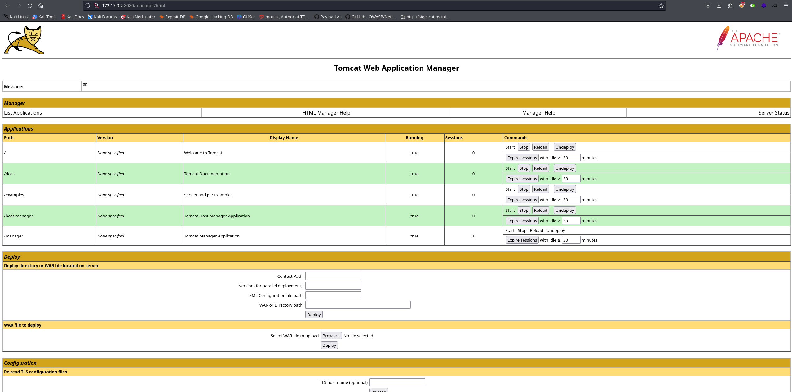

Hola otra vez y espero que todo os vaya genial, vamos a resolver otra máquina de [Dockerlabs](https://dockerlabs.es/#/), en este caso la máquina se llama -Pn y está incluida en la categoría fácil de Dockerlabs de [El Pingüino de Mario](https://www.youtube.com/channel/UCGLfzfKRUsV6BzkrF1kJGsg).


---------------------------------------------------------------------------------------------------------------------------------------------------

Sin más que añadir vamos a ello, como siempre empezaremos por descargar la máquina y realizar su instalación, recordad que funcionan mediante docker por lo que estaremos creando un contenedor en nuestra máquina local en el que se almacenará la máquina víctima.


Empezaremos realizando un ping a la máquina para verificar su correcto funcionamiento, al hacerlo vemos que tiene un TTL de 64, lo que significa que la máquina objetivo usa un sistema operativo Linux.


Como vemos, la máquina funciona correctamente y podemos empezar con el proceso de enumeración de la misma, vamos a ello.

# Enumeración

Lo primero que haremos para enumerar esta máquina será realizar un escaneo básico de puertos para identificar cuáles están abiertos.

```sudo nmap -p- --min-rate 5000 172.17.0.2 -Pn -n -oN escaneo```


Vemos que tanto el puerto 21 como el puerto 8080 de esta máquina se encuentran abiertos, vamos a realizar un escaneo más exhaustivo para tratar de enumerar las versiones de los servicios así como lanzar unos scripts básicos de reconocimiento que nos proporciona la propia herramienta de Nmap.

``sudo nmap -p 21,8080 -sCV 172.17.0.2 -Pn -n -oN escaneoSC``


De este output podemos sacar en claro que en el puerto 8080 de la máquina encontraremos un Tomcat con su versión concreta, pero lo más interesante es que mediante el puerto 21 podemos conectarnos por FTP de forma anónima y acceder a su contenido, vamos a hacer esto antes de pasar a analizar el puerto 8080.


Bien, de este archivo podemos sacar el nombre de un posible usuario siendo tomcat, pero no parece que vayamos a encontrar nada más. Vamos a pasar a analizar el servicio web.


Encontramos la página por defecto de Tomcat, vamos a fuzzear en busca de directorios o archivos ocultos que no se puedan ver a simple vista.


Siempre que encontremos un servidor con Tomcat deberíamos tener en cuenta el directorio /manager que encontramos en esta máquina. Vamos a intentar acceder con credenciales por defecto de Apache Tomcat, estas se pueden conseguir con una sencilla búsqueda en internet. Recordad el usuario que encontramos en el archivo de texto en el puerto 21, podríamos realizar un pequeño ataque de fuerza bruta pero en este caso nos valdrá con probar todas las posibles combinaciones por defecto en las que el usuario es el que encontramos.



Conseguimos acceder al panel de admin de Tomcat, desde aquí es conocido que se puede obtener una reverse shell usando el campo de subida de archivos que nos encontraremos generalmente si disponemos de los suficientes privilegios. Vamos a intentar explotar esto para obtener nuestro primer acceso al sistema.

# Explotación


Ahí tenemos la funcionalidad que estábamos buscando. En este campo de subida tenemos la capacidad de introducir una reverse shell en el servidor ya que nuestro usuario dispone de los privilegios suficientes para usar esto. Usaremos Msfvenom para generar la shell que necesitamos que tiene que tener como extensión .war.


Tenemos la shell generada, vamos a ponernos en escucha por el puerto indicado en nuestra máquina atacante.


Genial, estamos listos para subir nuestra shell y luego acceder a la misma para activarla y recibir nuestra conexión.


Con la reverse shell subida correctamente sólo tendremos que acceder a ella.


Y efectivamente recibiremos la conexión que buscábamos.


En este caso vemos que el acceso conseguido es con el usuario root por lo que hemos obtenido el control total sobre el sistema y podemos dar por concluida la máquina. Espero que os haya gustado mucho y nos vemos en la siguiente. :)

