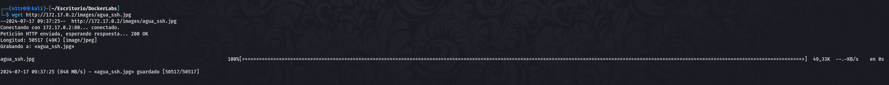

Hola otra vez, vamos a resolver otra máquina de [Dockerlabs](https://dockerlabs.es/#/), en este caso la máquina se llama AguaDeMayo y está incluida en la categoría fácil de Dockerlabs de [El Pingüino de Mario](https://www.youtube.com/channel/UCGLfzfKRUsV6BzkrF1kJGsg).


---------------------------------------------------------------------------------------------------------------------------------------------------

Sin más que añadir vamos a ello, como siempre empezaremos por descargar la máquina y realizar su instalación, recordad que funcionan mediante docker por lo que estaremos creando un contenedor en nuestra máquina local en el que se almacenará la máquina víctima.


Empezaremos realizando un ping a la máquina para verificar su correcto funcionamiento, al hacerlo vemos que tiene un TTL de 64, lo que significa que la máquina objetivo usa un sistema operativo Linux.


Como vemos, la máquina funciona correctamente y podemos empezar con el proceso de enumeración de la misma, vamos a ello.

# Enumeración

Lo primero que haremos para enumerar esta máquina será realizar un escaneo básico de puertos para identificar cuáles están abiertos.

```sudo nmap -p- --min-rate 5000 172.17.0.2 -Pn -n -oN escaneo```


Identificamos dos puertos abiertos, el 22 y el 80, haciendo referencia a servicios SSH y HTTP respectivamente. De cualquier forma realizaremos un escaneo más exhaustivo para lanzar scripts básicos de reconocimiento y tratar de enumerar las versiones de los mismos.

```sudo nmap -p 22,80 -sCV 172.17.0.2 -Pn -n -oN escaneoSC```


Parece que por el momento nada interesante, vamos a inspeccionar la web que tenemos en el puerto 80 para ver qué podemos encontrarnos.


Por el momento nada, vamos a fuzzear en busca de directorios y archivos ocultos que no se vean a simple vista.


Lo único que llama nuestra atención de este output es el directorio images, vamos a echarle un vistazo y comprobar si podemos encontrar algo que pueda servirnos para obtener nuestro primer acceso.


Vemos que el directorio nos da la capacidad de listar los archivos, de cualquier forma lo único que podemos encontrar es una imagen que llama la atención ya que menciona el servicio SSH en su nombre, vamos a descargarla a nuestra máquina atacante para ver si hay algún contenido oculto dentro de la misma que pueda darnos alguna pista.



# Explotación

Una vez la tenemos descargada vamos a tratar de enumerar los metadatos de la misma y verificar que no hay aningún contenido que se haya ocultado dentro de la misma mediante alguna técnica de esteganografía, para estas dos cosas usaremos las herramientas exiftool y steghide respectivamente.


En los metadatos nada interesante, busquemos secretos dentro.


Tampoco encontramos nada interesante, parece que nos estamos perdiendo algo, volvamos al punto de partida ya que se nos pasó por alto echar un ojo al código fuente de la página por defecto.


Vemos que al final del código fuente hay un comentario con una cadena de carácteres bastante extraña, vamos a investigar acerca de la misma ya que no creo que esté ahí porque sí.


Vale, parece que ahora estamos en el buen camino y parece que la imagen no era más que un rabbit hole, en principio, vamos a seguir tirando de este hilo.


¡Bien! Conseguimos interpretar la cadena que encontramos comentada y nos da lo que parece una contraseña que será presumiblemente del servicio SSH, pero de momento no disponemos de un usuario que sepamos a ciencia cierta que existe, o eso podría parecer a simple vista ya que si recordamos la imagen que vimos anteriormente se llama agua y hacía referencia al servicio SSH, vale la pena probar agua como usuario junto a la posible contraseña que acabamos de encontrar.


Genial, esto funciona correctamente y obtenemos nuestro primer acceso al sistema, vamos a intentar encontrar nuestro camino para obtener privilegios máximos.

# Post-Explotación

Hacemos una enumeración rápida y vemos que el sistema está bastante limitado aunque sí encontramos que el usuario es capaz de usar sudo para ejecutar un binario en concreto, vamos a investigar acerca del mismo para ver si podemos usar esto a nuestro favor y escalar de esta forma nuestros privilegios.


Parece que bettercap es una herramienta multipropósito usada para analizar las redes e incluso realizar auditorías de las mismas, vamos a ejecutar la herramienta como sudo.


Vaya, parece que la herramienta nos permite ejecutar comandos, y teniendo en cuenta que la estamos utilizando como root deberíamos de ser capaces de hacer cualquier cosa que queramos. En mi caso trataré de otorgarle los permisos SUID a la bash y en caso de funcionar correctamente podremos ejecutar el binario y obtener una shell como root, vamos a intentarlo.


Vamos a verificar si esto ha funcionado.


Genial, ha funcionado correctamente y podemos usar el comando ```bash -p``` para obtener una shell como root.


Efectivamente, obtenemos una shell como root y tenemos el control total sobre el sistema pudiendo dar por concluido el reto. Espero que os haya gustado mcuho y nos vemos en la siguiente. :)