Hola otra vez, vamos a resolver otra máquina de [Dockerlabs](https://dockerlabs.es/#/), en este caso la máquina se llama Amor y está incluida en la categoría fácil de Dockerlabs de [El Pingüino de Mario](https://www.youtube.com/channel/UCGLfzfKRUsV6BzkrF1kJGsg).

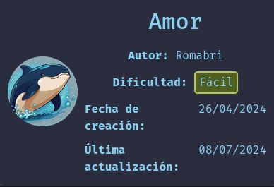

---------------------------------------------------------------------------------------------------------------------------------------------------

Sin más que añadir vamos a ello, como siempre empezaremos por descargar la máquina y realizar su instalación, recordad que funcionan mediante docker por lo que estaremos creando un contenedor en nuestra máquina local en el que se almacenará la máquina víctima.

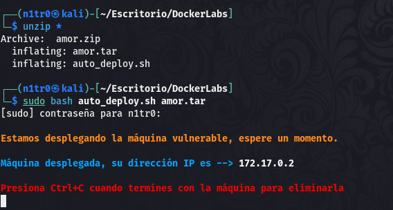

Empezaremos realizando un ping a la máquina para verificar su correcto funcionamiento, al hacerlo vemos que tiene un TTL de 64, lo que significa que la máquina objetivo usa un sistema operativo Linux.

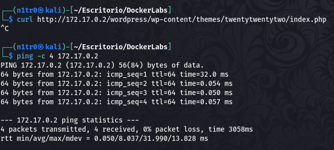

Como vemos, la máquina funciona correctamente y podemos empezar con el proceso de enumeración de la misma, vamos a ello.

# Enumeración

Lo primero que haremos para enumerar esta máquina será realizar un escaneo básico de puertos para identificar cuáles están abiertos.

```sudo nmap -p- --min-rate 5000 172.17.0.2 -Pn -n -oN escaneo```

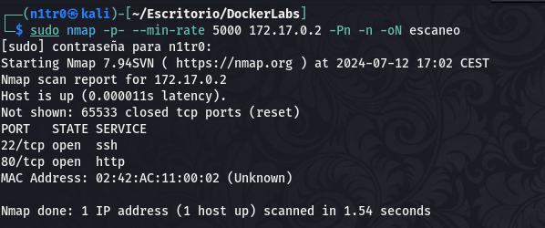

Vemos que en esta máquina se encuentran abiertos los puertos 22 y 80 haciendo referencia a servicios SSH y HTTP, de cualquier forma vamos a lanzar un escaneo más exhaustivo para tratar de enumerar versiones de servicios así como lanzar unos scripts básicos de reconocimiento.

```sudo nmap -p 80,22 -sCV 172.17.0.2 -Pn -n -oN escaneoSC```

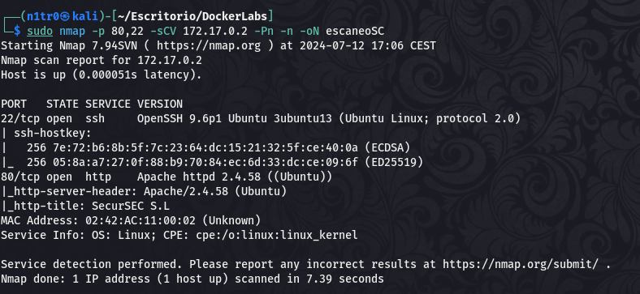

En el output podemos ver las versiones de los servicios y también vemos el nombre de la página web que encontraremos en el puerto 80, vamos a echarle un ojo.

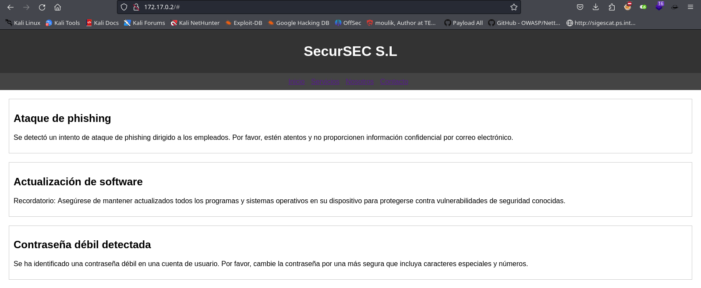

Encontramos una página estática sin mucha funcionalidad pero si nos fijamos bien podemos ver que se nos otorga una información que nos puede venir bien para conseguir un primer acceso.

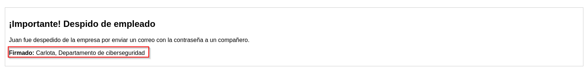

Tenemos un posible usuario, vamos a tratar de obtener un inicio de sesión exitoso lanzando un ataque de fuerza bruta al servicio SSH que descubrimos en el primer escaneo de puertos.

# Explotación

Para lanzar el ataque de fuerza bruta usaremos la herramienta hydra.

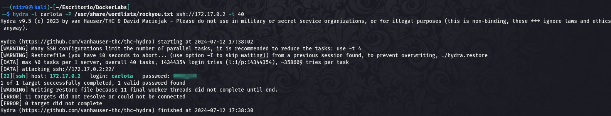

Bien, tenemos un par de credenciales válidas para iniciar sesión mediante SSH.

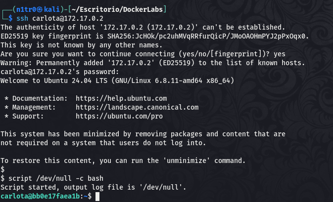

Conseguimos entrar dentro del sistema con el usuario carlota, una vez aquí tendremos que buscar la forma de elevar nuestros privilegios, vamos a enumerar el sistema para lograr encontrar nuestro vector de escalada.

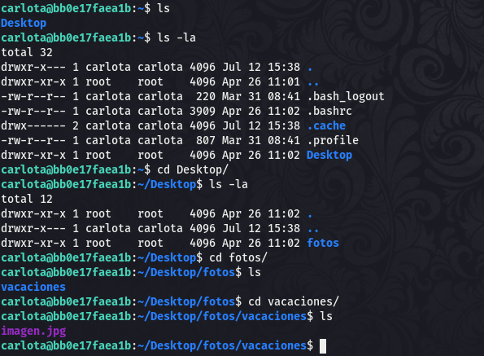

# Post-Explotación

Dentro del directorio de nuestro usuario actual encontramos una carpeta que contiene fotos, y sólo encontramos una, bastante extraño. Vamos a hacernos con ella para analizarla a fondo en nuestra máquina atacante, esto se podría hacer de varias formas, se podría montar un servidor en python, pero el protocolo SSH nos permite descargar archivos desde nuestra máquina con la herramienta scp.

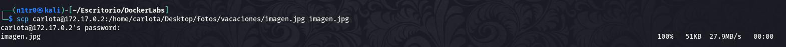

Con el archivo en nuestro poder vamos a ver si hay algo escondido en la misma.

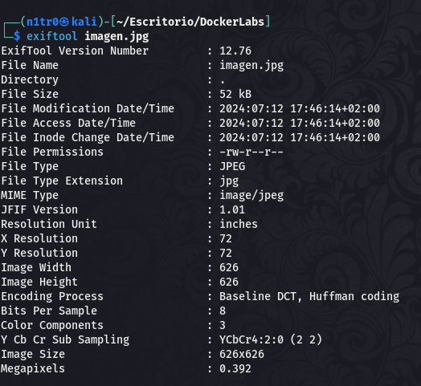

Parece que en los metadatos no hay nada interesante, vamos a intentar buscar secretos dentro.

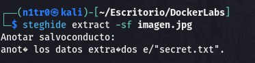

Vaya, parece que tenemos algo, vamos a ver de qué se trata.

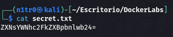

Parece que estamos ante una cadena en base64, vamos a decodearla para leer su contenido original.

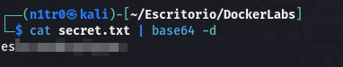

Personalmente diría que se trata de una contraseña, volvamos al sistema objetivo para enumerar los usuarios disponibles dentro de la máquina y así en caso de encontrar alguno usar esta contraseña para movernos lateralmente.

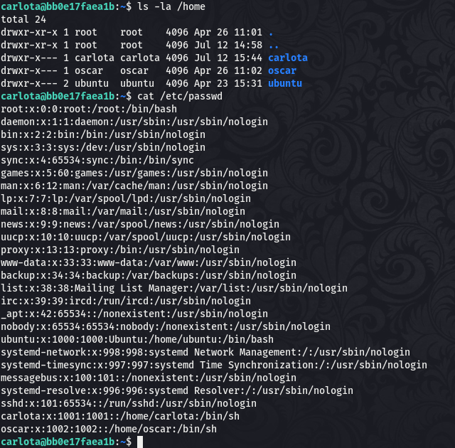

Bingo, vemos un usuario llamado oscar, vamos a intentar acceder como este ya que el usuario del que disponemos ahora mismo no está dentro del grupo sudoers y tiene privilegios muy reducidos.

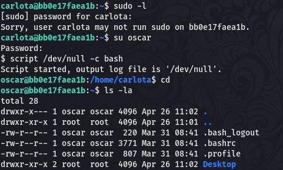

Eso es, vamos a tratar de listar los permisos de este usuario a ver si tenemos más suerte.

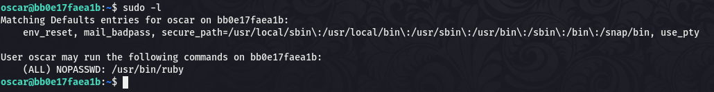

Y parece que es el caso ya que este usuario puede usar el comando sudo para ejecutar el binario ruby, el cual nos puede otorgar una shell como root con un comando bastante simple. Vamos a [GTFObins](https://gtfobins.github.io) para consultar cuál es este comando.

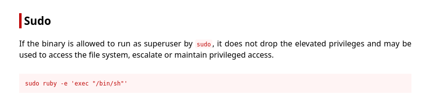

Habiendo hecho esta mini-investigación sabemos el comando que necesitamos ejecutar para elevar nuestros privilegios, vamos a llevarlo a cabo.

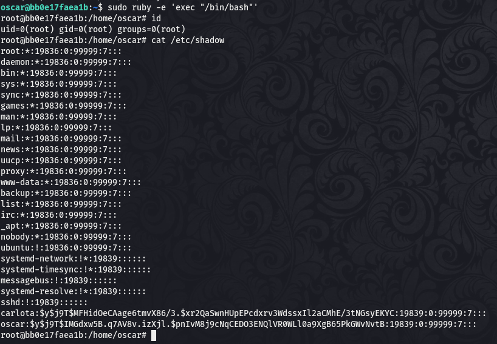

¡Genial! Conseguimos una shell como root y obtenemos el control total sobre el sistema pudiendo dar por concluida esta máquina. Espero que os haya gustado mucho y nos vemos en la siguiente. :)

