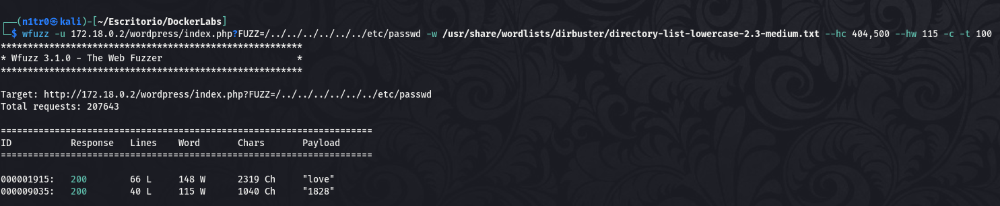
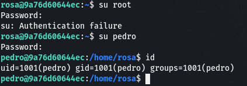

Hola otra vez, vamos a resolver otra máquina de [Dockerlabs](https://dockerlabs.es/#/), en este caso la máquina se llama Pinguinazo y está incluida en la categoría fácil de Dockerlabs de [El Pingüino de Mario](https://www.youtube.com/channel/UCGLfzfKRUsV6BzkrF1kJGsg).


---------------------------------------------------------------------------------------------------------------------------------------------------

Sin más que añadir vamos a ello, como siempre empezaremos por descargar la máquina y realizar su instalación, recordad que funcionan mediante docker por lo que estaremos creando un contenedor en nuestra máquina local en el que se almacenará la máquina víctima.


Empezaremos realizando un ping a la máquina para verificar su correcto funcionamiento, al hacerlo vemos que tiene un TTL de 64, lo que significa que la máquina objetivo usa un sistema operativo Linux.


Como vemos, la máquina funciona correctamente y podemos empezar con el proceso de enumeración de la misma, vamos a ello.

# Enumeración

Lo primero que haremos para enumerar esta máquina será realizar un escaneo básico de puertos para identificar cuáles están abiertos.

```sudo nmap -p- --min-rate 5000 172.18.0.2 -Pn -n -oN escaneo```


Encontramos abiertos los puertos 22 y 80, vamos a realizar un escaneo más exhaustivo para enumerar las versiones de los servicios así como lanzar ciertos scripts básicos de reconocimiento que nos otorga la propia herramienta de Nmap.

``sudo nmap -p 22,80 --min-rate 5000 -sCV 172.18.0.2 -Pn -n -oN escaneoSC``


No vemos nada interesante, vamos a inspeccionar manualmente el puerto 80 de la máquina para ver qué nos encontramos.


Sólo vemos una página por defecto, por lo que vamos a fuzzear para buscar directorios y archivos ocultos que nos puedan ampliar la superficie de ataque.


En el fuzzeo encontramos un directorio llamado wordpress, aunque la web no está utilizando dicha tecnología. No nos da mucha información pero si nos fijamos en el código fuente podemos ver un comentario interesante.


Fuzzearemos a partir de este directorio encontrado y encontramos la página index.php que muestra lo que acabamos de ver de nuevo.


Parece que no tenemos muchas alternativas aquí, lo único que se me ocurre gracias al comentario encontrado es que en este index.php exista un parámetro que podamos introducir en la URL para leer archivos internos ya que el comentario hace alusión a "los curiosos que quieran leer", vamos a fuzzear en busca de algún parámetro que nos permita leer archivos internos mediante LFI(Local File Inclusion).


Como todos los resultados nos dan la misma cantidad de palabras vamos a filtrar por esto mismo para sólo obtener resultados con longitud distinta a esta.



Encontramos el parámetro love, que coincide con los que encontramos en el comentario, vamos a acceder a esto.


¡Genial! Encontramos dos usuarios, vamos a realizar un ataque de fuerza bruta a los mismos por el puerto 22 para tratar de obtener un inicio de sesión exitoso con alguno de los mismos.

# Explotación


Usaremos Hydra para realizar este ataque de fuerza bruta con la intención de obtener un par de credenciales válidas.


¡Eso es! Obtenemos unas credenciales válidas que usaremos para iniciar sesión con el usuario rosa.


Estamos dentro y tenemos nuestro primer acceso al sistema, vamos a buscar la forma de elevar nuestros privilegios.

# Post-Explotación

Vamos a enumerar nuestros permisos para identificar nuestro vector de escalada de privilegios con el fin de convertirnos en el usuario root.


Podemos usar ls y cat utilizando sudo, esto significa que podemos ver los contenidos de cualquier carpeta del sistema así como acceder a los mismos. Vamos a enumerar el directorio del usuario root para ver si hay algo que llame nuestra atención. También podríamos leer el archivo /etc/shadow para obtener los hashes de usuarios e intentar crackearlos en caso de que sus contraseñas se encontrasen en alguna wordlist como rockyou.txt.


Vaya, encontramos un archivo de texto "secreto", aunque no tanto ya que tenemos estos permisos. Vamos a acceder a su contenido usando cat.


Vemos una cadena que parece estar en hexadecimal, vamos a tratar de obtener su contenido original.


Obtenemos lo que parece una contraseña, probaremos tanto con el usuario root como con el usuario pedro que encontramos antes en el archivo /etc/passwd.



Conseguimos convertirnos en el usuario pedro, lo que significa que tendremos nuevos permisos de los que aprovecharnos para elevar nuestros privilegios.


Este usuario puede ejecutar sudo junto al binario env, esto ya lo hemos explotado en máquinas previas y sabemos que con el comando ``sudo /usr/bin/env /bin/bash`` podemos obtener una shell como el usuario root. De cualquier forma si no nos acordásemos bien del comando podríamos realizar una breve investigación para encontrar este vector de escalada.


Genial, obtenemos una shell como el usuario root y hemos comprometido por completo el sistema pudiendo dar por concluida la máquina. Espero que os haya gustado mucho y nos vemos en la siguinete. :)


