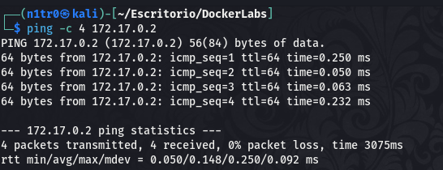
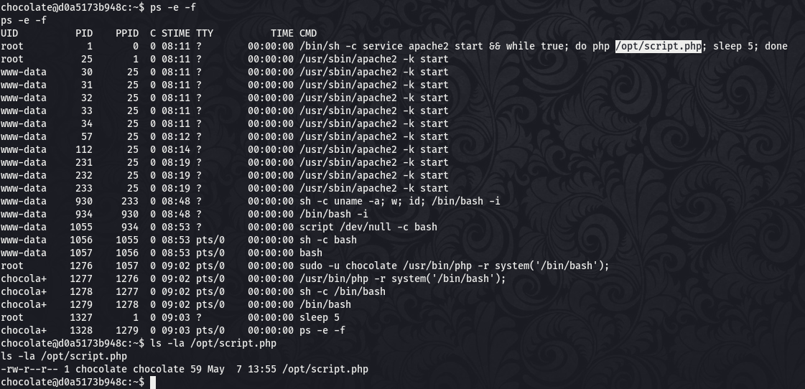

Hola otra vez, vamos a resolver otra máquina de [Dockerlabs](https://dockerlabs.es/#/), en este caso la máquina se llama ChocolateLovers y está incluida en la categoría fácil de Dockerlabs de [El Pingüino de Mario](https://www.youtube.com/channel/UCGLfzfKRUsV6BzkrF1kJGsg).


---------------------------------------------------------------------------------------------------------------------------------------------------

Sin más que añadir vamos a ello, como siempre empezaremos por descargar la máquina y realizar su instalación, recordad que funcionan mediante docker por lo que estaremos creando un contenedor en nuestra máquina local en el que se almacenará la máquina víctima.


Empezaremos realizando un ping a la máquina para verificar su correcto funcionamiento, al hacerlo vemos que tiene un TTL de 64, lo que significa que la máquina objetivo usa un sistema operativo Linux.



Como vemos, la máquina funciona correctamente y podemos empezar con el proceso de enumeración de la misma, vamos a ello.

# Enumeración

Lo primero que haremos para enumerar esta máquina será realizar un escaneo básico de puertos para identificar cuáles están abiertos.

```sudo nmap -p- --min-rate 5000 172.17.0.2 -Pn -n -oN escaneo```


Vemos que únicamente tenemos disponible el puerto 80, de cualquier forma vamos a lanzar un escaeno más exhaustivo para tratar de enumerar versiones de servicios así como lanzar unos scripts básicos de reconocimiento.

```sudo nmap -p 80 -sCV 172.17.0.2 -Pn -n -oN escaneoSC```


Podemos ver la versión de apache y el contenido de la página por defecto, vamos a acceder al servicio y a fuzzear en busca de directorios y archivos que no se vean a simple vista.


Antes de empezar a fuzzear vamos a echar un vistazo rápido al código fuente de esta página.


Aquí aparece lo que parece un directorio comentado, vamos a tratar de acceder al mismo.


Vemos un blog montado con PHP, vamos a dar un paseo por el mismo para tratar de buscar cosas que puedan servirnos. Tampoco hace falta irnos demasiado lejos porque en la entrada que podemos ver en la página principal se hace referencia al dashboard del administrador, vamos a intentar acceder por ahí.


Vemos un panel de login, vamos a probar alguna combinación por defecto. Wow, eso ha sido rápido, la primera combinación que probé fue admin:admin y se puede entrar sin problema.


Podemos ver la versión de este servicio, vamos a hacer una investigación para ver si hay alguna vulnerabilidad conocida que apunte al mismo.


Genial, hay una vulnerabilidad conocida que nos permite subir archivos, teniendo en cuenta que este CMS utiliza PHP podemos tratar de subir una reverse shell en PHP para enviar una conexión a nuestra máquina atacante y conseguir nuestro primer acceso a la máquina.

# Explotación

Lo primero que haremos será descargar este exploit a nuestra máquina.


Con este exploit descargado en nuestra máquina también tendremos que descargar una shell en PHP que podamos pasar como argumento al exploit.


Editaremos este archivo para adecuarlo a nuestra situación concreta.


Con todo esto preparado podemos lanzar nuestro exploit, antes tendremos que ponernos en escucha por el puerto que le indicamos al archivo malicioso.


Parece que el exploit no funciona correctamente, vamos a investigar más acerca de la vulnerabilidad para ver si somos capaces de explotarla manualmente, no debería costarnos demasiado.


Según estos datos sabemos que esta vulnerabilidad se explota subiendo un archivo desde el plugin Myimages/image ya que este no verifica la extensión de los archivos, vamos a usarlo para subir la shell que creamos anteriormente.


Eso es, tenemos nuestro primer acceso y hemos logrado explotar exitosamente esta vulnerabilidad, vamos a tratar de elevar nuestros privilegios o movernos lateralmente a otros usuarios.

Si ejecutamos el comando sudo -l vemos que podemos ejecutar el binario php sin contraseña impersonando al usuario chocolate que previamente verificamos su existencia leyendo el archivo /etc/passwd. Vamos a investigar cómo podríamos usar esto para movernos hacia este usuario.


Bien, hemos conseguido pivotar a otro usuario, vamos a enumerar los permisos de este para ver cómo podemos convertirnos en usuario root y comprometer la máquina por completo.

No podemos usar sudo -l ya que se nos pide la contraseña y no disponemos de ella, vamos a seguir enumerando.




Si enumeramos los procesos de la máquina vemos que el usuario root ejecuta un script periódicamente en PHP del que somos propietarios y que podemos editar a nuestro gusto, esto podemos usarlo para introducir una shell o para cambiar los permisos de cualquier archivo del sistema ya que es el usuario root el que ejecutará estas instrucciones.


Conseguimos cambiar el contenido del script para que cambie los permisos del binario bash y le otorgue el SUID, pudiendo usar esto para ejecutar la shell como root directamente sin tener que usar contraseña con el comando ```/bin/bash -p```.


¡Genial! Tenemos una shell como root y tenemos el control total sobre el sistema dando por concluida la máquina. Espero que os haya gustado mucho, nos vemos en la siguiente :)


