Hola otra vez, vamos a resolver otra máquina de [Dockerlabs](https://dockerlabs.es/#/), en este caso la máquina se llama ShowTime y está incluida en la categoría fácil de Dockerlabs de [El Pingüino de Mario](https://www.youtube.com/channel/UCGLfzfKRUsV6BzkrF1kJGsg).

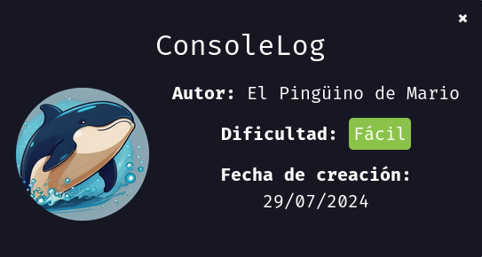

---------------------------------------------------------------------------------------------------------------------------------------------------

Sin más que añadir vamos a ello, como siempre empezaremos por descargar la máquina y realizar su instalación, recordad que funcionan mediante docker por lo que estaremos creando un contenedor en nuestra máquina local en el que se almacenará la máquina víctima.

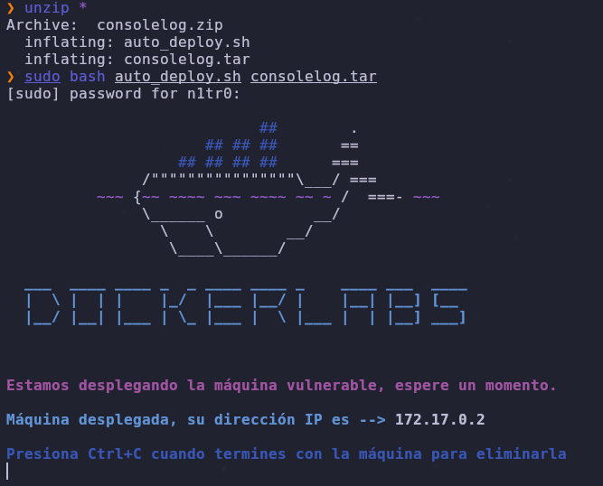

Empezaremos realizando un ping a la máquina para verificar su correcto funcionamiento, al hacerlo vemos que tiene un TTL de 64, lo que significa que la máquina objetivo usa un sistema operativo Linux.

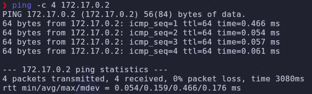

Como vemos, la máquina funciona correctamente y podemos empezar con el proceso de enumeración de la misma, vamos a ello.

# Enumeración

Lo primero que haremos para enumerar esta máquina será realizar un escaneo básico de puertos para identificar cuáles están abiertos.

```sudo nmap -p- --min-rate 5000 172.17.0.2 -Pn -n -oN escaneo```

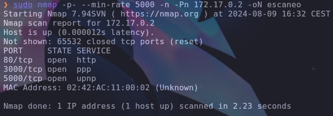

Encontramos tres puertos abiertos, de cualquier forma vamos a realizar un escaneo más exhaustivo para tener una mejor idea de a qué nos estamos enfrentando así como para tratar de enumerar las versiones de los servicios y lanzar unos scripts básicos de reconocimiento.

``sudo nmap -p 80,3000,5000 --min-rate 5000 -sCV 172.17.0.2 -Pn -n -oN escaneoSC``

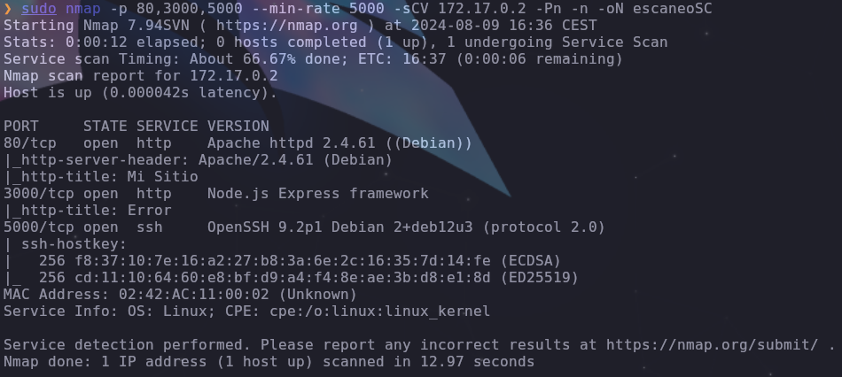

Vemos que en los puertos 80 y 3000 tenemos dos servicios web funcionando mientras que en el puerto 5000 podemos encontrar el servicio SSH en un puerto distinto al usado por defectro siendo este el 22. Vamos a inspeccionar estos servicios web.

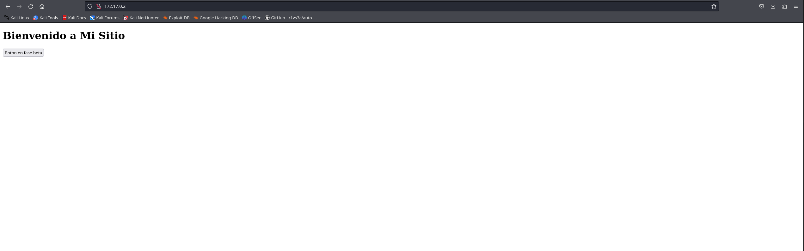

En el puerto 80 encontramos una web estática con un botón, si inspeccionamos el código fuente vemos cosas interesantes.

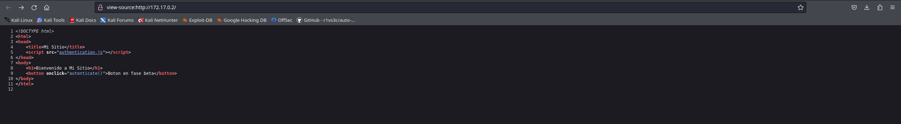

Tenemos un script que contiene una función la cual es llamada mediante el botón, vamos a inspeccionar este script para entender esta función.

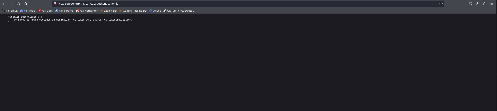

Nos da un directorio válido así como el valor del token, vamos a ver hacia dónde nos lleva esto.

# Explotación

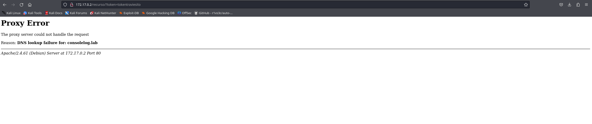

Parece que tenemos que modificar el archivo /etc/hosts para que la resolución DNS se efectúe correctamente.

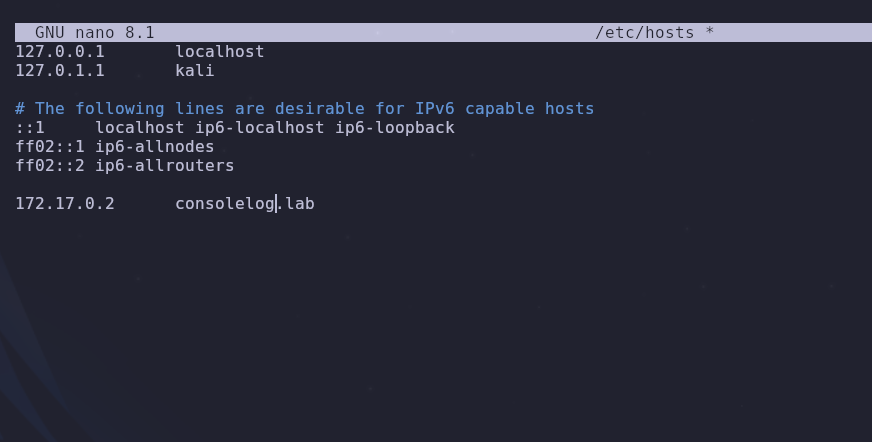

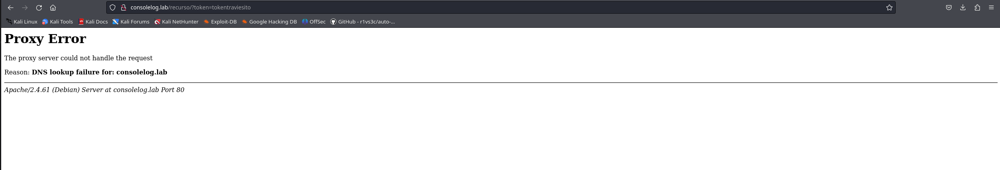

Sigue sin funcionar correctamente, vamos a fuzzear este puerto para buscar más directorios interesantes.

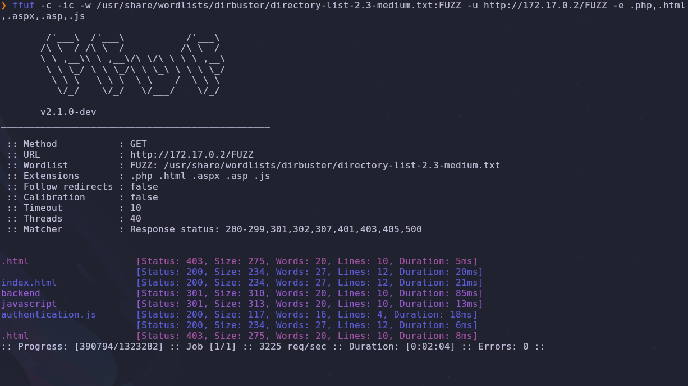

Tenemos un directorio llamado /backend que puede ser interesante, vamos a acceder al mismo.

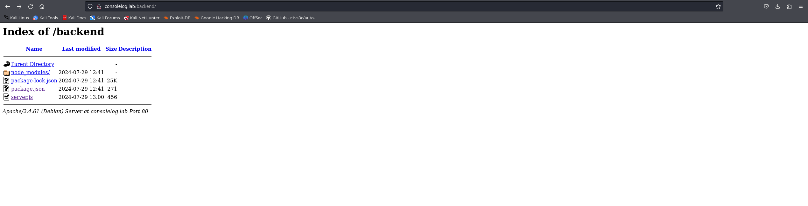

Podemos listar los contenidos de este directorio y vemos que hay un archivo llamado server.js, vamos a echarle un ojo.

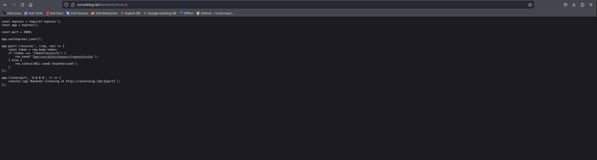

Tenemos una contraseña en texto plano que podría ser válida para el servicio SSH en caso de que se reutilicen las contraseñas, vamos a lanzar un ataque de fuerza bruta para ver si algún usuario usa esta contraseña.

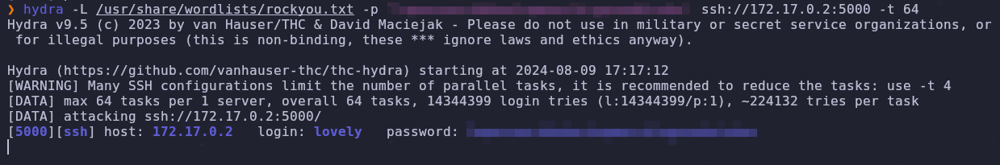

¡Genial! Tenemos unas credenciales válidas para iniciar sesión por SSH, vamos a acceder.

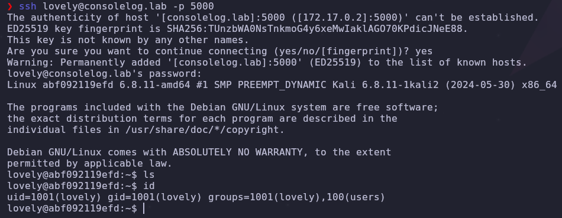

Estamos dentro, hemos conseguido nuestro primer acceso al sistema, en esta máquina podemos ver la importancia de leer detenidamente el código fuente de las páginas web.

# Post-Explotación

Una vez estamos dentro del sistema tendremos que listar los permisos de nuestro usuario así como carpetas como /tmp u /opt además de los directorios personales.

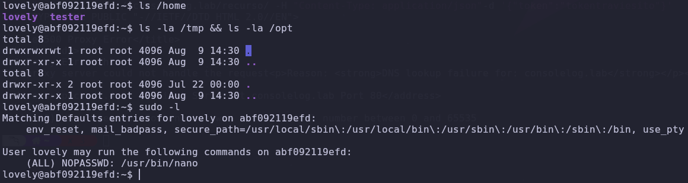

Vemos que no hay ningún archivo interesante pero nuestro usuario puede usar sudo como cualquier usuario para ejecutar el binario nano, usaremos [GTFObins](https://gtfobins.github.io) para identificar cómo usar esto a nuestro favor para elevar privilegios.

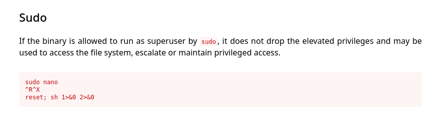

Parece que es posible elevar nuestros privilegios usando este binario, vamos a hacerlo.

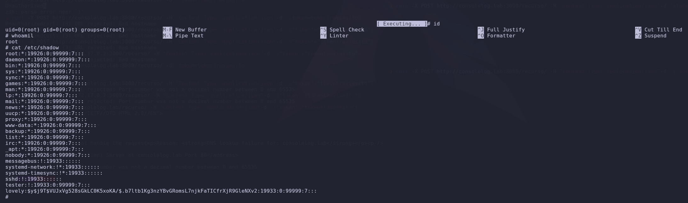

Somos el usuario root y podemos ejecutar comandos con altos privilegios, vamos a otorgarle permisos SUID a la bash para obtener más persistencia y estabilidad.

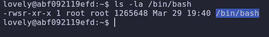

Con el comando chmod u+s /bin/bash le damos los permisos a la bash y ahora simplemente tendremos que ejecutar el comando bash -p cada vez que queramos obtener una shell como root.

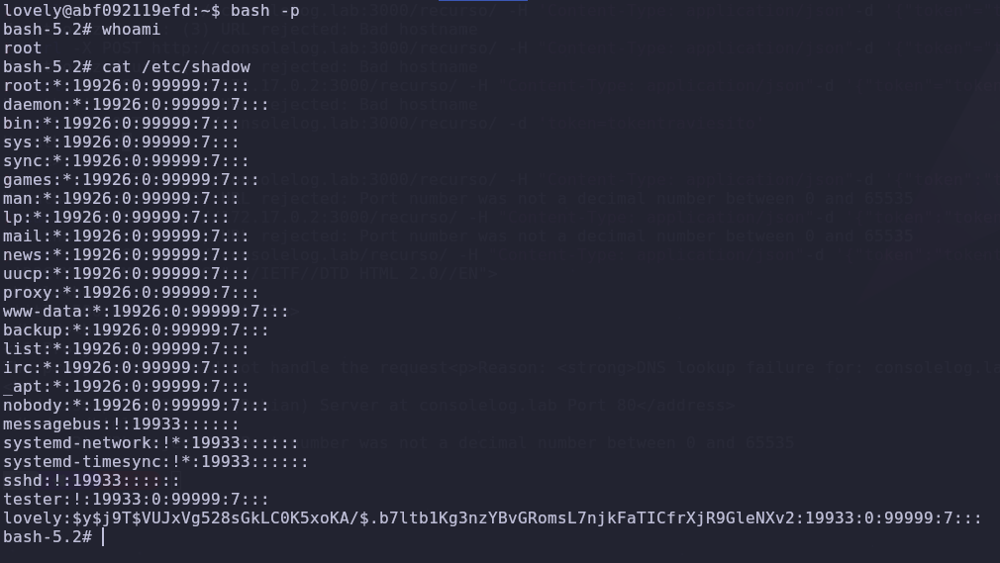

¡Genial! Tenemos persistencia como el usuario root y hemos comprometido el sistema por completo pudiendo dar por concluida la máquina. Espero que os haya gustado mucho y nos vemos en la siguiente. :)


