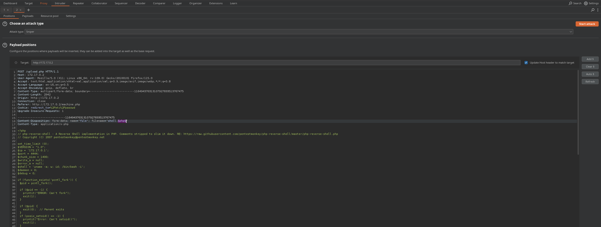

Hola otra vez, vamos a resolver otra máquina de [Dockerlabs](https://dockerlabs.es/#/), en este caso la máquina se llama DockerLabs y está incluida en la categoría fácil de Dockerlabs de [El Pingüino de Mario](https://www.youtube.com/channel/UCGLfzfKRUsV6BzkrF1kJGsg).


---------------------------------------------------------------------------------------------------------------------------------------------------

Sin más que añadir vamos a ello, como siempre empezaremos por descargar la máquina y realizar su instalación, recordad que funcionan mediante docker por lo que estaremos creando un contenedor en nuestra máquina local en el que se almacenará la máquina víctima.


Empezaremos realizando un ping a la máquina para verificar su correcto funcionamiento, al hacerlo vemos que tiene un TTL de 64, lo que significa que la máquina objetivo usa un sistema operativo Linux.


Como vemos, la máquina funciona correctamente y podemos empezar con el proceso de enumeración de la misma, vamos a ello.

# Enumeración

Lo primero que haremos para enumerar esta máquina será realizar un escaneo básico de puertos para identificar cuáles están abiertos.

```sudo nmap -p- --min-rate 5000 172.17.0.2 -Pn -n -oN escaneo```


Identificamos que el puerto 80 está abierto haciendo referencia a un servicio web, vamos a realizar un escaneo más exhaustivo para tratar de enumerar versiones y lanzar unos scripts básicos de reconocimiento que nos brinda Nmap.

``sudo nmap -p 80 --min-rate 5000 -sCV 172.17.0.2 -Pn -n -oN escaneoSC``


Nada interesante por aquí, vamos a inspeccionar manualmente la web para identificar nuestro vector de entrada.


Vemos una web muy similar a la propia DockerLabs, vamos a fuzzear para buscar directorios y archivos que estén ocultos a simple vista.


Vemos algunos directorios que nos llaman la atención, analizamos los mismos y vemos que en /machine.php se nos permite subir archivos. 


Al ver que esta web interpreta el código PHP podemos deducir que podríamos usar este campo de subida de archivos para subir una reverse shell que nos otorgue nuestro primer acceso al sistema, vamos a intentarlo.

# Explotación


Vemos que no podemos subir directamente nuestra shell ya que no acepta la extensión .php, vamos a interceptar esta subida de archivos con BurpSuite para lanzar un ataque de fuerza bruta a la extensión de nuestro archivo para tratar de identificar una extensión en PHP que sea aceptada por la funcionalidad.





¡Genial! Vemos que podemos subir nuestra shell si utilizamos la extensión .phar ya que es una extensión utilizada por un método de compresión. Vamos a subirla y a ponernos en escucha por el puerto que indicamos antes de acceder a la misma. Si realizamos todos los pasos correctamente deberíamos recibir nuestra conexiuón y obtener el primer acceso al sistema.


Hecho, tenemos nuestro primer acceso y ahora tenemos que buscar la forma de elevar nuestros privilegios para comprometer el sistema por completo.

# Post-Explotación


Leyendo el archivo /etc/passwd vemos que no hay otros usuarios a los que pivotar por lo que tendremos que tratar de elevar nuestros privilegios desde el usuario actual. Vamos a listar los permisos del mismo.


Parece que nuestro usuario puede ejecutar el comando sudo sin contraseña junto a los binarios cut y grep. Vamos a realizar una investigación para ver cómo podríamos aprovechar esto para convertirnos en el usuario root. Aunque antes de esto vamos a enumerar los archivos del sistema.


Esto nos viene muy bien ya que con los dos binarios que podemos ejecutar como sudo podemos leer archivos que requieran altos privilegios, vamos a usar esto para tratar de leer este archivo del que nos habla la nota.


¡Eso es! Usamos los permisos para leer correctamente el archivo que contiene la contraseña del usuario root, vamos a usar la misma para iniciar sesión como este.


Somos el usuario root y tenemos el control total sobre el sistema pudiendo dar por concluida la máquina. Espero que os haya gustado mucho y nos vemos en la siguiente. :)

