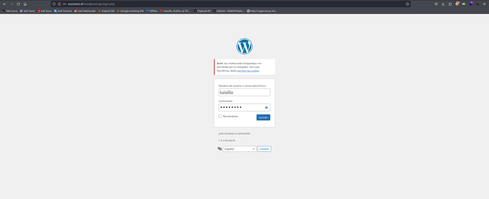
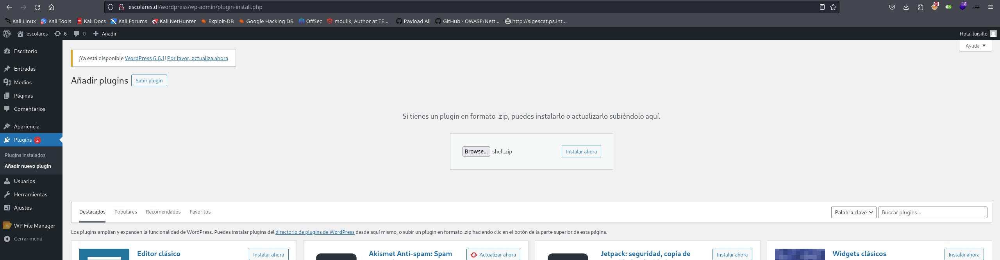
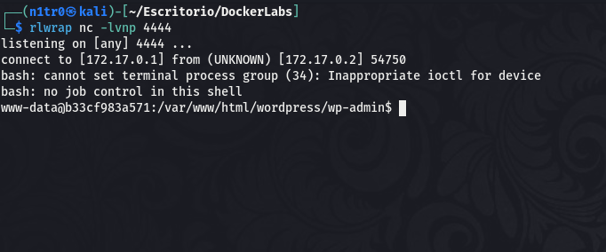

Hola otra vez, vamos a resolver otra máquina de [Dockerlabs](https://dockerlabs.es/#/), en este caso la máquina se llama Pinguinazo y está incluida en la categoría fácil de Dockerlabs de [El Pingüino de Mario](https://www.youtube.com/channel/UCGLfzfKRUsV6BzkrF1kJGsg).


---------------------------------------------------------------------------------------------------------------------------------------------------

Sin más que añadir vamos a ello, como siempre empezaremos por descargar la máquina y realizar su instalación, recordad que funcionan mediante docker por lo que estaremos creando un contenedor en nuestra máquina local en el que se almacenará la máquina víctima.


Empezaremos realizando un ping a la máquina para verificar su correcto funcionamiento, al hacerlo vemos que tiene un TTL de 64, lo que significa que la máquina objetivo usa un sistema operativo Linux.


Como vemos, la máquina funciona correctamente y podemos empezar con el proceso de enumeración de la misma, vamos a ello.

# Enumeración

Lo primero que haremos para enumerar esta máquina será realizar un escaneo básico de puertos para identificar cuáles están abiertos.

```sudo nmap -p- --min-rate 5000 172.17.0.2 -Pn -n -oN escaneo```


Encontramos abiertos los puertos 22 y 80, vamos a realizar un escaneo más exhaustivo para tratar de enumerar las versiones de los servicios así como para lanzar unos scripts básicos de reconocimiento que nos proporciona la propia herramienta de Nmap.

``sudo nmap -p 22,80 --min-rate 5000 -sCV 172.17.0.2 -Pn -n -oN escaneoSC``


Vemos el título de la página web que se encuentra en el puerto 80 pero no encontramos nada más interesante, vamos a inspeccionar manualmente la web para tratar de localizar nuestro primer vector de entrada y obtener nuestro primer acceso.


En el código fuente encontramos un comentario interesante en el que se menciona un directorio al que podemos acceder, vamos a ver qué nos encontramos en el mismo.


Podemos ver un directorio con una lista sobre los profesores de esta universidad ficticia, pero uno de ellos llama especialmente la atención ya que pone claramente que es el admin del wordpress, vamos a fuzzear este puerto para ver si localizamos la ruta en la que se encuentre este CMS en caso de estar presente.


Encontramos la ruta que estábamos buscando, vamos a usar WPscan para enumerar esta versión concreta de Wordpress y enumerar los usuarios para confirmar lo que encontramos previamente.


Efectivamente, existe el usuario luisillo dentro del Wordpress, vamos a usar el propio WPscan para lanzar un ataque de fuerza bruta a este usuario. 

# Explotación

Antes de realizar este ataque crearemos un diccionario personalizado con los datos que encontramos acerca de este usuario en concreto. Usaré Cupp para generar esta lista de posibles contraseñas ya que es una herramienta bastante intuitiva.


Con esta lista creada estamos listos para lanzar el ataque de fuerza bruta, vamos a intentar obtener unas credenciales válidas.


¡Bien! Tenemos unas credenciales válidas para el usuario luisillo, vamos a iniciar sesión.




Para poder ver el contenido correctamente tendremos que editar nuestro archivo /etc/hosts para añadir las resolución del nombre que vemos en la URL.


Y estamos dentro, vamos a identificar la forma en la que podríamos introducir en el servidor web una reverse shell que nos otorgue una conexión en nuestra máquina atacante.


Vemos que podemos subir plugins creados por nosotros mismos, lo cual es crítico ya que podremos usar esto a nuestro favor para introducir en el servidor web una reverse shell.


Con nuestro archivo zip creado estamos listos para subirlo al servidor como si fuese un plugin, nos pondremos en escucha por el puerto indicado antes de realizar esto.





Esto no ha funcionado como esperaba, vamos a investigar de qué forma podemos hacer que el Wordpress interprete nuestro archivo como un plugin legítimo.


Vamos a tratar de hacerlo con esta información a ver si tenemos más suerte.


Lo tenemos, hemos conseguido subir nuestra shell correctamente, ahora activaremos nuestro plugin malicioso para conseguir recibir la conexión que nos otorgue nuestro primer acceso al sistema.



Activamos el plugin y recibimos la conexión en el puerto en el que nos encontrábamos a la escucha.

# Post-Explotación

Vamos a listar los usuarios disponibles en el sistema, aunque al hacerlo nos vamos a encontrar una sorpresita.


Encontramos un archivo "secreto", vamos a tratar de listar su contenido.


Vemos que lo que hay en este archivo es la contraseña del usuario luisillo, vamos a pivotar hacia el mismo.


Una vez pivotamos con éxito a este usaurio vamos a listar los permisos del mismo para identificar nuestro vector de escalada de privilegios.


Este usuario puede ejecutar sudo junto al binario awk, vamos a investigar cómo podemos usar esto para convertirnos en el usuario root.


[GTFOBins](https://gtfobins.github.io) como siempre es nuestro gran aliado, y nos dice el comando exacto que podemos usar para elevar nuestros privilegios, vamos a usarlo.


Somos el usuario root y hemos comprometido el sistema por completo pudiendo dar por concluida la máquina. Espero que os haya gustado mucho y nos vemos en la siguiente. :)

