Hola otra vez, vamos a resolver otra máquina de [Dockerlabs](https://dockerlabs.es/#/), en este caso la máquina se llama Library y está incluida en la categoría fácil de Dockerlabs de [El Pingüino de Mario](https://www.youtube.com/channel/UCGLfzfKRUsV6BzkrF1kJGsg).

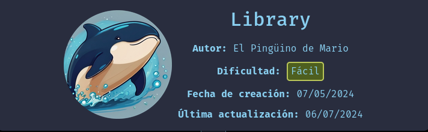

---------------------------------------------------------------------------------------------------------------------------------------------------

Sin más que añadir vamos a ello, como siempre empezaremos por descargar la máquina y realizar su instalación, recordad que funcionan mediante docker por lo que estaremos creando un contenedor en nuestra máquina local en el que se almacenará la máquina víctima.

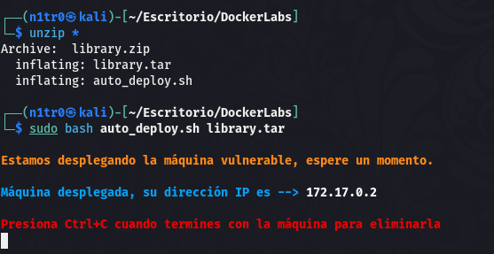

Empezaremos realizando un ping a la máquina para verificar su correcto funcionamiento, al hacerlo vemos que tiene un TTL de 64, lo que significa que la máquina objetivo usa un sistema operativo Linux.

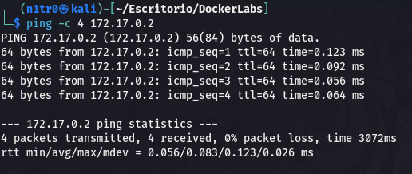

Como vemos, la máquina funciona correctamente y podemos empezar con el proceso de enumeración de la misma, vamos a ello.

# Enumeración

Lo primero que haremos para enumerar esta máquina será realizar un escaneo básico de puertos para identificar cuáles están abiertos.

```sudo nmap -p- --min-rate 5000 172.17.0.2 -Pn -n -oN escaneo```

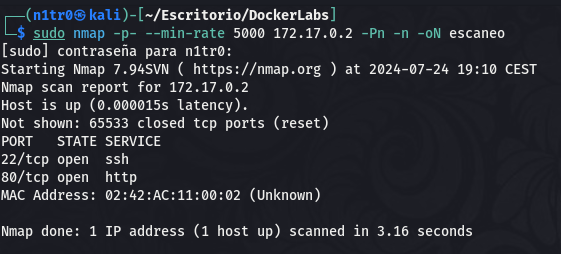

Vemos que tanto el puerto 22 como el puerto 80 de esta máquina se encuentran abiertos, vamos a realizar un escaneo más exhaustivo para tratar de enumerar las versiones de los servicios así como lanzar unos scripts básicos de reconocimiento que nos proporciona la propia herramienta de Nmap.

``sudo nmap -p 22,80 -sCV 172.17.0.2 -Pn -n -oN escaneoSC``

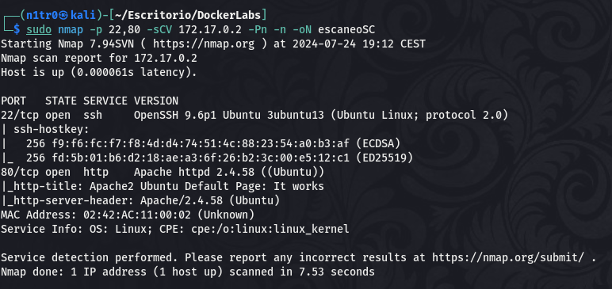

Nada interesante por aquí, vamos a analizar manualmente el servidor web del puerto 80.

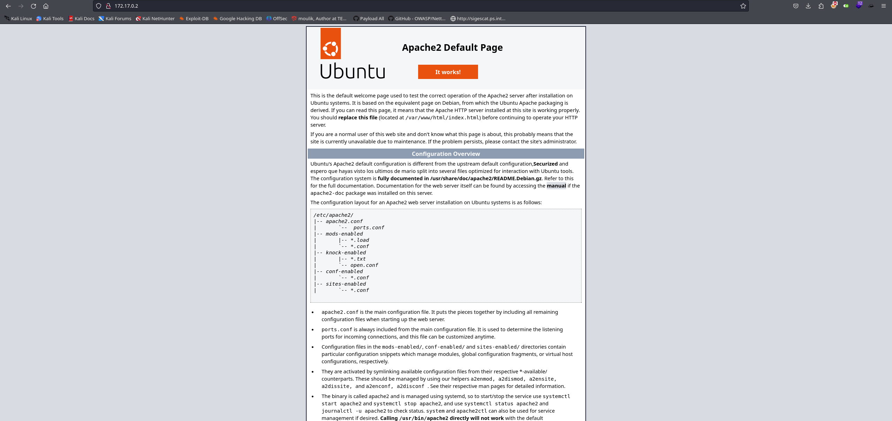

Encontramos una página por defecto, vamos a fuzzear en busca de directorios y archivos ocultos.

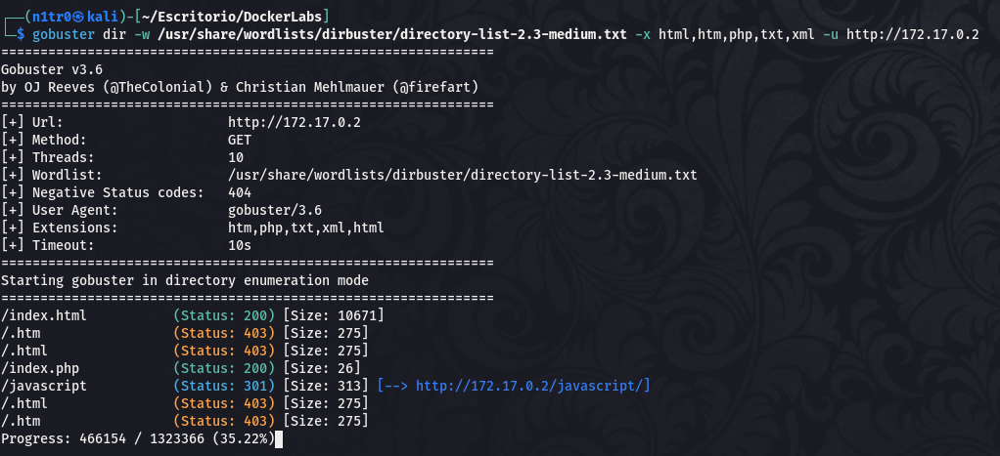

Vemos que hay un archivo llamado index.php, vamos a acceder al mismo para ver su contenido.

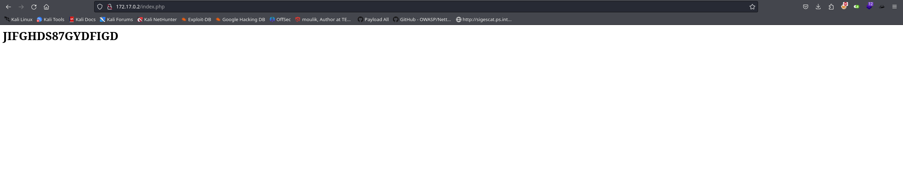

Vemos una cadena que parece que podría ser una contraseña, y tenemos el puerto 22 disponible, por lo que ya que no encontramos nada más que pueda interesarnos vamos a realizar un ataque de fuerza bruta para tratar de obtener algún usuario que esté haciendo uso de esta contraseña para conectarse por SSH.

# Explotación

Para hacer esto usaremos hydra y utilizaremos una wordlist de nombres de usuario.

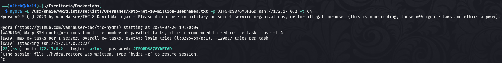

¡Bien! Vemos que el usuario carlos utiliza esta contraseña para acceder al sistema por SSH, vamos a utilizar esta sesión para obtener nuestro primer acceso al sistema.

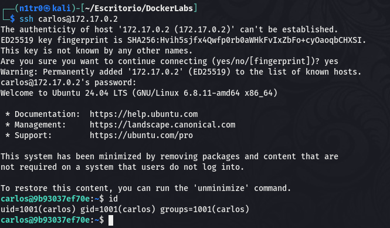

Estamos dentro, vamos a buscar la forma de elevar nuestros privilegios para lograr convertirnos en root y comprometer el sistema al completo.

# Post-Explotación

Vamos a listar los permisos de nuestro usuario y también los usuarios disponibles dentro del sistema.

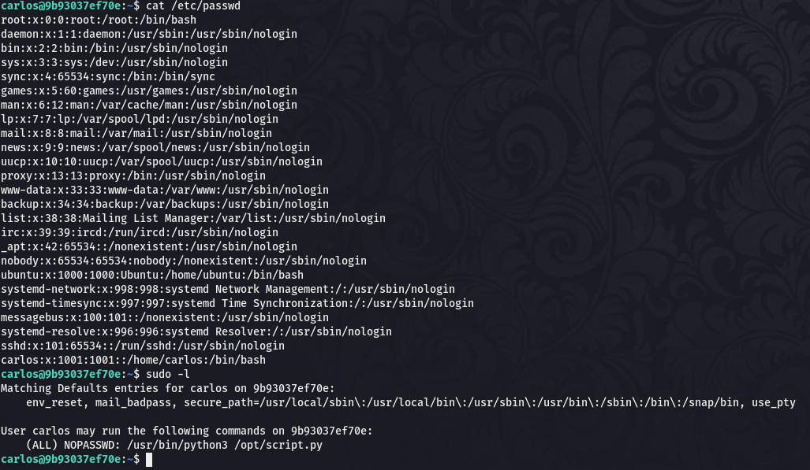

No tenemos ningún usuario aparte del que hemos obtenido y este usuario puede ejecutar un script como root usando el comando sudo. Vamos a ver cuál es el funcionamiento de este script para localizar la forma de elevar nuestros privilegios.

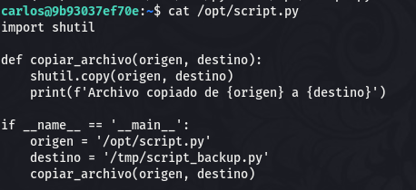

Tenemos un script que sirve para copiar archivos a una ruta concreta, lo interesante aquí es que utiliza una librería específica, y teniendo en cuenta que la máquina se llama Library podemos deducir que podría ser posible realizar un Library Hijacking y hacer que cuando el script trate de acceder a una librería creada por nosotros mismos ejecute las órdenes que queramos. Si sumamos esto a que podemos ejecutar el script como root podríamos realizar cualquier cambio en el sistema. Usaré esto para otorgarle permisos SUID al binario bash.

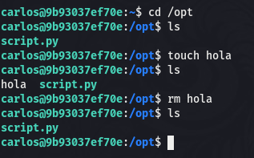

Tenemos permisos de escritura en el directorio /opt, vamos a crear un archivo malicioso con el nombre de la librería que solicita el script en el que incluyamos las órdenes que queramos ejecutar. Esto lo haremos más cómodamente en nuestra máquina atacante.

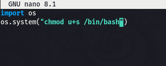

Usaré SCP para transferir el archivo malicioso al sistema objetivo.

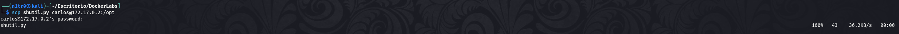

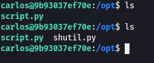

Lo tenemos listo, ahora sólo tendremos que ejecutar el sudo junto al script, al tratar de acceder a la librería primero probará en el directorio actual, y eso hará que se active nuestra carga maliciosa.

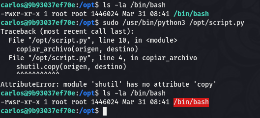

Genial, hemos conseguido cambiar los permisos del binario bash, ahora sólo tendremos que usar el comando ``bash -p`` para ejecutar una shell como el usuario root.

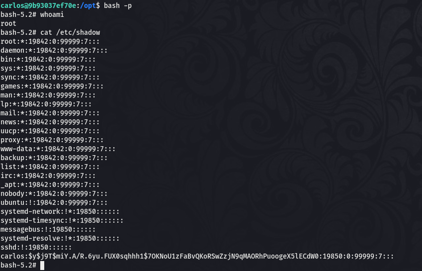

¡Eso es! Tenemos una shell como root y tenemos el control absoluto habiendo comprometido el sistema por completo y pudiendo dar por concluida la máquina. Espero que os hay agustado mucho y nos vemos en la siguiente. :)


