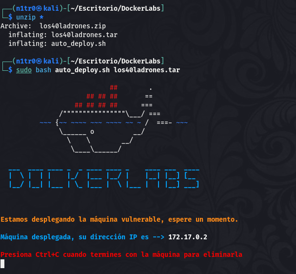

Hola otra vez y espero que todo os vaya genial, vamos a resolver otra máquina de [Dockerlabs](https://dockerlabs.es/#/), en este caso la máquina se llama Los 40 Ladrones y está incluida en la categoría fácil de Dockerlabs de [El Pingüino de Mario](https://www.youtube.com/channel/UCGLfzfKRUsV6BzkrF1kJGsg).


---------------------------------------------------------------------------------------------------------------------------------------------------

Sin más que añadir vamos a ello, como siempre empezaremos por descargar la máquina y realizar su instalación, recordad que funcionan mediante docker por lo que estaremos creando un contenedor en nuestra máquina local en el que se almacenará la máquina víctima.



Empezaremos realizando un ping a la máquina para verificar su correcto funcionamiento, al hacerlo vemos que tiene un TTL de 64, lo que significa que la máquina objetivo usa un sistema operativo Linux.


Como vemos, la máquina funciona correctamente y podemos empezar con el proceso de enumeración de la misma, vamos a ello.

# Enumeración

Lo primero que haremos para enumerar esta máquina será realizar un escaneo básico de puertos para identificar cuáles están abiertos.

```sudo nmap -p- --min-rate 5000 172.17.0.2 -Pn -n -oN escaneo```


Sólo tenemos disponible el puerto 80 haciendo referencia a un servicio web, vamos a lanzar un escaneo más exhaustivo a este puerto en concreto para tratar de enumerar las versiones y lanzar unos scripts básicos de reconocimiento.

``sudo nmap -p 80 -sCV 172.17.0.2 -Pn -n -oN escaneoSC``


No vemos nada interesante en este output, vamos a analizar manualmente la web para ver qué nos encontramos.


En principio sólo vemos una página por defecto en el servidor, vamos a fuzzear para buscar directorios y archivos que estén ocultos y no sean accesibles a simple vista.


Parece que aquí si tenemos algo que llama nuestra atención, vamos a echar un ojo al archivo que acabamos de descubrir.


Parece que tenemos el nombre de un posible usuario, bastante maleducado por lo visto. Además de esto tenemos una secuencia de números y el contenido del archivo hace referencia a llamar a la puerta. Existe una técnica llamada Port Knocking que permite mantener ciertos puertos cerrados u ocultos siendo imposible acceder a ellos sin tratar previamente de conectarse a unos puertos específicos en un orden marcado. Siguiendo esta secuencia veríamos el puerto abierto y podríamos acceder al mismo. Si pensamos en esto es muy similar al mecanismo de la cerradura de una caja fuerte, para que se entienda mejor.

# Explotación

Tenemos una posible secuencia de puertos que nos permitirá acceder a un nuevo puerto por lo que merece la pena intentar explotar esto. Existe una herramienta en Linux llamada Knockd que nos facilita esta tarea, para instalarla podéis usar el comando ``sudo apt install -y knockd``. Con la herramienta instalada vamos a "llamar educadamente a la puerta" como se nos pide en el archivo que encontramos en el servidor web.


Si esta "llamada" ha funcionado correctamente deberíamos ver algún nuevo puerto accesible al realizar un escaneo con Nmap.


Y efectivamente, ahora tenemos disponible el puerto 22 con un servicio SSH en su interior, y tenemos un posible usuario. Ya sabemos lo que toca, vamos a realizar un ataque de fuerza bruta para tratar de obtener las credenciales de este usuario y lograr así nuestro primer acceso al sistema.


¡Bien! Conseguimos un inicio de sesión exitoso y tenemos las credenciales válidas para el usuario que encontramos anteriormente. Vamos a entrar mediante SSH para obtener así nuestro primer acceso al sistema.


Estamos dentro, vamos a buscar la forma de elevar nuestros privilegios para comprometer el sistema por completo.

# Post-Explotación

Una vez hemos conseguido acceder al sistema vamos a enumerar nuestros privilegios para ver qué opciones tenemos para convertirnos en el usuario root.


Podemos ejecutar dos comandos como root y uno de ellos es bash, pero en este caso desde el directorio /opt. Vamos a probar a ejecutar el comando ``sudo /opt/bash -p`` ya que esto debería entregarnos una shell como el usuario root.


¡Genial! Conseguimos una shell como root habiendo comprometido por completo el sistema y pudiendo dar por concluida la máquina. Espero que os haya gustado mucho y nos vemos en la siguiente. :)