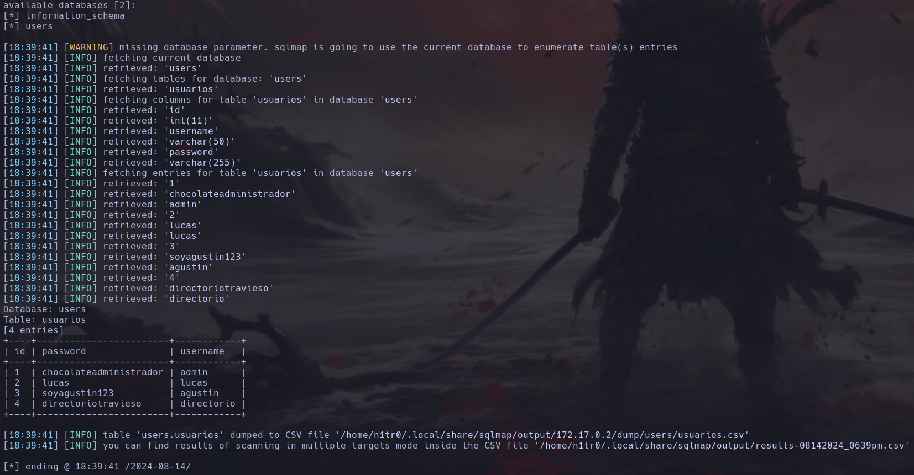

Hola otra vez, vamos a resolver otra máquina de [Dockerlabs](https://dockerlabs.es/#/), en este caso la máquina se llama Mirame y está incluida en la categoría fácil de Dockerlabs de [El Pingüino de Mario](https://www.youtube.com/channel/UCGLfzfKRUsV6BzkrF1kJGsg).


---------------------------------------------------------------------------------------------------------------------------------------------------

Sin más que añadir vamos a ello, como siempre empezaremos por descargar la máquina y realizar su instalación, recordad que funcionan mediante docker por lo que estaremos creando un contenedor en nuestra máquina local en el que se almacenará la máquina víctima.


Empezaremos realizando un ping a la máquina para verificar su correcto funcionamiento, al hacerlo vemos que tiene un TTL de 64, lo que significa que la máquina objetivo usa un sistema operativo Linux.


Como vemos, la máquina funciona correctamente y podemos empezar con el proceso de enumeración de la misma, vamos a ello.

# Enumeración

Lo primero que haremos para enumerar esta máquina será realizar un escaneo básico de puertos para identificar cuáles están abiertos.

```sudo nmap -p- --min-rate 5000 172.17.0.2 -Pn -n -oN escaneo```


Identificamos que los puertos 22 y 80 están abiertos, vamos a realizar un escaneo más exhaustivo para tratar de enumerar versiones así como para lanzar ciertos scripts básicos de reconocimiento.

``sudo nmap -p 22,80 --min-rate 5000 -sCV 172.17.0.2 -Pn -n -oN escaneoSC``


Nada interesante por aquí, servicio SSH actualizado y poca información sobre el servicio web que se encuentra en el puerto 80 teniendo sólo información de que se trata de una página de login. Vamos a analizar el contenido manualmente.


Aquí tenemos el panel de login, vamos a probar credenciales por defecto y varias posibles explotaciones como inyecciones SQL o SSTI en caso de ver algún tipo de reflexión.


Parece que este panel de login es vulnerable a inyecciones SQL pero se trata de un tipo de inyección blind basada en errores ya que no tenemos un output que nos permita listar las consultas que hagamos a las bases de datos por lo que usaremos Sqlmap para ahorrarnos un valioso tiempo.

# Explotación


Conseguimos los nombres de las bases de datos, vamos a dumpear los contenidos de las mismas.



Tenemos varios usuarios y sus contraseñas, vamos a usarlos para acceder mediante este panel de login. Cabe recalcar que parece bastante raro que haya un usuario que se llame directrorio en mi opinión.


Encontramos una funcionalidad de consulta de temperatura que parece que no va a llevarnos a ningún sitio. Volviendo al contenido de la base de datos, ¿puede que la "contraseña" de directorio simplemente nos diga que existe un directorio con ese nombre? Vamos a ver si esto es así.


Parece que estábamos en lo correcto, vamos a hacernos con este archivo que seguramente contenga información escondida en su interior.


En los metadatos de la fotografía no encontramos nada interesante, vamos a verificar que no se hayan usado técnicas de esteganografía para ocultar algo en el interior de la misma.


Usamos stegseek ya que es una herramienta que automatiza el análisis de estas técnicas y en caso de estar protegido por contraseña realiza el propio ataque de fuerza bruta para obtener la misma, como sucede en este caso. Teniendo la passphrase podemos analizar este contenido oculto.


Tenemos los contenidos extraídos pero parece que el .zip dispone de otra contraseña, vamos a usar zip2john para hacernos con ella.


¡Eso es! Tenemos la contraseña y podemos descomprimir el contenido para analizar lo que hay dentro de secret.txt.


Tenemos un par de credenciales, vamos a ver si son válidas para conectarnos al sistema por SSH.


¡Estamos dentro! Conseguimos nuestro primer acceso y es momento de buscar la forma de elevar nuestros privilegios.

# Post-Explotación

Una vez estamos dentro del sistema vamos a enumerar a fondo la máquina para buscar potenciales vías de escalada de privilegios.


No hay nada interesante por aquí, vamos a intentar buscar binarios que tengan el set SUID activado.


En un simple vistazo parece que el binario find no debería tener esto activado, vamos a verificarlo en GTFObins.


Efectivamente, que este binario tenga activados los permisos SUID permite que un atacante pueda usarlo para elevar sus privilegios y obtener una shell como root, vamos a hacerlo.


Obtenemos nuestra shell como el usuario root y hemos comprometido el sistema por completo pudiendo dar por concluida la máquina. Espero que os haya gustado mucho y nos vemos en la siguiente. :)


