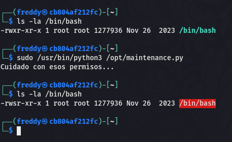

Hola otra vez y espero que todo os vaya genial, vamos a resolver otra máquina de [Dockerlabs](https://dockerlabs.es/#/), en este caso la máquina se llama Move y está incluida en la categoría fácil de Dockerlabs de [El Pingüino de Mario](https://www.youtube.com/channel/UCGLfzfKRUsV6BzkrF1kJGsg).


---------------------------------------------------------------------------------------------------------------------------------------------------

Sin más que añadir vamos a ello, como siempre empezaremos por descargar la máquina y realizar su instalación, recordad que funcionan mediante docker por lo que estaremos creando un contenedor en nuestra máquina local en el que se almacenará la máquina víctima.


Empezaremos realizando un ping a la máquina para verificar su correcto funcionamiento, al hacerlo vemos que tiene un TTL de 64, lo que significa que la máquina objetivo usa un sistema operativo Linux.


Como vemos, la máquina funciona correctamente y podemos empezar con el proceso de enumeración de la misma, vamos a ello.

# Enumeración

Lo primero que haremos para enumerar esta máquina será realizar un escaneo básico de puertos para identificar cuáles están abiertos.

```sudo nmap -p- --min-rate 5000 172.17.0.2 -Pn -n -oN escaneo```


Vemos tres puertos abiertos, vamos a realizar un escaneo más exhaustivo para tratar de enumerar las versiones de los servicios corriendo en dichos puertos y para lanzar unos scripts básicos de reconocimiento que nos podrían dar información valiosa acerca de los mismos.

``sudo nmap -p 22,80,3000 -sCV 172.17.0.2 -Pn -n -oN escaneoSC``


Según este output podemos verificar que tanto en el puerto 80 como en el 3000 podemos encontrar servicios web. Es interesante que también nos identifica una redirección a un panel de login en el puerto 3000. Vamos a analizar estos dos puertos manualmente para localizar nuestro vector de ataque.


En el puerto 80 encontramos una simple página por defecto, vamos a fuzzear en busca de directorios y archivos que no sean accesibles a simple vista y que nos puedan dar más información.


Parece que el archivo maintenance.html puede ser interesante, vamos a nalizar qué hay en su interior.


Tenemos un encabezado en HTML que nos proporciona la ruta de un archivo que parece bastante interesante pero al que de momento no podemos acceder ya que no estamos dentro del sistema. Guardaremos esto para el futuro. Viendo que no hay nada más por aquí pasaremos a enumerar el puerto 3000 de la máquina víctima.


Tenemos un panel de login de Grafana, pero lo más interesante es que en la parte inferior podemos observar la versión de este servicio, vamos a investigar acerca de la misma para ver si hay alguna vulnerabilidad conocida que permita nuestro primer acceso al sistema.


Genial, parece que esta versión en concreto está afectada por una vulnerabilidad que nos permite leer archivos que se encuentran dentro del sistema. Vamos a descargar este exploit a nuestra máquina atacante y comenzar nuestro proceso de intrusión.

# Explotación


Con nuestro exploit listo en nuestra máquina atacante vamos a tratar de ejecutarlo para explotar la vulnerabilidad presente en esta versión de Grafana. Vamos a ello.


¡Bien! Conseguimos explotar correctamente la vulnerabilidad y podemos leer cualquier archivo de la máquina que no requiera altos privilegios. Con esto y teniendo en mente que tenemos disponible el puerto 22 con un servicio SSH tratamos de enumerar los usuarios disponibles dentro del sistema así como el archivo al que se hacía alusión en el puerto 80 de la máquina. Con estas dos cosas parece que podríamos acceder al sistema, vamos a intentarlo.


Efectivamente, gracias a una enumeración exhaustiva de los puertos disponibles y la explotación de una vulnerabilidad de tipo LFI conseguimos nuestro primer acceso al sistema. Vamos a tratar de elevar nuestros privilegios para obtener el control total del sistema.

# Post-Explotación

Una vez estamos dentro del sistema vamos a enumerar los permisos de nuestro usuario para localizar cuál será nuestro vector para la escalada de privilegios.


Vaya, parece que este usuario tiene permisos para ejecutar el comando sudo junto a un script del cual tiene permisos de escritura. En este caso la escalada de privilegios vendrá de modificar este script para que realice las acciones que queramos ya que al ejecutarlo como root gracias al comando sudo no tendrá restricciones en cuanto a privilegios se refiere. Con esto en mente podríamos modificar el script para que ejecute una shell interactiva como root, en mi caso lo usaré para otorgarle permisos SUID al binario bash para poder spawnear una shell como root siempre que queramos obteniendo una gran persistencia en el sistema.




¡Eso es! Hemos cambiado correctamente los permisos y podemos obtener una shell como root simplemente usando el comando ``bash -p``, vamos a hacerlo.


Conseguimos spawnear una shell como root y obtenemos el control absoluto sobre el sistema pudiendo dar por concluida la máquina. Espero que os haya gustado mucho y nos vemos en la siguiente. :)


