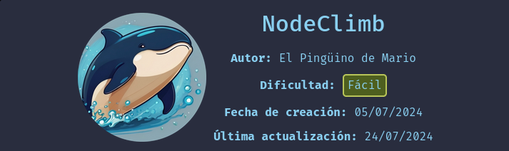

Hola otra vez, vamos a resolver otra máquina de [Dockerlabs](https://dockerlabs.es/#/), en este caso la máquina se llama NodeClimb y está incluida en la categoría fácil de Dockerlabs de [El Pingüino de Mario](https://www.youtube.com/channel/UCGLfzfKRUsV6BzkrF1kJGsg).



---------------------------------------------------------------------------------------------------------------------------------------------------

Sin más que añadir vamos a ello, como siempre empezaremos por descargar la máquina y realizar su instalación, recordad que funcionan mediante docker por lo que estaremos creando un contenedor en nuestra máquina local en el que se almacenará la máquina víctima.


Empezaremos realizando un ping a la máquina para verificar su correcto funcionamiento, al hacerlo vemos que tiene un TTL de 64, lo que significa que la máquina objetivo usa un sistema operativo Linux.


Como vemos, la máquina funciona correctamente y podemos empezar con el proceso de enumeración de la misma, vamos a ello.

# Enumeración

Lo primero que haremos para enumerar esta máquina será realizar un escaneo básico de puertos para identificar cuáles están abiertos.

```sudo nmap -p- --min-rate 5000 172.17.0.2 -Pn -n -oN escaneo```


Vemos abiertos los puertos 21 y 22 haciendo referencia a un servicio FTP y a un SSH respectivamente, vamos a realizar un escaneo más exhaustivo para tratar de enumerar las versiones de estos dos servicios así como para lanzar unos scripts básicos de reconocimiento que nos proporciona la propia herramienta de Nmap.


Vemos que en el puerto 21 hay un "secretito" almacenado y que está permitido el inicio de sesión anónimo, por lo que vamos a conectarnos para descargar este archivo y poder así acceder a su contenido.


Lo tenemos, vamos a inspeccionar este archivo


Parece que el archivo está protegido por contraseña, usaremos la herramienta Zip2john para obtener un hash que vamos a intentar crackear para conseguir la contraseña en texto plano.

# Explotación

Con esta hash en nuesto poder vamos a usar John para tratar de crackearlo y poder de esta forma acceder al contenido del archivo comprimido.


¡Bien! Vamos a descomprimir el archivo para poder ver qué se encuentra dentro del archivo password.txt que vimos referenciado.


Tenemos un par de credenciales que suponemos que deberían de ser válidas, vamos a intentar acceder al servicio SSH con las mismas.


¡Genial! Obtenemos nuestro primer acceso al sistema con este par de credenciales. Vamos a buscar la manera de elevar nuestros privilegios con el objetivo de convertirnos en el usuario root y lograr así comprometer el sistema por completo.

# Post-Explotación

Vamos a enumerar los permisos de nuestro usuario para identificar nuestro vector de escalada.


Vale, nuestro usuario es capaz de usar sudo junto a node para ejecutar un archivo en Javascript del cual es propietario y sobre el que tiene permisos de escritura, vamos a realizar una pequeña investigación para saber cómo podemos usar esto a nuestro favor.


En este caso tras una investigación y con ayuda de la IA llegamos a este pequeño script que otorgará permisos SUID al binario bash pudiendo obtener una shell como root siempre que queramos, también podríamos modificarlo para que otorgara una shell directamente, en mi caso personal prefiero siempre cambiar los privilegios de dicho binario ya que nos proporciona una shell bastante más estable.


¡Eso es! Hemos cambiado los permisos de la bash, vamos a ejecutar el comando ``/bin/bash -``p para obtener una shell como el usuario root.


Conseguimos nuestra shell y tenemos el control total sobre el sistema pudiendo dar por concluida la máquina. Espero que os haya gustado mucho y nos vemos en la siguiente. :)


