Hola otra vez, vamos a resolver otra máquina de [Dockerlabs](https://dockerlabs.es/#/), en este caso la máquina se llama Picadilly y está incluida en la categoría fácil de Dockerlabs de [El Pingüino de Mario](https://www.youtube.com/channel/UCGLfzfKRUsV6BzkrF1kJGsg).

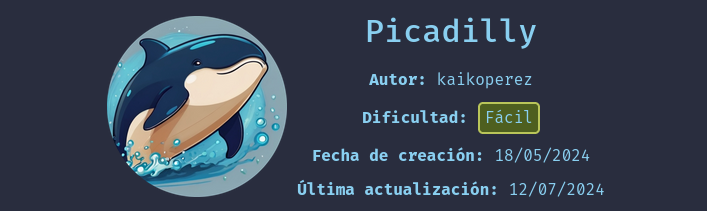

---------------------------------------------------------------------------------------------------------------------------------------------------

Sin más que añadir vamos a ello, como siempre empezaremos por descargar la máquina y realizar su instalación, recordad que funcionan mediante docker por lo que estaremos creando un contenedor en nuestra máquina local en el que se almacenará la máquina víctima.

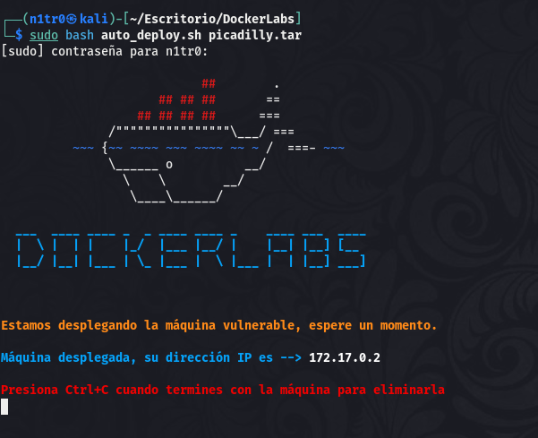

Empezaremos realizando un ping a la máquina para verificar su correcto funcionamiento, al hacerlo vemos que tiene un TTL de 64, lo que significa que la máquina objetivo usa un sistema operativo Linux.

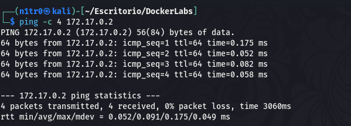

Como vemos, la máquina funciona correctamente y podemos empezar con el proceso de enumeración de la misma, vamos a ello.

# Enumeración

Lo primero que haremos para enumerar esta máquina será realizar un escaneo básico de puertos para identificar cuáles están abiertos.

```sudo nmap -p- --min-rate 5000 172.17.0.2 -Pn -n -oN escaneo```

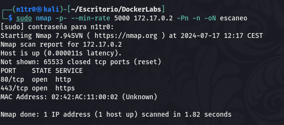

Este output nos muestra que dentro de la máquina nos encontramos con dos servicios web en los puertos 80 y 443, de cualquier manera vamos a realizar un escaneo más exhaustivo para tratar de enumerar las versiones de los servicios y lanzar unos scripts básicos de reconocimiento.

```sudo nmap -p 80,443 -sCV 172.17.0.2 -Pn -n -oN escaneoSC```

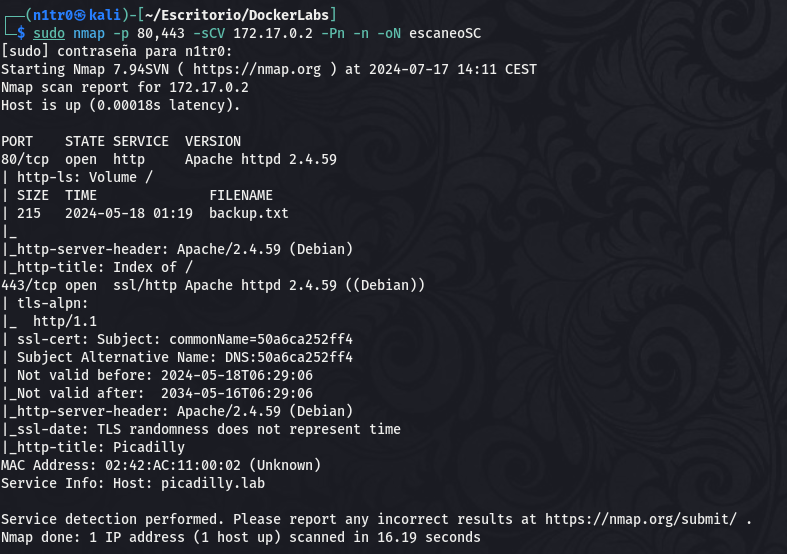

Vemos que en el puerto 80 de la máquina nos encontraremos con un página de listado de archivos en el que encontraremos uno llamado backup.txt, mientras que en el puerto 443 encontraremos una web llamada picadilly. Lo primero que haremos será investigar el archivo que se encuentra en el puerto 80.

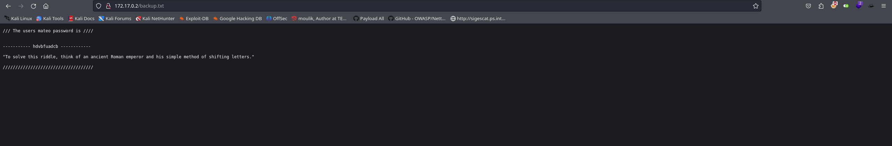

Se nos propone un pequeño acertijo en el que se hace referencia a un emperador romano, y sabemos que existe un método de encriptado llamado Caesar Cypher, por lo que suponemos que esta cadena de texto está usando este método para ocultar su contenido original. Vamos a tratar de averiguar de qué se trata.


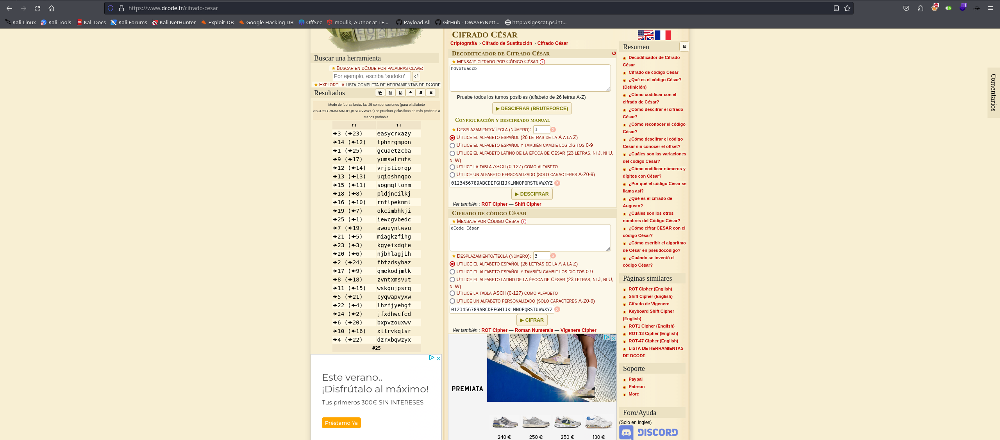

Se nos otorgan varias posibilidades, pero hay una enconcreto que nos llama más la atención que las demás. De todas formas no tenemos ningún sitio en el que probarlo, por lo que vamos a seguir enumerando el sistema, pero guardaremos esta información ya que seguramente nos haga falta más tarde. Vamos a inspeccionar lo que podemos encontrar en el puerto 443.

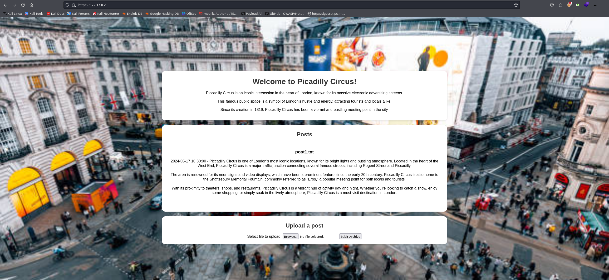

Vemos que tenemos la posibilidad de subir archivos, sin duda lo primero que haremos será intentar subir una reverse shell para recibir una conexión en nuestra máquina atacante y obtener de esta forma nuestro primer acceso.

# Explotación

Como en otras ocasiones, descargaremos nuestra reverse shell en PHP y la editaremos para adecuarla a nuestro caso concreto modificando la IP y el puerto de escucha en el que esperaremos la llegada de nuestra conexión.

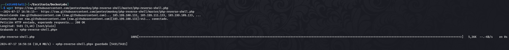

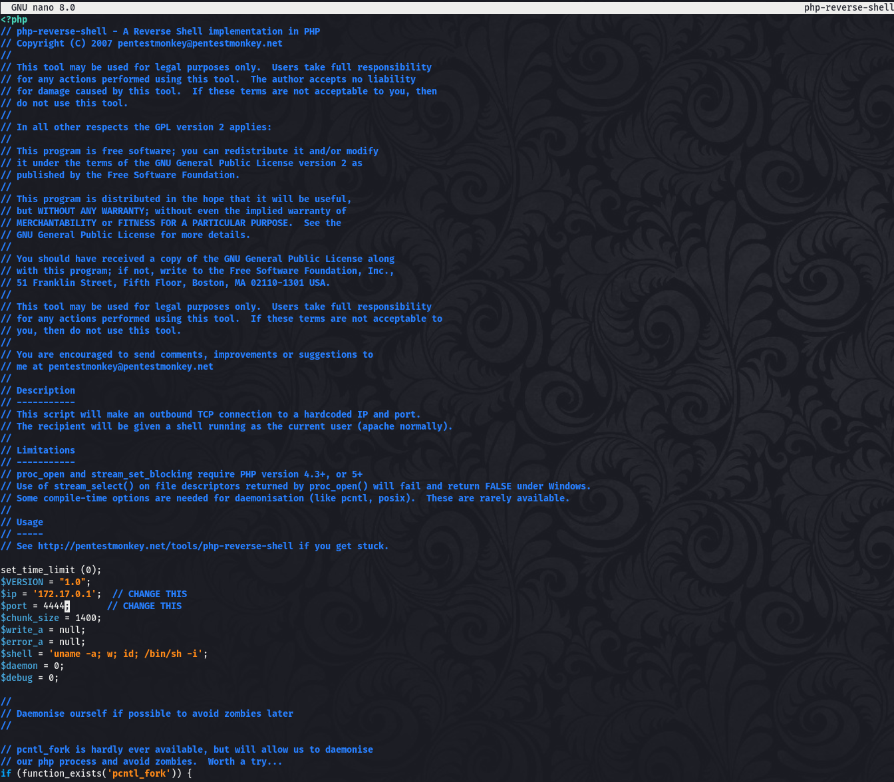

Con esto hecho nos pondremos en escucha por el puerto indicado y subiremos nuestra shell al servidor objetivo.

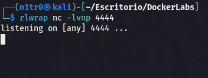


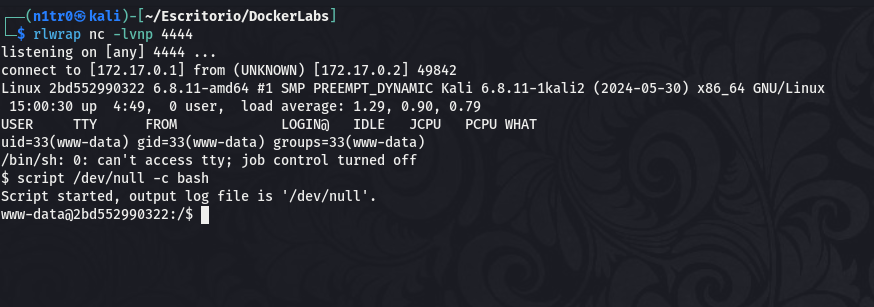

¡Genial! Accedemos al archivo que subimos al servidor y recibimos una conexión en el puerto de escucha, obteniendo así nuestro primer acceso al sistema, vamos a buscar la forma de elevar nuestros privilegios para comprometer la máquina por completo y obtener los mayores privilegios.

# Post-Explotación

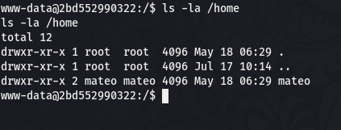

Vemos que hay un usuario llamado mateo disponible en el sistema, vamos a ver si lo que conseguimos descifrar antes con el Caesar Cypher podría ser la contraseña de este usuario.

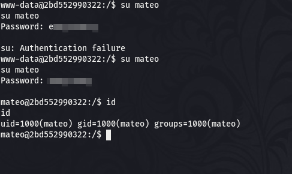

¡Eso es! Parece que una de las posibilidades funciona aunque hay que hacerle un pequeño ajuste por simple intuición. Con este nuevo usuario vamos a tratar de enumerar nuestros permisos para identificar cuál podría ser el vector para llegar a ser el usuario root y comprometer el sistema por completo.

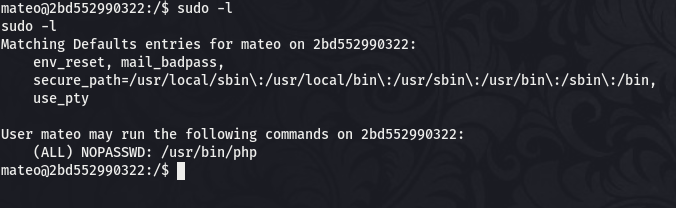

El usuario puede usar sudo para ejecutar el binario PHP, vamos a investigar en [GTFObins](https://gtfobins.github.io/) para saber cómo podemos aprovecharnos de esto para obtener los privilegios del usuario root.

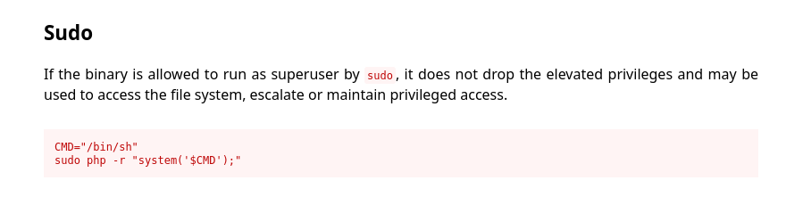

Parece que sólo tenemos que crear una variable que contenga la shell y luego usar sudo junto a PHP para hacer una llamada a esta variable para obtener una shell como root, vamos a hacerlo.

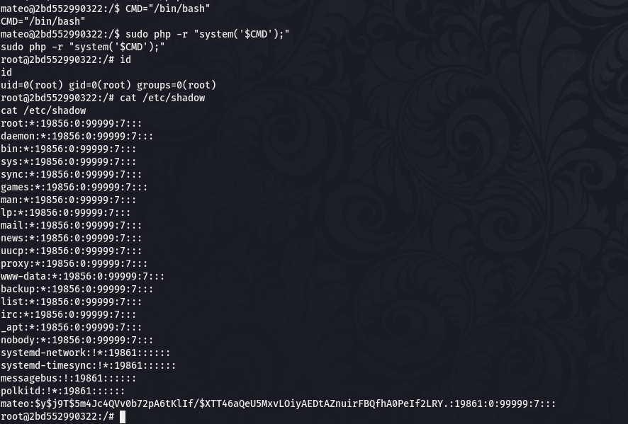

¡Bien! Nuestra explotación funciona correctamente y obtenemos una shell como el usuario root y tenemos el control total sobre el sistema pudiendo dar por completada la máquina. Espero que os haya gustado mucho y nos vemos en la siguiente. :)
