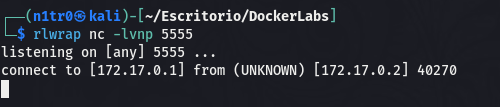

Hola otra vez, vamos a resolver otra máquina de [Dockerlabs](https://dockerlabs.es/#/), en este caso la máquina se llama Pinguinazo y está incluida en la categoría fácil de Dockerlabs de [El Pingüino de Mario](https://www.youtube.com/channel/UCGLfzfKRUsV6BzkrF1kJGsg).


---------------------------------------------------------------------------------------------------------------------------------------------------

Sin más que añadir vamos a ello, como siempre empezaremos por descargar la máquina y realizar su instalación, recordad que funcionan mediante docker por lo que estaremos creando un contenedor en nuestra máquina local en el que se almacenará la máquina víctima.


Empezaremos realizando un ping a la máquina para verificar su correcto funcionamiento, al hacerlo vemos que tiene un TTL de 64, lo que significa que la máquina objetivo usa un sistema operativo Linux.


Como vemos, la máquina funciona correctamente y podemos empezar con el proceso de enumeración de la misma, vamos a ello.

# Enumeración

Lo primero que haremos para enumerar esta máquina será realizar un escaneo básico de puertos para identificar cuáles están abiertos.

```sudo nmap -p- --min-rate 5000 172.17.0.2 -Pn -n -oN escaneo```


Tan sólo tenemos el puerto 5000 disponible, vamos a realizar un escaneo más exhaustivo para tratar de enumerar en profundidad el sistema así como para lanzar unos scripts básicos de reconocimiento que nos proporciona la propia herramienta de Nmap.

``sudo nmap -p 5000 --min-rate 5000 -sCV 172.17.0.2 -Pn -n -oN escaneoSC``


Parece que estamos ante un servidor usando Werkzeug usando Flask, vamos a inspeccionar manualmente esta web.


Vemos un panel de registro, vamos a fuzzear para buscar directorios y archivos ocultos a simple vista.


Identificamos un directorio console que en este tipo de servidores puede otorgarnos RCE, en este caso está protegido por PIN por lo que seguiremos enumerando.

Parece que el fuzzeo de momento no nos otorga más resultados, vamos a jugar un poco con el formulario que encontramos al principio. Vemos que hay una reflexión en el campo del nombre, vamos a ver si interpreta el código HTML.


Vemos que sí interpreta las etiquetas de HTML, vamos a comprobar si podemos realizar un ataque de SSTI, usaremos el payload {{7+7}}, si la operación se realiza correctamente significa que podríamos ejecutar comandos usando estas plantillas y realizando estos ataques de inyección.


¡Genial! La operación se ha realizado, vamos a usar esto para inyectar una reverse shell y obtener así nuestro primer acceso al sistema.

# Explotación


Tras una larga investigación acerca de los payloads usables para Jinja2 llegamos a este payload que permite ejecutar el comando que nos envía una shell a nuestra máquina atacante después de varios intentos que tornaban en un error. Para esta investigación usé HackTricks y el repositorio público de PayloadAllTheThings.


Y conseguimos nuestro primer acceso al sistema, vamos a identificar nuestra ruta para elevar los privilegios.

# Post-Explotación


Vemos que nuestro usuario puede ejecutar sudo junto al binario java sin necesidad de contraseña, vamos a investigar para ver cómo podríamos usar esto para comprometer por completo el sistema.


En GTFOBins no encontramos nada, vamos a seguir investigando. Encuentro [aquí](https://exploit-notes.hdks.org/exploit/linux/privilege-escalation/sudo/sudo-java-privilege-escalation/) una forma de usar esto para convertirnos en el usuario root. Básicamente lo que se nos dice es que si podemos usar java como root podremos ejecutar una reverse shell con extensión .jar que nos otorgará una shell como el usuario root, vamos a intentarlo.


En nuestra máquina atacante usamos MSFvenom para generar una reverse shell en java, ahora la descargaremos desde la máquina víctima.


Genial, tenemos nuestra reverse shell preparada en la máquina víctima, vamos a ponernos en escucha en la máquina atacante.


Ahora ejecutaremos la shell que hemos creado.




Y recibimos la conexión correctamente, vamos a realizar un pequeño tratamiento de la TTY para estabilizar nuestra conexión.

``script /dev/null -c bash;
CTRL Z;
stty raw -echo; fg;
reset xterm;
export TERM=xterm;
export SHELL=bash;``


Tenemos una conexión estable.


Somos el usuario root y hemos comprometido el sistema por completo pudiendo dar por concluida la máquina. Espero que os haya gustado mucho y nos vemos en la siguiente. :)


