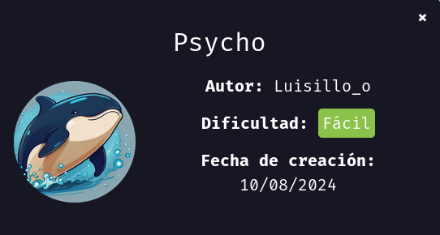

Hola otra vez, vamos a resolver otra máquina de [Dockerlabs](https://dockerlabs.es/#/), en este caso la máquina se llama Psycho y está incluida en la categoría fácil de Dockerlabs de [El Pingüino de Mario](https://www.youtube.com/channel/UCGLfzfKRUsV6BzkrF1kJGsg).



---------------------------------------------------------------------------------------------------------------------------------------------------

Sin más que añadir vamos a ello, como siempre empezaremos por descargar la máquina y realizar su instalación, recordad que funcionan mediante docker por lo que estaremos creando un contenedor en nuestra máquina local en el que se almacenará la máquina víctima.


Empezaremos realizando un ping a la máquina para verificar su correcto funcionamiento, al hacerlo vemos que tiene un TTL de 64, lo que significa que la máquina objetivo usa un sistema operativo Linux.


Como vemos, la máquina funciona correctamente y podemos empezar con el proceso de enumeración de la misma, vamos a ello.

# Enumeración

Lo primero que haremos para enumerar esta máquina será realizar un escaneo básico de puertos para identificar cuáles están abiertos.

```sudo nmap -p- --min-rate 5000 172.17.0.2 -Pn -n -oN escaneo```


Identificamos que los puertos 22 y 80 est-an abiertos, vamos a realizar un escaneo más exhaustivo para tratar de enumerar versiones así como para lanzar ciertos scripts básicos de reconocimiento.

``sudo nmap -p 22,80 --min-rate 5000 -sCV 172.17.0.2 -Pn -n -oN escaneoSC``


No vemos nada interesante así que vamos a inspeccionar el servicio web que está funcionando por el puerto 80 en el que sabemos que su título es 4you gracias al output de nmap.


Puede que este comentario nos sirva en algún momento, de cualquier forma vamos a fuzzear para encontrar directorios y archivos ocultos ya que en el código fuente tampoco encontramos nada interesante.


De momento tenemos un directorio /assets, vamos a analizarlo.


Sólo vemos la foto del fondo de la página, vamos a hacernos con ella para ver si contiene metadatos que nos puedan dar alguna pista.


En los metadatos no hay nada interesante, vamos a verificar que no se esté haciendo uso de steganografía para ocultar algo dentro de la fotografía.


Parece que tampoco hay nada por aquí, y nuestro fuzzeo no ha dado ningún resultado más, encontramos la página index.php y se me ocurre que podría existir algún parámetro oculto.


Y efectivamente, tenemos un parámetro llamado secret. Vamos a realizar un ataque de fuerza bruta al contenido de este parámetro.

# Explotación


Pruebo con varias wordlists y no hay coincidencias, se me ocurre que en este parámetro podría existir una vulnerabilidad de LFI(Local File Inclusion), vamos a probar. Al hacer pruebas me doy cuenta de que el error que aparecía en la página de inicio en la parte inferior era debido a este parámetro.


¡Genial! Podemos leer el archivo /etc/passwd e identificamos que dentro de la máquina existen los usuarios luisillo y vaxei, con estos dos usuarios podemos realizar una lista para realizar un ataque de fuerza bruta y tratar de obtener un inicio de sesión exitoso por el servicio SSH, vamos a hacerlo.


Con esta lista creada vamos a realizar el ataque, aunque antes me gustaría probar la contraseña caramelo con ambos debido al comentario que encontramos antes.


No pudo ser, vamos a desplegar la artillería pesada para realizar este ataque en condiciones.


Parece que tampoco va a ser posible obtener un inicio de sesión de esta manera, pero sabemos que tenemos una vulnerabilidad de LFI y un servicio SSH corriendo en la máquina, por lo que podríamos usar esto para leer las claves privadas de los usuarios y obtener así un acceso, vamos a hacer esto.


Tenemos la clave privada del usuario vaxei, vamos a guardar el contenido en un archivo.


Usamos el comando ``chmod 600 id_rsa`` para tener los permisos correctos para poder usarla para iniciar sesión.


Con esto podemos usarla para acceder al sistema.


Genial, estamos dentro, vamos a buscar la forma de elevar nuestros privilegios para comprometer el sistema por completo.

# Post-Explotación


Vemos que en el directorio personal de nuestro usuario hay un archivo bastante aleatorio que no parece que nos vaya a servir para nada pero con el comando sudo -l vemos que podemos usar el binario perl como el usuario luisillo con sudo , vamos a usar esto para pivotar hacia dicho usuario.


¡Eso es! Tenemos una shell como luisillo, vamos a estabilizar la misma.


Una vez estabilizada vamos a listar los permisos de este usuario en concreto.


Podemos usar como sudo un archivo en python que se encuentra en el directorio /opt, vamos a analizarlo con detalle para buscar una forma de usar esto para elevar nuestros privilegios.


Cabe la posibilidad de que seamos capaces de realizar un Library Hijacking creando un archivo llamado subprocess,py que ejecute los comandos que nosotros queramos al ejecutar este script como sudo, vamos a intentarlo.


Creamos un archivo que le otorgará permisos SUID a la bash, vamos a probarlo.


Y con esto conseguimos cambiar los permisos correctamente, sólo tendremos que usar el comando ``bash -p`` para obtener una shell como el usuario root.


Tenemos nuestra shell como el usuario root y hemos comprometido el sistema por completo pudiendo dar por concluida la máquina. Espero que os haya gustado mucho y nos vemos en la siguiente. :)


