Hola otra vez, vamos a resolver otra máquina de [Dockerlabs](https://dockerlabs.es/#/), en este caso la máquina se llama WhereIsMyWebshell y está incluida en la categoría fácil de Dockerlabs de [El Pingüino de Mario](https://www.youtube.com/channel/UCGLfzfKRUsV6BzkrF1kJGsg).

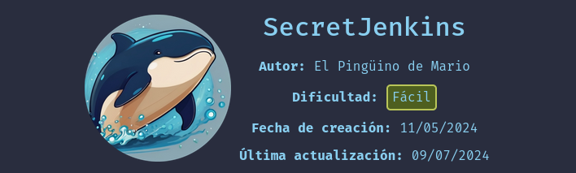

---------------------------------------------------------------------------------------------------------------------------------------------------

Sin más que añadir vamos a ello, como siempre empezaremos por descargar la máquina y realizar su instalación, recordad que funcionan mediante docker por lo que estaremos creando un contenedor en nuestra máquina local en el que se almacenará la máquina víctima.

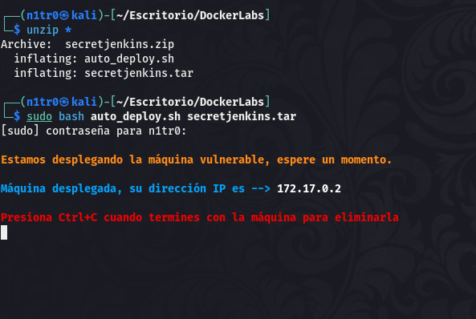

Empezaremos realizando un ping a la máquina para verificar su correcto funcionamiento, al hacerlo vemos que tiene un TTL de 64, lo que significa que la máquina objetivo usa un sistema operativo Linux.

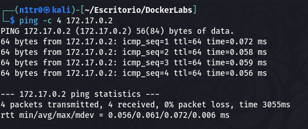

Como vemos, la máquina funciona correctamente y podemos empezar con el proceso de enumeración de la misma, vamos a ello.

# Enumeración

Lo primero que haremos para enumerar esta máquina será realizar un escaneo básico de puertos para identificar cuáles están abiertos.

```sudo nmap -p- --min-rate 5000 172.17.0.2 -Pn -n -oN escaneo```

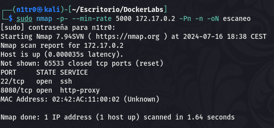

Vemos que tenemos disponibles los puertos 22 y 8080, vamos a realizar un escaneo más exhaustivo de estos dos puertos para tratar de enumerar las versiones de los servicios y lanzar unos scripts básicos de reconocimiento.

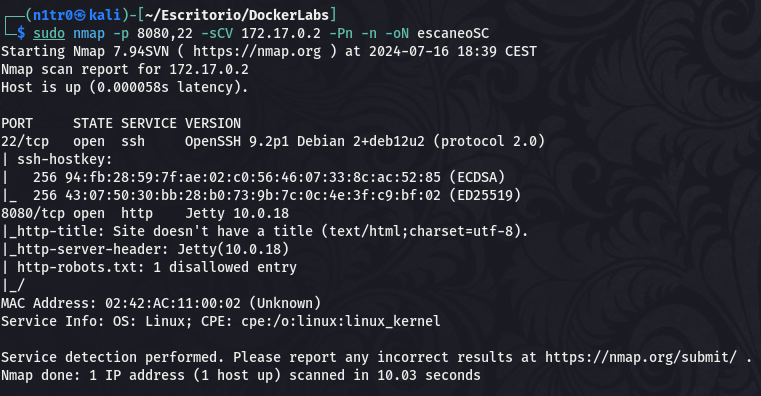

Este output nos muestra que en el puerto 8080 nos encontramos con un servidor Jetty el cual hace referencia a una instancia de Jenkins, el cual no suele ser demasiado seguro. Vamos a echarle un vistazo.

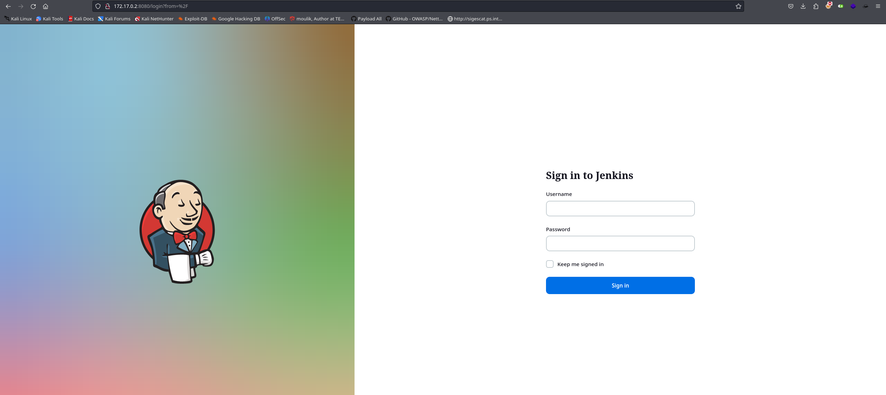

Nos encontramos con un panel de login pero no disponemos de ninguna pista acerca de usuarios, vamos a fuzzear este servicio para tratar de encontrar directorios y archivos que no son visibles a simple vista, puede que encontremos algo que merezca la pena.

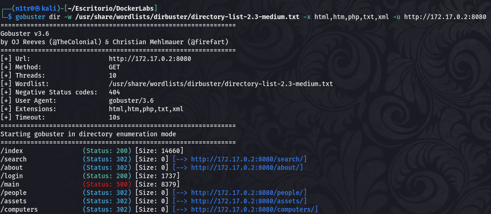

En este output nos encontramos con un directorio index que vale la pena visitar, vamos a acceder al mismo para ver qué nos encontramos.

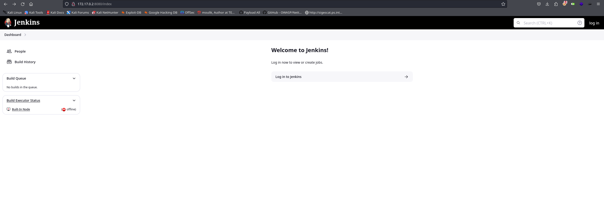

Desde aquí podemos acceder a varias secciones de esta instancia, pero lo realmente importante es que si nos fijamos bien veremos que abajo a la derecha encontramos la versión de este Jenkins,


Vamos a investigar un poco sobre esta versión en concreto.

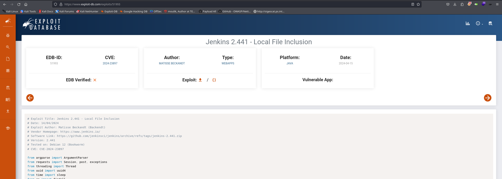

Parece ser que esta versión de Jenkins tiene una vulnerabilidad conocida de Local File Inclusion, por lo que tenemos la capacidad de leer archivos internos de la máquina. 


# Explotación

Podemos usar esto a nuestro favor tratando de leer el archivo /etc/passwd para ver qué usuarios están disponibles dentro del sistema y lanzar un ataque de fuerza bruta a cada uno de ellos por el puerto 22 en el que hay un servicio SSH tratando de obtener de esta manera un inicio de sesión exitoso. Vamos a hacerlo.

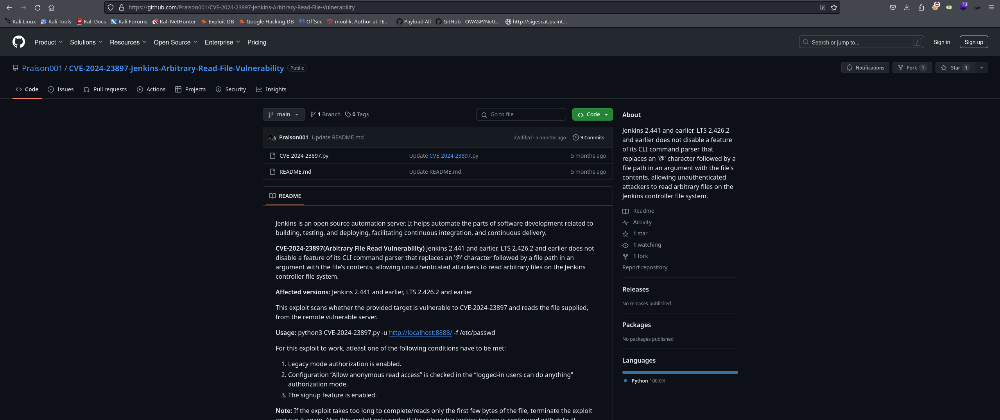

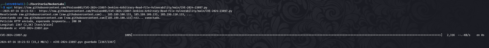

Con el exploit en nuestra máquina local estamos listos para tratar de leer el archivo en cuestión.

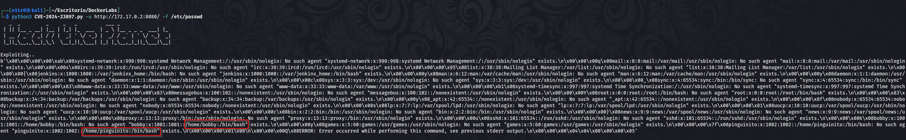

Genial, el exploit ha funcionado correctamente y podemos ver que hay dos usuarios que tienen directorio /home dentro del sistema, y estos en concreto son los que deberían de tener la posibilidad de iniciar sesión por SSH. Teniendo estos datos en nuestro poder podemos hacer una lista con estos dos usuarios y lanzar un ataque de fuerza bruta al servicio SSH, vamos a hacerlo.

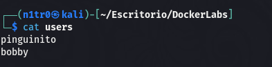

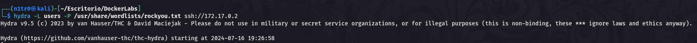

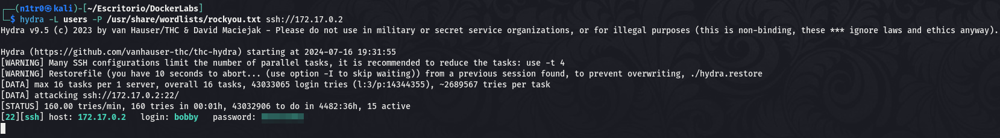

Eso es, conseguimos las credenciales del usuario bobby así que podemos usarlas para iniciar sesión dentro de la máquina y obtener así nuestro primer acceso.

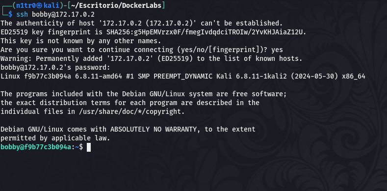

¡Bien! Estamos dentro del sistema, vamos a tratar de encontrar la manera de elevar nuestros privilegios para obtener el control total sobre la máquina.

# Post-Explotación

Para tratar de enumerar los permisos de nuestro usuario usaremos el coomando ```sudo -l```.

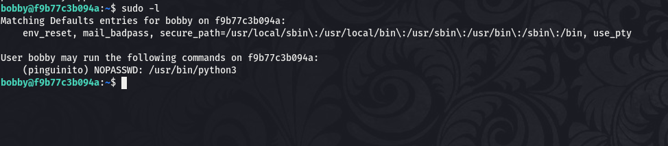

Parece que nuestro usuario puede ejecutar sudo como el usuario pinguinito junto al binario python 3, vamos a hacer una pequeña investigación en [GTFObins](https://gtfobins.github.io) para ver si esto puede servirnos para elevar nuestros privilegios.

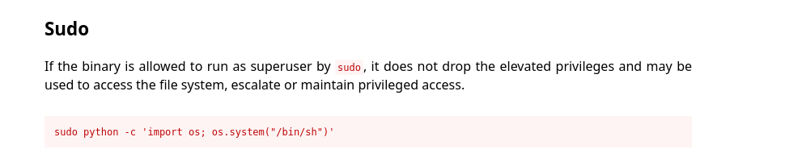


Efectivamente, parece que podemos usar sudo junto a python3 para movernos lateralmente hacia el usuario pinguinito.

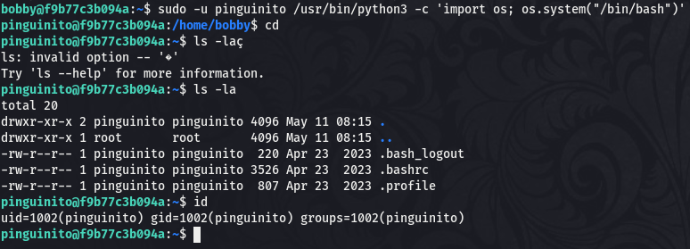

Genial, tenemos un nuevo usuario y eso significa que tenemos nuevos permisos, vamos a tratar de listarlos.

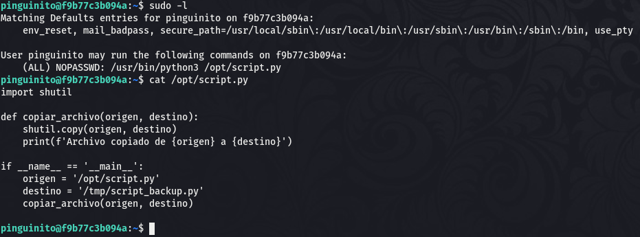

Vemos que el usuario pinguinito puede ejecutar un script en concreto con sudo impersonando al usuario root. Vamos a ver de qué forma podríamos aprovecharnos de esto mirando detenidamente el script. 

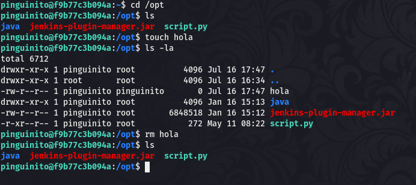

El script como tal no va a permitir que seamos capaces de elevar nuestros privilegios pero investigando vemos que tenemos permisos de escritura dentro del directorio /opt por lo que simplemente tendremos que reemplazar el script por uno malicioso que haga lo que nosotros queramos y ejecutarlo como sudo ya que tendremos privilegios elevados para hacer cualquier cosa, en mi caso trataré de ejecutar una shell como root, vamos a ello.

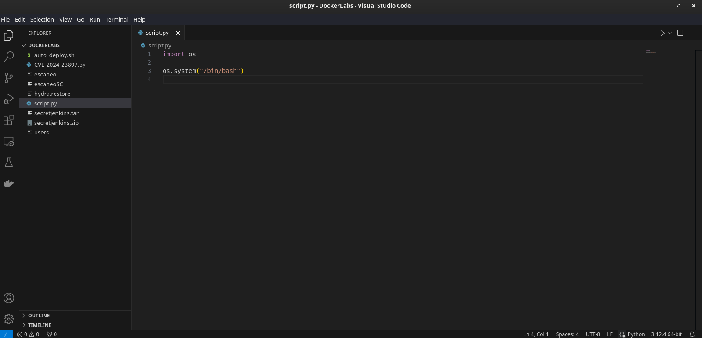

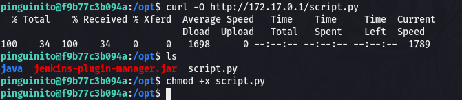

Tenemos nuestro script malicioso listo para entrar en acción, vamos a ejecutarlo como sudo dentro de la máquina víctima.

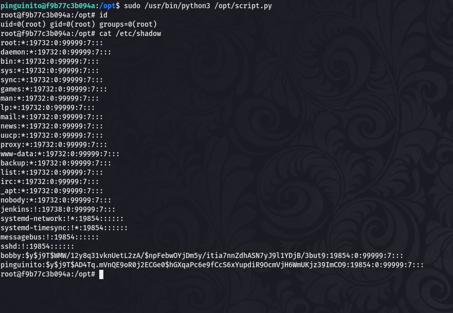

¡Eso es! Conseguimos convertirnos en el usuario root y tenemos el control total sobre el sistema pudiendo dar por concluida esta máquina, espero que os haya gustado mucho y nos vemos en la siguiente. :)


