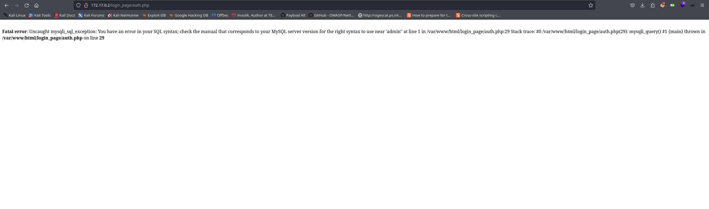
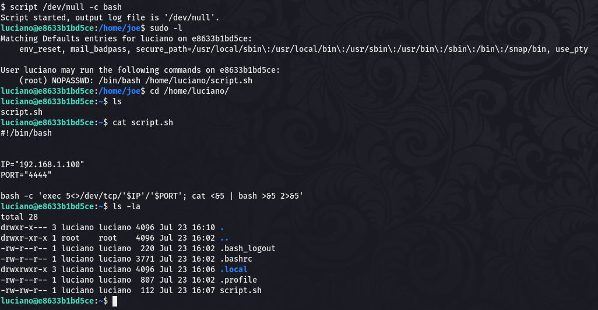

Hola otra vez, vamos a resolver otra máquina de [Dockerlabs](https://dockerlabs.es/#/), en este caso la máquina se llama ShowTime y está incluida en la categoría fácil de Dockerlabs de [El Pingüino de Mario](https://www.youtube.com/channel/UCGLfzfKRUsV6BzkrF1kJGsg).


---------------------------------------------------------------------------------------------------------------------------------------------------

Sin más que añadir vamos a ello, como siempre empezaremos por descargar la máquina y realizar su instalación, recordad que funcionan mediante docker por lo que estaremos creando un contenedor en nuestra máquina local en el que se almacenará la máquina víctima.


Empezaremos realizando un ping a la máquina para verificar su correcto funcionamiento, al hacerlo vemos que tiene un TTL de 64, lo que significa que la máquina objetivo usa un sistema operativo Linux.


Como vemos, la máquina funciona correctamente y podemos empezar con el proceso de enumeración de la misma, vamos a ello.

# Enumeración

Lo primero que haremos para enumerar esta máquina será realizar un escaneo básico de puertos para identificar cuáles están abiertos.

```sudo nmap -p- --min-rate 5000 172.17.0.2 -Pn -n -oN escaneo```


Enocntramos abiertos los puertos 22 y 80, vamos a realizar un escaneo exhaustivo para tratar de enumerar las versiones de los servicios así como para lanzar un conjunto de scripts básicos de reconocimiento que la propia herramienta de Nmap selecciona para cada puerto en concreto.

``sudo nmap -p 22,80 --min-rate 5000 -sCV 172.17.0.2 -Pn -n -oN escaneoSC``


De momento nada que llame nuestra atención, vamos a analizar manualmente el puerto 80 para ver qué encontramos en este servicio web.


Encontramos la web de un casino que parece que tiene un panel de login, de cualquier manera vamos a ir lanzando un fuzzeo para identificar directorios y archivos ocultos.


Nada por aquí que llame nuestra atención demás del directorio de login al que ya podíamos acceder desde la página de inicio. Analizamos el código fuente y no vemos nada interesante por lo que iremos directamente a inspeccionar el directorio de login.


Probamos con varias credenciales por defecto y no hay suerte, tampoco vemos una reflexión de nuestro input. Al probar una sintaxis básica de SQL para tratar de bypassear este proceso de autenticación tenemos un error, lo cual indica que podiblemente podamos usar un ataque de SQL Injection en este panel.




# Explotación

Probamos con varias modificaciones y conseguimos saltar este proceso de autenticación con el payload ``admin' OR 1=1 -- -``.


Parece que aunque hayamos efectuado esto con éxito no vamos a llegar a nada a raíz de este login, pero sabemos que podemos interactuar con el contenido de la base de datos por lo que vamos a explotar esto para tratar de obtener credenciales válidas. Vamos a usar SQLmap para interactuar con la base de datos, aunque también podríamos hacer esto manualmente.


Tenemos 5 bases de datos pero la que nos interesa es la llamada users, vamos a acceder a su contenido, antes identificaremos las tablas y columnas de la misma para verificar que es lo que necesitamos.


¡Eso es! Justo lo que estábamos buscando, vamos a dumpear los contenidos.


Tenemos las credenciales de tres usuarios, vamos a probar las mismas en el panel de login que hemos usado para obtener estos contenidos.


Al entrar con el usuario joe se nos da la nueva posibilidad de ejecutar comandos en python, lo cual podremos explotar para introducir una reverse shell que nos otorgue una conexión en nuestra máquina atacante.


¡Eso es! Conseguimos nuestro primer acceso al sistema usando este panel de administración con un simple comando en python, vamos a buscar la manera de elevar nuestros privilegios para comprometer el sistema por completo.

# Post-Explotación

Una vez estamos dentro del sistema buscamos los distintos usuario accediendo al directorio /home, pero no tenemos permisos para acceder a los contenidos de los mismos por lo que seguimos enumerando el sistema en busca de información privilegiada.


En el directorio /tmp vemos un archivo que llama nuestra atención, vamos a acceder a su contenido.


Tenemos una lista de nombres de trucos para GTA, pero es un archivo que se ha tratado de ocultar con especial cuidado por lo que dentro de esta lista podría haber alguna contraseña, para probar esto usaremos un script en bash creado por el propio Mario que nos permite realizar ataques de fuerza bruta a usuarios dentro de un sistema Linux.


Vamos a hacernos con la lista y a convertir su contenido a minúsculas.


Tenemos todo preparado, vamos a ejecutar el script, como primer usuario usaremos a joe ya que vimos previamente que tenía más permisos que los demás.


¡Genial! En esta lista se encontraba la contraseña de este usuario, vamos a iniciar sesión como el mismo. Recordamos que el puerto 22 está abierto por lo que usaremos este protocolo para tener una shell más estable y para demostrar la persistencia obtenida.


Somos el usuario joe y eso significa que tenemos más permisos que enumerar, vamos a listar los mismos para identificar nuestro vector de escalada.


Este usuario puede ejecutar posh como el usuario luciano usando sudo, este binario es una shell alternativa a bash o sh por lo que con el comando ``sudo posh`` deberíamos de obtener una shell como dicho usuario.


¡Bien! Hemos conseguido pivotar hacia un nuevo usuario, vamos a enumerar los permisos del mismo así como los contenidos de su directorio personal.



Parece que este usuario puede ejecutar como root un script del cual tiene permisos de escritura, sólo tendremos que modificar el contenido del mismo para ejecutar las órdenes que queramos, como siempre intentaré otorgarle a la bash permisos SUID. 


Con esto conseguimos modificar los permisos del binario bash y sólo tendremos que ejecutar el comando ``bash -p`` para obtener una shell como el usuario root.


¡Bingo! Conseguimos convertirnos en el usuario root comprometiendo el sistema por completo y pudiendo dar por concluida esta entretenida máquina. Espero que os haya gustado mucho y nos vemos en la siguiente. :)


