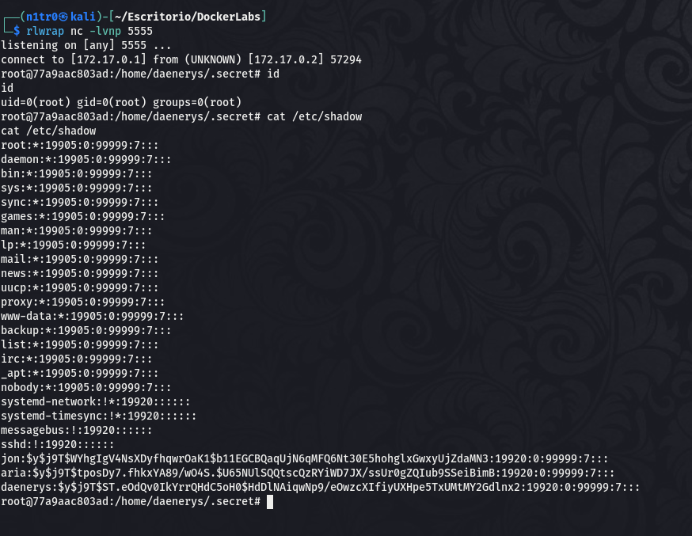

Hola otra vez, vamos a resolver otra máquina de [Dockerlabs](https://dockerlabs.es/#/), en este caso la máquina se llama WinterFell y está incluida en la categoría fácil de Dockerlabs de [El Pingüino de Mario](https://www.youtube.com/channel/UCGLfzfKRUsV6BzkrF1kJGsg).


---------------------------------------------------------------------------------------------------------------------------------------------------

Sin más que añadir vamos a ello, como siempre empezaremos por descargar la máquina y realizar su instalación, recordad que funcionan mediante docker por lo que estaremos creando un contenedor en nuestra máquina local en el que se almacenará la máquina víctima.


Empezaremos realizando un ping a la máquina para verificar su correcto funcionamiento, al hacerlo vemos que tiene un TTL de 64, lo que significa que la máquina objetivo usa un sistema operativo Linux.


Como vemos, la máquina funciona correctamente y podemos empezar con el proceso de enumeración de la misma, vamos a ello.

# Enumeración

Lo primero que haremos para enumerar esta máquina será realizar un escaneo básico de puertos para identificar cuáles están abiertos.

```sudo nmap -p- --min-rate 5000 172.17.0.2 -Pn -n -oN escaneo```


Vemos varios puertos abiertos y llama la atención que tenemos tanto SSH como SMB, vamos a realizar un escaneo más exhaustivo para tratar de enumerar las versiones de los servicios y lanzar unos scripts básicos de reconocimiento.

``sudo nmap -p 22,80,139,445 --min-rate 5000 -sCV 172.17.0.2 -Pn -n -oN escaneoSC``


En este output podemos ver que aparece el nombre de la serie Juego de Tronos en el puerto 80 por lo que probablemente estemos ante una máquina temática teniendo en cuenta que el nombre de la máquina también hace refrencia a la misma, y personalmente este tipo de CTFs son los que más disfruto. Vamos a acceder a este puerto ya que por el momento no tenemos credenciales válidas para iniciar sesión.


Efectivamente, tenemos una web inspirada en la serie. En el código fuente no vemos nada interesante así que vamos a fuzzear para tratar de identificar directorios y archivos ocultos.


Vemos un directorio llamado dragon y parece que es el que más llama la atención, vamos a acceder al mismo.


Vemos el nombre de los capítulos de la primera temporada de la serie, y se indica que no hay espacios porque la persona que lo escribió tenía la barra espaciadora estropeada. 

# Explotación

Desde nuestra forma de pensar esto podría ser una lista de posibles contraseñas y en el directorio raíz de la web vimos tres posibles nombres de usuario. Vamos a crear dos listas con estos datos para usarlas tanto en el SSH como en el SMB de la máquina para tratar de identificar unas credenciales válidas.


Con las dos listas creadas vamos a realizar unos pequeños ataques de fuerza bruta, comenzaremos con el protocolo SMB.


Nos dice un par de credenciales, pero al probarlas con smbclient y smbmap no funcionan correctamente así que podríamos estar ante un falso positivo. Al probar sólo con el usuario jon también nos da un inicio de sesión válido y parece que el mismo tiene mejor funcionamiento.


Con smbmap vemos que podemos acceder al contenido del directorio shared, vamos a usar smbclient para acceder a los contenidos.


Vemos un archivo interesante así que lo descargamos en nuestra máquina para ver qué nos encontramos.


Parece que Jon ha dejado un mensaje para Arya en el que le indica su contraseña encodeada en un "lenguaje antiguo", nosotros vemos claramente que ese lenguaje resulta ser base64, vamos a decodearlo para acceder al contenido original.


Tenemos una posible contraseña para el usuario jon, vamos a intentar acceder al sistema por SSH con estas credenciales.


¡Eso es! Conseguimos nuestro primer acceso al sistema gracias a estas credenciales, vamos a buscar la forma de elevar nuestros privilegios para comprometer el sistema por completo.

# Post-Explotación

Vemos que en el directorio de este usuario hay un mensaje, vamos a leerlo.


El mensaje hace referencia al script oculto que vimos al listar los contenidos de nuestro directorio, y parece que podemos usar sudo para ejecutar este script como el usuario arya, aunque no tenemos permisos de escritura sobre el mismo. Vamos a buscar la forma de usar esto para lograr pivotar a dicho usuario.

Si nos fijamos en el script vemos que importa dos librerías y cabe la posibilidad de que al estar en nuestro directorio personal podamos usar un ataque de Library Hijacking creando una "librería" maliciosa que ejecute las órdenes que queramos, vamos a intentarlo.


Hemos creado nuestra librería maliciosa que nos debería de otorgar una shell como el usuario aria al usar sudo junto al script legítimo, vamos a hacerlo.


¡Genial! Somos un nuevo usuario y tenemos nuevos permisos que enumerar. 


Podemos usar los comandos ls y cat como el usuario daenerys, vamos a usar esto para listar los contenidos del directorio de este usuario.


Identificamos que en este directorio hay otro mensaje, vamos a acceder a su contenido.


Tenemos la contraseña del último de los tres usuarios que vimos, vamos a iniciar sesión como el mismo.


Somos el usuario daenerys, vamos a enumerar sus permisos.


Vemos que este usuario puede ejecutar como cualquier usuario un script que se encuentra en un directorio oculto dentro de su carpeta personal y del cual tiene permisos de escritura, esto es bastante crítico. Vamos a modificar el contenido de este script para otorgarle permisos SUID al binario bash dándonos una vía fácil para obtener una shell estable como el usuario root. También podríamos modificar el contenido del script para introducir una reverse shell que nos dé una shell como root en nuestra máquina atacante poniéndonos previamente en escucha. Vamos a usar las dos maneras para que cada quien elija la vía que más le guste.




Recibimos nuestra shell como el usuario root, vamos a usar el otro método que es el que más me gusta personalmente.


Conseguimos otorgarle permisos SUID a la bash y sólo tendremos que ejecutar ``bash -p`` para obtener nuestra shell estable como root.


Somos el usuario root y hemos comprometido el sistema por completo pudiendo dar por concluida esta divertida máquina. Espero que os haya gustado mucho y nos vemos en la siguiente. :)


