Hola otra vez, vamos a resolver otra máquina de [Dockerlabs](https://dockerlabs.es/#/), en este caso la máquina se llama Asucar y está incluida en la categoría media de Dockerlabs de [El Pingüino de Mario](https://www.youtube.com/channel/UCGLfzfKRUsV6BzkrF1kJGsg).

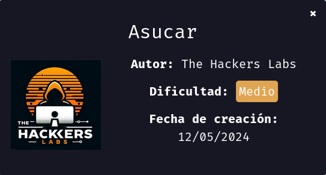

---------------------------------------------------------------------------------------------------------------------------------------------------

Sin más que añadir vamos a ello, como siempre empezaremos por descargar la máquina y realizar su instalación, recordad que funcionan mediante docker por lo que estaremos creando un contenedor en nuestra máquina local en el que se almacenará la máquina víctima.

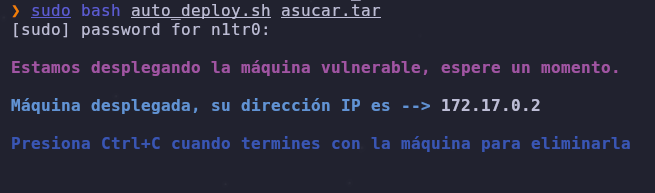

Empezaremos realizando un ping a la máquina para verificar su correcto funcionamiento, al hacerlo vemos que tiene un TTL de 64, lo que significa que la máquina objetivo usa un sistema operativo Linux.

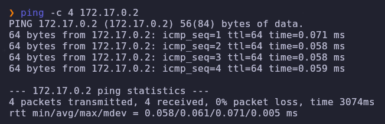

Como vemos, la máquina funciona correctamente y podemos empezar con el proceso de enumeración de la misma, vamos a ello.

# Enumeración

Lo primero que haremos para enumerar esta máquina será realizar un escaneo básico de puertos para identificar cuáles están abiertos.

```sudo nmap -p- --min-rate 5000 172.17.0.2 -Pn -n -oN escaneo```

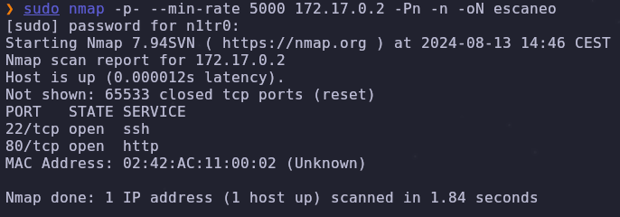

Como ya es costumbre vemos abiertos el puerto 80 y el puerto 22, vamos a realizar un escaneo más exhaustivo para tratar de enumerar las versiones de los servicios así como lanzar unos scripts básicos de reconocimiento.

``sudo nmap -p 22,80 --min-rate 5000 -sCV 172.17.0.2 -Pn -n -oN escaneoSC``

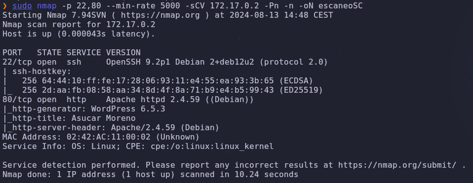

Vemos que el servicio web está usando Wordpress como CMS, vamos a analizarlo accediendo al mismo.

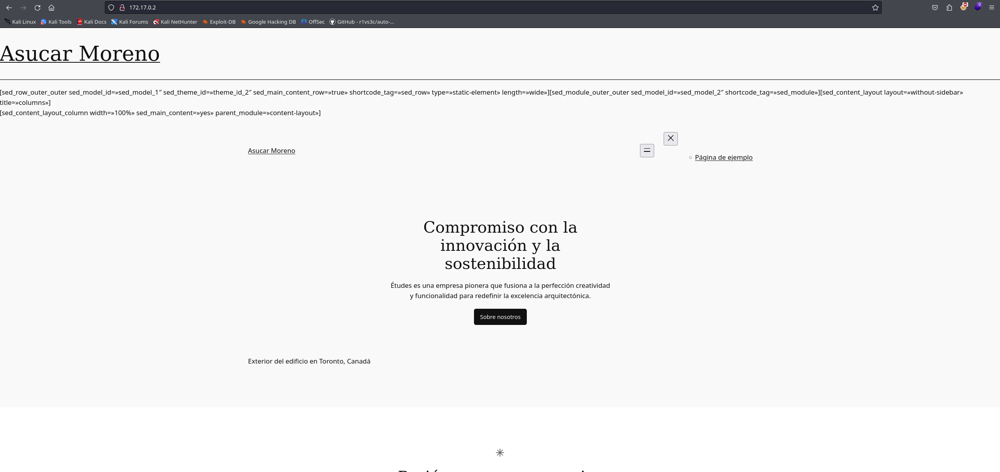

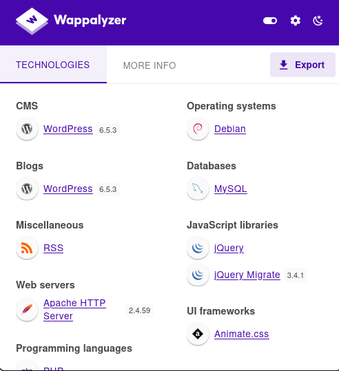

Efectivamente, estamos ante una instancia de Wordpress, vamos a hacer un escaneo del mismo.

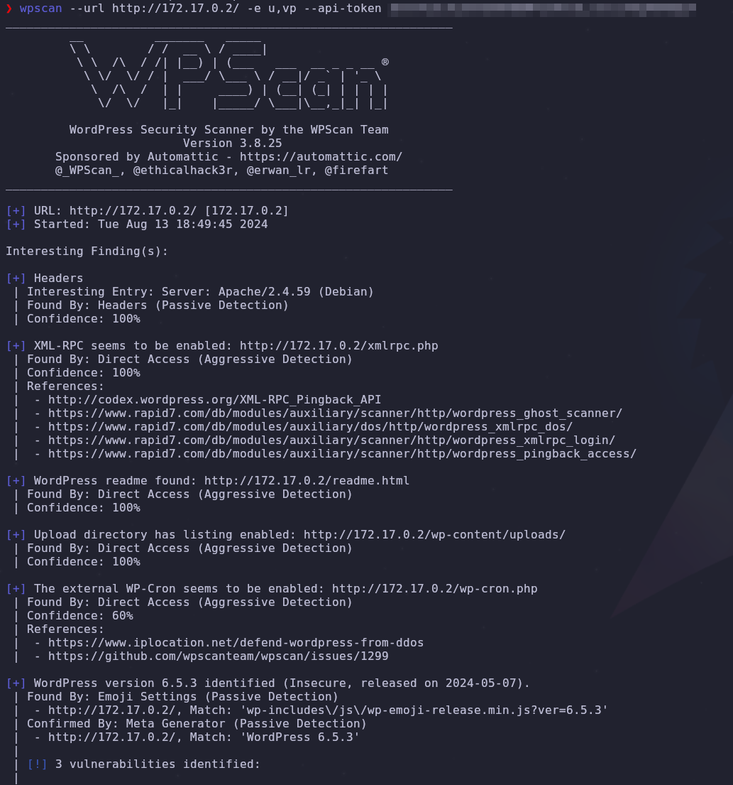

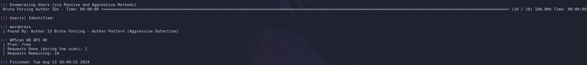

Este escaneo automatizado encuentra un usuario llamado wordpress que vamos a omitir por el momento ya que dudo mucho que esta sea una vía potencial para obtener el primer acceso. Vamos a listar los plugins de este Wordpress para localizar si alguno de los mismos es vulnerable.

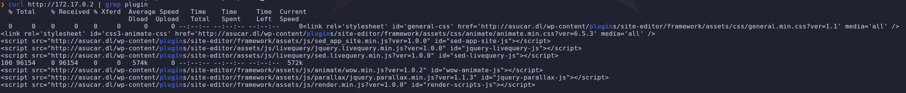

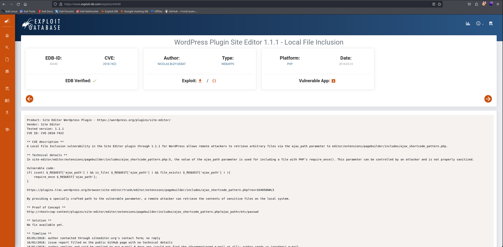

Parece que la versión de uno de los plugins es vulnerable a LFI(Local File Inclusion), vamos a tirar de este hilo para obtener información que nos permita aumentar nuestra superficie de ataque. Leeremos con detalle esta vulnerabilidad para poder explotarla.

# Explotación

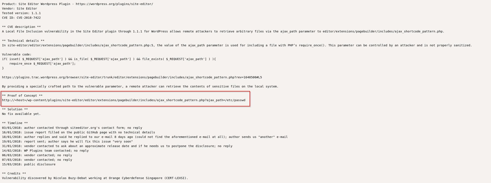

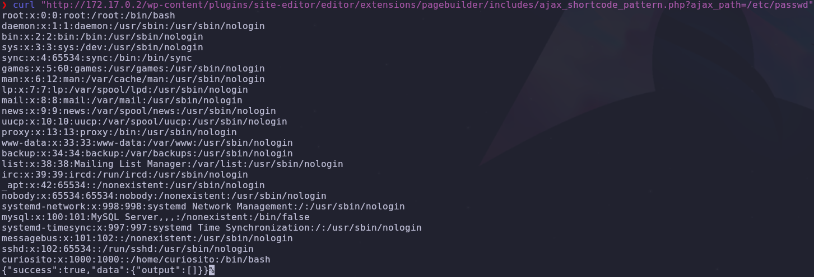

Efectivamente, aquí tenemos la vulnerabilidad y conseguimos listar los usuarios del sistema, siendo curiosito el realmente importante.

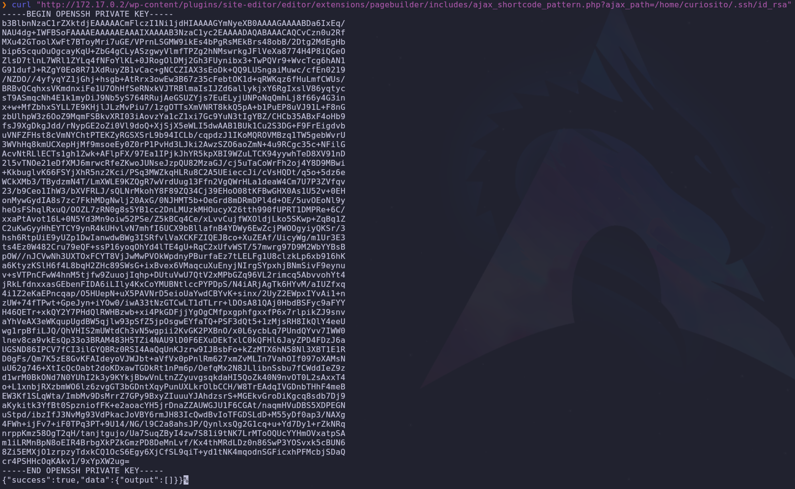

Gracias a esta vulnerabilidad conseguimos btener el contenido de la clave privada de dicho usuario por lo que podremos acceder al sistema con la misma.

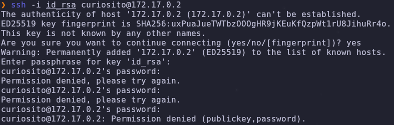

Vemos que aunque consigamos hacer estos pasos el sistema pide contraseña de cualquier forma para acceder, por lo que vamos a probar a lanzar un ataque de fuerza bruta para identificar la contraseña del usuario.

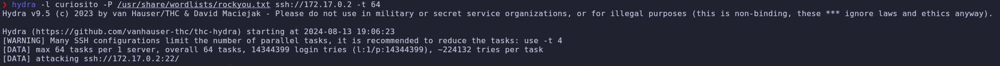

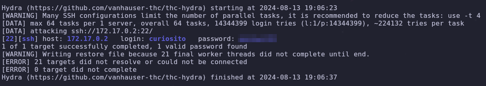

Genial, tenemos unas credenciales válidas para el usuario, vamos a accceder al sistema.

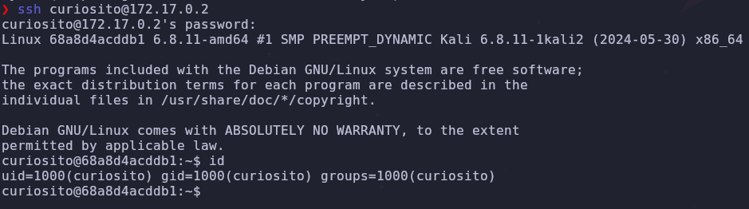

Tenemos nuestro primer acceso al sistema, vamos a buscar la manera de elevar nuestros privilegios.

# Post-Explotación

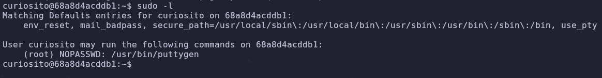

Nuestro usuario puede ejecutar puttygen como cualquier usuario usando root, vamos a investigar cómo podemos aprovechar esto para comprometer el sistema por completo.

Tras esta investigación vemos que este binario sirve para generar claves SSH, lo que se me ocurre que podríamos hacer es generar una clave y luego mandarla al directorio del usuario root para convertir la misma en una clave legítima que permita que podamos conectarnos con esta como root en el sistema, vamos a intentar hacer esto. Lo primero que haremos será generar una clave.

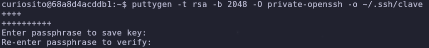

Generamos la clave dentro de nuestro directorio personal.

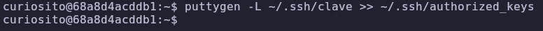

Añadimos la misma a las claves autorizadas para que no haya conflictos a la hora de usarla.

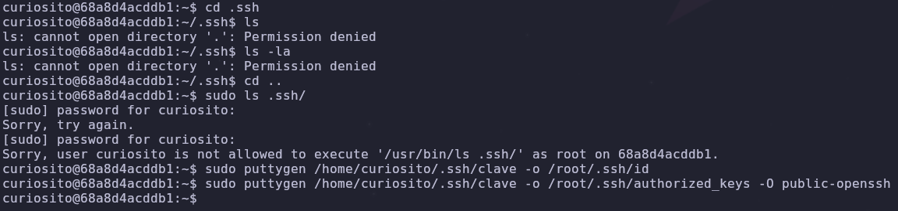

Copiamos el contenido de esta clave al directorio .ssh del usuario root y lo añadimos también a su archivo de claves autorizadas, vemos que no tenemos permiso para leer el contenido del directorio .ssh de nuestro usuario pero podremos usar scp para mandar el contenido de esta clave hacia nuestra máquina atacante.

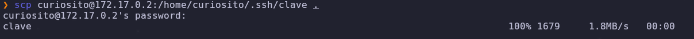

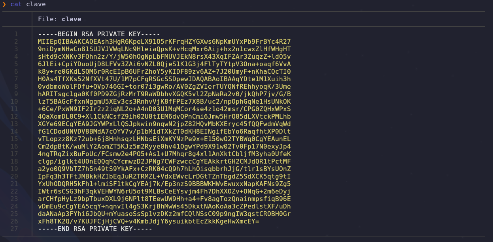

Tenemos la clave de nuestro usuario, pero lo que hemos hecho previamente ha sido duplicarla por lo que esta clave será válida para iniciar sesión también como el usuario root, vamos a hacerlo.

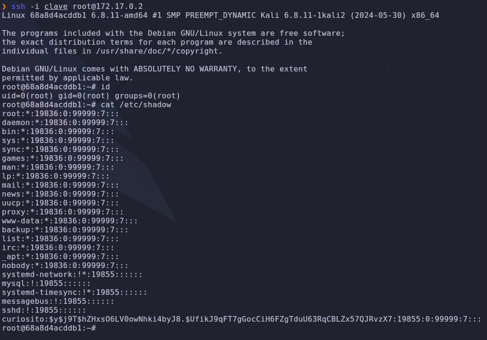

¡Eso es! Conseguimos nuestro acceso al sistema como el usuario root y hemos comprometido el sistema por completo pudiendo dar por concluida la máquina. Espero que os haya gustado mucho y nos vemos en la siguiente. :)


