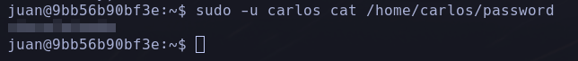

Hola otra vez, vamos a resolver otra máquina de [Dockerlabs](https://dockerlabs.es/#/), en este caso la máquina se llama Bashpariencias y está incluida en la categoría media de Dockerlabs de [El Pingüino de Mario](https://www.youtube.com/channel/UCGLfzfKRUsV6BzkrF1kJGsg).


---------------------------------------------------------------------------------------------------------------------------------------------------

Sin más que añadir vamos a ello, como siempre empezaremos por descargar la máquina y realizar su instalación, recordad que funcionan mediante docker por lo que estaremos creando un contenedor en nuestra máquina local en el que se almacenará la máquina víctima.


Empezaremos realizando un ping a la máquina para verificar su correcto funcionamiento, al hacerlo vemos que tiene un TTL de 64, lo que significa que la máquina objetivo usa un sistema operativo Linux.


Como vemos, la máquina funciona correctamente y podemos empezar con el proceso de enumeración de la misma, vamos a ello.

# Enumeración

Lo primero que haremos para enumerar esta máquina será realizar un escaneo básico de puertos para identificar cuáles están abiertos.

```sudo nmap -p- --min-rate 5000 172.18.0.2 -Pn -n -oN escaneo```


Encontramos dos puertos abiertos, vamos a realizar un escaneo más exhaustivo para tratar de enumerar los servicios y sus versiones así como para lanzar unos scripts básicos de reconocimiento.

``sudo nmap -p 80,8899 --min-rate 5000 -sCV 172.18.0.2 -Pn -n -oN escaneoSC``


Parece que este sistema está usando el servicio SSH por un puerto poco común y con una versión no demasiado actualizada, de cualquier forma vamos a analizar el servicio web del puerto 80 ya que de momento no disponemos de credenciales válidas para conectarnos.


Se hace mención a una empleada que ha metido la pata, y se otorga un enlace que envía a la descarga de la máquina BuscaLove que resolvimos días atrás. Además de esto nada interesante, vamos a seguir inspeccionando manualmente la web antes de pasar a realizar fuzzeos y una enumeración más activa.


Parece que en el código fuente de la web encontramos unas posibles credenciales por lo que posiblemente no nos haga falta realizar un escaneo más agresivo de la misma, vamos a probar estas credenciales por el servicio SSH para comprobar si son válidas.


Las credenciales obtenidas resultaron ser válidas y hemos conseguido nuestro primer acceso al sistema, vamos a enumerar la máquina para identificar posibles vías potenciales para elevar nuestros privilegios.

# Post-Explotación


No encontramos ninguna vía potencial por el momento pero identificamos que dentro del directorio de nuestro usuario se ha intentado ocultar un directorio llamándolo -. Vamos a acceder al mismo.


Tenemos la contraseña del usuario juan en un .zip en este directorio, además al listar el directorio /home para ver los usuarios disponibles encuentro un archivo llamado megasecret pero no tenemos permisos para acceder al mismo por el momento. Vamos a mandar el archivo .zip a nuestra máquina atacante.


Con este archivo en nuestro poder vamos a intentar acceder a su contenido.


Nos pide una contraseña para descomprimirlo, te toca zip2john.


Tenemos la contraseña para descomprimir el archivo.


Conseguimos la contraseña del usuario juan, vamos a acceder como este en el sistema víctima.


Somos este usuario y vemos que ha usado un comando previamente para convertirse en el usuario carlos. Vamos a enumerar los permisos del mismo para seguir escalando nuestros privilegios.


Podemos usar como carlos los comandos tree y cat mediante sudo, lo cual nos permite acceder a todos los contenidos dentro del directorio personal del mismo, vamos a ver si hay algo interesante.


Otra contraseña más, vamos a leer este archivo ya que podemos usar el comando cat como el usuario carlos.




Somos el usuario carlos y tenemos nuevos permisos, vemos que este usuario puede usar sudo junto al binario tee, sabiendo que este comando sirve para añadir contenido a archivos no sería descabellado que pudiéramos utilizarlo para añadir contenido al archivo /etc/shadow. Vamos a tratar de usar esto para añadir permisos totales de sudo en nuestro usario actual.


¡Genial! Conseguimos que el usuario tenga permisos totales con sudo y podemos cambiar sin problema al usuario root. Antes de nada y por mera curiosidad quiero acceder al contenido del "megasecreto".


Vaya... jeje parece que mi ilusión duró poco. De cualquier forma, tenemos una shell como root y hemos comprometido el sistema por completo pudiendo dar por concluida la máquina. Espero que os haya gutado mucho y nos vemos en la siguiente. :)


