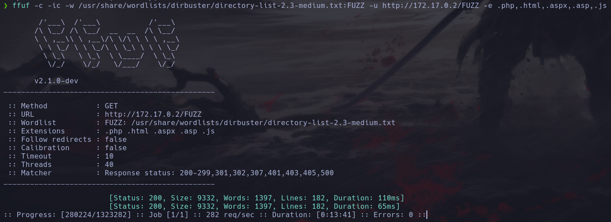
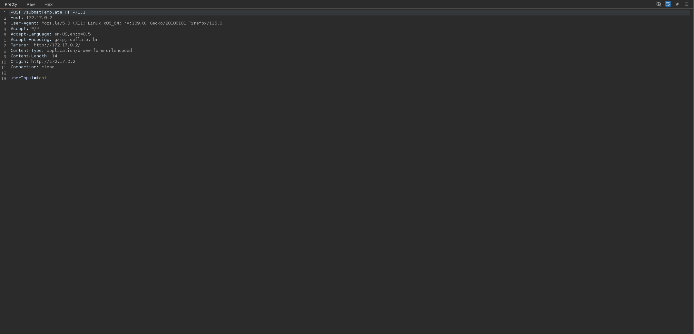

Hola otra vez, vamos a resolver otra máquina de [Dockerlabs](https://dockerlabs.es/#/), en este caso la máquina se llama Bashpariencias y está incluida en la categoría media de Dockerlabs de [El Pingüino de Mario](https://www.youtube.com/channel/UCGLfzfKRUsV6BzkrF1kJGsg).


---------------------------------------------------------------------------------------------------------------------------------------------------

Sin más que añadir vamos a ello, como siempre empezaremos por descargar la máquina y realizar su instalación, recordad que funcionan mediante docker por lo que estaremos creando un contenedor en nuestra máquina local en el que se almacenará la máquina víctima.


Empezaremos realizando un ping a la máquina para verificar su correcto funcionamiento, al hacerlo vemos que tiene un TTL de 64, lo que significa que la máquina objetivo usa un sistema operativo Linux.


Como vemos, la máquina funciona correctamente y podemos empezar con el proceso de enumeración de la misma, vamos a ello.

# Enumeración

Lo primero que haremos para enumerar esta máquina será realizar un escaneo básico de puertos para identificar cuáles están abiertos.

```sudo nmap -p- --min-rate 5000 172.17.0.2 -Pn -n -oN escaneo```


Como estamos acostumbrados a ver, tenemos los puertos 22 y 80 abiertos. Vamos a realizar un escaneo más exhaustivo para enumerar los servicios y lanzar unos scripts básicos de reconocimiento.

``sudo nmap -p 22,80 --min-rate 5000 -sCV 172.17.0.2 -Pn -n -oN escaneoSC``


Vemos un servicio SSH actualizado y un servidor web en el puerto 80 que está usando Werkzeug, investigamos un poco acerca de la versión pero parece que no dispone de vulnerabilidades conocidas que podamos explotar. Vamos a inspeccionar este puerto manualmente.


Vemos lo que parece la carta de un restaurante dedicado a los cachopos. Vamos a fuzzear para seguir enumerando este puerto.



De momento no encontramos nada así que vamos a seguir analizando la página de inicio, en el código fuente no vemos nada interesante.


Al final de la página encontramos una funcionalidad para realizar reservas, vamos a usarla y a interceptarla con Burp para trastear un rato con la misma.

# Explotación



Vamos a enviar la petición al repeater para tener más comodidad y no tener que estar interceptando la misma cada vez que realicemos un cambio.


Parece que por detrás algo está tratando de decodear el mensaje que mandamos como input.


Vemos que se trata de base64, vamos a intentar mandar un input codificado en base64 para ver la reacción del servidor.


¿Está buscando nuestro input como comando del sistema? Vamos a probar pasándole el comando whoami encodeado en base64.


¡Eso es! Tenemos ejecución de comandos, al tener el servicio SSH activo en la máquina vamos a tratar de obtener los distintos usuarios del sistema para realizar un ataque de fuerza bruta.


De estos usuarios el que más llama nuestra atención es cachopin, vamos a lanzar el ataque para intentar obtener sus credenciales.


Muy bien, tenemos unas credenciales válidas para iniciar sesión en el sistema como el usuario cachopin.


Tenemos nuestro primer acceso al sistema y nos toca enumerar los permisos de este usuario para llegar a escalar los privilegios.

# Post-Explotación


Parece que tenemos cosas que analizar en el directorio personal de nuestro usuario, vamos a inspeccionarlo en detalle.


Tenemos una lista de varios hashes, vamos a copiarlos a nuestra máquina atacante para tratar de crackearlos y así ver su contenido original.


Tras varias pruebas sin éxito y una extensa investigación me encuentro con un proyecto de [PatxaSec](https://github.com/PatxaSec), el propio creador de la máquina víctima, que permite desencriptar este tipo de hashes, vamos a probarlo.


Funciona a la perfección y a una velocidad que no termino de entender ya que pasa todo el rockyou completo en cuestión de segundos, sin duda un proyecto increíble. Teniendo esta contraseña podríamos probarla con el usuario root ya que no hay más usuarios disponibles en la máquina.


Y efectivamente, la contraseña es válida y nos convertimos en el usuario root comprometiendo el sistema por completo y pudiendo dar por concluida la máquina. Espero que os haya gustado mucho y nos vemos en la siguiente. :)
