Hola otra vez, vamos a resolver otra máquina de [Dockerlabs](https://dockerlabs.es/#/), en este caso la máquina se llama ChocolateFire y está incluida en la categoría media de Dockerlabs de [El Pingüino de Mario](https://www.youtube.com/channel/UCGLfzfKRUsV6BzkrF1kJGsg).

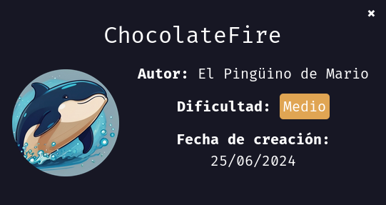

---------------------------------------------------------------------------------------------------------------------------------------------------

Sin más que añadir vamos a ello, como siempre empezaremos por descargar la máquina y realizar su instalación, recordad que funcionan mediante docker por lo que estaremos creando un contenedor en nuestra máquina local en el que se almacenará la máquina víctima.

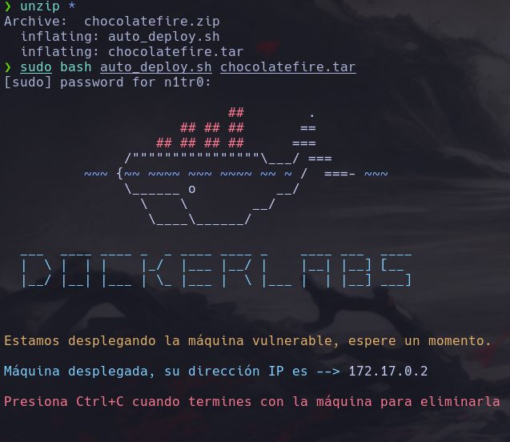

Empezaremos realizando un ping a la máquina para verificar su correcto funcionamiento, al hacerlo vemos que tiene un TTL de 64, lo que significa que la máquina objetivo usa un sistema operativo Linux.

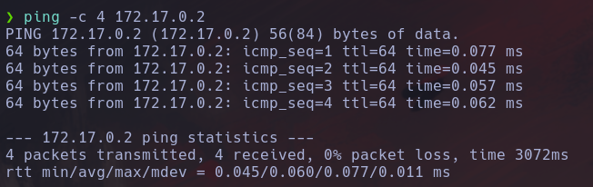

Como vemos, la máquina funciona correctamente y podemos empezar con el proceso de enumeración de la misma, vamos a ello.

# Enumeración

Lo primero que haremos para enumerar esta máquina será realizar un escaneo básico de puertos para identificar cuáles están abiertos.

```sudo nmap -p- --min-rate 5000 172.17.0.2 -Pn -n -oN escaneo```

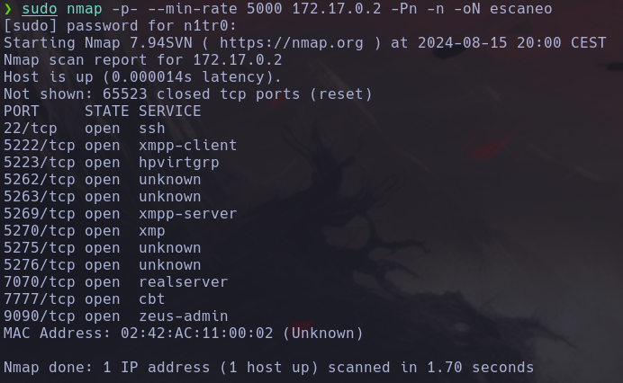

Vemos bastantes puertos abiertos, vamos a realizar un escaneo más exhaustivo para tratar de enumerar los servicios así como para lanzar ciertos scripts básicos de reconocimiento. En principio vamos a centrarnos en los puertos 22,7070,7777y 9090 ya que parecen ser los más importantes.

``sudo nmap -p 22,7070,7777,9090 --min-rate 5000 -sCV 172.17.0.2 -Pn -n -oN escaneoSC``

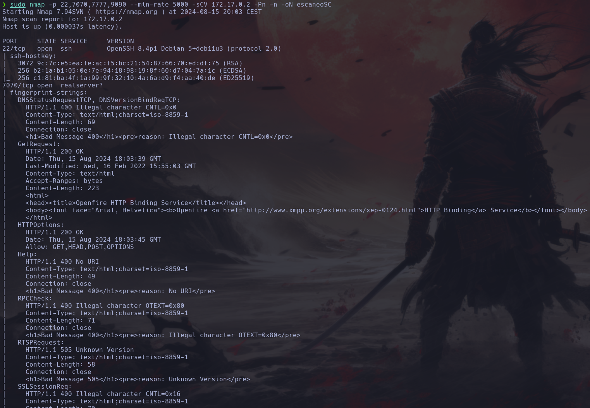

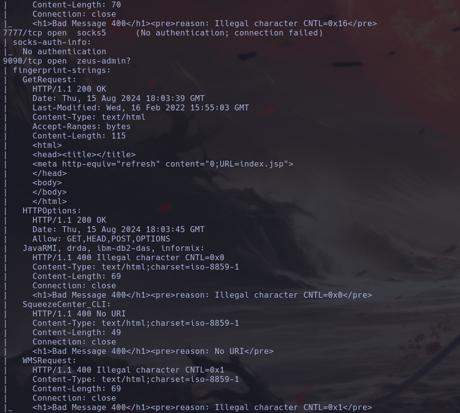

Podemos ver que tanto en el puerto 7070 como en el 9090 tenemos disponibles dos servicios web, vamos a inspeccionar los mismos manualmente.

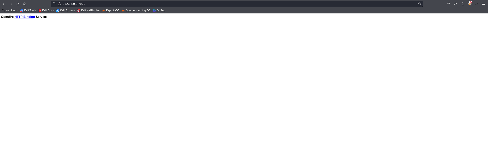

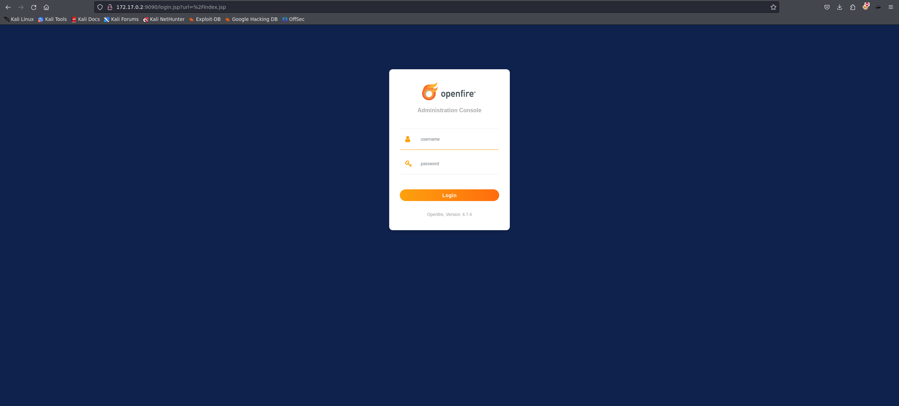

En el puerto 9090 se nos muestra un panel de login de Openfire que nos proporciona la versión del mismo, vamos a probar a ingresar con credenciales por defecto y vamos a realizar una investigación sobre esta versión en concreto para ver si hay alguna vulnerabilidad conocida que podamos explotar.

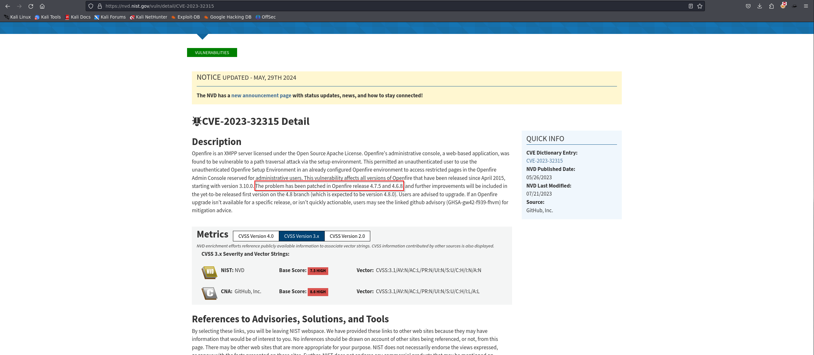

Encontramos un CVE que se encuentra en esta versión en concreto y haciendo una búsqueda vemos que Metasploit lo tiene incluido en su base de datos por lo que vamos a tratar de explotarlo ya que nos permitiría la ejecución remota de código en caso de funcionar correctamente.

# Explotación

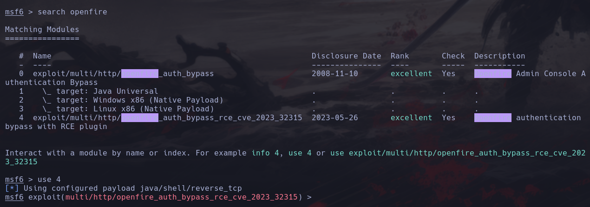

Vamos a ajustar las opciones del exploit para adecuarlo a nuestro caso concreto.

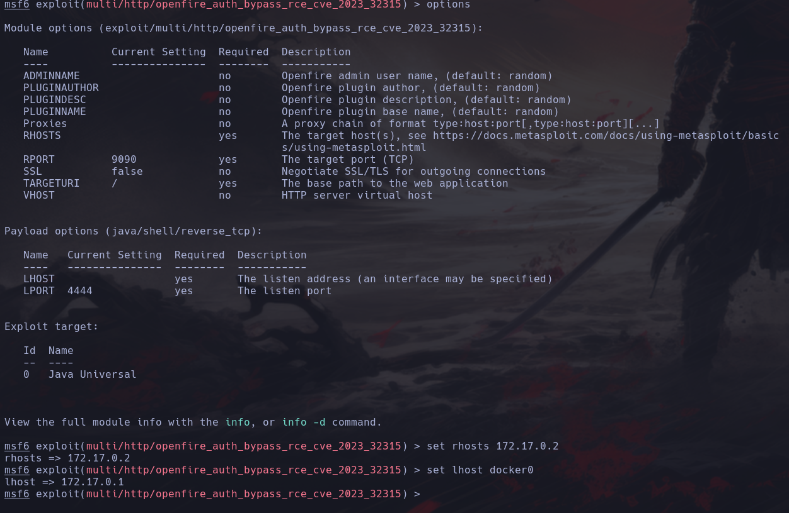

Con los parámetros modificados vamos a tatar de lanzarlo.

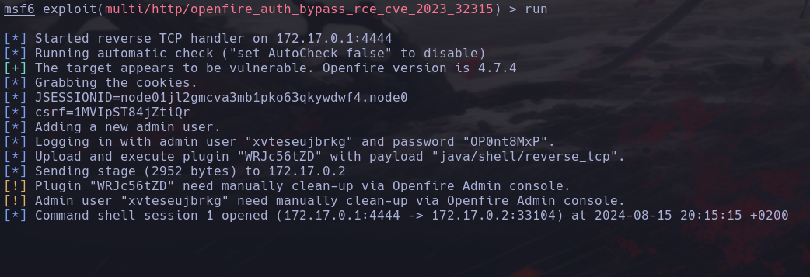

¡Genial! Parece que ha funcionado, vamos a interactuar con la sesión que nos acaba de crear.

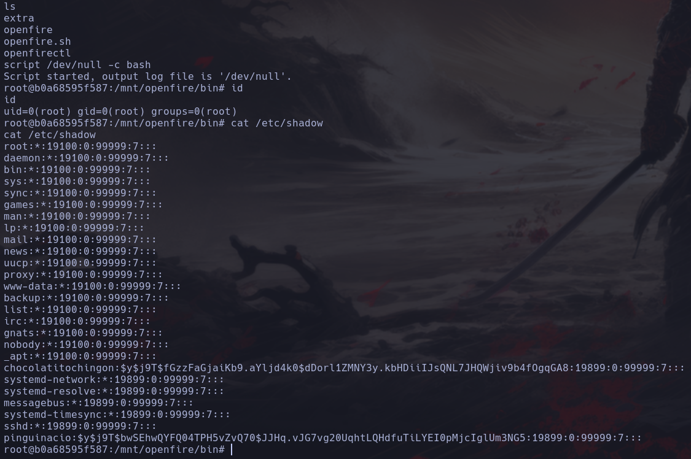

Vaya, eso ha sido inesperado, recibimos una shell como el usuario root por lo que no tendremos que realizar ningún paso adicional ya que tenemos el sistema comprometido por completo, para obtener persistencia podríamos simplemente otorgarle el set SUID al binario /bin/bash y crackear en nuestra máquina atacante la contraseña de los usuarios que vemos en el archivo /etc/shadow para poder acceder con el mismo por SSH o crear un nuevo usuario con todos los permisos. 

# EXTRA

Vamos a realizar este ejercicio para obtener persistencia y practicar un poco más. Empezaremos creando un usuario nuevo y luego lo añadiremos al grupo sudo. De cualquier forma también le otorgaremos permisos SUID a la bash.

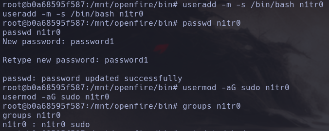

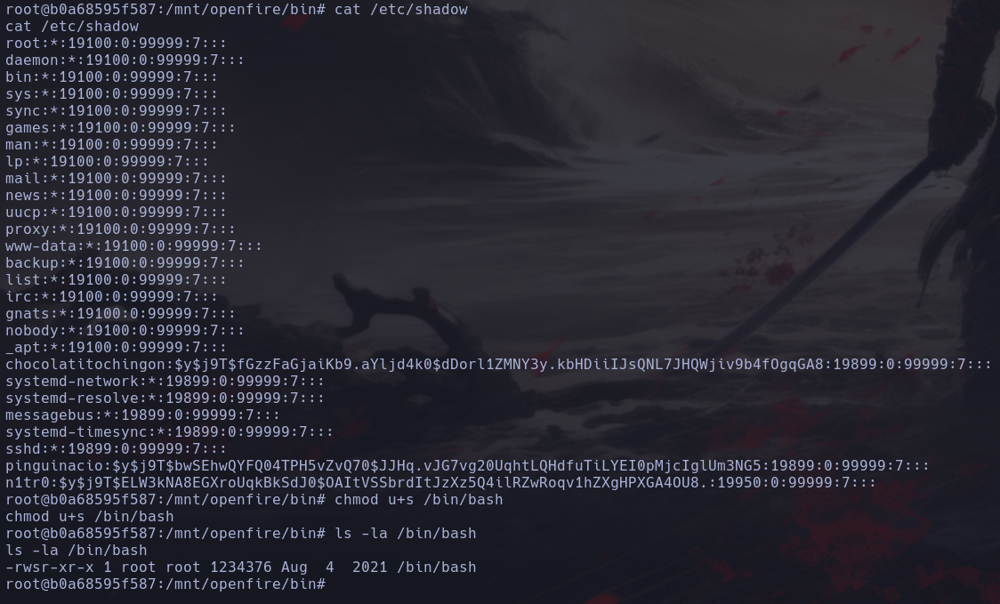

Una vez hecho esto vamos a tratar de iniciar sesión por SSH con nuestro nuevo usuario creado.

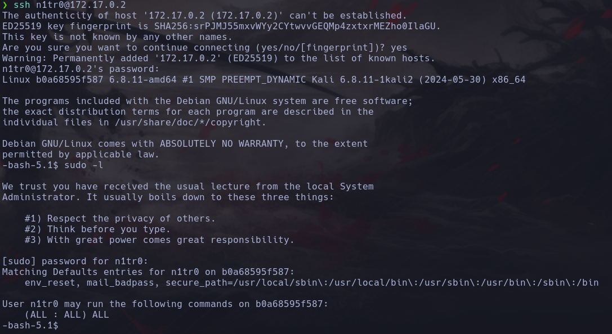

¡Genial! Vemos que el usuario se ha creado correctamente y que puede usar sudo sin restricciones, vamos a ejecutar una shell como root tanto con sudo como con los permisos SUID que le hemos otorgado a la shell para demostrar la persistencia obtenida.

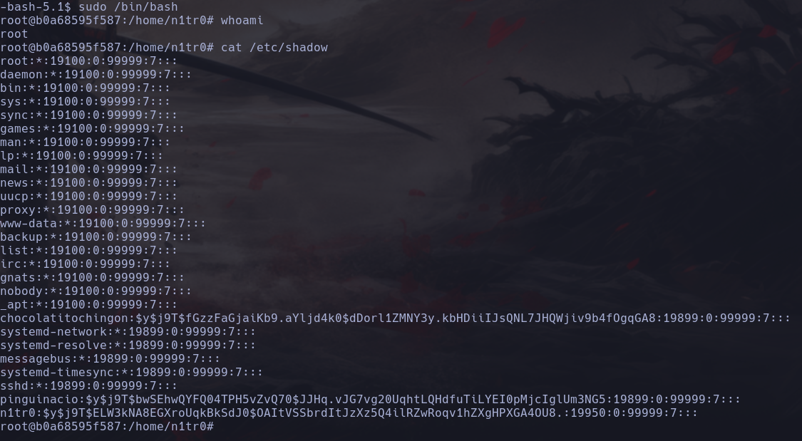

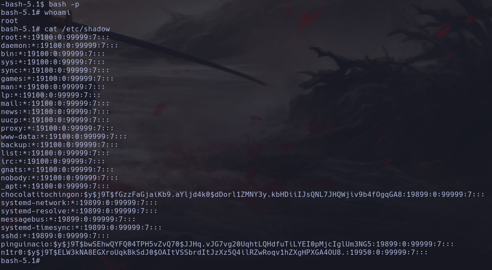

Eso es, tenemos persistencia total en la máquina. Sin más que decir, tenemos el sistema comprometido por completo y hemos conseguido obtener una gran persistencia por lo que podemos dar por concluida la máquina. Espero que os haya gustado mucho y nos vemos en la siguiente. :)


