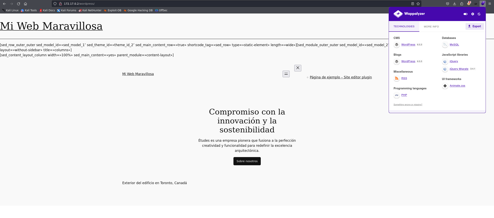

Hola otra vez, vamos a resolver otra máquina de [Dockerlabs](https://dockerlabs.es/#/), en este caso la máquina se llama Collections y está incluida en la categoría media de Dockerlabs de [El Pingüino de Mario](https://www.youtube.com/channel/UCGLfzfKRUsV6BzkrF1kJGsg).


---------------------------------------------------------------------------------------------------------------------------------------------------

Sin más que añadir vamos a ello, como siempre empezaremos por descargar la máquina y realizar su instalación, recordad que funcionan mediante docker por lo que estaremos creando un contenedor en nuestra máquina local en el que se almacenará la máquina víctima.


Empezaremos realizando un ping a la máquina para verificar su correcto funcionamiento, al hacerlo vemos que tiene un TTL de 64, lo que significa que la máquina objetivo usa un sistema operativo Linux.


Como vemos, la máquina funciona correctamente y podemos empezar con el proceso de enumeración de la misma, vamos a ello.

# Enumeración

Lo primero que haremos para enumerar esta máquina será realizar un escaneo básico de puertos para identificar cuáles están abiertos.

```sudo nmap -p- --min-rate 5000 172.17.0.2 -Pn -n -oN escaneo```


Vemos tres puertos abiertos, vamos a realizar un escaneo más exhaustivo para tratar de enumerar los servicios funcionando en la máquina así como para lanzar unos scripts básicos de reconocimiento.


Vemos que el servicio MongoDB nos da bastante información sobre el sistema, pero necesitaremos credenciales para acceder al contenido de la base de datos por lo que pasaremos a inpeccionar el puerto 80 por el momento.


Tenemos una página por defecto, vamos a fuzzear para localizar directorios o archivos ocultos en caso de haberlos.


Rápidamente encontramos un directorio llamado wordpress, vamos a acceder al mismo y revisar con Wappalizer para confirmar si efectivamente estamos ante una instancia de Wordpress ya que aunque el directorio tenga ese nombre no tiene que ser necesariamente un indicador de esto, siempre tenemos que comprobar lo que encontremos.



Muy bien, tenemos una instancia de Wordpress por lo que vamos a identificar los plugins usados así como a lanzar un escaneo general con WPscan para enumerar el servicio de forma rápida.


Vemos que tenemos el plugin site editor 1.1 el cual ya sabemos que tiene una vulnerabilidad asociada de LFI ya que lo hemos explotado en una máquina previa. 

# Explotación

Nuestro escaneo también nos confirma la existencia del usuario chocolate, pero antes de centrarnos en esto vamos a tratar de explotar la vulnerabilidad mencionada ya que es bastante interesante para nosotros ya que nos podría permitir leer archivos internos del sistema y no quedarnos en la superficie.


Vamos a seguir los pasos del POC.


¡Eso es! Tenemos los distintos usuarios del sistema, vamos a añadirlos a una wordlist y a lanzar un ataque de fuerza bruta al servicio SSH para tratar de obtener un inicio de sesión exitoso.


Tenemos nuestro primer par de credenciales válidas, vamos a usarlas para acceder al sistema.


Bien, tenemos nuestro primer acceso y estamos listos para localizar nuestro vector de escalada de privilegios.

# Post-Explotación

Vamos a enumerar el sistema minuciosamente para identificar algo que nos permita elevar nuestros privilegios.


Parece que dentro del directorio personal de nuestro usuario hemos encontrado un poquito de oro ya que tenemos la contraseña de la base de datos del usuario dbadmin, ¿cabe la posibilidad de que este usuario use esta misma contraseña para inicar sesión en el sistema? Vamos a probarlo.


¡Genial! Por esto nunca se deben de reautilizar las contraseñas. Vamos a enumerar los permisos y los directorios de este usuario.


No encontramos nada interesante y vemos que el comando sudo no existe en la máquina. Vamos a listar los binarios con permisos SUID.


Por aquí tampoco tenemos nada fuera de lo común. Lo único que se me ocurre dándole un par de vueltas es que el usuario root haya usado su propia contraseña al crear el usuario dbadmin ya que este es un pseudo usuario root en el contexto de la base de datos, y al ser un usuario con altos privilegios tendría sentido pensar que el usuario root es el único que debería tener acceso a este usuario, vamos a probar a iniciar sesión como root con la contraseña del usuario dbadmin.


¡Bien! A veces lo más sensato es seguir nuestra intuición. Tenemos una shell como root y hemos comprometido el sistema por completo pudiendo dar por concluida la máquina. Espero que os haya gustado mucho y nos vemos en la siguiente. :)
