Hola otra vez, vamos a resolver otra máquina de [Dockerlabs](https://dockerlabs.es/#/), en este caso la máquina se llama Database y está incluida en la categoría media de Dockerlabs de [El Pingüino de Mario](https://www.youtube.com/channel/UCGLfzfKRUsV6BzkrF1kJGsg).

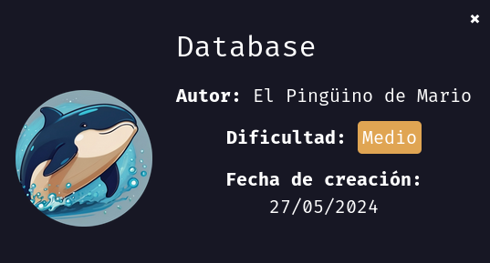

---------------------------------------------------------------------------------------------------------------------------------------------------

Sin más que añadir vamos a ello, como siempre empezaremos por descargar la máquina y realizar su instalación, recordad que funcionan mediante docker por lo que estaremos creando un contenedor en nuestra máquina local en el que se almacenará la máquina víctima.

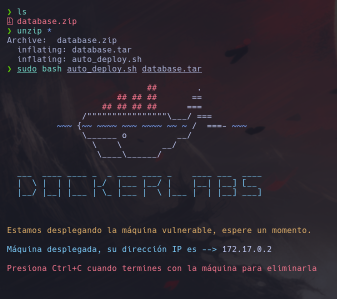

Empezaremos realizando un ping a la máquina para verificar su correcto funcionamiento, al hacerlo vemos que tiene un TTL de 64, lo que significa que la máquina objetivo usa un sistema operativo Linux.

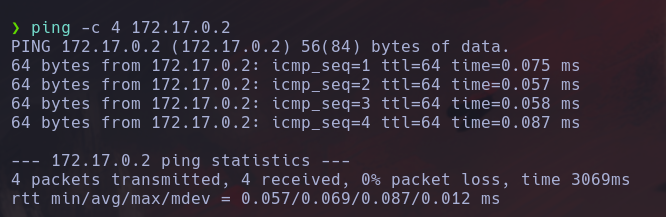

Como vemos, la máquina funciona correctamente y podemos empezar con el proceso de enumeración de la misma, vamos a ello.

# Enumeración

Lo primero que haremos para enumerar esta máquina será realizar un escaneo básico de puertos para identificar cuáles están abiertos.

```sudo nmap -p- --min-rate 5000 172.17.0.2 -Pn -n -oN escaneo```

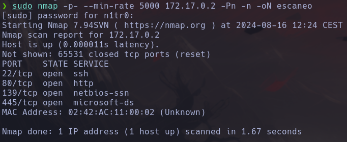

Vemos varios puertos abiertos incluyendo el 139 y el 445 que son puertos más comunes en máquinas Windows. De cualquier forma vamos a realizar un escaneo más exhaustivo para tratar de enumerar los servicios así como lanzar unos scripts básicos de reconocimiento para obtener más información sobre los mismos.

``sudo nmap -p 22,80,139,445 --min-rate 5000 -sCV 172.17.0.2 -Pn -n -oN escaneoSC``

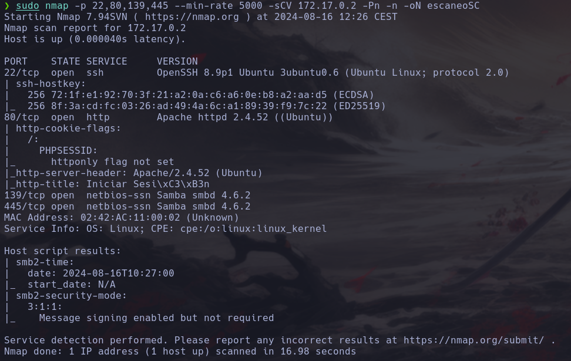

No tenemos demasiada información interesante, vamos a inspeccionar el puerto 80 mientras que simultáneamente lanzaremos enum4linux al puerto 445 para enumerar este servicio más en profundidad.

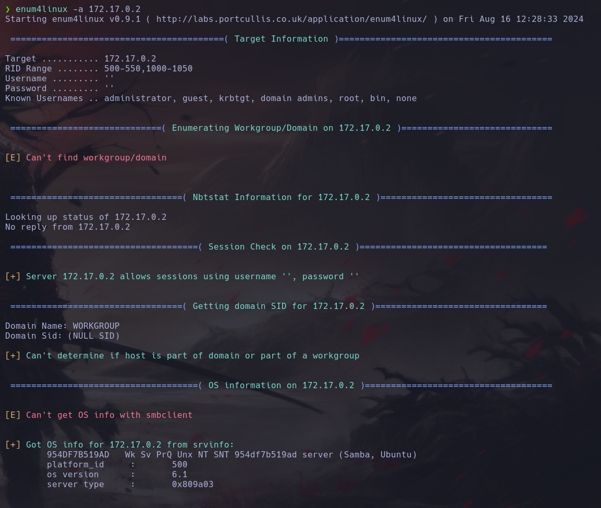

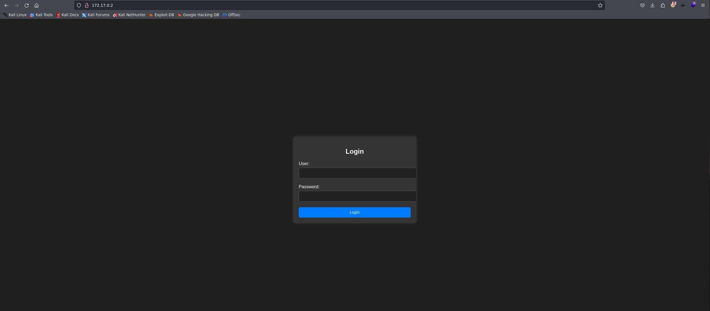

En el puerto 80 nos encontramos con un panel de login que ya hemos visto en otra máquina, vamos a probar varias cosas como credenciales por defecto y varias inyecciones.

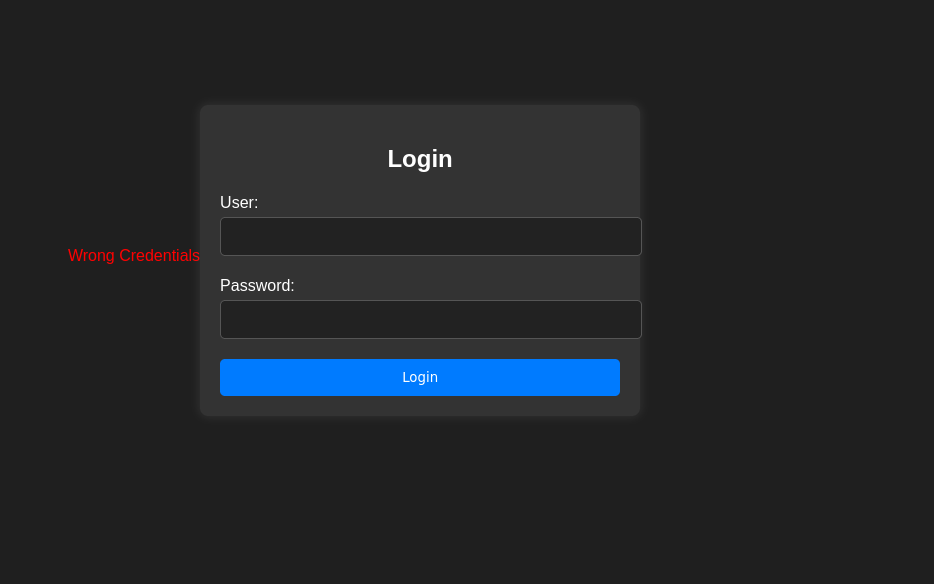

Las credenciales por defecto no nos sirven, vamos a probar a añadir una comilla en los campos de entrada.

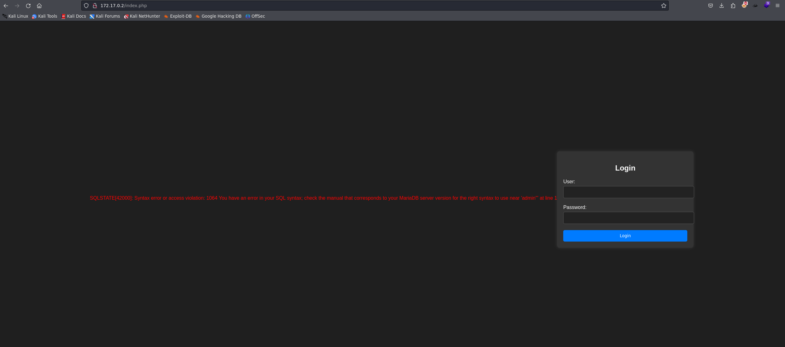

# Explotación

Parece que encontramos una vulnerabilidad de SQL Injection, vamos a usar SQLmap para ahorrarnos un tiempo valioso.

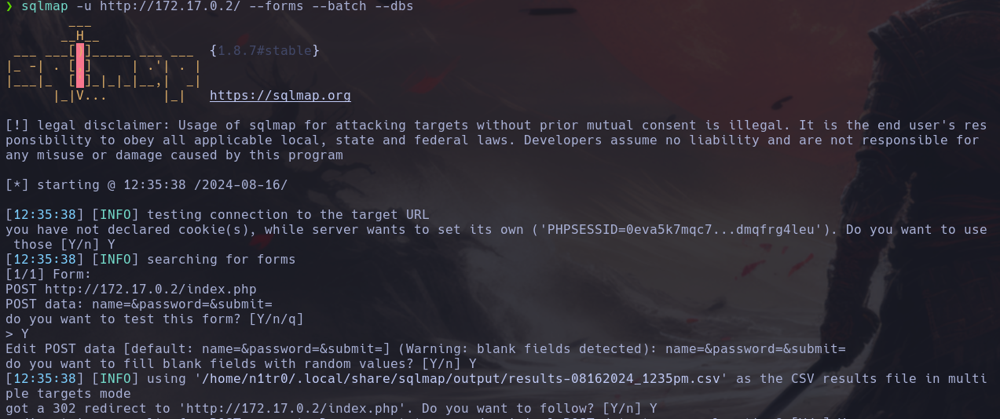

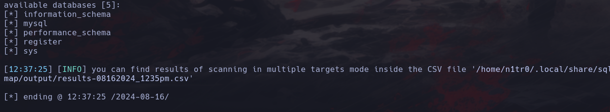

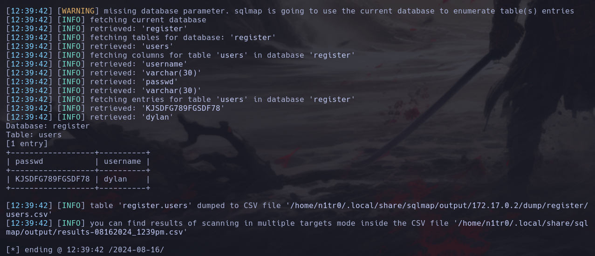

Vamos a tratar de hacer login con esta contraseña.

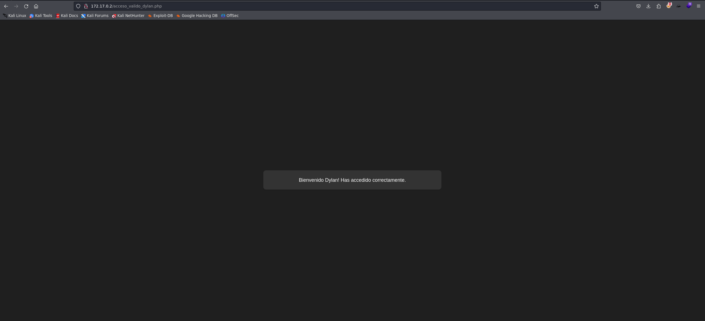

Conseguimos entrar pero no hay absolutamente nada interesante, aunque tenemos un usuario y una posible contraseña, vamos a probar esto en el servicio SSH aunque dudo que funcione.

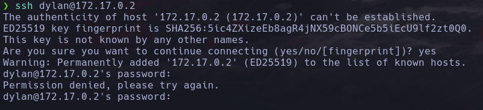

No funciona como imaginaba, pero nuestra enumeración del puerto 445 ha terminado y tenemos cosas interesantes.

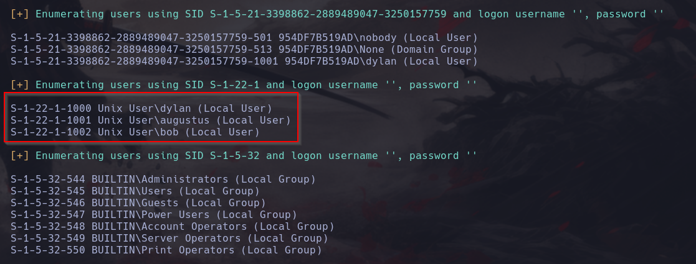

Tenemos tres usuarios que existen dentro del sistema y obviamente dylan está entre ellos, vamos a crear una wordlist con los mismos para lanzar un ataque de fuerza bruta al puerto 22 y obtener de esta forma un inicio de sesión exitoso.

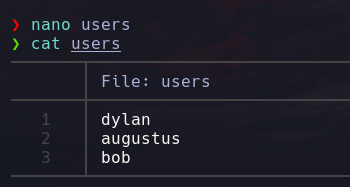

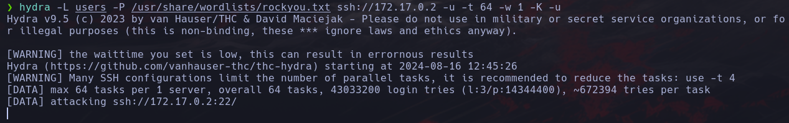

Mientras este ataque de fuerza bruta se lanza podemos probar con las credenciales que encontramos antes a entrar por el puerto 445.

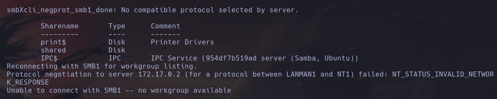

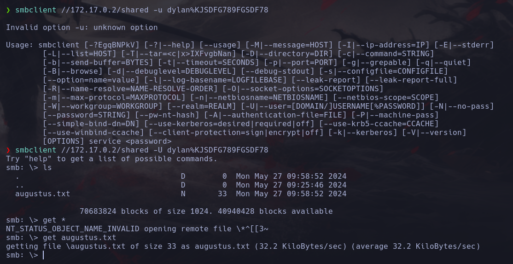

Parece que no sólo podemos acceder sino que además tenemos un archivo de texto, vamos a ver qué contiene.

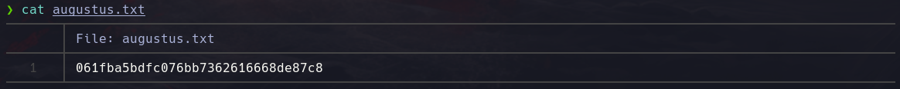

Tenemos lo que parece ser un hash en MD5, vamos a verificar esto con hashid.

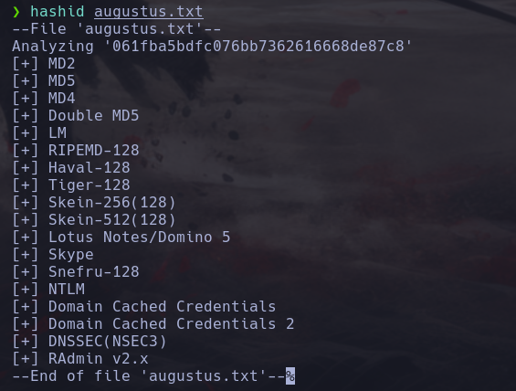

Para crackear este hash usaremos hashcat.

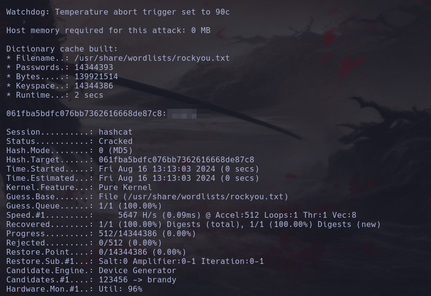

Esto ha sido bastante más rápido que el ataque al servicio SSH y parece que obtenemos la contraseña del usuario augustus, vamos a intentar acceder por SSH al sistema.

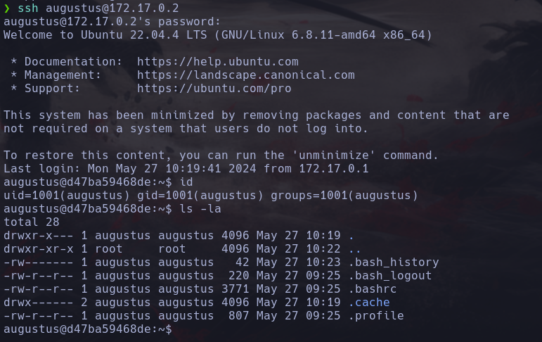

¡Eso es! Estamos dentro y hemos obtenido nuestro primer acceso al sistema, esta contraseña al estar dentro del rockyou también la habríamos acabado obteniendo con el tiempo con hydra, de cualquier forma, vamos a cancelar este ataque y a buscar la forma de elevar nuestros privilegios.

# Post-Explotación

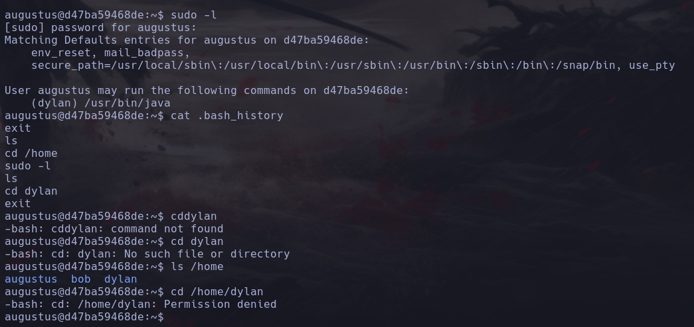

Nuestro usuario puede ejecutar como dylan el binario java gracias a sudo, vamos a usar esto para pivotar hacia este usuario creando una reverse shell con extensión .jar con msfvenom que luego ejecutaremos como dylan.

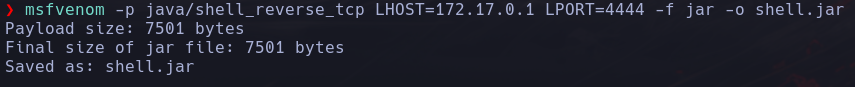

Con este archivo generado vamos a enviarlo a la máquina víctima.

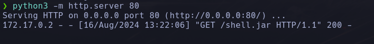

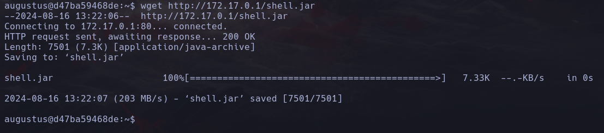

Teniéndolo listo vamos a ponernos en escucha en nuestra máquina atacante y a ejecutar esta reverse shell con sudo.

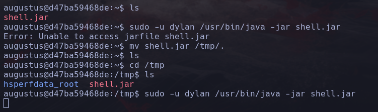

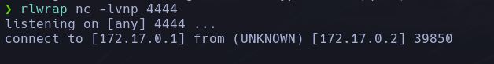

¡Eso es! Vamos a estabilizar nuestra shell. Una vez estabilizada vemos que no podemos usar el comando sudo sin contraseña por lo que vamos a enumerar los binarios con el set SUID activado.

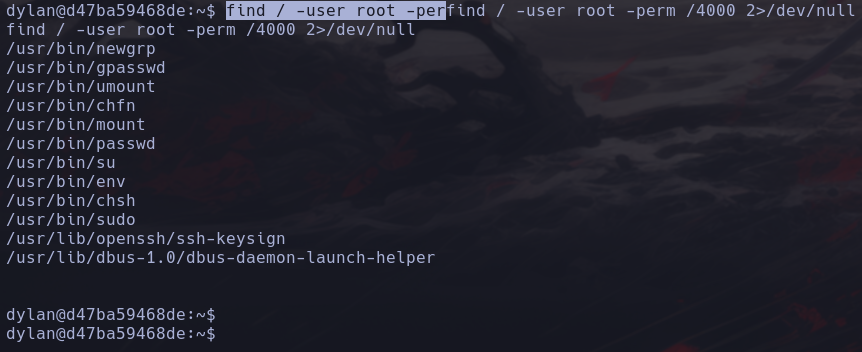

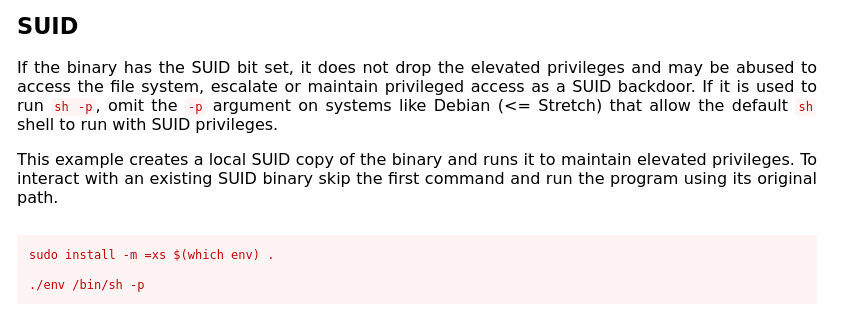

En GTFObins vemos que los permisos SUID en el binario env pueden llevar a la escalada de privilegios, vamos a hacerlo.

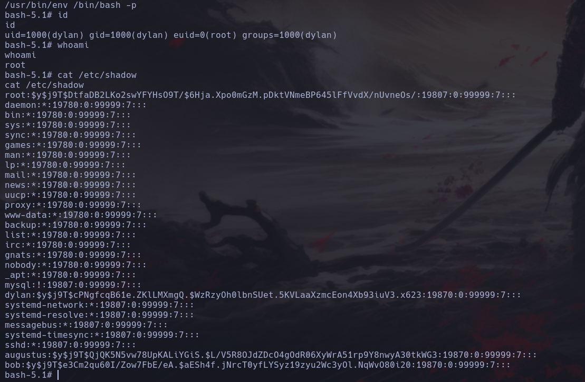

¡Eso es! Como guinda del pastel vamos a otorgarle estos permisos a la bash ya que somos root para mejorar nuestra persistencia ya que tenemos unas credenciales válidas para acceder por SSH.

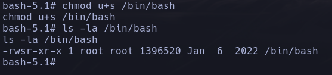

Con este cambio podríamos ejecutar una shell como root desde cualquier usuario con el comando ``bash -p``, vamos a probarlo con el usuario augustus ya que es del que tenemos unas credenciales con las que acceder de forma sencilla y sin hacer saltar las alertas.

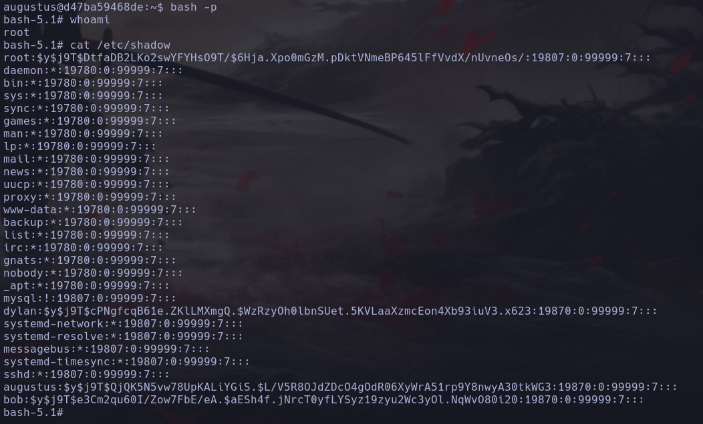

Lo tenemos, con el sistema comprometido por completo y habiendo obtenido persistencia podemos dar por concluida la máquina. Espero que os haya gustado mucho y nos vemos en la siguiente. :)


