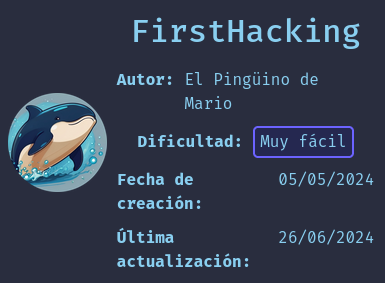
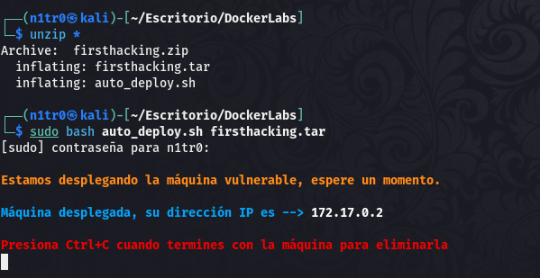
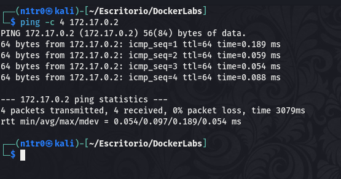
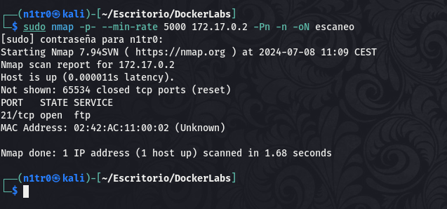
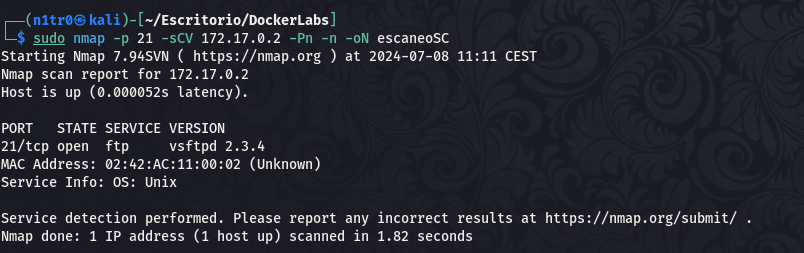
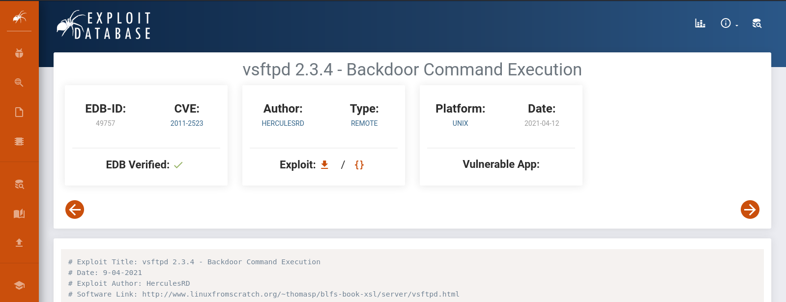
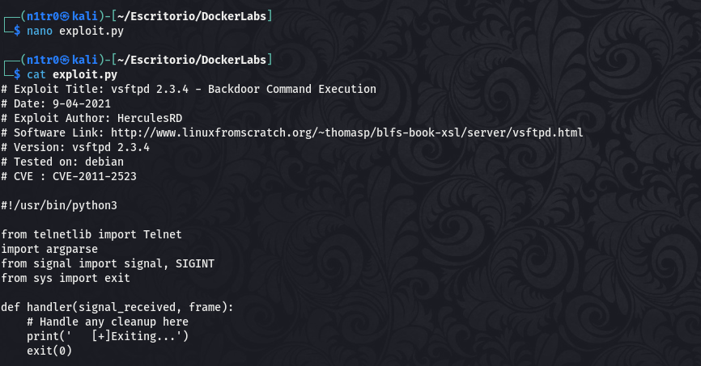
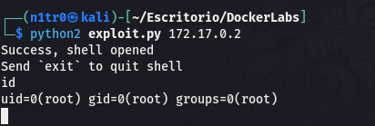
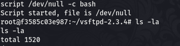

Hola otra vez, vamos a resolver otra máquina de [Dockerlabs](https://dockerlabs.es/#/), en este caso la máquina se llama FirstHacking y es una de la categoría más fácil de Dockerlabs de [El Pingüino de Mario](https://www.youtube.com/channel/UCGLfzfKRUsV6BzkrF1kJGsg).



---------------------------------------------------------------------------------------------------------------------------------------------------

Sin más que añadir vamos a ello, como siempre empezaremos por descargar la máquina y realizar su instalación, recordad que funcionan mediante docker por lo que estaremos creando un contenedor en nuestra máquina local en el que se almacenará la máquina víctima.



Empezaremos realizando un ping a la máquina para verificar su correcto funcionamiento, al hacerlo vemos que tiene un TTL de 64, lo que significa que la máquina objetivo usa un sistema operativo Linux.



Como vemos, la máquina funciona correctamente y podemos empezar con el proceso de enumeración de la misma, vamos a ello.

# Enumeración

Lo primero que haremos para enumerar esta máquina será realizar un escaneo básico de puertos para identificar cuáles están abiertos.

```sudo nmap -p- --min-rate 5000 172.17.0.2 -Pn -n -oN escaneo```



Vemos que únicamente está abierto el puerto 21, de cualquier forma vamos a realizar un escaneo más exhaustivo para recopilar más información del objetivo lanzando scripts básicos de reconocimiento y tratando de enumerar las versiones.

```sudo nmap -p 21 -sCV 172.17.0.2 -Pn -n -oN escaneoSC```



El output nos da la versión de vsftpd, vamos a realizar una investigación acerca de la misma descubriendo que tiene vulnerabilidades conocidas con exploit públicos.



# Explotación

Teniendo en mente este conocimiento vamos a tratar de explotar esta vulnerabilidad que nos permitirá la ejecución remota de código dándonos una shell y permitiéndonos acceder al sistema sin tener unas credenciales válidas ya que el inicio de sesión anónimo no está habilitado en este caso.





Conseguimos una shell y además nos damos cuenta de que la shell obtenida es como el usuario root, lo que nos otorga el control total sobre la máquina ya que este usuario tiene todos los permisos.



Con el comando ```script /dev/null -c bash``` conseguimos que la shell se vea más agradable a la vista y hace que sea más fácil movernos. De cualquier forma en este caso no será necesario movernos ya que hemos obtenido el control total y podemos dar por concluido el reto.

Espero que os haya gustado mucho este Mini-WriteUp y nos vemos en la siguiente :)