#Hi, English below :) 

Hola a todos y bienvenidos, este va a ser mi primer WriteUp así que tampoco prometo que vaya a ser una maravilla, pero se intentará xD

En este caso voy a estar haciendo una de las máquinas de la plataforma creada por un querido miembro de la comunidad, Mario de [El Pingüino de Mario](https://www.youtube.com/@ElPinguinoDeMario), echad todos un ojo a sus redes sociales, seguro que no os defraudará.

La máquina en cuestión se llama Trust y es una de las más sencillas de la plataforma.

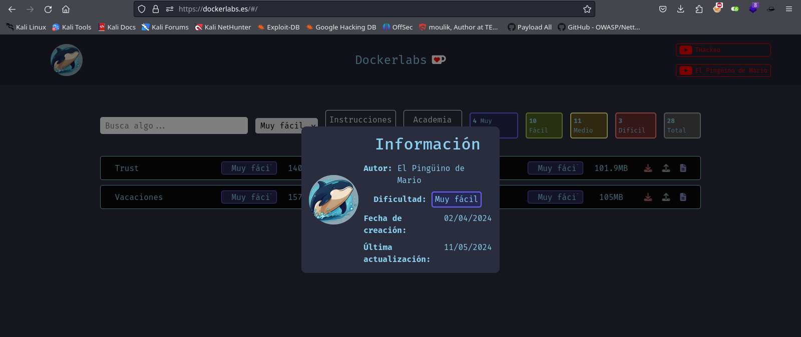

Siguiendo las instrucciones de instalación de la máquina y de docker, podremos empezar con ello. Al instalar la máquina se nos proporcionará la dirección IP de la misma, sinceramente el proceso de instalación me ha parecido muy sencillo y eso se agradece.

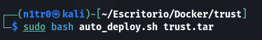

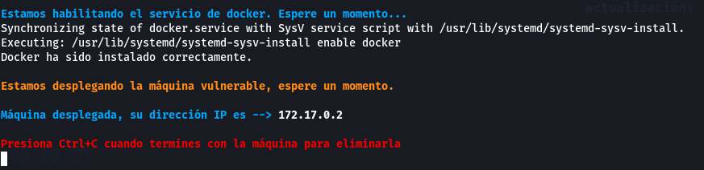

Comprobamos utilizando un ping que la máquina es efectivamente accesible. Esto también nos ayuda a identificar qué sistema operativo está utilizando, si el ttl es de 128 estaremos ante una máquina Windows, si por el contrario, y como sucede en este caso, el ttl es de 64, entonces sabremos que estamos antes una máquina Linux.

Con todo esto hecho, empezamos a hacer un reconocimiento básico de los puertos abiertos para saber cuál va a ser nuestro vector de ataque.

`sudo nmap -p- --open 172.17.0.2 -Pn -n --min-rate 5000 -vvv -oN escaneo`

Vemos que la máquina tiene abiertos los puertos 80 y 22, que hacen referencia a un servicio http y a otro ssh, respectivamente.

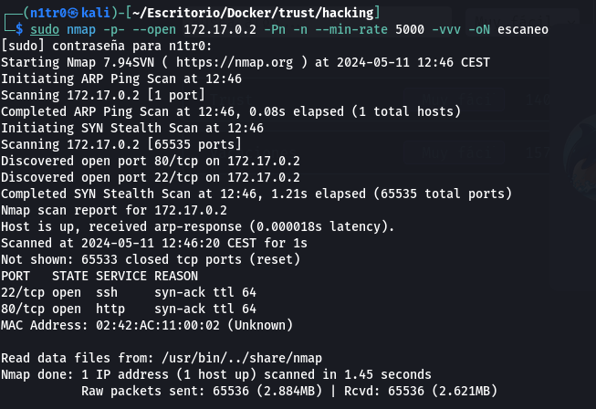

Sabiendo esto, lo primero que haremos será acceder al servicio web a través de nuestro navegador para ver qué nos encontramos.

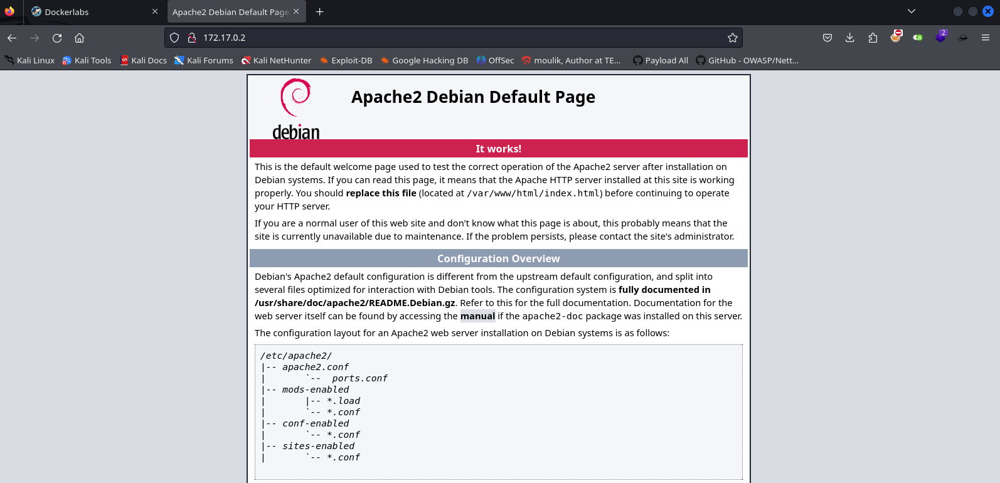

Nos encontramos con una página por defecto de Apache, si usamos Wappalyzer también podemos ver la versión del mismo, siendo en este caso la versión 2.4.57. También podremos verificar esto haciendo un escaneo con nmap tan solo a los puertos abiertos y especificando que queremos que ejecute unos scripts básicos de reconocimiento, además de darnos las versiones con el argumento -sCV.

`sudo nmap -p 22,80 -sCV 172.17.0.2 -Pn -n --min-rate 5000 -vvv -oN escaneoSC`

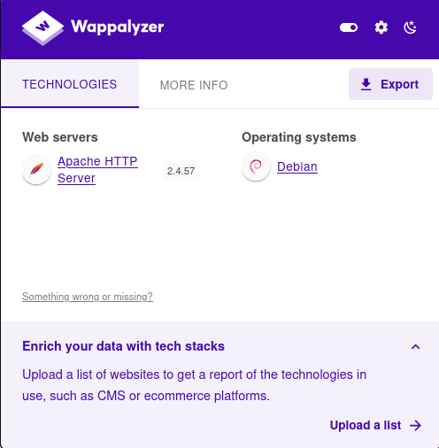

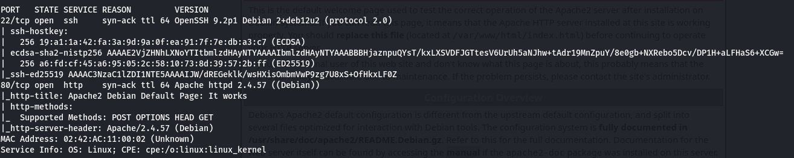

Buscamos en internet las versiones y vemos si tienen alguna vulnerabilidad conocida, no parece ser el caso así que procederemos a fuzzear la web para buscar posibles directorios y archivos. Aunque antes de esto echaremos un ojo al código fuente para ver si hay algún comentario o algo interesante que nos pueda servir de ayuda.

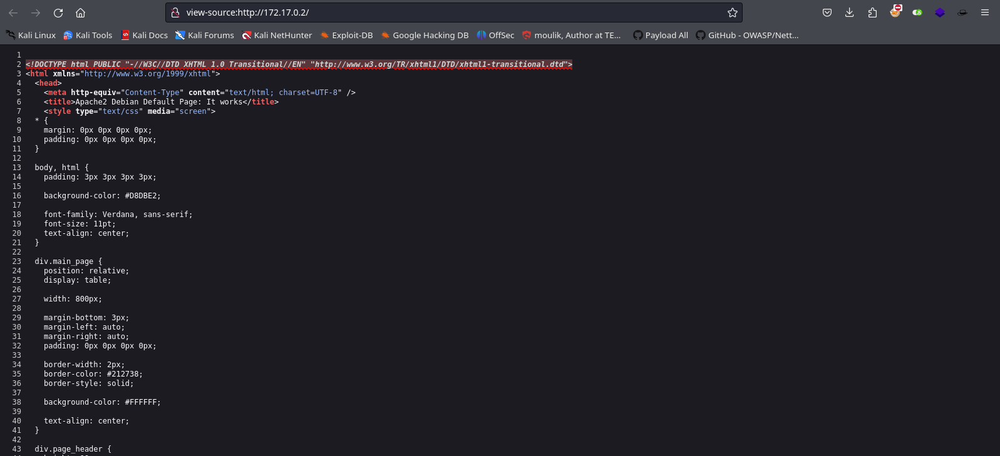

En el código fuente no hay nada interesante, así que vamos a hacer fuzz. Para esto se pueden usar varias herramientas como dirsearch, wfuzz, o gobuster. En este caso usaré feroxbuster ya que un compañero me la recomendó esta semana. 

`feroxbuster -u http://172.17.0.2/ -w /usr/share/wordlists/seclists/Discovery/Web-Content/directory-list-2.3-medium.txt`

En principio no vemos que haya encontrado ningún directorio, por lo que usaremos el argumento -x para indicarle extensiones para buscar archivos.

`feroxbuster -u http://172.17.0.2/ -w /usr/share/wordlists/seclists/Discovery/Web-Content/directory-list-2.3-medium.txt -x php,html,xml,html,js`

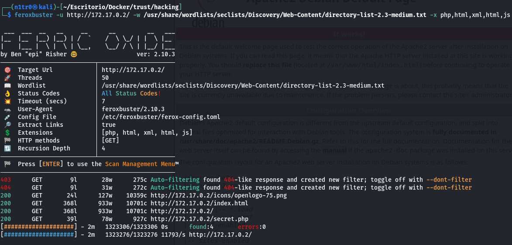

Tenemos cositas interesantes por aquí, un index.html y un secret.php, no tan secreto por lo visto, así que vamos a ojear lo que nos encontramos.

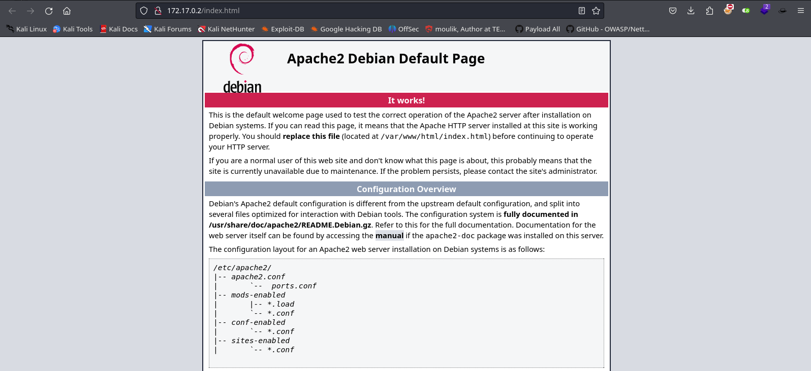

En el index.html nos encontramos con la página anterior, por supuesto.

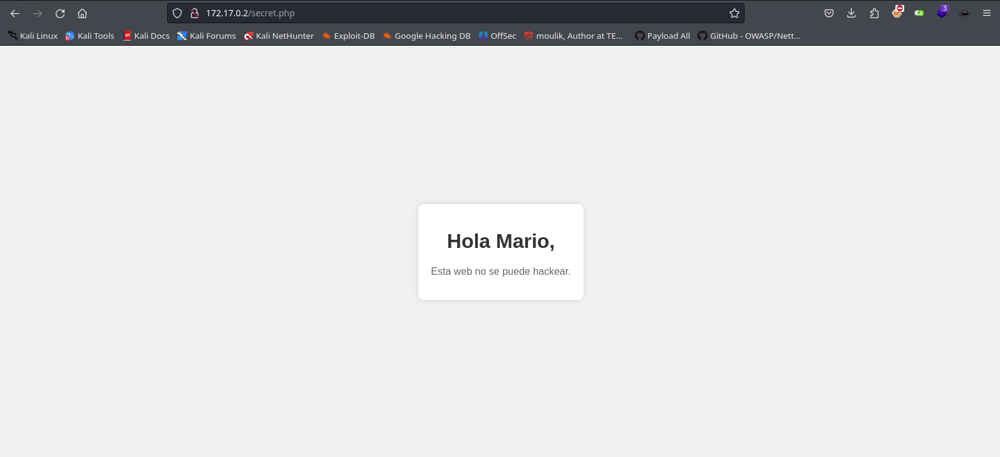

¡Vaya! ¿Qué tenemos por aquí? Nos aparece un mensaje diciendo que esta web no se puede hackear, y posiblemente tenga razón, pero lo más interesante aquí es que nos llama Mario, por lo que podríamos dar por hecho que tenemos un posible usuario. Si nos remontamos al escaneo inicial, recordamos que tenemos un servicio ssh corriendo en esta máquina, por lo que podríamos probar a realizar fuerza bruta a este servicio con el usuario que hemos obtenido.

Para realizar esto utilizaremos hydra, una potente herramienta para hacer ejercicios de fuerza bruta.

`hydra -l mario -P /usr/share/wordlists/rockyou.txt 172.17.0.2 ssh`

Y efectivamente, tenemos la contraseña del usuario y podremos acceder mediante ssh a la máquina.

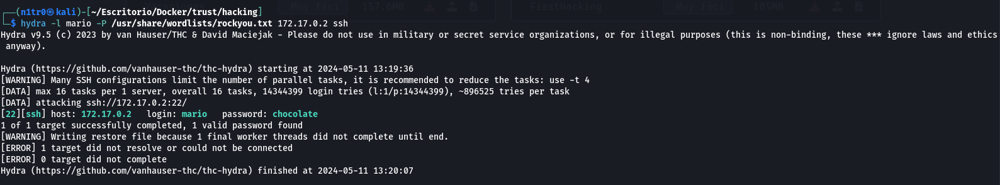

`ssh mario@172.17.0.2`

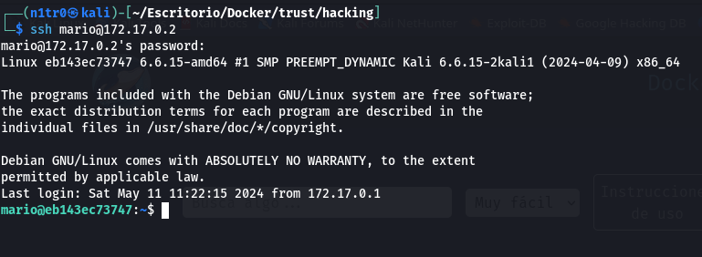

Utilizando `sudo -l` y proporcionando la contraseña para el usuario podemos listar lo que podemos utilizar utilizando sudo.

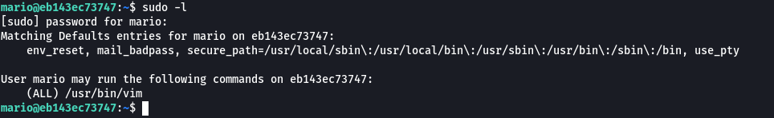

Vemos que podemos utilizar el comando vim como usuario privilegiado, por lo que hacemos una búsqueda para ver cómo podríamos aprovechar esto para elevar nuestros privilegios. Accediendo a la web https://gtfobins.github.io nos encontramos con esto al buscar vim.

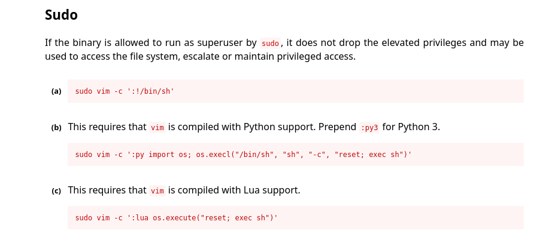

Usaremos el siguiente comando y conseguiremos escalar nuestros privilegios y convertirnos en el usuario root, teniendo de esta forma el control total de la máquina.

`sudo vim -c ':!/bin/sh'`

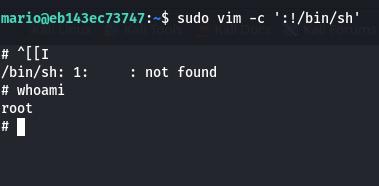

Espero que os haya gustado, y nos veremos en la próxima. Agradecer a Mario por haber hecho esta plataforma y estas máquinas que son muy instructivas, seguiremos haciendo hasta completar todas. Un besito a todos <3

--------------------------------------------------------------------------------------------------------------------------------------------------

Hello everyone and welcome, this is going to be my first WriteUp so I can't promise it's going to be a masterpiece, but we'll try xD

In this case, I'll be tackling one of the machines on the platform created by a beloved member of the community, Mario from [El Pingüino de Mario](https://www.youtube.com/@ElPinguinoDeMario), everyone check out his social media, it's sure not to disappoint.

The machine in question is called Trust and it's one of the simplest on the platform.

Following the installation instructions for the machine and Docker, we can get started. Installing the machine will provide us with its IP address, and honestly, the installation process seemed very straightforward and that's appreciated.

We check using a ping that the machine is indeed accessible. This also helps us identify which operating system it's using; if the TTL is 128, we're dealing with a Windows machine, if, on the other hand, as is the case here, the TTL is 64, then we know we're dealing with a Linux machine.

With all of this done, we start a basic enumeration of the open ports to figure out our attack vector.

`sudo nmap -p- --open 172.17.0.2 -Pn -n --min-rate 5000 -vvv -oN escaneo`

We see that the machine has ports 80 and 22 open, which refer to an HTTP service and an SSH service, respectively.

Knowing this, the first thing we'll do is access the web service through our browser to see what we find.

We're greeted with an Apache default page, and if we use Wappalyzer, we can also see its version, which in this case is version 2.4.57. We can also verify this by scanning only the open ports and specifying that we want it to run basic reconnaissance scripts, as well as giving us the versions with the -sCV argument.

`sudo nmap -p 22,80 -sCV 172.17.0.2 -Pn -n --min-rate 5000 -vvv -oN escaneoSC`

We search the internet for the versions and see if they have any known vulnerabilities, it doesn't seem to be the case, so we'll proceed to fuzz the web to look for possible directories and files. But before that, we'll take a look at the source code to see if there are any comments or anything interesting that might help us.

In the source code, there's nothing interesting, so we're going to fuzz. For this, several tools can be used like dirsearch, wfuzz, or gobuster. In this case, I'll use feroxbuster since a colleague recommended it to me this week. 

`feroxbuster -u http://172.17.0.2/ -w /usr/share/wordlists/seclists/Discovery/Web-Content/directory-list-2.3-medium.txt`

Initially, we don't see that it has found any directories, so we'll use the -x argument to specify extensions to search for files.

`feroxbuster -u http://172.17.0.2/ -w /usr/share/wordlists/seclists/Discovery/Web-Content/directory-list-2.3-medium.txt -x php,html,xml,html,js`

We have some interesting things here, an index.html and a secret.php, not so secret apparently, so let's take a look at what we find.

In the index.html, we find the previous page, of course.

Wow! What do we have here? We get a message saying that this website cannot be hacked, and it might be right, but the most interesting thing here is that it mentions Mario, so we could assume we have a possible username. If we go back to the initial scan, we remember that we have an SSH service running on this machine, so we could try to brute force this service with the username we've obtained.

To do this, we'll use Hydra, a powerful tool for brute forcing.

`hydra -l mario -P /usr/share/wordlists/rockyou.txt 172.17.0.2 ssh`

And indeed, we have the password for the user and we'll be able to access the machine via SSH.

`ssh mario@172.17.0.2`

Using sudo -l and providing the password for the user, we can list what we can use using sudo.

We see that we can use the vim command as a privileged user, so we'll do a search to see how we could exploit this to elevate our privileges. Accessing the website https://gtfobins.github.io, we find this when searching for vim.

We'll use the following command and we'll manage to escalate our privileges and become the root user, thus having full control of the machine.

`sudo vim -c ':!/bin/sh'`

I hope you liked it, and see you next time. Thanks to Mario for creating this platform and these machines that are very instructive, we'll keep doing them until we complete them all. A kiss to everyone <3

