#Hi, english below :)

Hola a todos, estoy aquí otra vez para traeros el WriteUp de otra máquina de Dockerlabs, en este caso vamos a estar resolviendo la máquina Vacaciones, también de las más sencillas de la plataforma, así que no nos entretenemos más y vamos a ello.

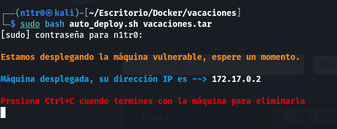

Una vez tenemos la máquina desplegada pasaremos al reconocimiento básico de la misma, no sin antes lanzarle un ping para ver si la máquina está efectivamente activa.

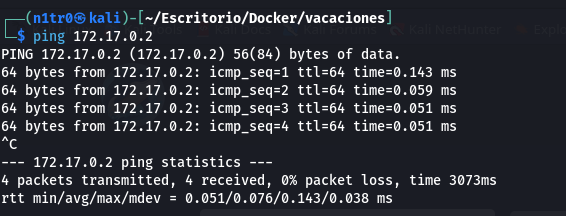

Tenemos un TTL de 64, por lo que ya sabemos de antemano que nos encontramos ante otra máquina linux. Vamos a pasar a hacer un escaneo de puertos abiertos con nmap.

`sudo nmap -p- --open 172.17.0.2 -Pn -n --min-rate 5000 -vvv -oN escaneo`

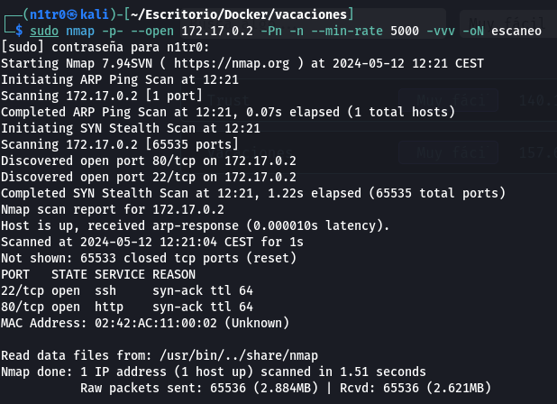

Igual que en la máquina de Trust que resolvimos ayer, tenemos los puertos 22 y 80 abiertos, que se refieren a un servicio ssh y uno http, respectivamente. Vamos a realizar un escaneo algo más exhaustivo únicamente a los puertos abiertos, especificando el argumento -sCV para lanzar unos scripts básicos de reconocimiento además de obtener la versión de los servicios.

`sudo nmap -p 22,80 -sCV 172.17.0.2 -Pn -n --min-rate 5000 -vvv -oN escaneoSC`

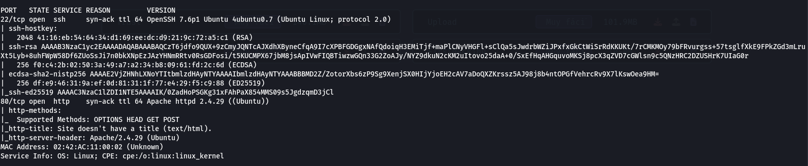

Vemos que la versión de OpenSSH es la 7.6p1, la cual está desactualizada y es vulnerable a la enumeración de usuarios (CVE-2018-15473), a los que luego se les podría realizar fuerza bruta para lograr un inicio de sesión exitoso, por lo que nuestra aproximación irá por esta vía. 

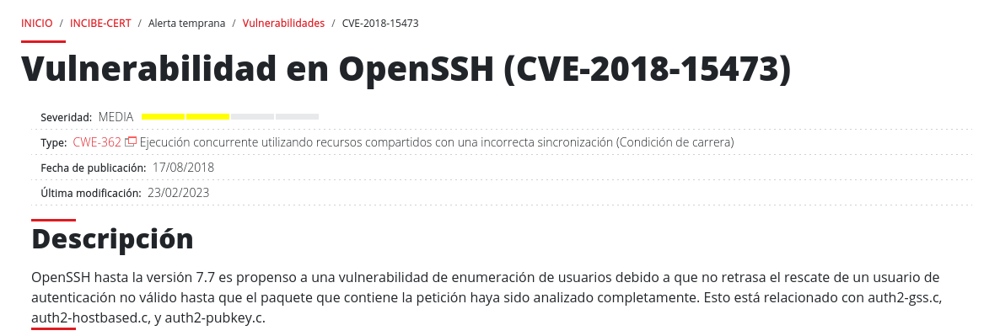

De todas formas, antes de comenzar con esto vamos a echarle un vistazo al servicio web que corre en el puerto 80.

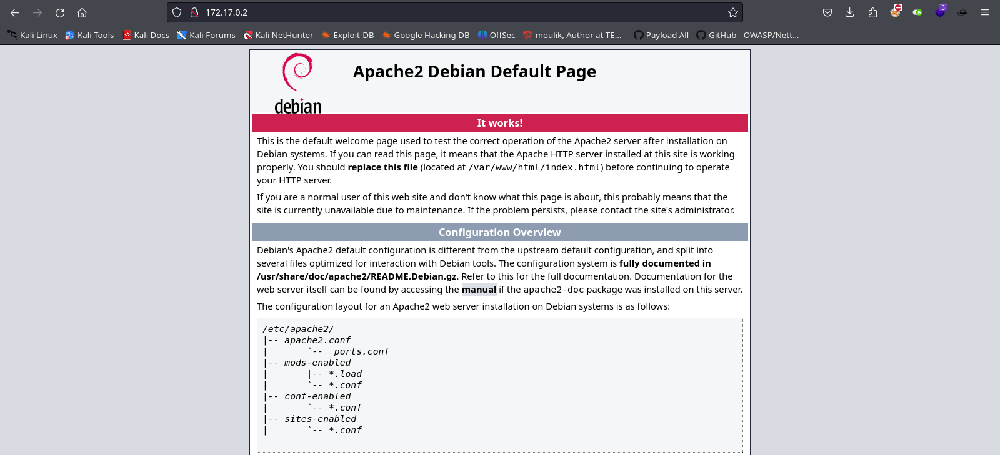

Sólo nos encontramos con la página por defecto, así que vamos a volver en un principio a nuestro servicio SSH vulnerable. Sabemos de antemano que el exploit para esta versión de SSH está disponible en Metasploit, aunque también podríamos usarlo tomando el exploit desde la web y utilizándolo. En este caso usaremos Metasploit, ya que en lo personal me parece un framework de explotación cómodo. Para abrir el framework usaremos el comando:

`msfconsole`

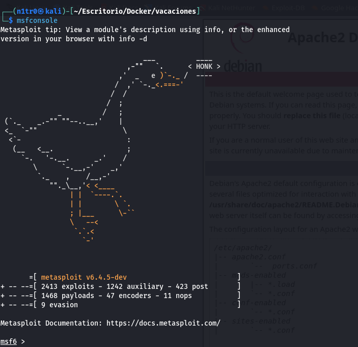

Una vez dentro de Metasploit buscaremos por SSH usando `search ssh-users`, aquí nos encontraremos con el exploit que necesitamos utilizar para poder enumerar los usaurios. Lo seleccionaremos usando `use 0`.

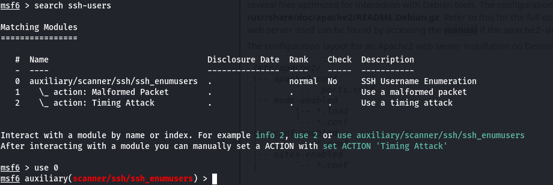

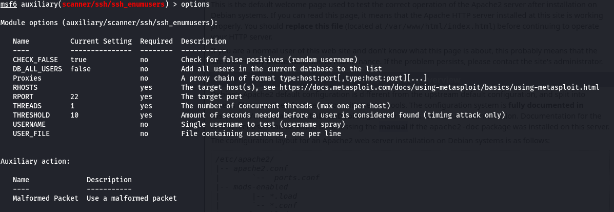

Con el comando `options` veremos los parámetros que necesitamos introducir para que el exploit tenga efecto. En este caso, tenemos que introducir el RHOSTS y el parámetro USER_FILE. Añadiremos la dirección IP de la máquina víctima y un diccionario que contendrá nombres de usuarios respectivamente.

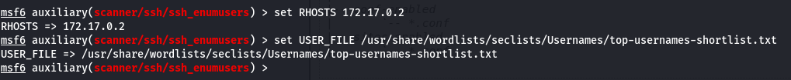

Una vez hecho esto, usaremos el comando `run` o `exploit` para lanzarlo.

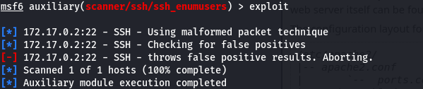

Mala suerte, parece que la máquina nos está devolviendo falsos positivos, por lo que vamos a ver más en profundidad la web, intentaremos fuzzear para ver si nos encontramos algún archivo o directorio oculto que nos pueda dar información.

`feroxbuster -u http://172.17.0.2/ -w /usr/share/wordlists/seclists/Discovery/Web-Content/directory-list-2.3-medium.txt -x php,html,xml,html,js`

No se encuentra nada, por lo que en este caso necesito ayuda externa. Para darme cuenta de que mi laboratorio estaba teniendo algún tipo de problema y el servicio web no se estaba cargando correctamente ya que no se debería ver esa página por defecto. Una vez solucionado el problema, si volvemos a acceder a la web vemos que está completamente en blanco.

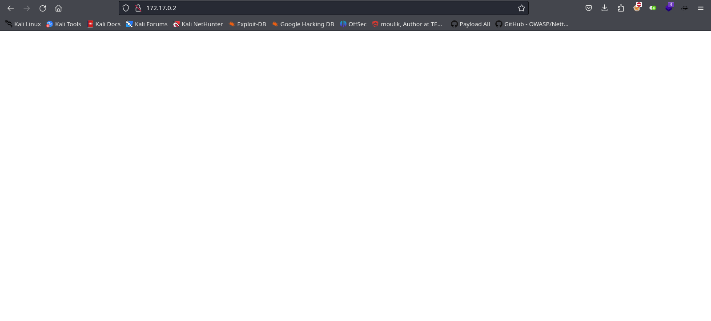

Lo primero que haríamos sería verificar el contenido del código fuente, ya que en ocasiones hay información útil en forma de comentarios o rutas dentro del servidor.

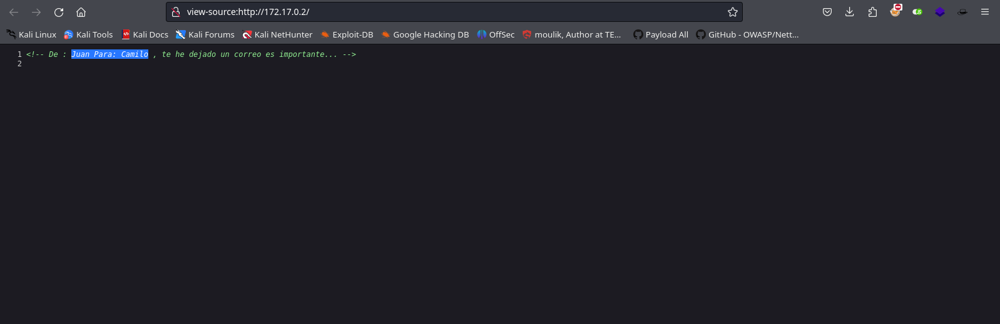

Efectivamente, vemos que hay un comentario haciendo referencia a dos usuarios: Juan y Camilo. Sabiendo esto, probaremos a realizar fuerza bruta a estos dos usuarios por el servicio SSH que hay en el puerto 22. Para esto crearemos una lista con estos dos usuarios, y usaremos estos dos usuarios para intentar conseguir un inicio de sesión exitoso.

`hydra -L users -P /usr/share/wordlists/rockyou.txt 172.17.0.2 ssh`

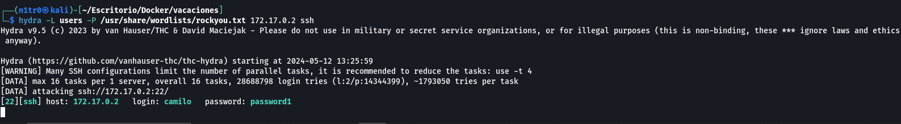

Tenemos el usuario y la contraseña, así que vamos a iniciar sesión.

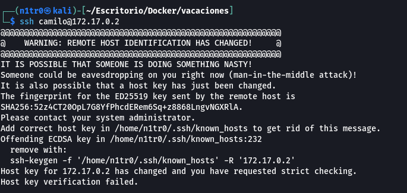

Nos aparece un error, para solucionarlo usaremos el comando:

`ssh-keygen -f '/home/n1tr0/.ssh/known_hosts' -R '172.17.0.2'`

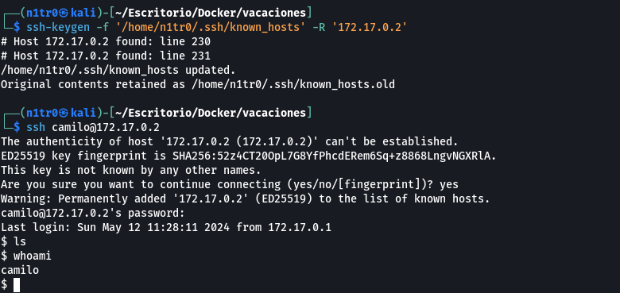

Usaremos el siguiente comando para que la terminal sea más interactiva:

`script /dev/null -c bash`

`sudo -l`

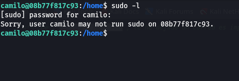

Vemos que el usuario con el que hemos iniciado sesión no es capaz de ejecutar sudo en el sistema, por lo que buscaremos otra forma de elevar nuestros privilegios para obtener el control total. 

`find / -user root -perm /4000 2>/dev/null`

Usamos este comando para ver los permisos SUID, parece que no hay nada fuera de lo común.

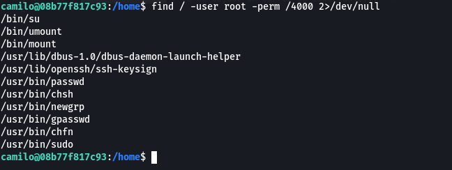

¿Os acordáis del correo que se mencionaba en el comentario de la web? Vamos a intentar acceder a el:

`find / -name "correo" 2>/dev/null`

Con este comando estamos buscando en todo el sistema archivos con el nombre correo, pero no encontramos nada. Cambiaremos el nombre por mail a ver si tenemos más suerte.

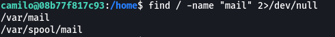

Tenemos un par de rutas, vamos a acceder a ellas.

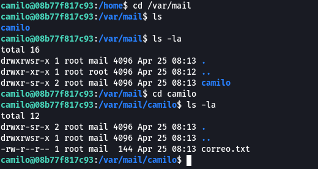

Aquí está el correo que estábamos buscando. Vamos a leerlo con el comando cat.

`cat correo.txt`

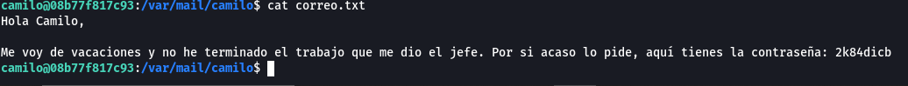

Vaya, bastante interesante. Tenemos la contraseña del usuario Juan, que es el que enviaba el correo. Cambiaremos de usuario para ver si Juan tiene algunos permisos especiales que nos permitan escalar privilegios.

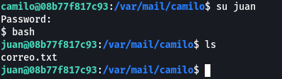

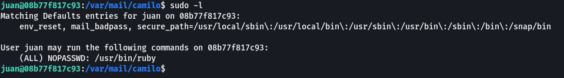

Vemos que Juan puede ejecutar ruby como usuario root dentro del sistema. Buscaremos en GTFObins si hay alguna manera en la que podamos aprovecharnos de esto para convertirnos en el usuario root.

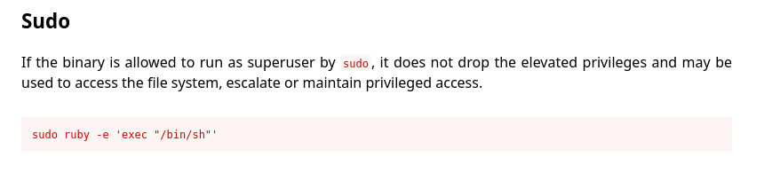

Parece que sí, por lo que volvemos a la máquina para ejecutar el comando y convertirnos en usuario privilegiado, teniendo de esta forma el acceso y control total del sistema.

`sudo ruby -e 'exec "/bin/sh"'`

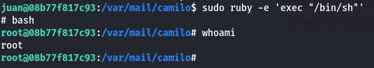

Una máquina muy interesante y que en ciertos momentos te obliga a pensar fuera de la caja, muchas gracias a Mario también por esta máquina, y no olvidéis de seguirle en sus redes sociales. [El pingüino de Mario](https://www.youtube.com/channel/UCGLfzfKRUsV6BzkrF1kJGsg).

---------------------------------------------------------------------------------------------------------------------------------------------------

Hello everyone, I'm here again to bring you the WriteUp of another Dockerlabs machine, in this case, we'll be solving the Vacaciones machine, also one of the simpler ones on the platform, so let's not waste any more time and get started.

Once we have the machine deployed, we'll move on to basic reconnaissance of it, not without first pinging it to see if the machine is indeed active.

We have a TTL of 64, so we already know beforehand that we are dealing with another Linux machine. Let's move on to scanning for open ports using nmap.

`sudo nmap -p- --open 172.17.0.2 -Pn -n --min-rate 5000 -vvv -oN escaneo`

Just like on the Trust machine we solved yesterday, we have ports 22 and 80 open, which refer to an SSH and an HTTP service, respectively. Let's perform a more exhaustive scan only on the open ports, specifying the -sCV argument to launch some basic reconnaissance scripts as well as to obtain the version of the services.

`sudo nmap -p 22,80 -sCV 172.17.0.2 -Pn -n --min-rate 5000 -vvv -oN escaneoSC`

We see that the version of OpenSSH is 7.6p1, which is outdated and vulnerable to user enumeration (CVE-2018-15473), after which brute force could be performed on the users to achieve a successful login, so our approach will go through this route. 

Anyway, before starting with this, let's take a look at the web service running on port 80.

We only encounter the default page, so let's go back initially to our vulnerable SSH service. We already know that the exploit for this version of SSH is available in Metasploit, although we could also use it by fetching the exploit from the web and using it. In this case, we'll use Metasploit, as I personally find it a convenient exploitation framework. To open the framework, we'll use the command:

`msfconsole`

Once inside Metasploit, we'll search for SSH using search ssh-users. Here we'll find the exploit we need to use to enumerate the users. We'll select it using use 0.

With the options command, we'll see the parameters we need to enter for the exploit to take effect. In this case, we need to enter the RHOSTS and the USER_FILE parameter. We'll add the victim machine's IP address and a dictionary containing usernames, respectively.

Once done, we'll use the run or exploit command to launch it.

Bad luck, it seems that the machine is giving us false positives, so let's take a closer look at the web, we'll try to fuzz to see if we find any hidden files or directories that could give us information.

`feroxbuster -u http://172.17.0.2/ -w /usr/share/wordlists/seclists/Discovery/Web-Content/directory-list-2.3-medium.txt -x php,html,xml,html,js`

We find nothing, so in this case, I need external help. To realize that my lab was having some kind of problem and the web service was not loading correctly since we shouldn't see that default page. Once the problem is solved, if we access the web again we see that it's completely blank.

The first thing we would do is to check the content of the source code, as sometimes there is useful information in the form of comments or paths within the server.

Indeed, we see a comment referring to two users: Juan and Camilo. Knowing this, we'll try to brute force these two users through the SSH service running on port 22. For this, we'll create a list with these two users, and we'll use these two users to try to get a successful login.

`hydra -L users -P /usr/share/wordlists/rockyou.txt 172.17.0.2 ssh`

We have the username and password, so let's log in.

An error appears, to fix it we'll use the command:

`ssh-keygen -f '/home/n1tr0/.ssh/known_hosts' -R '172.17.0.2'`

We'll use the following command to make the terminal more interactive:

`script /dev/null -c bash`

`sudo -l`

We see that the user with which we logged in cannot execute sudo on the system, so we'll look for another way to elevate our privileges to obtain full control.

`find / -user root -perm /4000 2>/dev/null`

We use this command to see SUID permissions, it seems that there's nothing out of the ordinary.

Do you remember the email mentioned in the web comment? Let's try to access it:

`find / -name "correo" 2>/dev/null`

With this command, we're searching the entire system for files named "correo", but we find nothing. Let's change the name to "mail" to see if we have better luck.

We have a couple of paths, let's access them.

Here's the email we were looking for. Let's read it with the cat command.

`cat correo.txt`

Wow, quite interesting. We have the password of the user Juan, who is the one sending the email. Let's switch users to see if Juan has some special permissions that allow us to escalate privileges.

We see that Juan can execute ruby as the root user within the system. Let's search GTFObins to see if there's any way we can take advantage of this to become the root user.

It seems that yes, so let's go back to the machine to execute the command and become a privileged user, thus gaining full access and control of the system.

`sudo ruby -e 'exec "/bin/sh"'`

A very interesting machine that at certain times forces you to think outside the box, thank you very much to Mario as well for this machine, and don't forget to follow him on his social networks.[El pingüino de Mario](https://www.youtube.com/channel/UCGLfzfKRUsV6BzkrF1kJGsg).

