Hola otra vez, vamos a resolver otra máquina de [Dockerlabs](https://dockerlabs.es/#/), en este caso la máquina se llama Obsession y es una de la categoría más fácil de Dockerlabs de [El Pingüino de Mario](https://www.youtube.com/channel/UCGLfzfKRUsV6BzkrF1kJGsg). 

---------------------------------------------------------------------------------------------------------------------------------------------------

Sin más que añadir vamos a ello, como siempre empezaremos por descargar la máquina y realizar su instalación, recordad que funcionan mediante docker por lo que estaremos creando un contenedor en nuestra máquina local en el que se almacenará la máquina víctima.

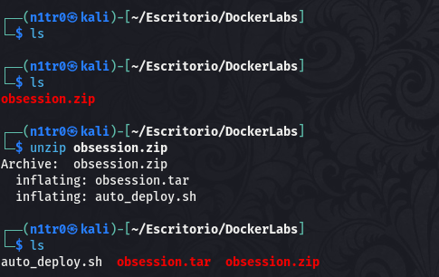

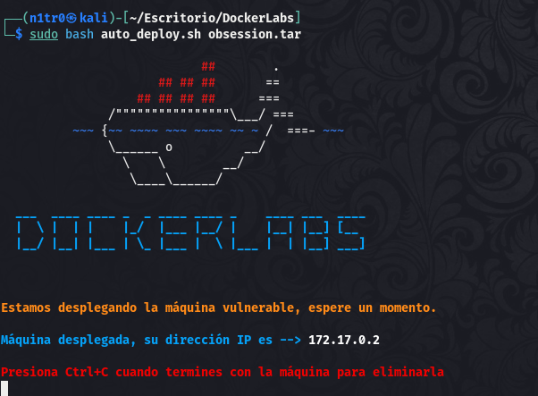

Empezaremos realizando un ping a la máquina para verificar su correcto funcionamiento, al hacerlo vemos que tiene un TTL de 64, lo que significa que la máquina objetivo usa un sistema operativo Linux.

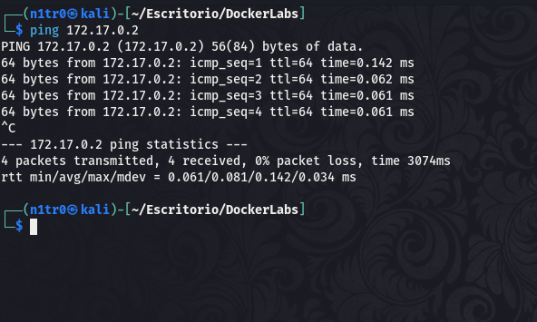

Como vemos, la máquina funciona correctamente y podemos empezar con el proceso de enumeración de la misma, vamos a ello.

# Enumeración

Lo primero que haremos para enumerar esta máquina será realizar un escaneo básico de puertos para identificar cuáles están abiertos.

```sudo nmap -p- --min-rate 5000 172.17.0.2 -Pn -n -oN escaneo```

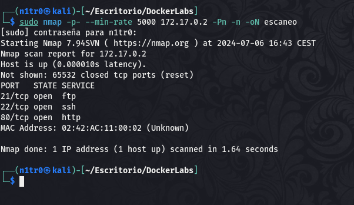

Identificamos tres puertos abiertos, el 21, el 22 y el 80, haciendo referencia a servicios FTP, SSH y HTTP respectivamente. De cualquier forma realizaremos un escaneo más exhaustivo para lanzar scripts básicos de reconocimiento y tratar de enumerar las versiones de los mismos.

```sudo nmap -p 21,22,80 -sCV 172.17.0.2 -Pn -n -oN escaneoSC```

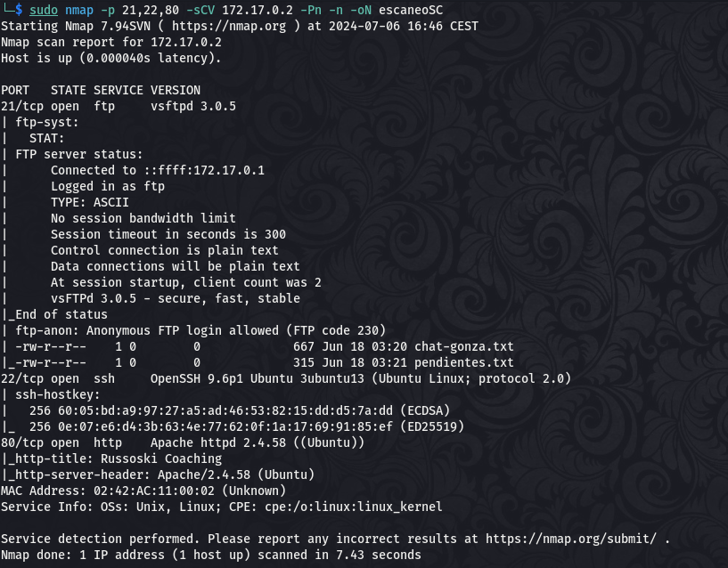

En este output podemos ver que el puerto 21 permite el inicio de sesión anónimo, por lo que vamos a entrar para ver qué podemos encontrar en este puerto.


Encontramos dos archivos de texto, vamos a hacernos con ellos para leerlos.

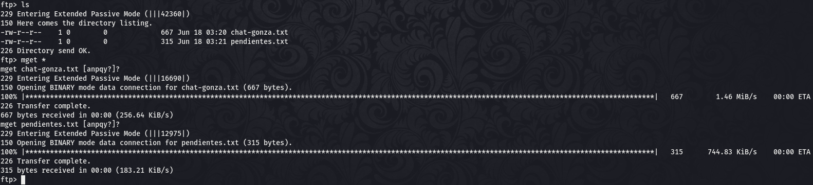

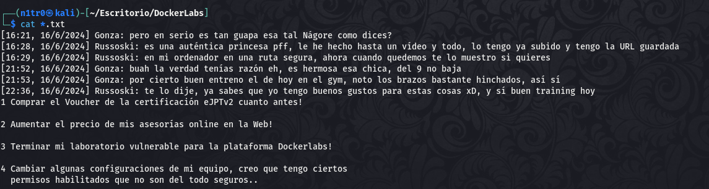

Aquí podemos encontrar un par de cosas interesantes, la primera y más obvia es la existencia de tres nombres que podrían ser posibles usuarios, la segunda es el último comentario de las tareas pendientes donde podemos leer que un usuario tiene activados unos privilegios peligrosos. Vamos a hacer una lista de usuarios con los nombres y vamos a acceder a la web para ver qué tenemos.

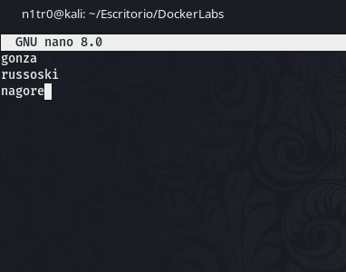

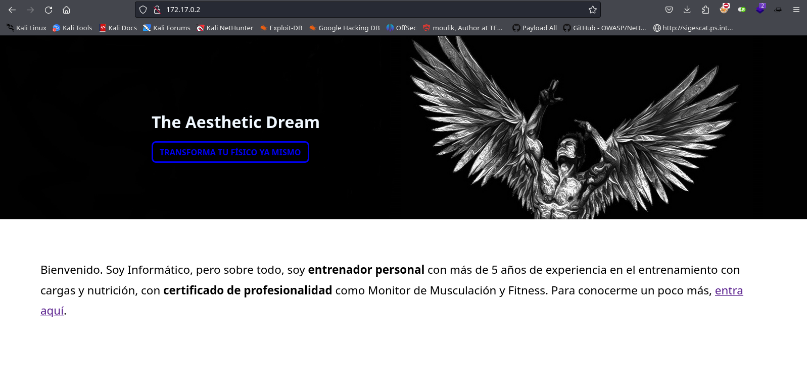

En el puerto 80 de esta máquina podemos encontrar una web de venta de servicios de coaching, nada demasiado interesante hasta que leemos el código fuente y encontramos un comentario revelador.

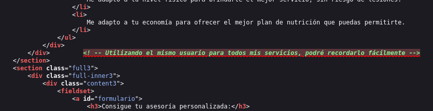

Parece que el usuario que hizo esta web usa el mismo usuario para todos los servicios según dice para que no se le olvide. Esta es una práctica poco segura ya que si damos con su usuario aumenta en gran medida nuestro vector de ataque, vamos a buscarlo.


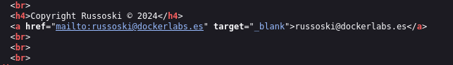

# Explotación

Encontramos dos posibles usuarios y recordamos que esta máquina tiene el puerto 22 abierto, trataremos de lanzar un ataque de fuerza bruta a estos dos posibles usuarios para tratar de obtener un inicio de sesión exitoso.

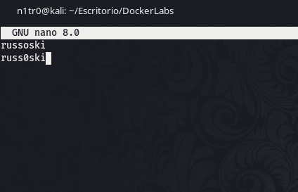

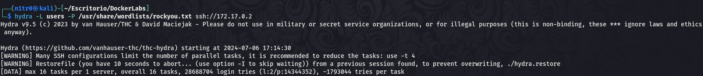

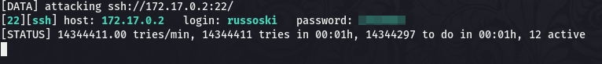

¡Bien! Conseguimos un inicio de sesión exitoso así que vamos a entrar a la máquina para obtener así nuestro primer acceso.

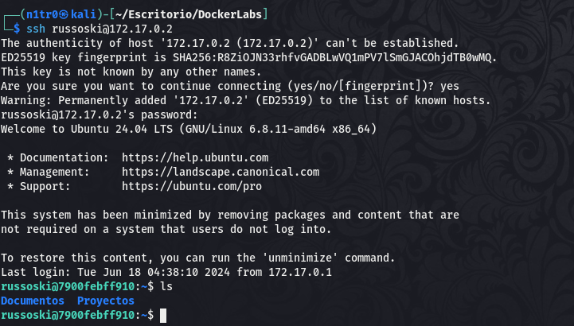

Estamos dentro de la máquina con credenciales válidas, lo que nos otorga una gran persistencia. De cualquier modo, vamos a tratar de elevar nuestros privilegios para comprometer la máquina completamente.

# Post-Explotación

Vamos a tratar de enumerar los permisos del usuario ya que vimos en el txt anterior que alguno de ellos podría ser peligroso, quizás podamos aprovechar esto para convertirnos en usuario root.

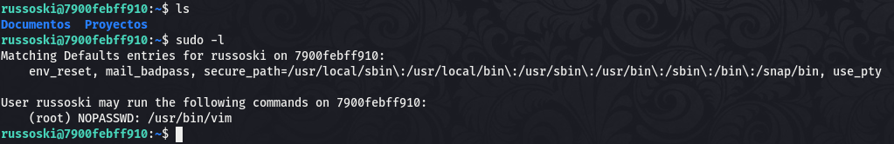

El usuario en cuestión tiene la capacidad de usar el comando vim como sudo, impersonando al usuario root mientras ejecuta la acción. Recuerdo haber explotado este permiso en alguna máquina más, de todas formas iremos a [GTFObins](https://gtfobins.github.io/) para ver las vías potenciales de usar esto en nuestro beneficio.

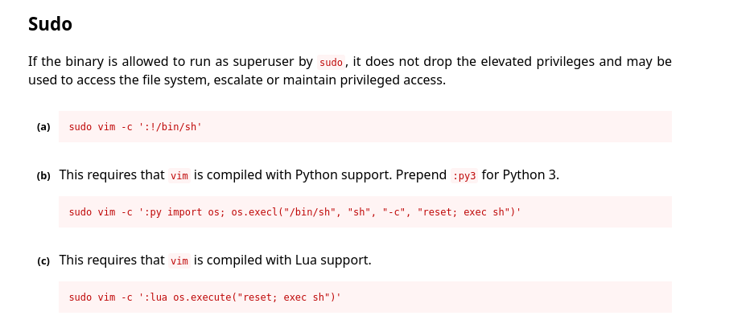

Vemos que este binario en concreto tiene bastantes vulnerabilidades a la hora de elevar privilegios, en nuestro caso la que nos interesa es la que podéis ver. Vamos a usar este conocimiento para completar la máquina.

```sudo vim -c ':!/bin/bash'```

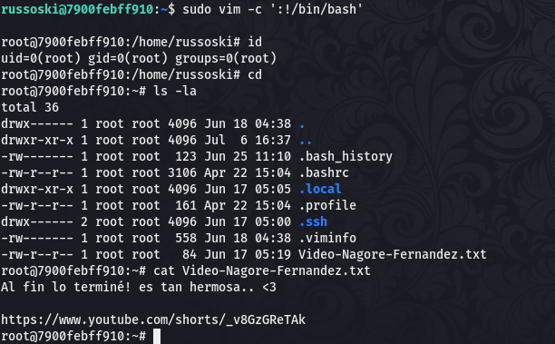

¡Eso es! Logramos elevar nuestros privilegios y convertirnos en usuario root comprometiendo así la máquina por completo y pudiendo dar por concluido el reto. Espero que os haya gustado mucho y nos vemos en la siguiente.


