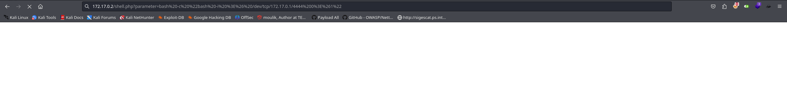

Hola otra vez, vamos a resolver otra máquina de [Dockerlabs](https://dockerlabs.es/#/), en este caso la máquina se llama WhereIsMyWebshell y está incluida en la categoría fácil de Dockerlabs de [El Pingüino de Mario](https://www.youtube.com/channel/UCGLfzfKRUsV6BzkrF1kJGsg).


---------------------------------------------------------------------------------------------------------------------------------------------------

Sin más que añadir vamos a ello, como siempre empezaremos por descargar la máquina y realizar su instalación, recordad que funcionan mediante docker por lo que estaremos creando un contenedor en nuestra máquina local en el que se almacenará la máquina víctima.


Empezaremos realizando un ping a la máquina para verificar su correcto funcionamiento, al hacerlo vemos que tiene un TTL de 64, lo que significa que la máquina objetivo usa un sistema operativo Linux.


Como vemos, la máquina funciona correctamente y podemos empezar con el proceso de enumeración de la misma, vamos a ello.

# Enumeración

Lo primero que haremos para enumerar esta máquina será realizar un escaneo básico de puertos para identificar cuáles están abiertos.

```sudo nmap -p- --min-rate 5000 172.17.0.2 -Pn -n -oN escaneo```


Vemos que únicamente tenemos disponible el puerto 80, de cualquier forma vamos a lanzar un escaeno más exhaustivo para tratar de enumerar versiones de servicios así como lanzar unos scripts básicos de reconocimiento.

```sudo nmap -p 80 -sCV 172.17.0.2 -Pn -n -oN escaneoSC```


Parece que aparte del nombre de la página web no encontramos nada interesante con este escaneo, vamos a acceder al puerto 80 para ver qué nos encontramos y buscar una forma de lograr nuestro primer acceso.


Vamos a fuzzear para localizar directorios y archivos ocultos.


Encontramos una página llamada warning, a ver qué encontramos en la misma.


Vaya, parece que en la shell que encontramos en la enumeración se puede utilizar un parámetro, pero no sabemos de cuál se trata por lo que volveremos a fuzzear para tratar de encontrar este parámetro que necesitamos.


Lo tenemos, el parámetro que estábamos buscando se llama parameter, vamos a verificar esto en nuestro navegador.


Efectivamente, hemos dado con el parámetro que buscábamos y podemos ejecutar comandos dentro del sistema objetivo. Vamos a utilizar esta capacidad para enviar una conexión a nuestra máquina atacante y obtener de esta meanera nuestro primer acceso.

# Explotación

Para encontrar una shell podemos utilizar varias herramientas, en este caso utilizaré la web [RevShells](https://www.revshells.com/). Para usarla sólo tendremos que introducir nuestra IP y el puerto en el que nos pondremos a la escucha.


Una vez tenemos nuestro oneliner lo introduciremos en el parámetro descubierto añadiendo ````bash -c``` antes para indicar que queremos que use bash para ejecutar el comando que le proporcionamos. Antes de esto tendremos que habernos puesto en escucha para recibir la conexión, y es importante mencionar que tenemos que url-encodear nuestro payload. Si hemos hecho todos los pasos correctamente tendremos una conexión y habremos conseguido nuestro primer acceso.




Eso es, tenemos nuestro primer acceso y hemos conseguido explotar la shell que encontramos para enviar una conexión a nuestra máquina atacante, vamos a buscar la forma de elevar nuestros privilegios para comprometer el sistema por completo.


Parece que no disponemos de más usuarios a los que podamos pivotar por lo que tendremos que tratar de elevar nuestros privilegios desde este mismo usuario, también podemos ver que no tenemos disponible el comando sudo.

# Post-Explotación

Sin tener la capacidad de utilizar el comando sudo lo primero que se nos viene a la mente es tratar de enumerar los binarios que disponen de permisos SUID, vamos a hacerlo.


Parece que tampoco hay nada interesante. En este caso tendremos que volver unos pasos atrás ya que en la página web se nos mencionaba que en el directorio /tmp había un secreto. Vamos a intentar acceder a este para ver de qué se trata.


Vaya, parece que el secreto que se mencionada era ni más ni menos que la contraseña del usuario root. Teniendo esto en nuestro poder tan sólo tendremos que cambiar al usuario root, introducir su contraseña y habremos completado el reto.


¡Bien! Funciona a la perfección y nos comvertimos en el usuario root obteniendo el control total sobre el sistema y pudiendo dar por concluida esta máquina, espero que os haya gustado mucho y nos vemos en la siguiente. :)

