> **Hi, english below!**

Hola otra vez, vamos a resolver otra máquina de Dockerlabs, en este caso la máquina se llama Injection y sigue siendo una de la categoría más fácil de Dockerlabs de El Pingüino de Mario. 
Sin más que añadir vamos a ello, como siempre empezaremos por descargar la máquina y realizar su instalación, recordad que funcionan mediante docker por lo que estaremos creando un contenedor en nuestra máquina local en el que se almacenará la máquina víctima.


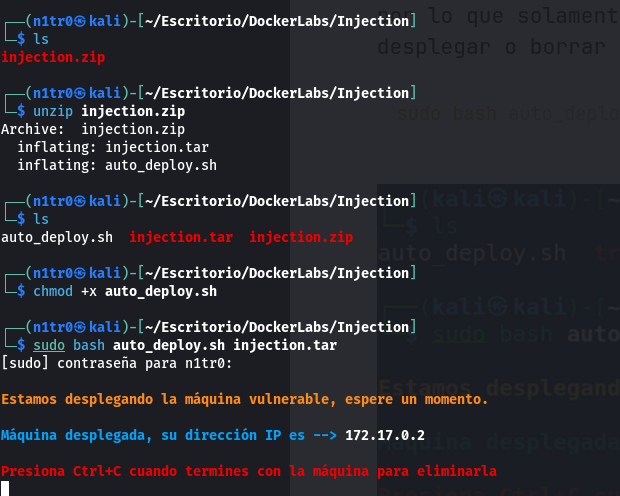


# Enumeración


Como siempre empezaremos realizando un ping a la máquina víctima para verificar que la misma se encuentra activa, una vez hecho esto, procederemos a realizar un escaneo básico de puertos para ver qué servicios están corriendo en la máquina.


Como dato adicional y como ya hemos visto anteriormente, al hacer ping vemos que nos encontramos con un TTL(Time To Live) de 64, lo que nos indica que estamos ante una máquina linux. Vamos a realizar el escaneo de puertos.

``` sudo nmap -p- --open 172.17.0.2 --min-rate 5000 -vvv -oN escaneo ```


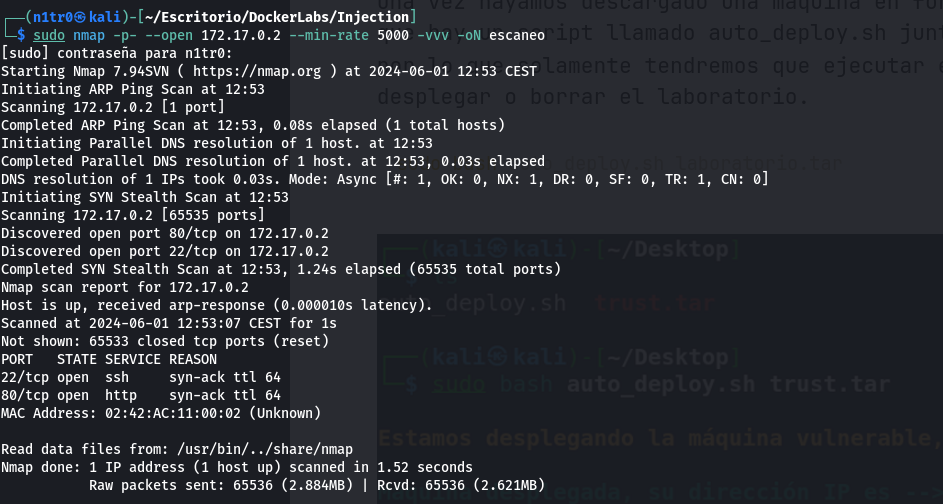


En esta ocasión nos encontramos de nuevo con los puertos 22 y 80 abiertos. El puerto 22 nos indica que tenemos disponible el servicio SSH en dicho puerto, mientras que el puerto 80 nos indica que dispone de un servicio web al que podremos acceder. Sabiendo esto, vamos a realizar un escaneo en profundidad lanzando unos scripts básicos de reconocimiento así como tratar de enumerar las versiones con el parámetro -sCV.

``` sudo nmap -p 22,80 -sCV 172.17.0.2 --min-rate 5000 -vvv -oN escaneoSC ```


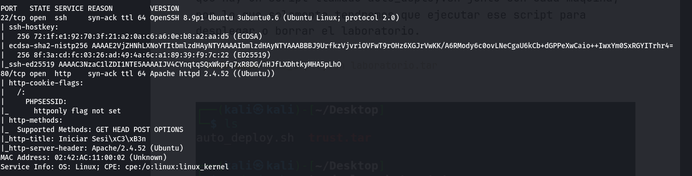


Podemos ver que la versión del SSH es la 8.9p1, mientras que la del servicio web es Apache/2.4.52. De momento nada intrigante por aquí, por lo que vamos a ver qué nos encontramos en el puerto 80 de esta máquina.


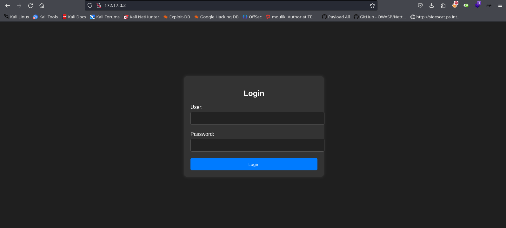


Nos encontramos ante un panel de login, vamos a ver el código fuente a ver si encontramos algo que nos sirva.


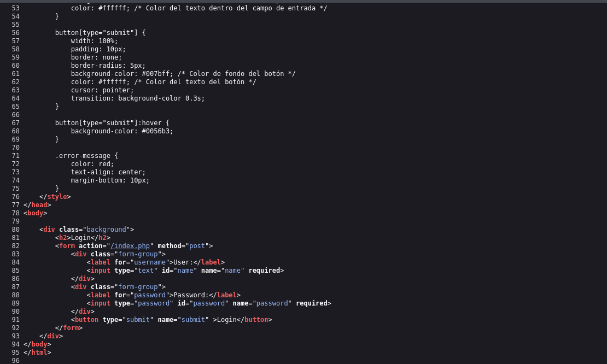


Tampoco parece que haya nada interesante, por lo que vamos a probar alguna cosa para poder saltarnos este login. Probamos con admin:admin pero no funciona. Al añadir una comilla después de admin la cosa cambia y vemos un error que nos indica un error en la sintaxis de SQL como podemos ver en la imagen.


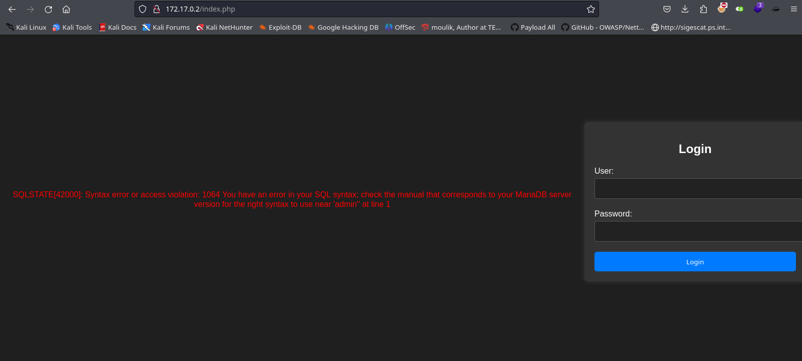


# Explotación


Parece que podríamos utilizar este vector para lograr bypassear este panel de login y acceder al sistema. Al probar con el clásico payload de SQL Injection conseguimos saltarnos este login y podemos acceder como si fuésemos un usuario legítimo.

``` admin' or 1=1 -- - ```

Con esta sintaxis en concreto lo que conseguimos es añadir una condición que indica que si somos admin y la contraseña es correcta seremos capaces de entrar como es obvio, la otra condición es que si 1 es igual a uno también podremos entrar, y ¿1 siempre es igual a 1? Eso es, por lo que podremos entrar sin ningún problema. Anotad que esto no funcionará siempre, pero es algo que vale la pena intentar(siempre en entornos controlados y con permiso).


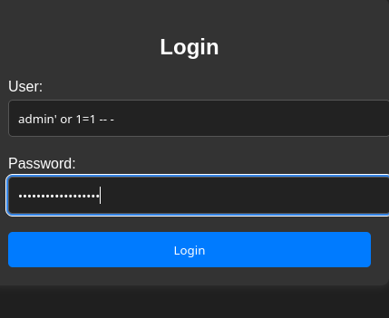


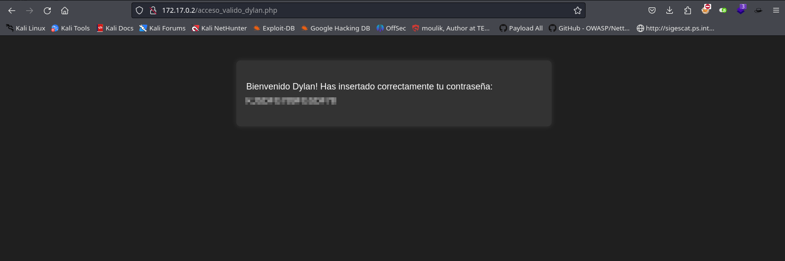


¡Genial! Al acceder se nos proporciona la contraseña real del usuario Dylan, y si echamos la vista atrás recordaremos que esta máquina tiene el SSH activo, por lo que lo primero que haríamos sería probar esta combinación de usuario y contraseña en dicho servicio para tratar de entrar a la máquina.


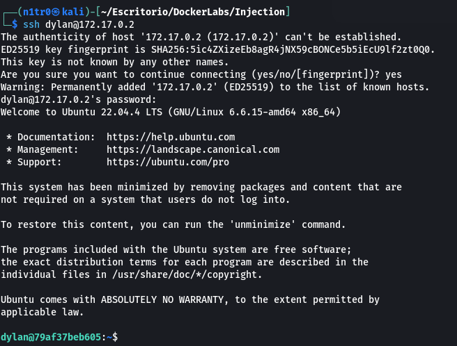


# Post-Explotación


Una vez dentro de la máquina lo que nos queda es elevar nuestros privilegios para convertirnos en el usuario root y tener el control total de la misma. Para conseguir esto, y teniendo en cuenta que tenemos la contraseña, lo primero sería utilizar el comando ``` sudo -l ``` para ver si somos capaces de utilizar algún comando con permisos de usuario root.


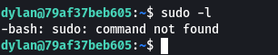


Vaya, parece que el comando sudo no está disponible. Tendremos que buscar otra forma de elevar nuestros privilegios. Con el siguiente comando podremos listar los permisos SUID, veamos si esto nos da algún vector interesante.

``` find / -user root -perm /4000 2>/dev/null ```

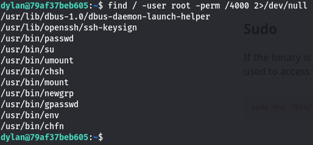


Si nos fijamos bien vemos que el binario env tiene permisos SUID, así que iremos a GTFObins para ver si gracias a este binario podemos convertirnos en usuario privilegiado. Y efectivamente, podemos utilizar este binario para convertirnos en usuario root, por lo que vamos a hacerlo.


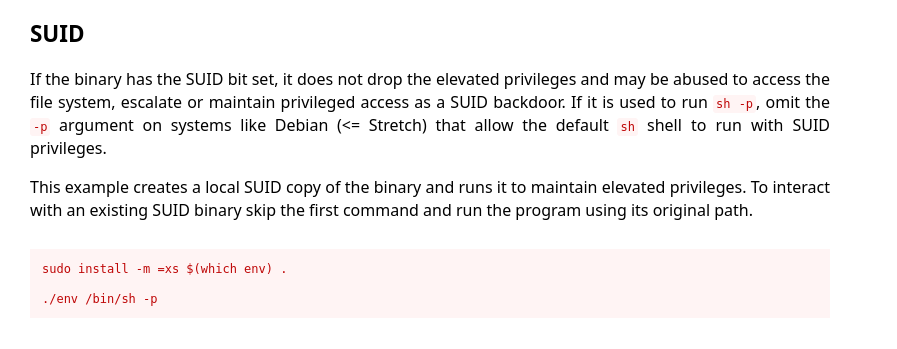


``` /usr/bin/env /bin/bash -p ```


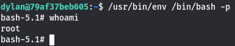

Somos root y tenemos control total sobre la máquina, por lo que nuestro trabajo ha terminado. Muchas gracias por leer y espero que os hay gustado, ¡nos vemos en la siguiente! :)


---------------------------------------------------------------------------------------------------------------------------------------------------

