Hola a todos y bienvenidos de nuevo, en el día de hoy vamos a resolver juntos la máquina Daily Bugle de TryHackMe siguiendo el path de Offensive Pentesting. No vamos a perder el tiempo y nos ponemos manos a la obra, espero que os guste y que todos aprendamos mucho juntos. Recordad que todo lo que veremos en el día de hoy se está utilizando en un entorno de pruebas controlado y que su uso fuera de este ámbito no es ético y podría conllevar problemas penales.

---------------------------------------------------------------------------------------------------------------------------------------------------

Como siempre empezaremos conectando nuestra máquina atacante a la VPN de TryHackMe e iniciando la máquina, lo cual no debería llevarnos más de 2 minutos, una vez hecho esto estamos listos para comenzar nuestra aventura.

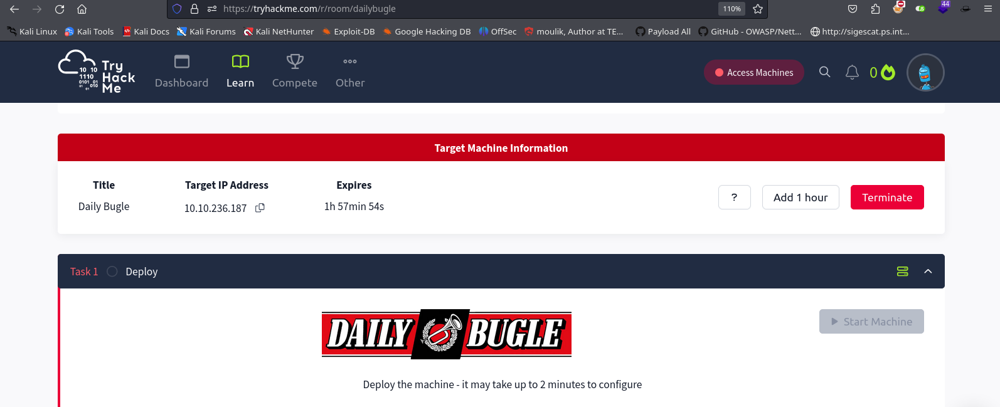

Empezamos lanzando un ping a la máquina para verificar que está activa y funcionando correctamente. Al tener un TTL de 63 podemos asumir que estamos ante una máquina Linux.

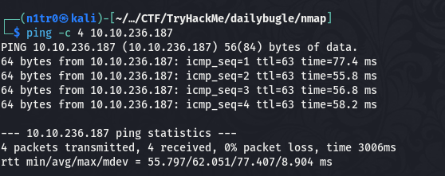

# Enumeración


Empezamos nuestra etapa de enumeración lanzando un escaneo básico de puertos con nmap para ver qué servicios están corriendo en esta máquina.


``` sudo nmap -p- --min-rate 5000 10.10.236.187 -Pn -n -oN escaneo ```


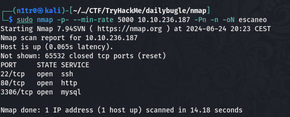

Podemos ver tres puertos abiertos, siendo el puerto 80 el más interesante de los mismos. De cualquier forma, vamos a realizar un escaneo de puertos más exhaustivo para tratar de enumerar los servicios concretos funcionando en esta máquina así como las versiones de los mismos. Para esto usaremos el parámetro -sCV de nmap.


``` sudo nmap -p 80,22,110,139,143,445 -sCV 10.10.236.187 -Pn -n -oN escaneoSC ```


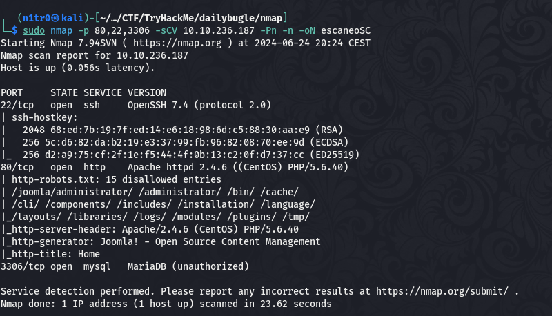

No vemos nada demasiado interesante en este output, por lo que vamos a acceder al puerto 80 de la máquina para ver qué podemos encontrarnos.


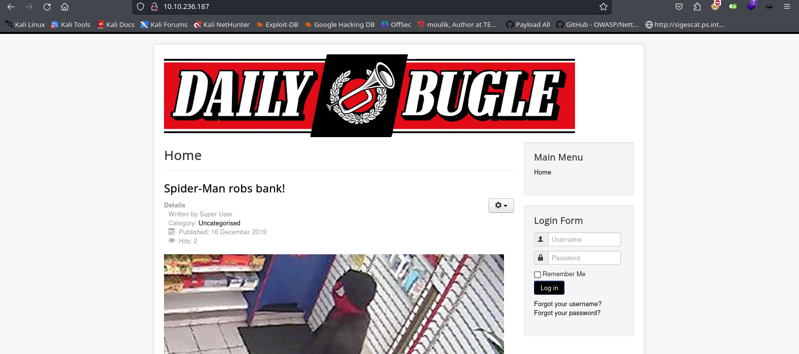

Podemos ver que nuestro amigo y vecino se ha pasado al lado oscuro de la Fuerza. Bromas aparte, si nos fijamos en el favicon de esta web vemos el característico logo de Joomla, lo que nos da una indicación perfecta acerca del CMS que se está utilizando para mantener la web. Sabiendo esto usaremos una herramienta llamada Joomscan que nos dará rápidamente información sobre ciertas configuraciones de este Joomla.


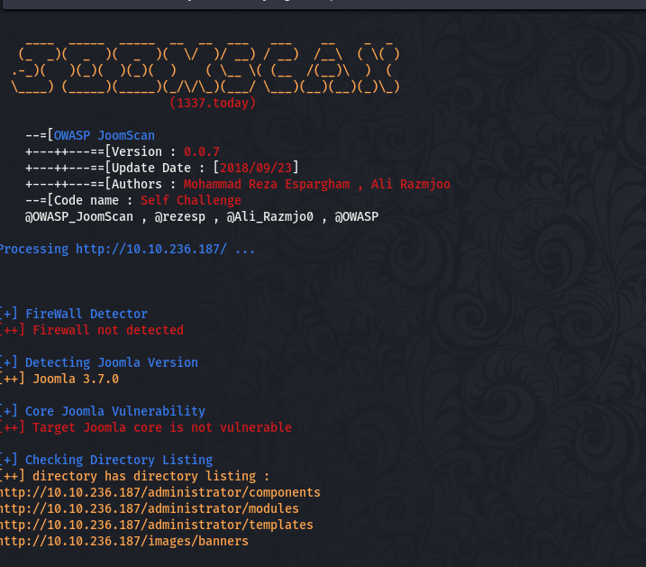


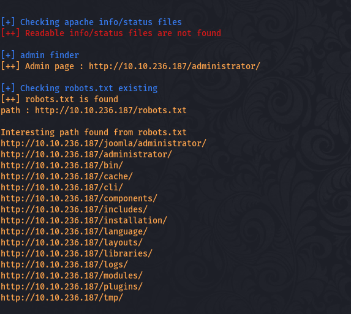

Al terminar el escaneo vemos que hay varios directorios indicados en el archivo robots.txt y el que más llama la atención de ellos es el de administrator. También nos da información sobre la versión del core de Joomla que está corriendo en esta web, siendo la 3.7.0.


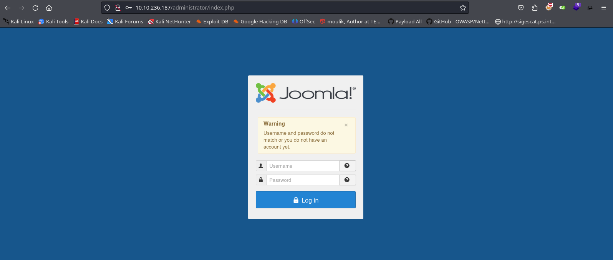

Investigamos un poco sobre la versión de Joomla y rápidamente vemos que tiene una vulnerabilidad conocida de SQL Injection.


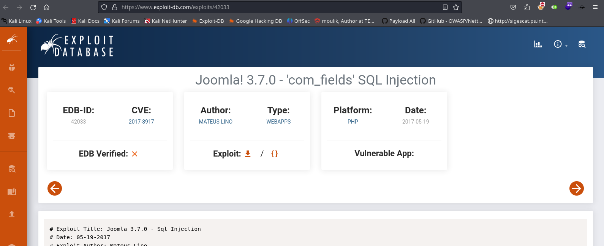

Seguimos los pasos para poder identificar la vulnerabilidad y vemos que la ruta vulnerable efectivamente existe en la web de nuestra víctima, por lo que nos centraremos en tratar de explotar esta vulnerabilidad.


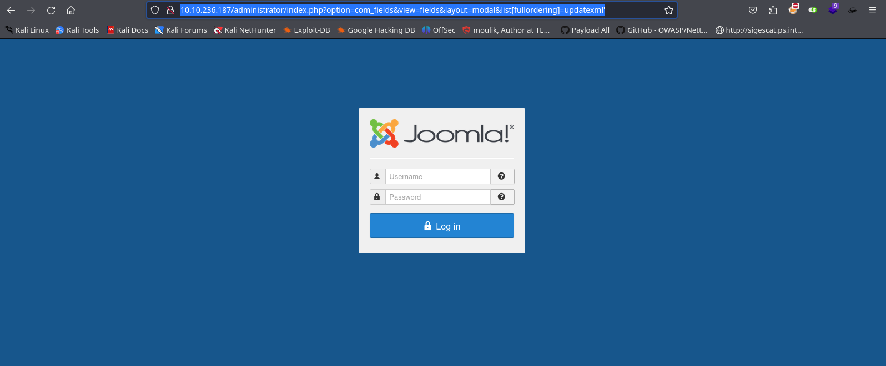

# Explotación


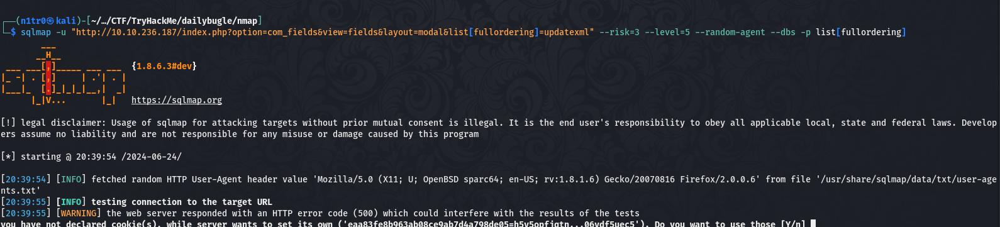

Vemos que SQLmap tarda demasiado así que seguimos investigando y encontramos un exploit público en Python para explotar la vulnerabilidad.


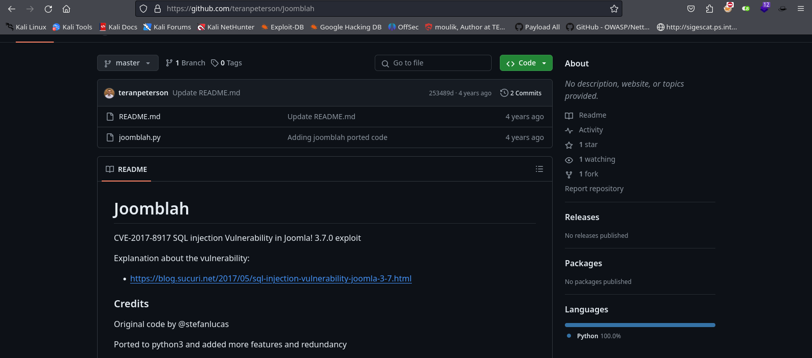

Usaremos este exploit para tratar de obtener los hashes de usuarios legítimos que nos sirvan para poder iniciar sesión en el panel de administrador que vimos previamente.


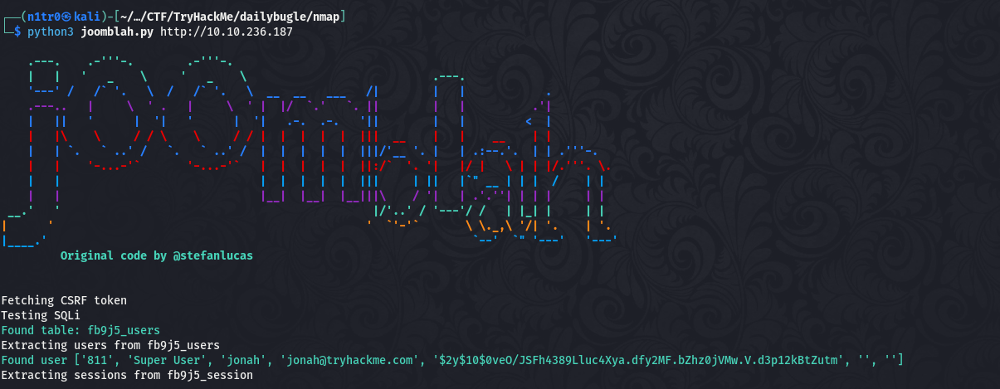

El exploit funciona correctamente y nos consigue el hash de un usuario llamado jonah que tiene permisos de superusuario, por lo que no vamos a perder más el tiempo y vamos a crackear este hash para obtener la contraseña en texto plano. Para identificar el tipo de hash podemos utilizar hashcat sin proporcionar ningún formato, esto hará que la herramienta trate de identificar el tipo por sí misma.


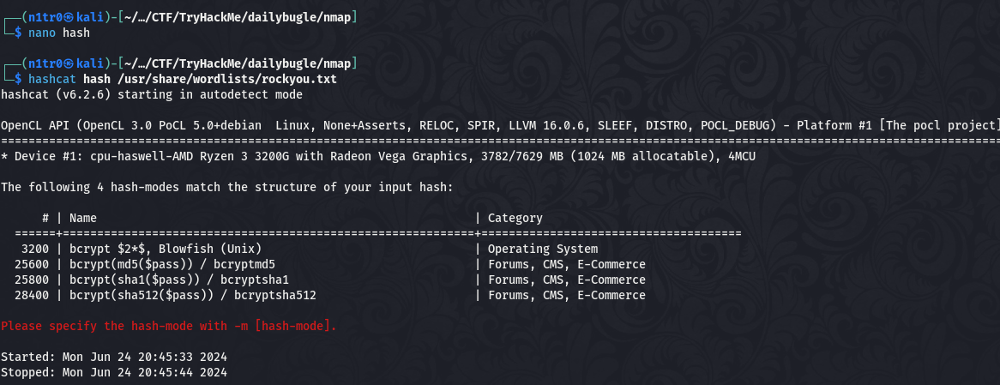

Una vez que tenemos el tipo de hash, podemos usarlo junto a hashcat para conseguir obtener la contraseña en texto plano a través de un ataque de diccionario.


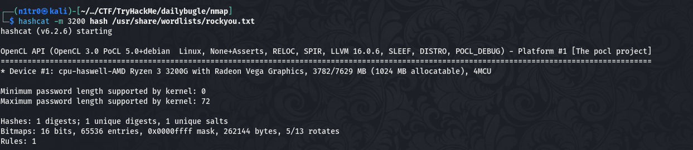


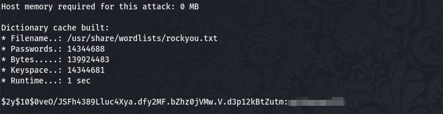

¡Eso es! Con la contraseña del usuario trataremos de hacer login en el panel de administrador que encontramos previamente en Joomla dentro del servidor web.


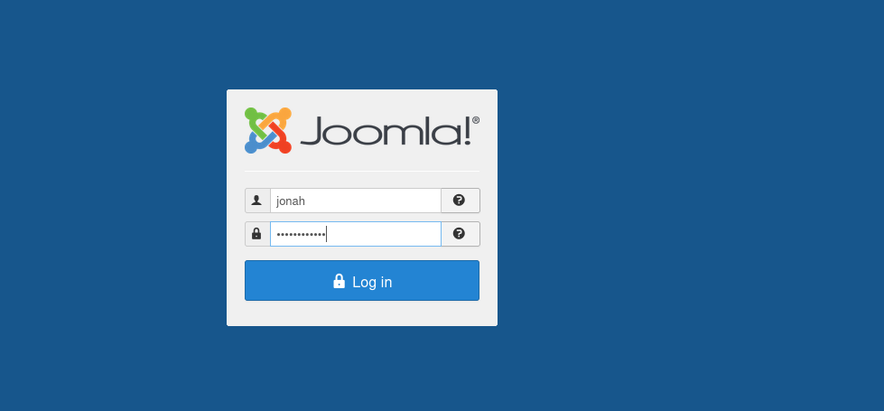

Conseguimos entrar exitosamente y vemos que el usuario tiene permisos de administrador, por lo que conseguir una shell inversa no será una tarea complicada. Para realizar esto sólo tendremos que editar el template de index.php, guardarlo y utilizar la opción de previsualizar para recibir una shell en nuestra máquina atacante. 


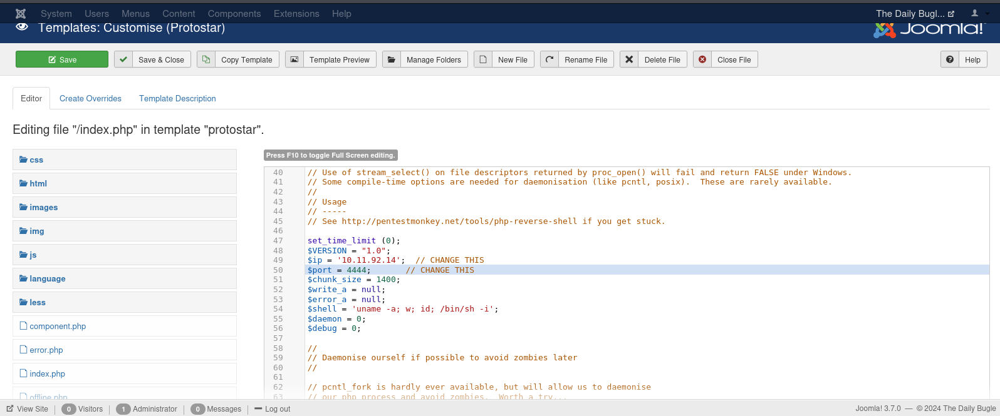


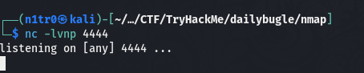

Tras modificar las variables de nuestra shell y ponernos en escucha sólo tendremos que hacer click en el botón de previsualizar y veremos que recibimos una shell en el puerto indicado.


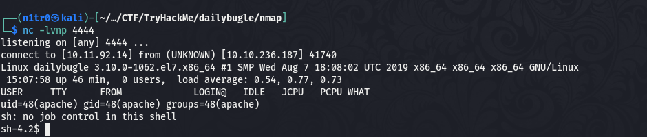

¡Genia! Estamos dentro, ha llegado el momento de ver cómo podemos elevar nuestros privilegios para tener el control total de la máquina.


# Post-Explotación


Una vez dentro de la máquina vemos que nuestro usuario es apache y que no tenemos permisos para usar sudo. Vamos a ir a la ruta /var/www/html para ver si hay algún archivo de configuración del servidor web que nos sirva de ayuda para elevar nuestros privilegios.

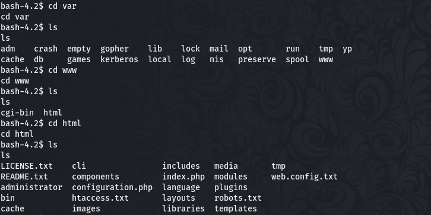

Vemos un archivo interesante llamado configuration.php, vamos a ver qué contiene en su interior.

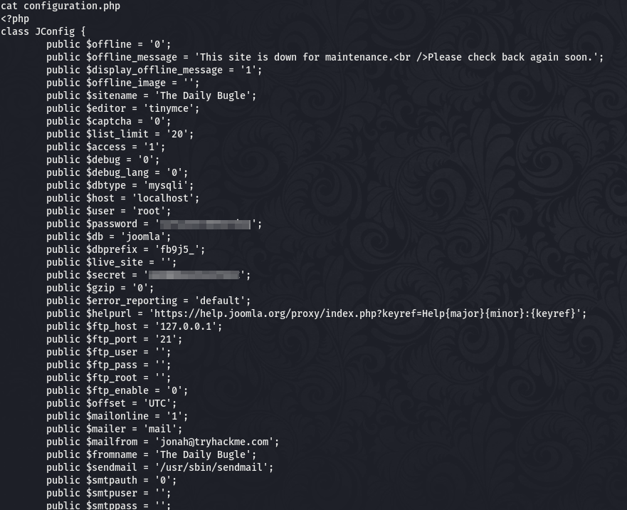

Vemos una contraseña del usuario root, ¿funcionará para poder elevar nuestros privilegios? Vamos a probarlo.

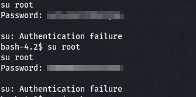

Parece que no sirven con el usuario root, pero si nos remontamos al primer acceso de la máquina, el usuario jonah tenía permisos de superusuario, leemos el archivo /etc/passwd para comprobar si existe este usuario dentro de la máquina.

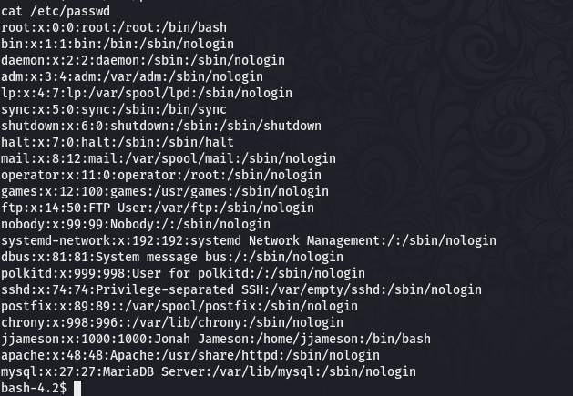

Existe el usuario jjameson, vamos a probar a hacer login como él mediante el SSH que encontramos en el puerto 22.

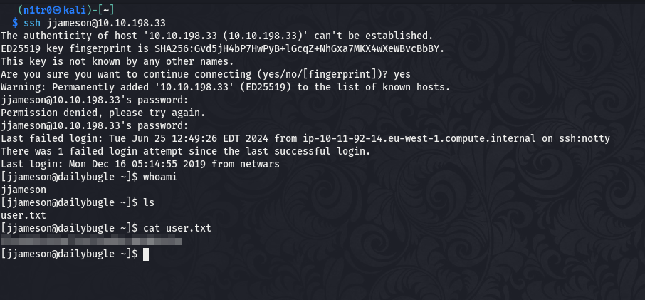

¡Genial! Hemos elevado nuestros privilegios y podemos leer la primera flag. Nuestro último objetivo es convertirnos en usuario root para comprometer la máquina por completo.

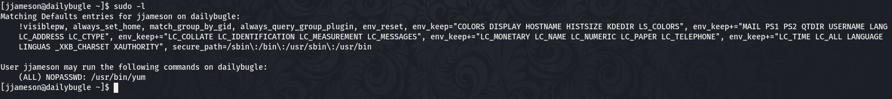

Con ``` sudo -l ``` vemos que este usuario puede ejecutar yum como root, por lo que vamos a investigar un poco para ver si hay alguna forma de usar esto a nuestro favor para elevar los privilegios.

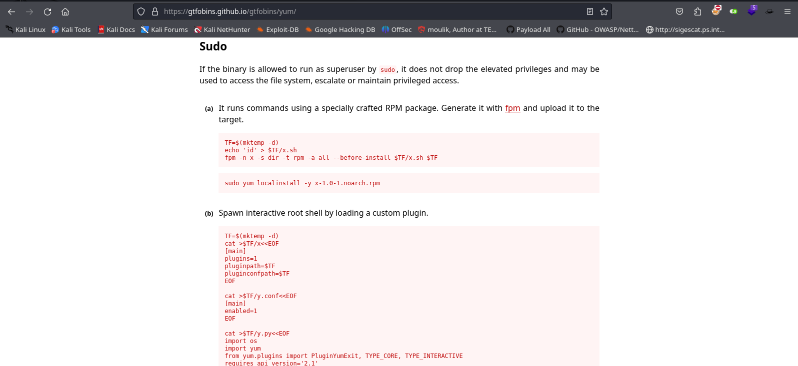

En [GTFObins](https://gtfobins.github.io) encontramos una forma de elevar nuestros privilegios utilizando este binario, así que vamos allá.

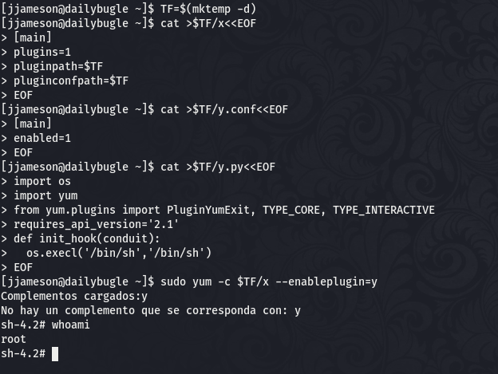

Si seguimos los pasos correctamente vemos que conseguimos una shell interactiva como el usuario root, teniendo de esta forma el control total sobre la máquina.

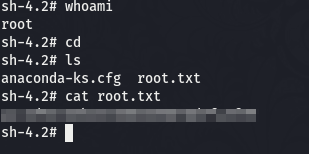

Habiendo comprometido por completo la máquina somos capaces de leer la última flag dando así por completada esta máquina. Espero que os haya gustado mucho, nos vemos en la siguiente :)


