Hola de nuevo, seguimos con nuestro path de TryHackMe, Offensive Pentesting. En esta ocasión estaremos solucionando la máquina GameZone. Sin más que decir empecemos como siempre iniciando la máquina en TryHackMe y conectando nuestra máquina atacante a la red VPN de la plataforma. Una vez hecho esto podemos empezar con nuestra enumeración.


Con nuestra máquina activa y funcionando correctamente (estamos ante una máquina linux ya que tiene un TTL de 63, recordad lo que mencionamos en la máquina anterior) podemos comenzar a enumerar.


# Enumeración


Como siempre comenzaremos haciendo un escaneo inicial para verificar qué puertos se encuentran activos en esta máquina.


``` sudo nmap -p- --min-rate 5000 10.10.15.236 -Pn -n -oN escaneo ```


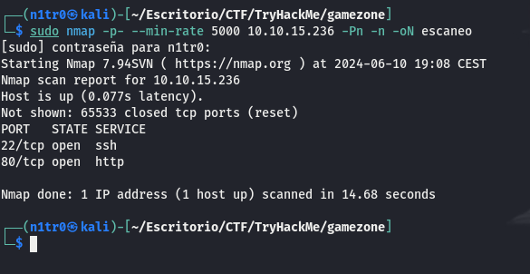


Tenemos dos puertos abiertos, el puerto 80 haciendo referencia a un sevicio http al que podremos acceder desde nuestro navegador y un puerto 22 haciendo referencia a un servicio SSH en el que podremos hacer login con credenciales válidas para entrar dentro de la máquina. Con este escaneo básico procederemos a hacer uno más exhaustivo para tratar de enumerar servicios concretos y versiones de los mismos.


``` sudo nmap -p 80,22 -sCV 10.10.15.236 -Pn -n -oN escaneoSC ```


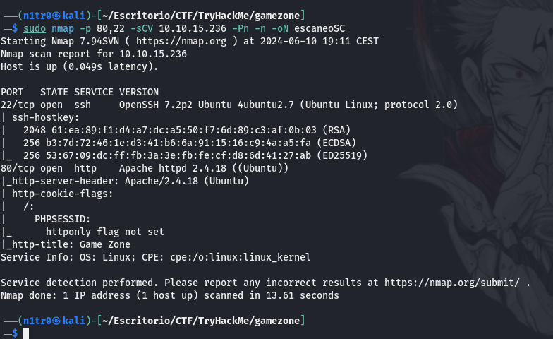


No vemos nada que nos llame demasiado la atención así que vamos directamente a nuestro navegador a explorar el puerto 80 de esta máquina. 


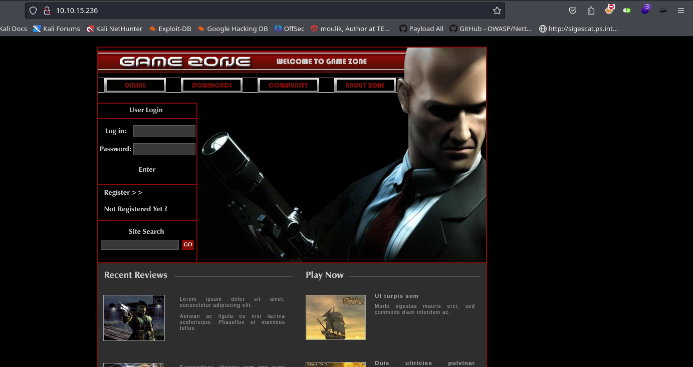


# Explotación


Podemos apreciar un panel de login, y teniendo en cuenta las pistas que nos da TryHackMe lo primero que haremos será probar diferentes payloads para lograr un SQL Injection en este panel. Esto lo podremos hacer de diferentes formas, manualmente o pasando una lista de payloads al intruder de BurpSuite. En este caso lo estaremos haciendo manualmente.


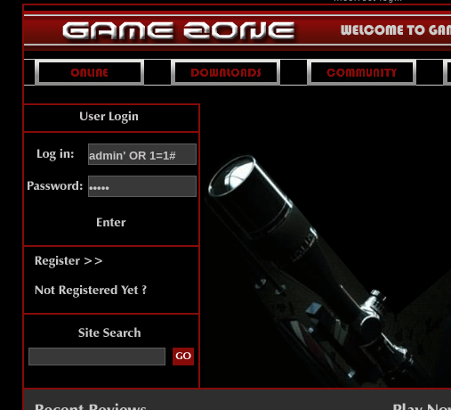


Tras probar varios payloads para tratar de bypassear este panel de autenticación lograremos entrar con éxito revelando una nueva ruta dentro de este servicio web. En https://github.com/payloadbox/sql-injection-payload-list podéis encontrar varias listas de payloads dependiendo de la situación en concreto, estas listas también se pueden usar para hacer un ataque de fuerza bruta como comenté anteriormente.


Una vez dentro de portal.php podemos encontrarnos con un buscador.


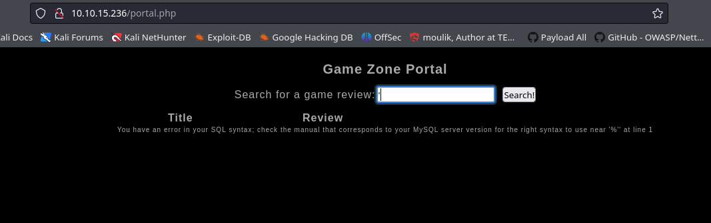


Si ponemos simplemente una comilla podremos observar que nos indica que hay un error de sintaxis en nuestra petición SQL, por lo que este buscador también será vulnerable a inyecciones SQL. Para esto usaremos SQLMAP, aunque antes tendremos que usar Burp para interceptar la petición y guardarla en un archivo .txt que luego pasaremos a la herramienta, esta nos dará información privilegiada sobre la base de datos tras este servicio web.


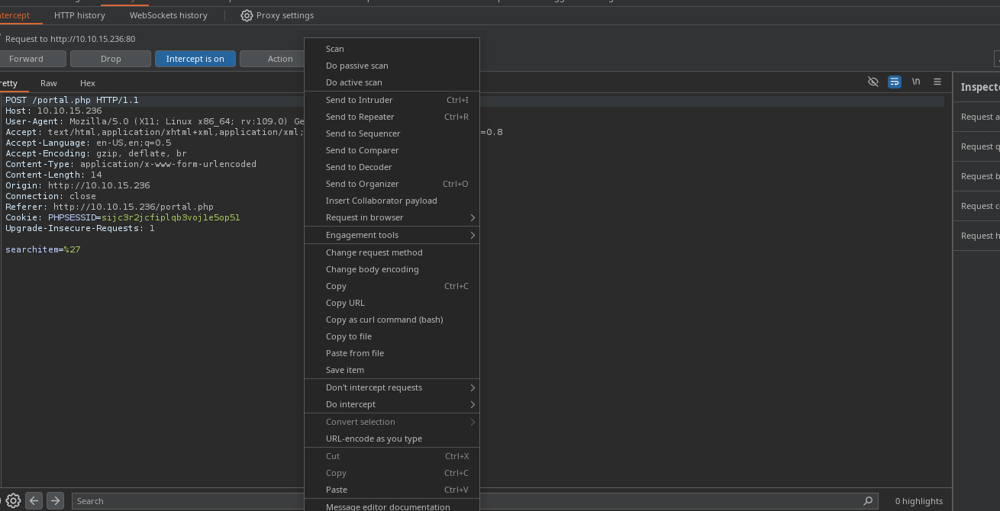


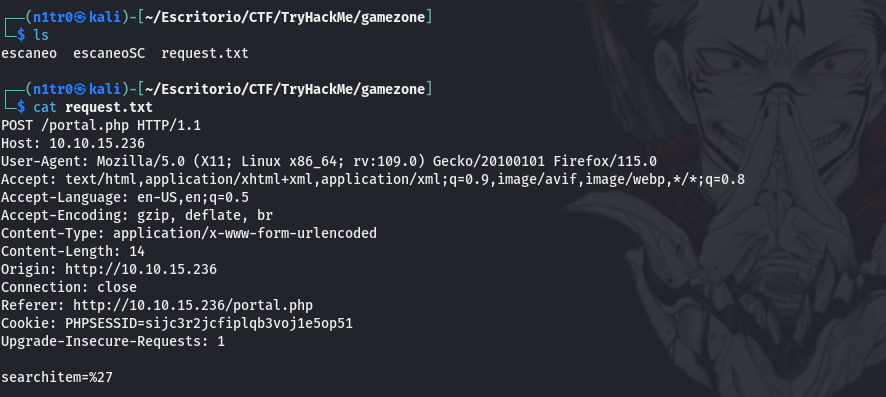


Tenemos nuestra petición guardada correctamente en un archivo y podemos inicar SQLMAP para conseguir la información sobre la base de datos, aunque esto es algo que también podríamos hacer manualmente ahorraremos mucho tiempo usando esta herramienta.


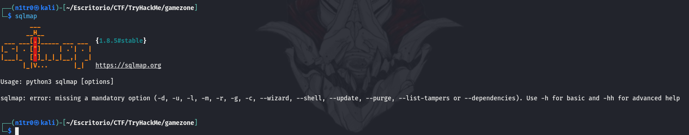


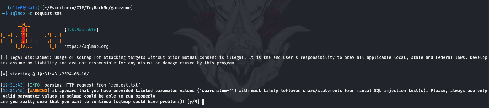


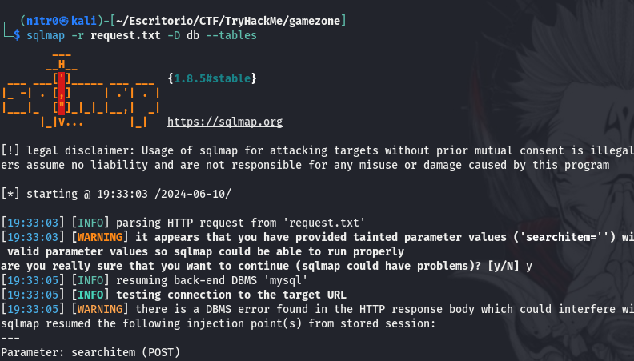


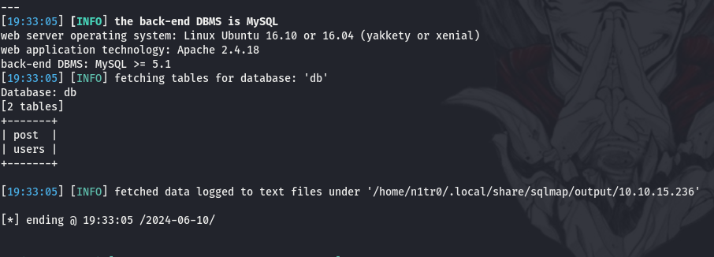


Vemos que tenemos dos bases de datos accesibles, entraremos en la que tiene como nombre users.


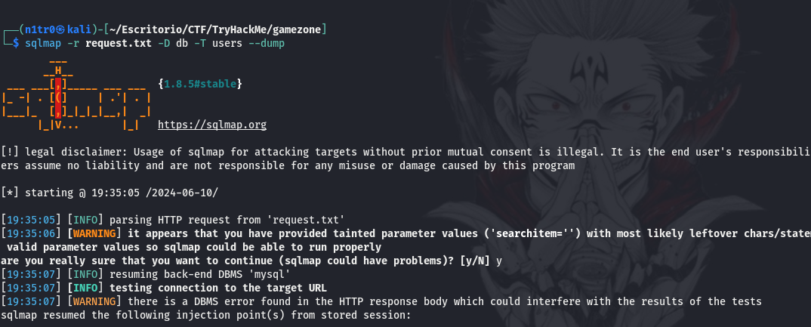


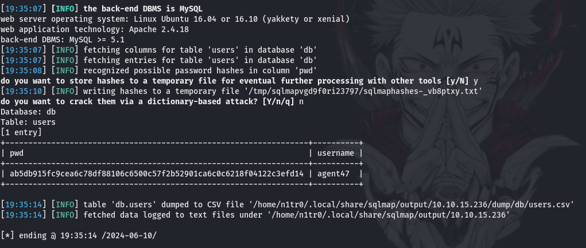


¡Genial! Tenemos un usuario con una contraseña hasheada, la cual tendremos que crackear si queremos ser capaces de usarla en el servicio SSH para hacer login y entrar en la máquina, en otros casos podremos usar este hash como contraseña, pero eso lo dejaremos para próximas máquinas ya que en este caso no es posible.


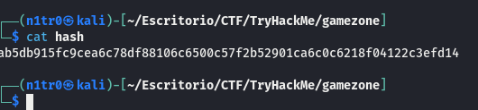


Para ser capaces de crackearla lo primero que tenemos que hacer es verificar el formato de la misma, para esto usaremos el propio Hashcat ya que si no le pasamos ningún modo tratará de autodetectarlo.


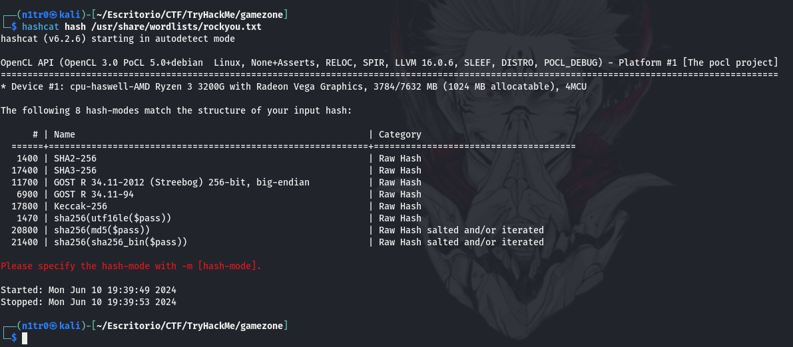


Vemos varios formatos posibles, en este caso concreto usaremos SHA-256 ya que es el más común de la lista que nos entrega. Si viésemos que esto no funciona simplemente iríamos probando con los diferentes formatos posibles.


``` hashcat -m 1400 hash /usr/share/wordlists/rockyou.txt ```


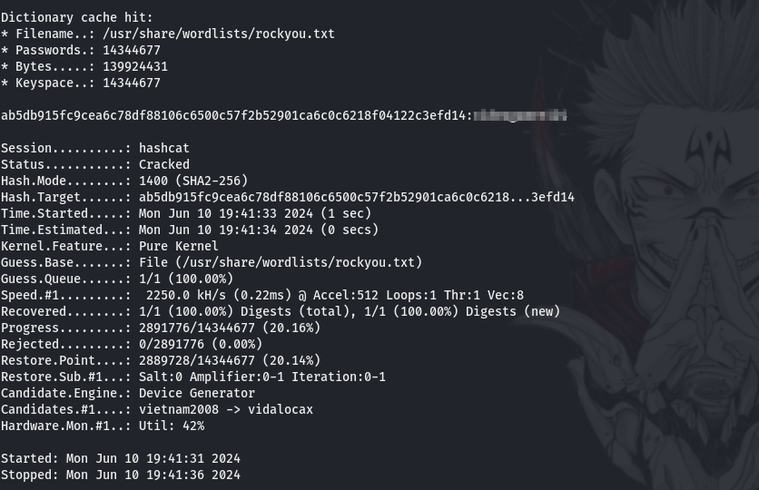


Con nuestra contraseña recién crackeada y nuestro usuario válido podemos iniciar sesión en SSH logrando así nuestro primer acceso.


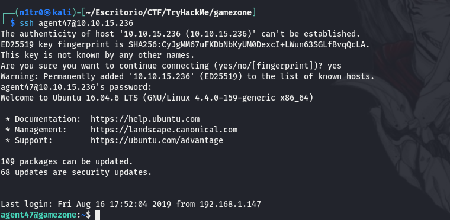


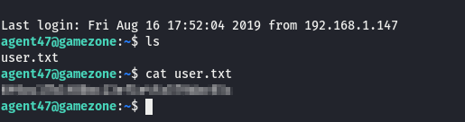


# Post-Explotación


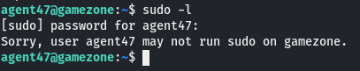


Vemos que este usuario en concreto no puede hacer uso de sudo, enumeraremos la máquina minuciosamente. También podríamos ayudarnos de linpeas pero en este caso no será necesario ya que con ss-tulnp podremos ver que hay algún servicio corriendo en el puerto 10000. Al encontrarse en local no podremos acceder al mismo, en principio, ya que con SSH somos capaces de realizar un port forwarding enviando un puerto a elección a nuestra máquina atacante.


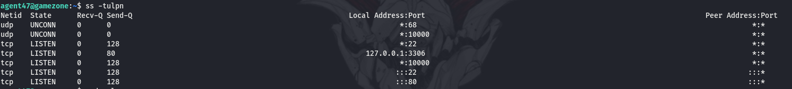


````ssh -L 10000:localhost:10000 agent47@10.10.15.236 ```


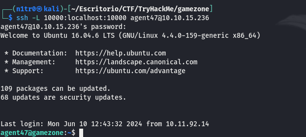


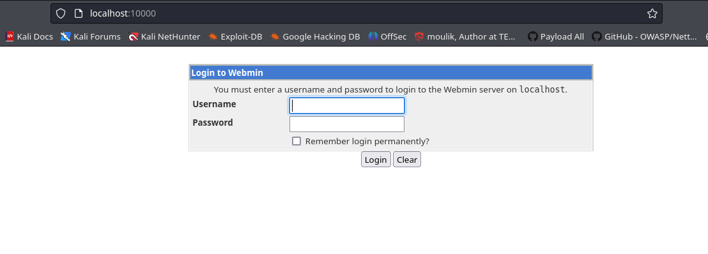


Somos capaces de entrar con las credenciales que ya teníamos.


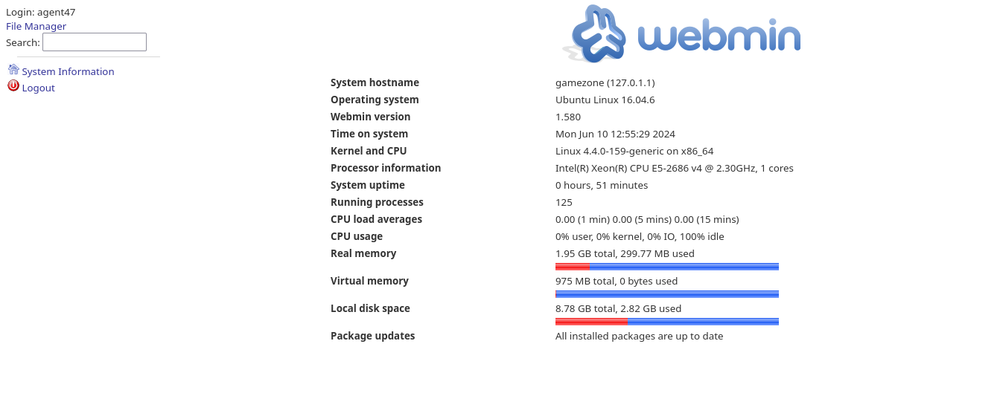


Una vez dentro de este servicio podemos ver claramente la versión del mismo por lo que vamos a investigar un poco más acerca de ello y a buscar posibles vectores de ataque. No tardamos mucho en encontrar que hay disponible un exploit en Metasploit para explotar una vulnerabilidad de ejecución remota de código en este CMS. 


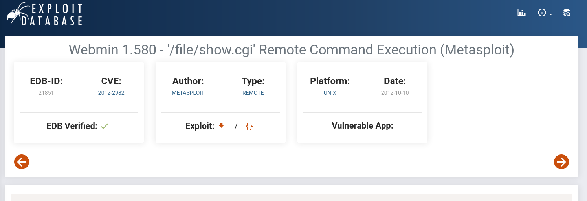


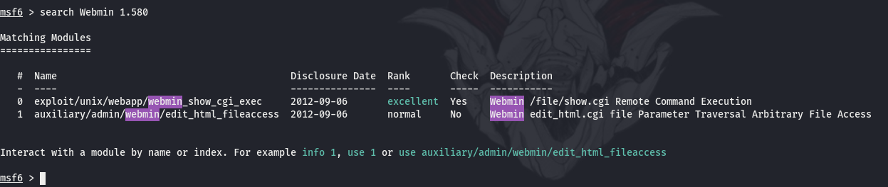


Usaremos este exploit así que vamos allá, un último empujón.


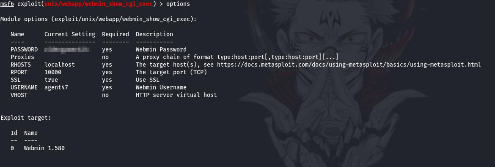


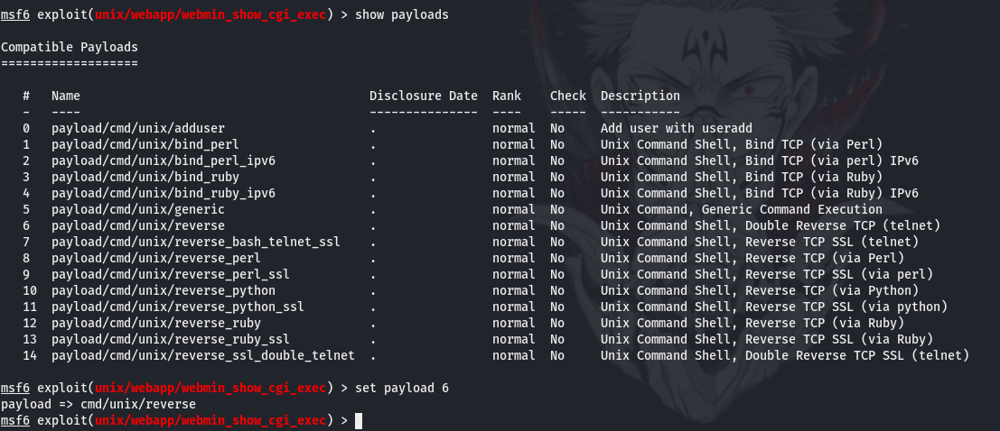


Tenemos que elegir correctamente el payload a utilizar y completar las opciones para poder ejecutar el exploit correctamente.


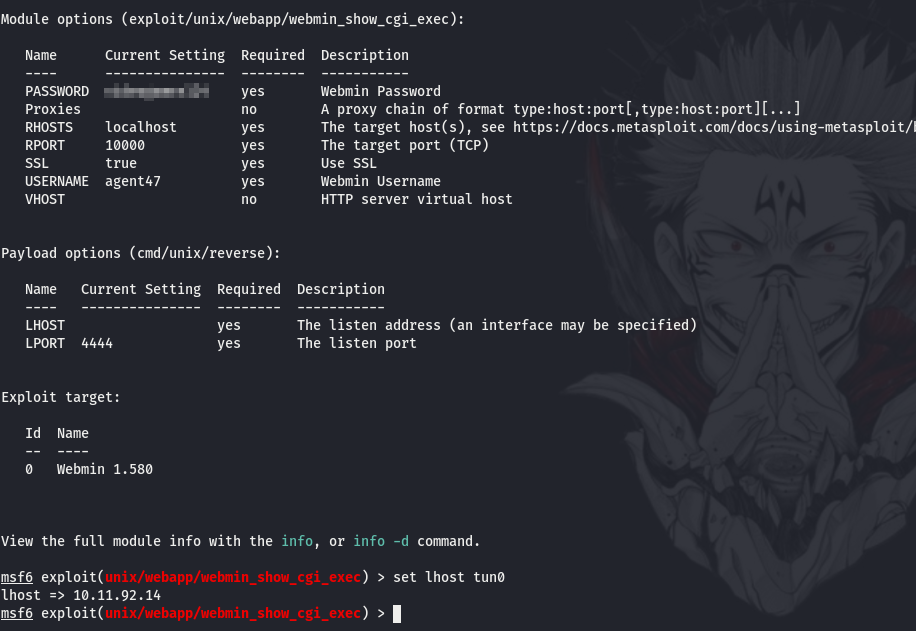


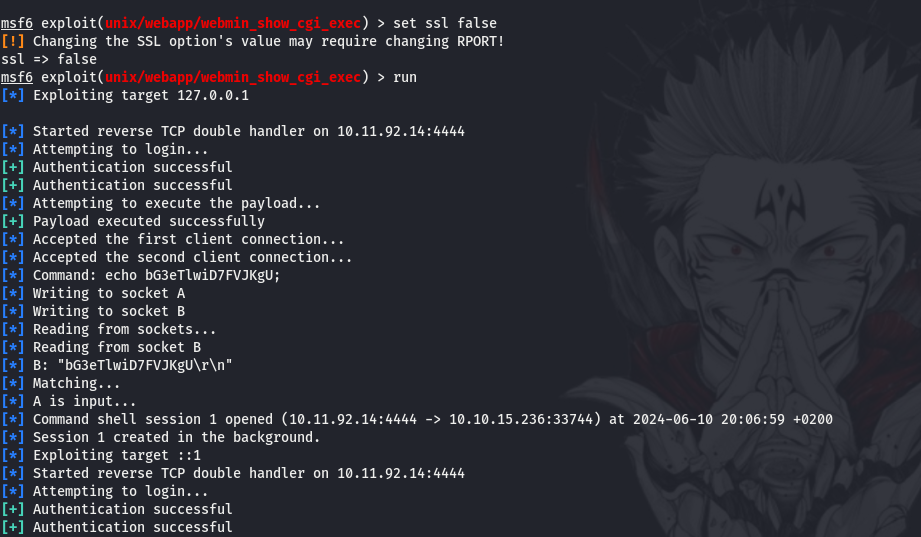


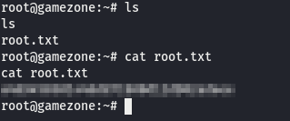


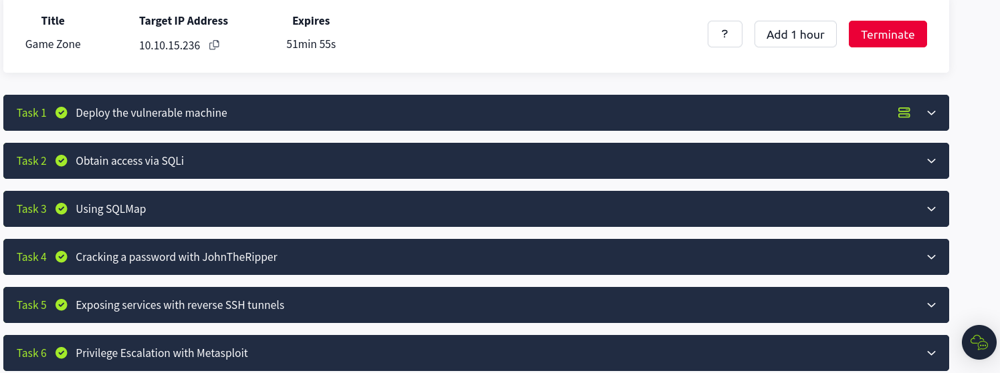


¡Eso es! Somos root y hemos comprometido la máquina por completo, podemos leer la última flag y dar por concluida esta divertida máquina. Espero que os lo hayáis pasado tan bien como yo, nos vemos en la siguiente :)


