Hola de nuevo y gracias por leerme. Hoy seguiremos completando el Path de Offensive Pentesting de TryHackMe con una máquina llamada HackPark así que no vamos a perder el tiempo y nos ponemos manos a la obra, espero que os guste y que todos aprendamos mucho juntos. Recordad que todo lo que veremos en el día de hoy se está utilizando en un entorno de pruebas controlado y que su uso fuera de este ámbito no es ético y podría conllevar problemas penales.

---------------------------------------------------------------------------------------------------------------------------------------------------

Como siempre empezaremos conectando nuestra máquina atacante a la VPN de TryHackMe e iniciando la máquina, lo cual no debería llevarnos más de 2 minutos, una vez hecho esto estamos listos para comenzar nuestra aventura.


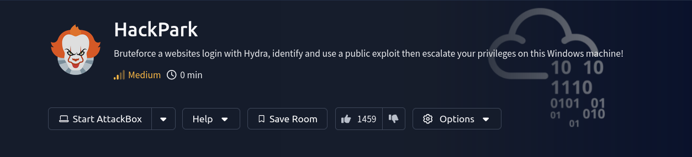


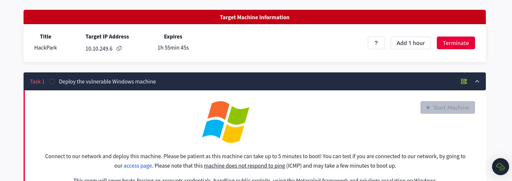


Con nuestra máquina activa y como solemos hacer, empezaremos mandando un ping a la máquina para verificar que se encuentra en correcto funcionamiento. 


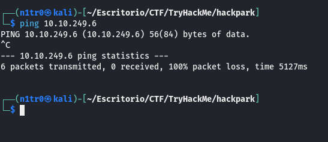


# Enumeración


Al igual que en la máquina Alfred este objetivo no responde a las conexiones por el protocolo ICMP, pero como ya vimos anteriormente tenemos en nmap un parámetro perfecto para estos casos, el parámetro -Pn. 


``` sudo nmap -p- --min-rate 5000 10.10.249.6 -Pn -n -oN escaneo ```


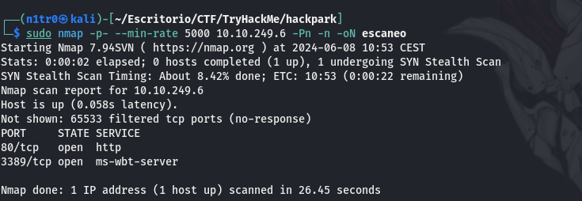


Vemos dos puertos abiertos, el puerto 80 haciendo referencia a un servicio HTTP y el puerto 3389 que está relacionado con RDP lo cual nos indica que esta máquina víctima utiliza el sistema operativo Windows. Pasamos a realizar un escaneo más exhaustivo a estos dos puertos antes de visitar la web.


``` sudo nmap -p 80,3389 -sCV 10.10.249.6 -Pn -n -oN escaneoSC ```


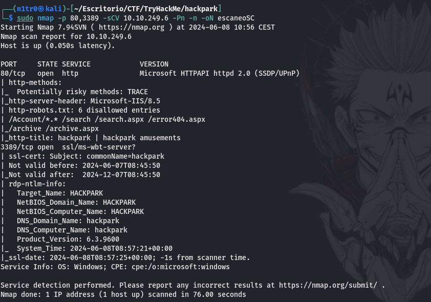


Podemos ver alguna información sobre el nombre de la máquina y alguna versión, pero nada que nos llame demasiado la atención, así que vamos a ir al puerto 80 para ver qué podemos encontrarnos allí. 


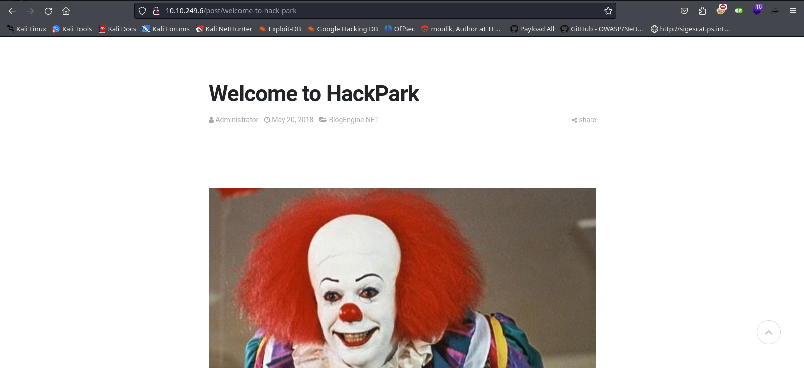


Vemos un blog en el que aparece la imagen de un payaso conocido por la antigua serie de It, basada en los relatos del gran Stephen King. En una de las preguntas que TryHackMe nos hace nos pide el nombre del payaso que aparece en la web. Para conseguirlo simplemente tendremos que hacer una investigación en internet o utilizar la búsqueda inversa de imágenes.


Contestamos correctamente a la pregunta y seguimos enumerando esta web. Utilizaremos cualquier herramienta de fuzz para descubrir directorios ocultos o archivos interesantes.


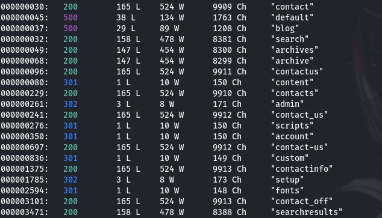


Encontramos el directorio admin, el cual nos da un código de error 300, lo cual significa que hace una redirección. Si vamos a este directorio nos lleva a un panel de login en el que podremos probar credenciales por defecto o ataques de fuerza bruta. Inspeccionemos un poco su funcionamiento.


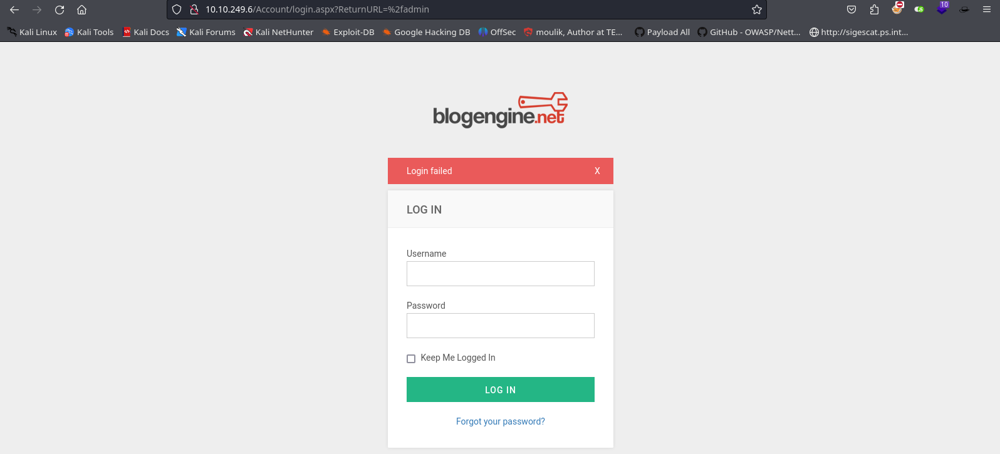


Intentamos manualmente varias combinaciones pero todas nos dan error en el login. Si nos fijamos vemos que debajo del panel de login hay una función de recuperación de contraseña, vamos a echarle un vistazo.


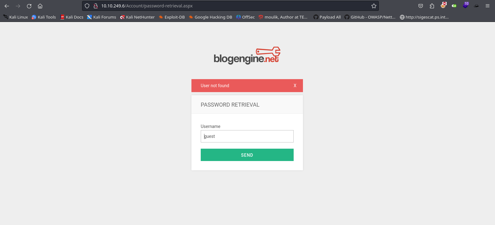


El hecho de que nos indique en texto claro si un usuario existe o no nos da la posibilidad de enumerar usuarios desde aquí, por lo que prepararemos nuestro BurpSuite para interceptar la petición y hacer un pequeño ataque de fuerza bruta para lograr enumerar usuarios válidos.


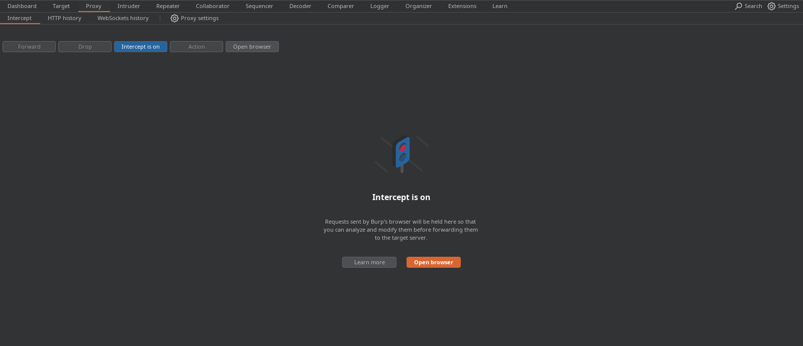


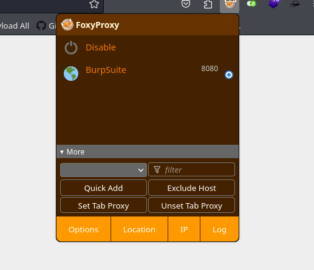


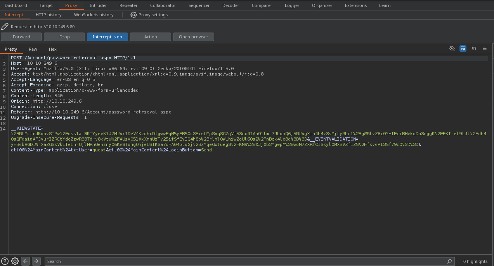


Con la petición interceptada la enviaremos al Intruder de nuestro Burp para realizar un ataque de tipo Sniper. 


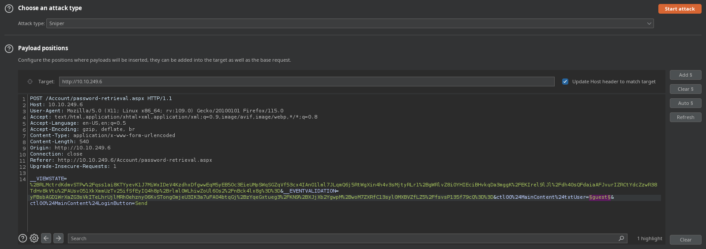


Con esto realizado iremos a la parte de payloads y crearemos un alista simple con usuarios posibles.


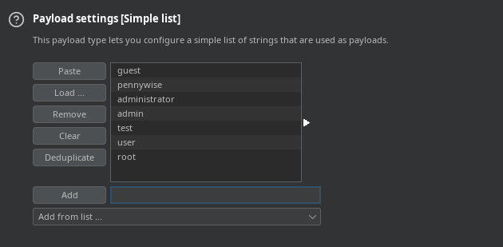


Bien, estamos listos para lanzar el ataque así que vamos allá.


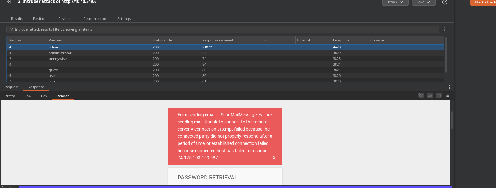


Vemos que con el usuario admin el output cambia gracias a la longitud de la respuesta y nos dice que el servidor ha intentado enviar el email de recuperación de la contraseña aunque no ha sido posible. De cualquier forma esto nos indica que ese usuario en concreto existe dentro de la base de datos, por lo que sabiendo esto podemos realizar otro ataque de fuerza bruta al panel de login en sí tratando de encontrar la contraseña de este usuario, para esto usaremos Hydra ya que es lo que no recomienda TryHackMe en este caso, aunque podríamos seguir usando el intruder de BurpSuite.


Para utilizar Hydra antes interceptaremos la petición POST del panel de login.


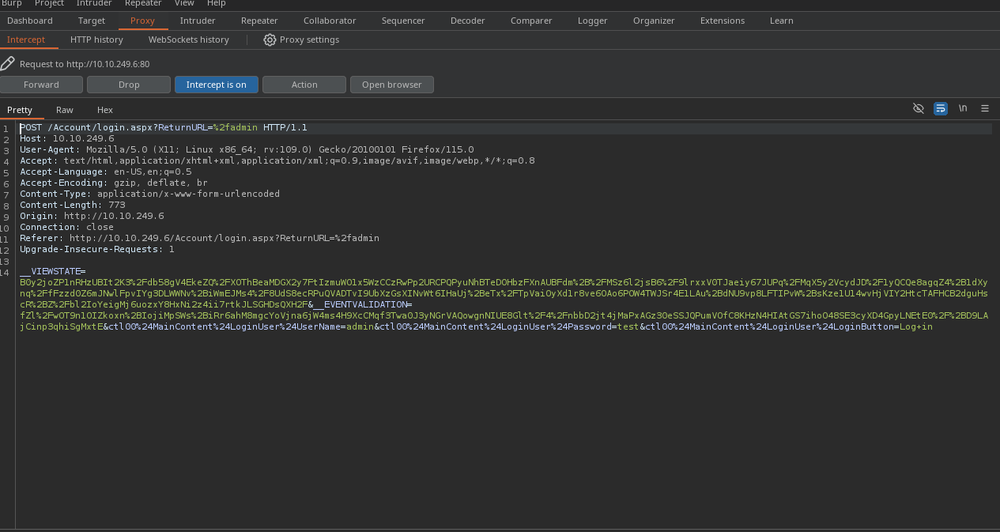


Con esto interceptado podemos ver los datos que envía la petición POST, los cuales necesitaremos para utilizar Hydra.


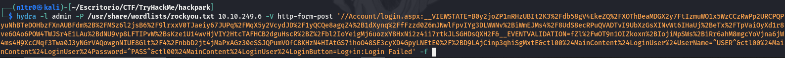


Con nuestro ataque listo simplemente lo lanzaremos y esperaremos hasta que encuentre una coincidencia entre al usuario y la contraseña.


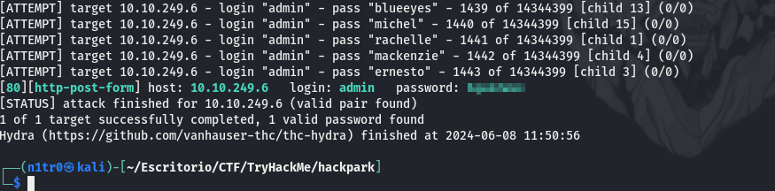


¡Eso es! Tenemos la contraseña del usuario admin y podemos entrar en el panel de admin de este sitio web.


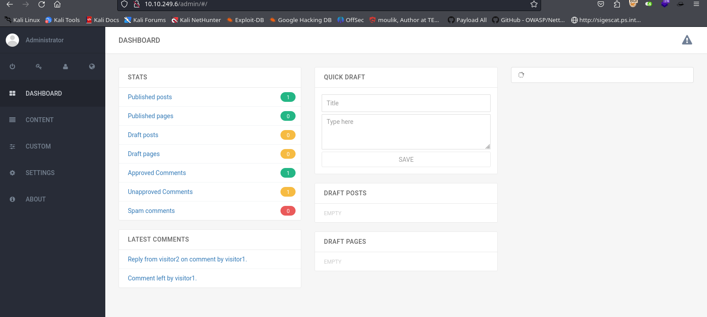


En la pestaña About podemos identificar la versión de este servicio web así que haremos una investigación sobre el mismo. Al buscar nos damos cuenta de que cuenta con una vulnerabilidad de ejecución remota de código CVE-2019-6714.


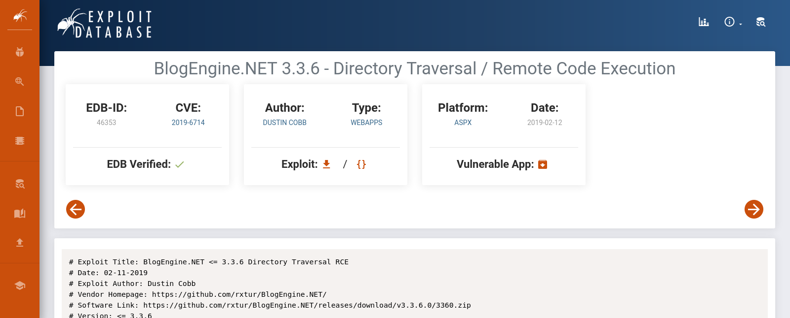


# Explotación


Inspeccionamos el código de ExploitDB e intentamos comprender la vulnerabilidad, una vez hecho nos ponemos manos a la obra. Creamos un archivo que se tiene que llamar PostView.ascx en el que introduciremos el código del exploit cambiando algunas cosas para adaptarlo a nuestro caso concreto como son la IP y el puerto. 


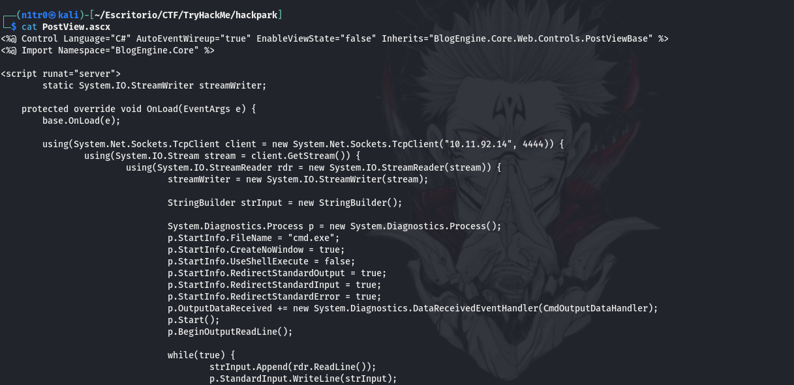


Una vez hecho esto iremos hasta la ruta /admin/app/editor/editpost.cshtml de nuestro panel de admin, lugar en el que se encuentra esta vulnerabilidad. 


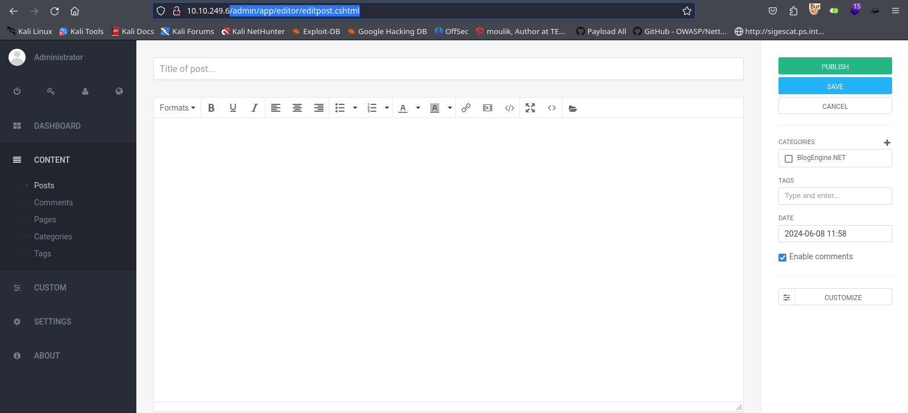


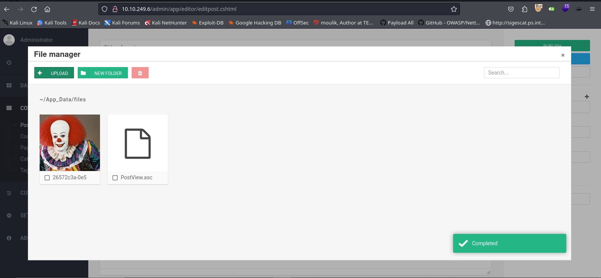


Seguimos los pasos y subimos correctamente nuestro archivo malicioso. Una vez subido correctamente nos ponemos a la escucha en nuestra máquina atacante y vamos hacia la ruta /?theme=../../App_Data/files, esto hará que el código se active y nosotros recibamos la shell reversa que nos permitirá el primer acceso a esta máquina.


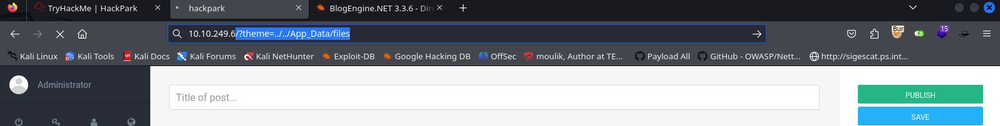


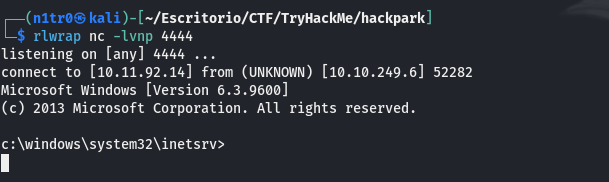


¡Estamos dentro!


# Post-Explotación


Una vez dentro vemos que la shell recibida no es demasiado estable, por lo que vamos a mejorar esta shell consiguiendo una sesión de meterpreter.


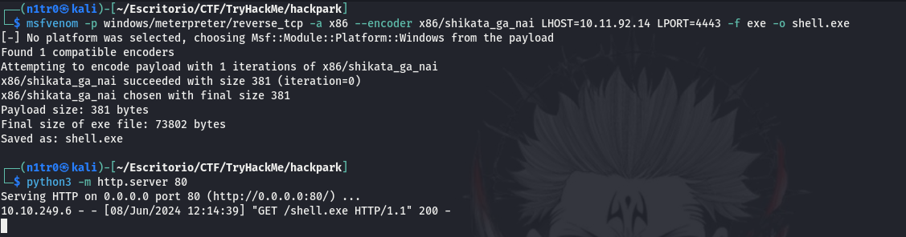


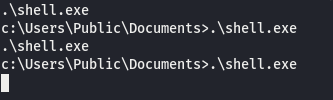


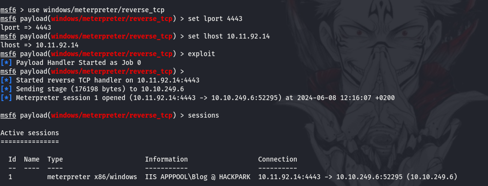


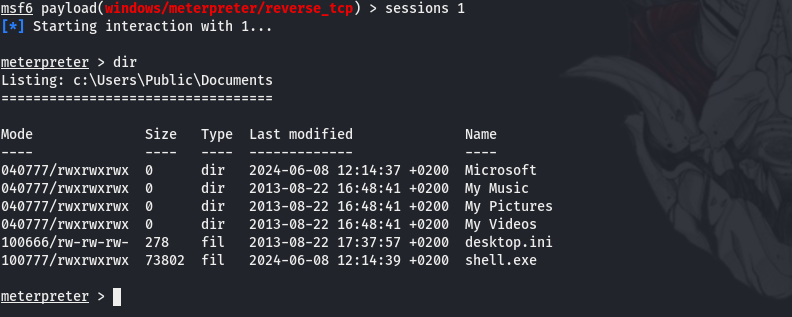


Una vez hecho esto vamos a buscar la manera de elevar nuestros privilegios. Para esto usaremos la herramienta WinPEAS y veremos de una forma sencilla vías potenciales de elevación de privilegios. 


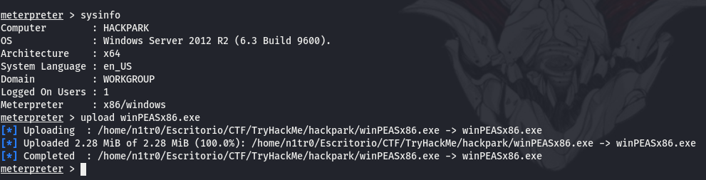


Una vez subido sólo tendremos que ejecutar el programa para que realice un escaneo en toda la máquina.


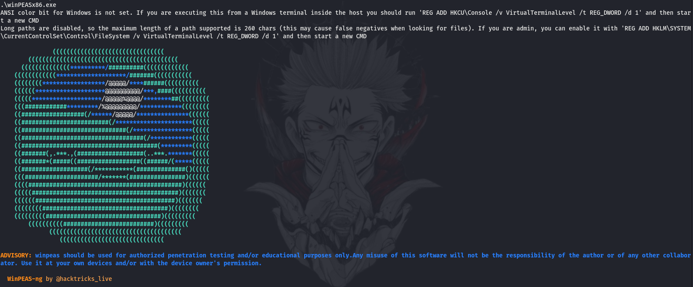


Vemos que TryHackMe nos pregunta cuál es el servicio anormal en esta máquina, por lo que enumeraremos con winPEAS los servicios en busca de alguno de ellos vulnerable.


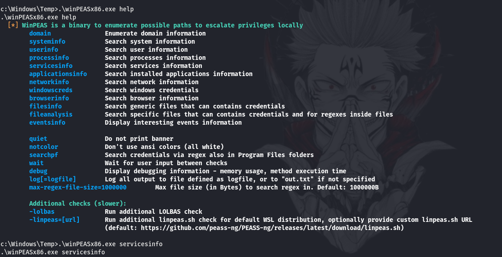


Vemos uno que nos llama la atención especialmente.


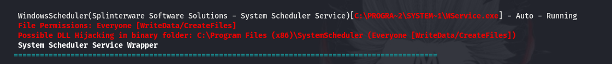


Vamos a la ubicación de este servicio para verlo más en profundidad.


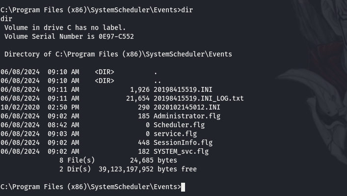


Leeremos los logs para hacernos una mejor idea del funcionamiento del mismo.


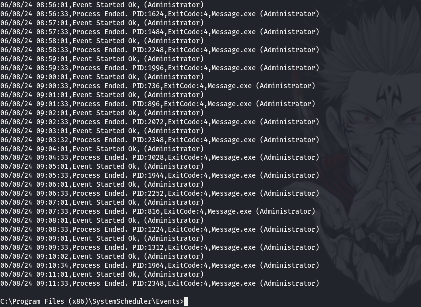


Esto nos ayuda a contestar la siguiente pregunta que nos hace TryHackMe, además de hacer que nos demos cuenta de que este binario en concreto se ejecuta cada 30 segundos por el Administrador de la máquina. Esto nos indica que podría ser para nosotros una vía potencial para elevar nuestros privilegios, por lo que buscaremos más información sobre este servicio.


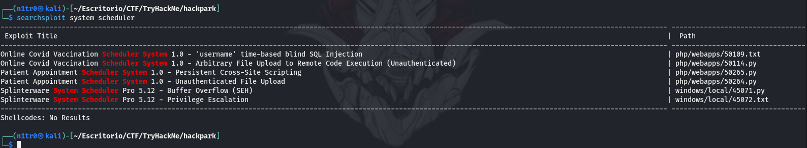


Parece que hay un exploit público para la escalada de privilegios. 


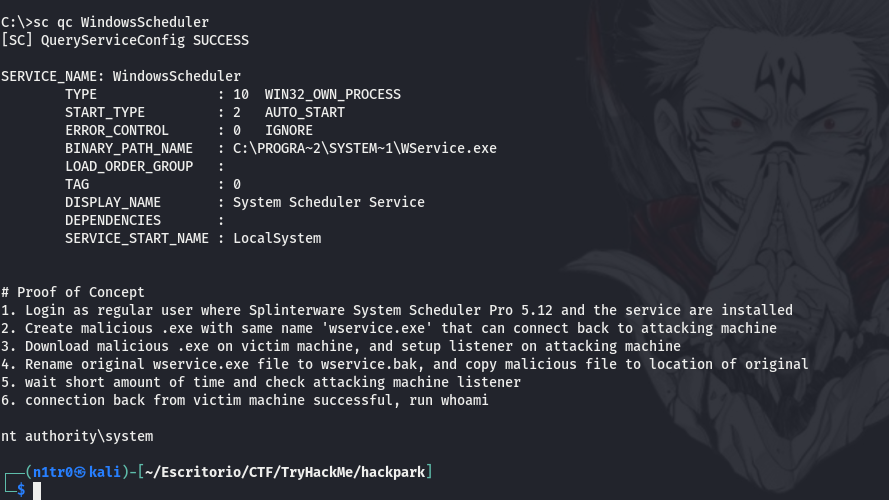


Seguimos los pasos que nos indica la vulnerabilidad, creamos la reverse shell con msfvenom, la subimos a la máquina víctima sustituyéndola por el binario que vimos anteriormente, nos ponemos en escucha y al cabo del tiempo recibiremos una shell con privilegios de administrador. Hemos comprometido la máquina por completo y podemos leer las dos flags.


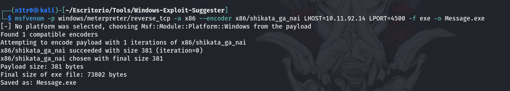


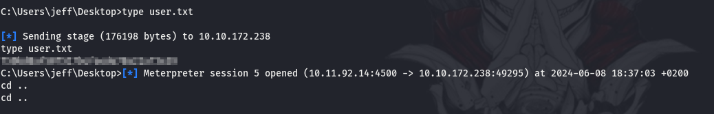


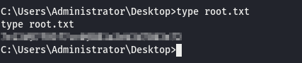


¡Máquina completada con éxito! Espero que os haya gustado y nos vemos en la siguiente :)


