Hola de nuevo y gracias por leerme. Hoy seguiremos completando el Path de Offensive Pentesting de TryHackMe con una máquina llamada Internal así que no vamos a perder el tiempo y nos ponemos manos a la obra, espero que os guste y que todos aprendamos mucho juntos. Recordad que todo lo que veremos en el día de hoy se está utilizando en un entorno de pruebas controlado y que su uso fuera de este ámbito no es ético y podría conllevar problemas penales.

---------------------------------------------------------------------------------------------------------------------------------------------------

Como siempre empezaremos conectando nuestra máquina atacante a la VPN de TryHackMe e iniciando la máquina, lo cual no debería llevarnos más de 2 minutos, una vez hecho esto estamos listos para comenzar nuestra aventura. En este caso simularemos un ejercicio real de pentesting de Caja Negra en el que no tendremos información previa sobre el sistema.


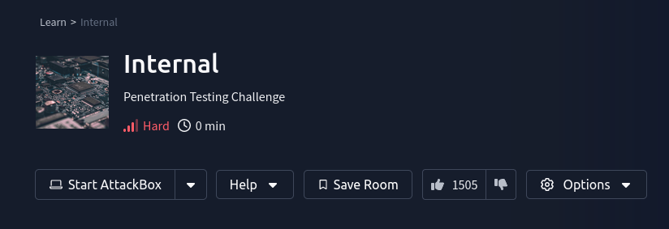

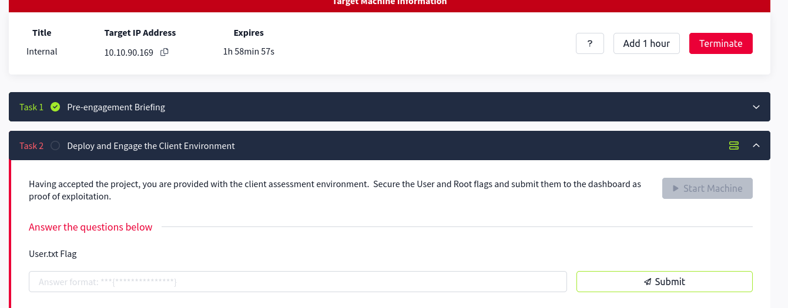

Con la máquina en funcionamiento podemos comenzar con el reto, aunque antes lanzaremos unas trazas ICMP con ping para asegurarnos de que la máquina está activa.


La máquina funciona perfectamente, podemos iniciar nuestra enumeración.

# Enumeración

Como siempre hacemos, comenzaremos escaneando nuestro objetivo para ver qué puertos hay abiertos, guardaremos el output en un archivo para tenerlo a mano si nos hace falta en algún momento.

``` sudo nmap -p- --min-rate 5000 10.10.90.169 -Pn -n -oN escaneo ```

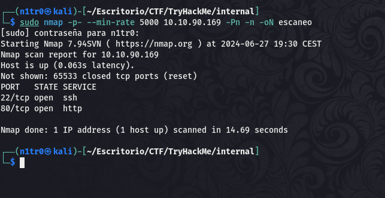

Vemos abiertos dos puertos, el 22 y el 80 que hacen referencia a un servicio SSH y uno HTTP como ya deberíamos saber. Antes de pasar a ver el contenido del servidor web lanzaremos un escaneo más exhaustivo a los puertos abiertos.

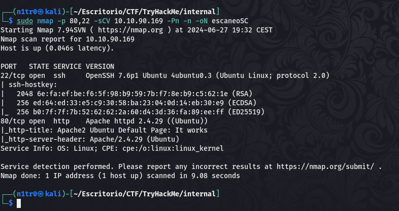

Parece que de este output lo máximo que podemos sacar en claro es que en el puerto 80 nos encontraremos una página por defecto de Apache, vamos a verificarlo.

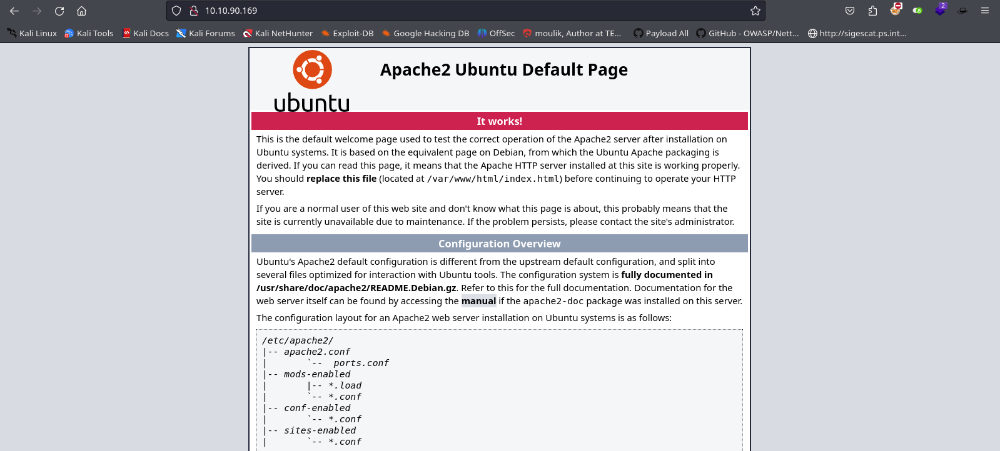

Efectivamente, vemos una página por defecto, vamos a fuzzear esta web para tratar de buscar directorios o archivos que sean de nuestro interés.

``` wfuzz -u http://10.10.90.169/FUZZ -w /usr/share/seclists/Discovery/Web-Content/directory-list-lowercase-2.3-medium.txt --hc 404 -c ```

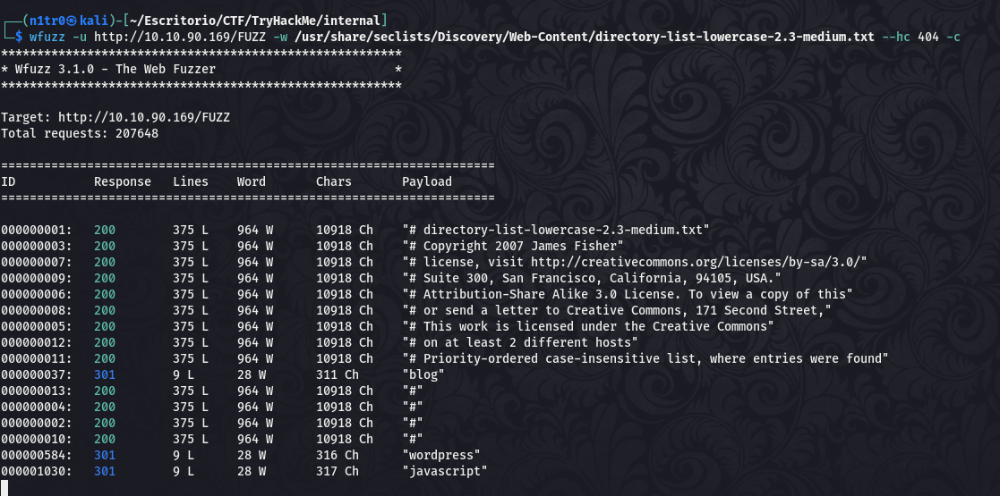

Nuestro escaneo aún no ha terminado pero ya podemos ver un directorio bastante interesante llamado Wordpress, vamos a acceder a él. Con esto ya sabemos que la web está utilizando este CMS en concreto, el cual suele tener vulnerabilidades debido a la introducción de plugins que en ocasiones no son lo seguros que deberían.

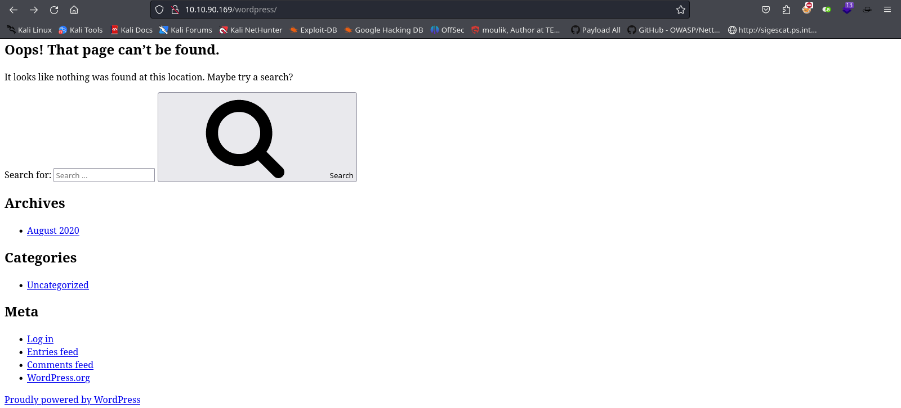

Vemos una página de login, vamos a tratar de acceder a ella.

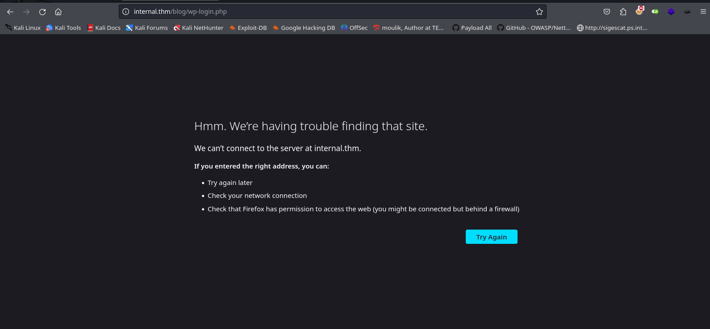

Vemos que no podemos acceder porque se está usando un vhost que resuelve la IP de la máquina víctima. Para acceder sólo tendremos que editar nuestro archivo /etc/hosts.

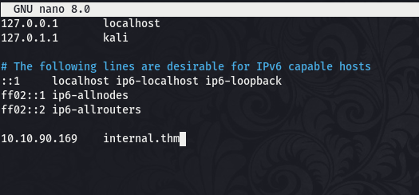

Guardamos nuestro archivo y ya deberíamos poder acceder sin problemas.

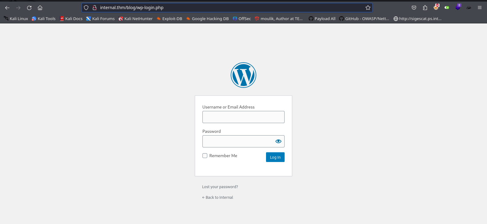

¡Eso es! Pudiendo acceder confirmamos del todo que nos encontramos ante un Wordpress, tenemos una herramienta disponible en Kali que nos va a venir muy bien y se llama WPscan. Vamos a usarlo para analizar esta web.

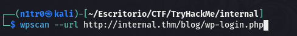

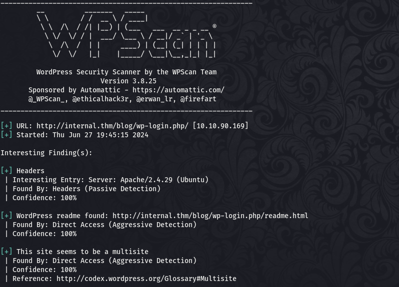

Usaremos el parámetro -e u para enumerar los usuarios.

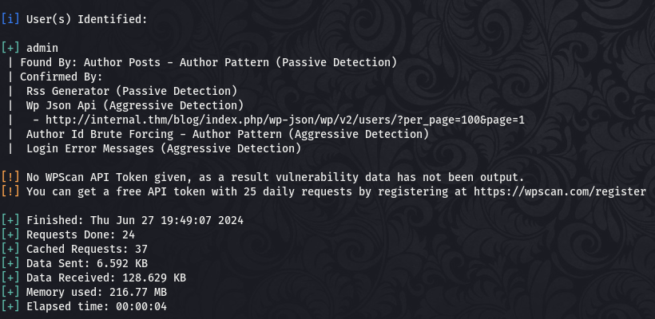

Genial, identificamos el usuario admin, y tenemos un panel de login, ya sabemos lo que toca, vamos a realizar un ataque de fuerza bruta para conseguir las credenciales del usuario y poder iniciar sesión. Como en otras ocasiones usaré hydra por preferencia personal pero se podría hacer de varias maneras, incluso con el propio WPscan.

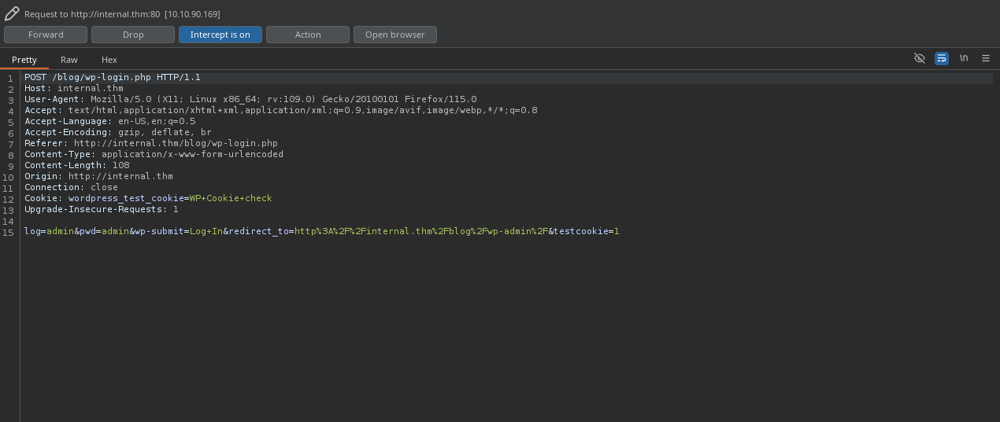

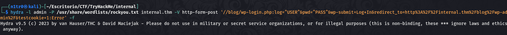

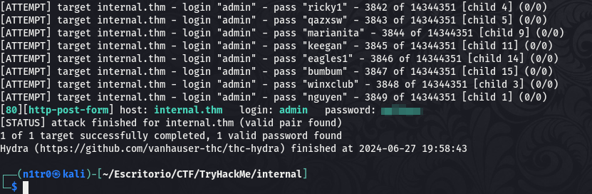

Tenemos el primer par de credenciales, vamos a iniciar sesión en Wordpress con el usuario admin.


Somos un usuario privilegiado y podemos editar las plantillas del sitio web para enviar una shell a nuestra máquina atacante, ¡vamos a hacerlo!

# Explotación

Una vez hemos conseguido acceder al panel de control como un usuario administrador somos capaces de editar todo a nuestra voluntad. Usaremos esta capacidad para editar una plantilla e introducir una reverse shell que recibiremos en nuestra máquina atacante.

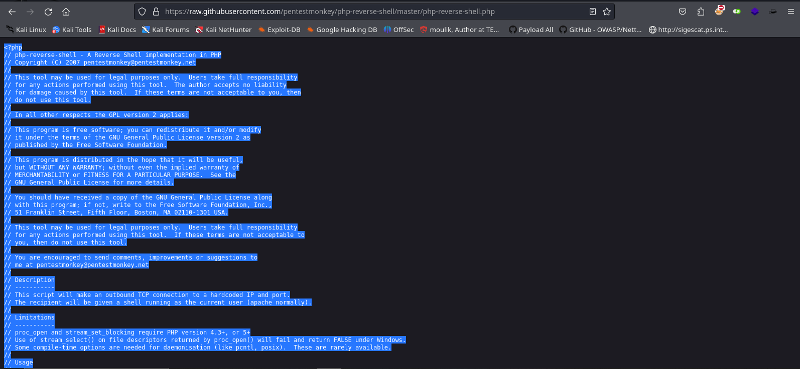

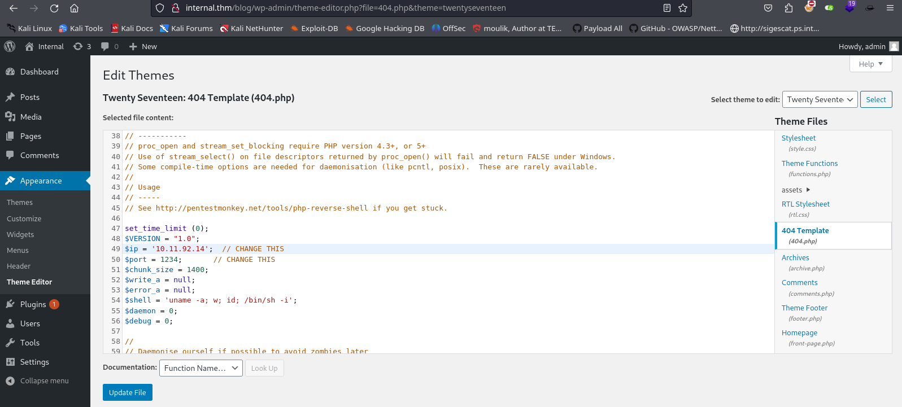

Editaremos la página de error 404 para introducir la shell, cambiaremos los parámetros requeridos para su funcionamiento y nos pondremos en escucha en el puerto que le hayamos indicado. Una vez hecho esto sólo tendremos que acceder a la página 404.php (Not Found) para activar la shell y recibir nuestro acceso al sistema.

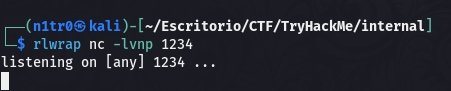

``` http://internal.thm/blog/wp-content/themes/twentyseventeen/404.php ```


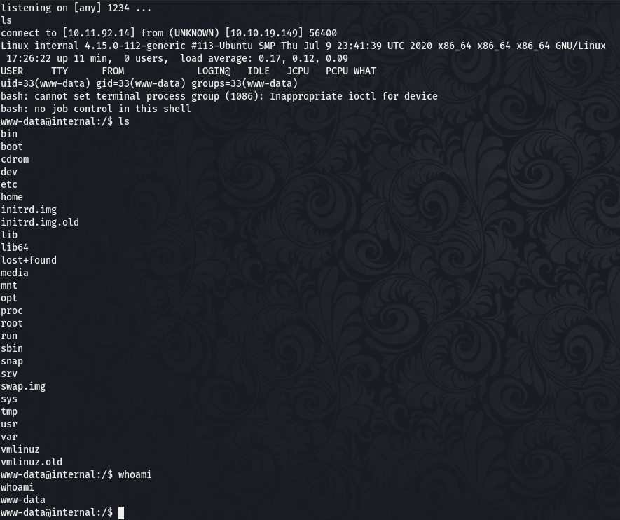

Tenemos nuestro acceso al sistema, podemos seguir. Realizamos un tratamiento de la tty como siempre que conseguimos nuestro primer acceso y tenemos una shell interactiva y más estable, una vez hecho buscaremos la manera de elevar nuestros privilegios.

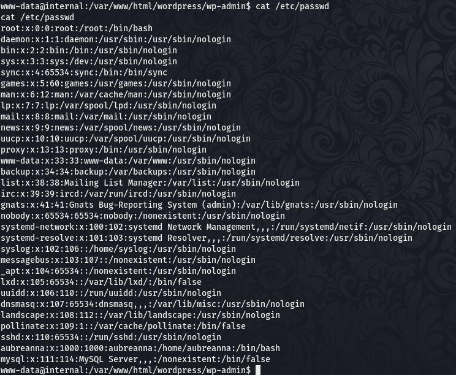

Si leemos el archivo /etc/passwd vemos que hay disponible un usuario al que podríamos movernos con credenciales válidas. Para tratar de encontrar la contraseña del usuario usaremos el comando grep para tratar de filtrar en todo el sistema las coincidencias que haya con el nombre de dicho usuario.

``` grep --color=auto -rnw '/' -ie "aubreanna" --color=always 2> /dev/null ```

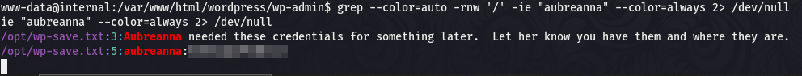

Parece que ha sido rápido, tenemos la contraseña del usuario, vamos a iniciar sesión en el servicio SSH que encontramos abierto en el escaneo de puertos.

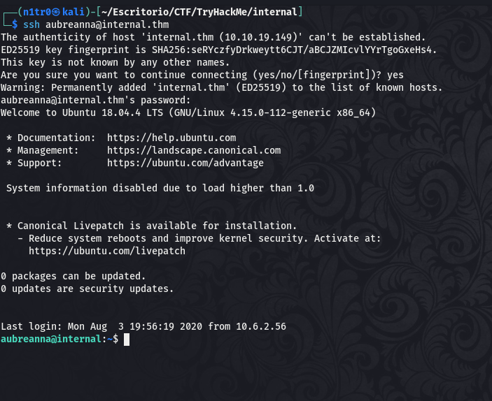

Genial, con este usuario tenemos más privilegios y una shell totalmente estable mediante SSH, vamos a investigar el sistema no sin antes hacernos con la primera flag del reto.

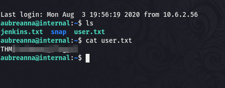

# Post-Explotación

Recogemos la flag y vemos que dentro del directorio personal del usuario encontramos un archivo llamado jenkins.txt, vamos a ver qué contiene en su interior.

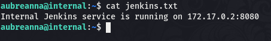

El archivo indica que hay una instancia de Jenkins en el puerto 8080 de una IP, vamos a verificar si es la nuestra.

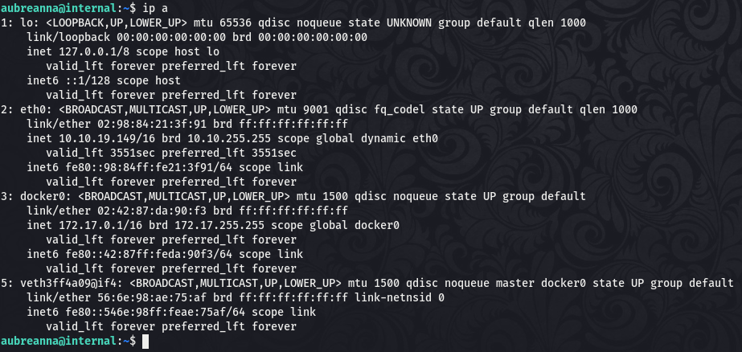

Nuestra IP no es la que estamos buscando pero si nos fijamos en el output vemos que una de las interfaces de red corresponde al rango que se indica en el archivo y tiene como nombre docker0. Sabiendo esto podemos dar por hecho que la instancia de Jenkins está funcionando en un contenedor. Podemos explotar esto realizando una tunelización por SSH para recibir en nuestra máquina local el puerto que deseamos.

``` ssh -L 9000:172.17.0.2:8080 aubreanna@internal.thm ```

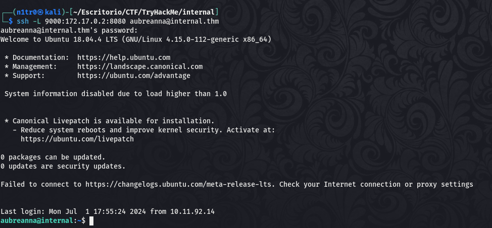

Con este comando estaremos enviando el puerto 8080 de la máquina indicada al puerto 9000 de nuestra máquina local, pudiendo acceder a este desde nuestro propio navegador. Para acceder sólo tendremos que usar como URL ``` localhost:9000 ```.

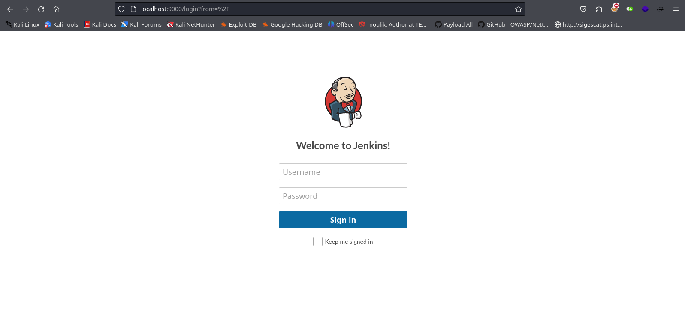

Nos encontramos con un panel de login pero no tenemos credenciales válidas. Sabemos que el usuario por defecto es admin gracias a una pequeña investigación, así que podríamos tratar de relizar de nuevo un ataque de fuerza bruta para obtener un inicio de sesión exitoso. Repetiremos la misma operación que realizamos previamente.

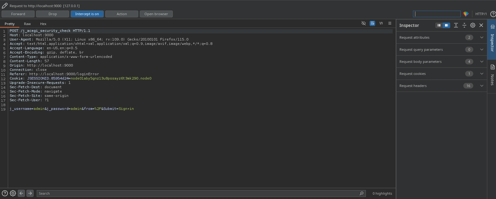

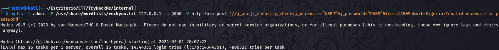

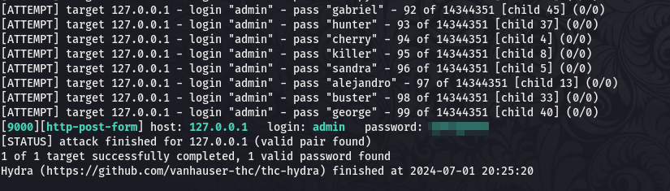

¡Eso es! Tenemos un par de credenciales válido y podemos usarlo para iniciar sesión en Jenkins.

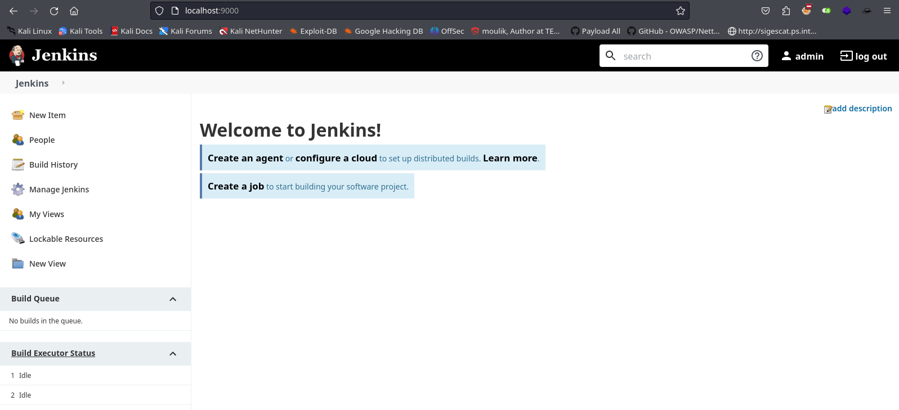

Estamos dentro del panel de control del administrador de Jenkins y haciendo memoria en la máquina Alfred ya fuimos capaces de explotar una instancia de Jenkins para recibir una shell, hagámoslo de nuevo, aunque algo diferente en esta ocasión. Mencioné en aquella máquina que si accedemos a un Jenkins hay que ver si podemos listar el directorio /script.

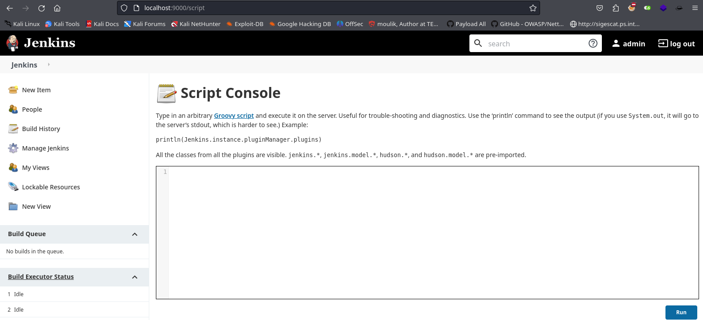

Aquí lo tenemos, este campo de entrada de scripts es vulnerable a la ejecución remota de código generalmente, así que vamos a tratar de explotarlo para enviar una shell a nuestra máquina atacante. Podéis ver referencias [aquí](https://cloud.hacktricks.xyz/pentesting-ci-cd/jenkins-security/jenkins-rce-with-groovy-script).

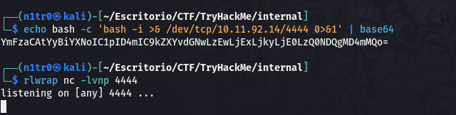

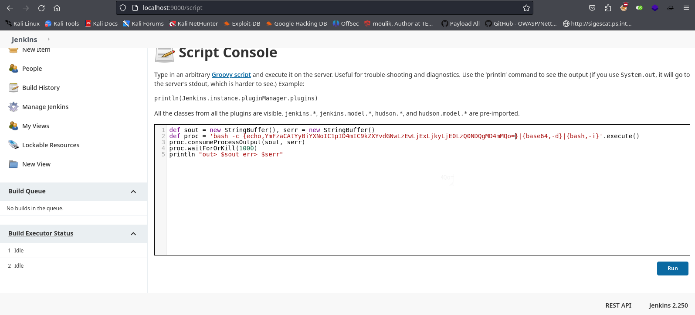

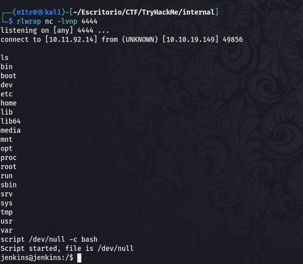

Realizamos de nuevo un tratamiento para obtener una shell más estable.

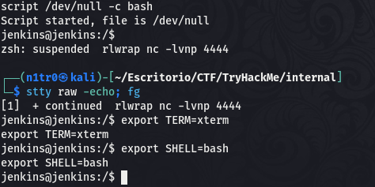

Y avanzamos un pasito más, estamos cerca de terminar, un último empujón. Si recordamos los pasos anteriores nos daremos cuenta de que el archivo con las credenciales del usuario aubreanna se encontraba en el directorio /opt, vayamos allí para ver si podemos encontrar algo de utilidad.

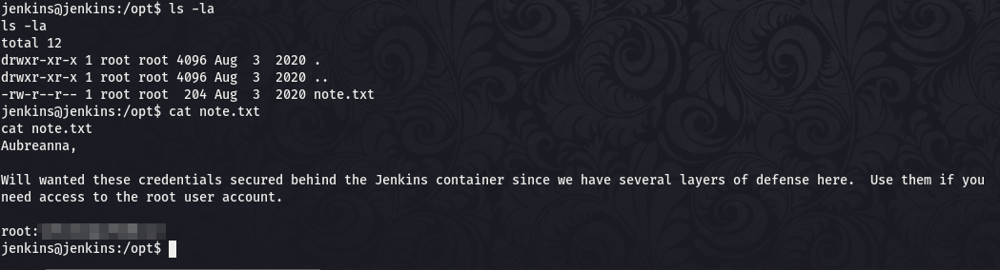

Nuestra intuición no fallaba, tenemos la contraseña del usuario root en texto plano y podemos usarla para autenticarnos para obtener control completo sobre el sistema.

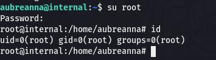

Tened en cuenta que esta contraseña no funcionará en el contenedor en el que encontramos la instancia de Jenkins, sino que es válida en el host principal. 

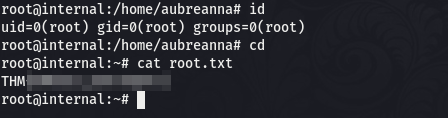

Siendo root hemos comprometido la máquina por completo dando por concluida esta máquina, espero que os haya gustado tanto como a mí y nos vemos en la siguiente :) #keepgoing


