Hola a todos y bienvenidos de nuevo. Hoy resolveremos juntos la siguiente máquina OverPass2 del path Offensive Pentesting de TryHackMe, la cual es algo diferente a lo que estamos acostumbrados. No perdamos el tiempo y empecemos con ella. Recordad que todo lo que veremos se está utilizando en un entorno de pruebas controlado y que su uso fuera de este ámbito no es ético y podría conllevar problemas penales.

---------------------------------------------------------------------------------------------------------------------------------------------------

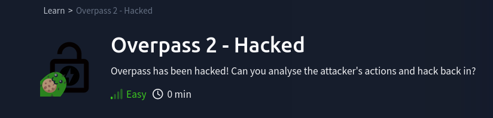

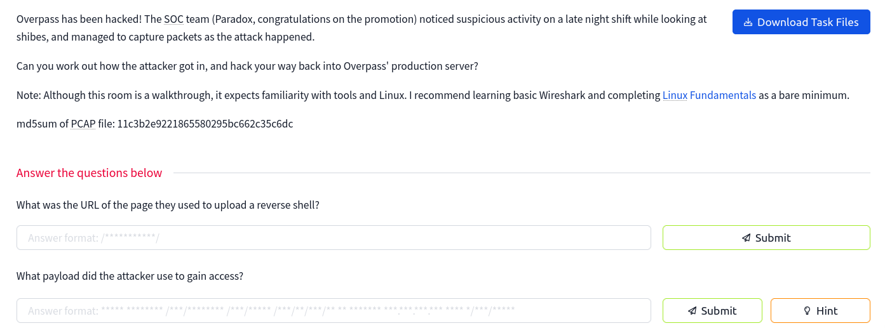

Como podemos ver, este caso es algo diferente a lo que estamos acostumbrados ya que se nos otorga un archivo que tenemos que descargar y tenemos que contestar a varias preguntas mientras realizamos un análisis forense. Lo primero que haremos será descargar el archivo que nos entregan.

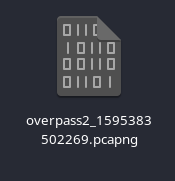

Una vez descargado vemos la extensión que nos indica que es un archivo que tendremos que abrir usando WireShark, una herramienta muy conocida que sirve para monitorizar redes y conexiones. 

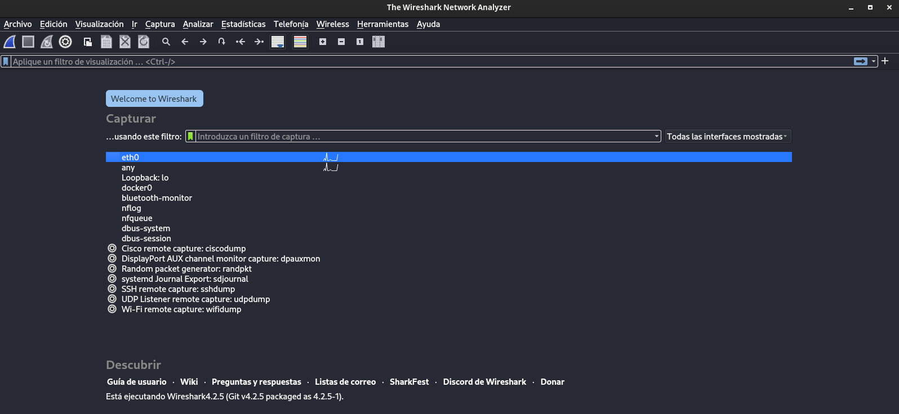

Con nuestra herramienta inicializada podemos abrir el archivo, veamos qué contiene.

# Análisis Forense

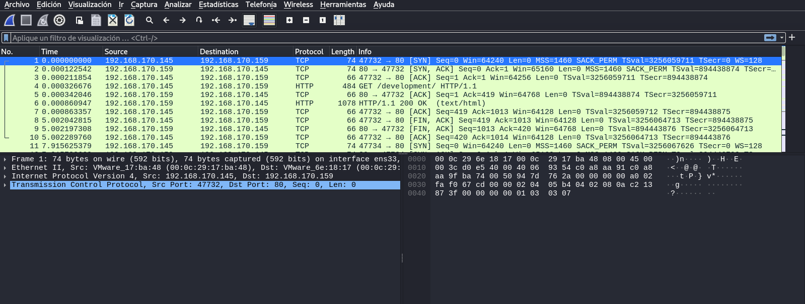

Podemos ver una captura del tráfico de red durante un evento puntual.

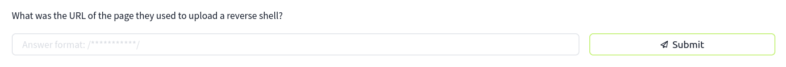

Si nos fijamos en la primera pregunta se nos incita a filtrar por las conexiones HTTP ya que estamos buscando una URL en la que los atacantes pudieron subir una reverse shell para conseguir persistencia en los sistemas.

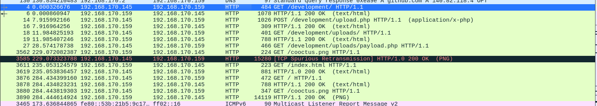

Con todas las peticiones HTTP agrupadas podemos comenzar a investigar para conseguir dar con la URL que los atacantes pudieron usar. Si nos fijamos bien vemos que tan sólo hay una petición POST, un método que podría usarse perfectamente para subir un archivo al servidor, algo que nos queda más claro cuando vemos que la ruta objetivo de esta petición es /development/upload.php y el archivo que se subió se llama payload.php, parece que esta investigación va por buen camino.

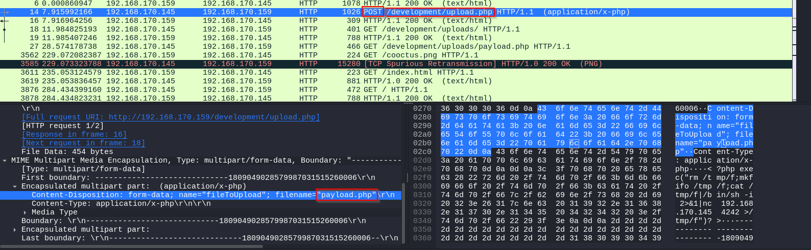

Una de las preguntas nos pide la cadena completa que se usó para que la reverse shell funcionara correctamente, esto es algo que podemos ver fácilmente en los datos de esta petición.

Si copiamos estos datos como texto plano en un archivo nos será más cómodo.

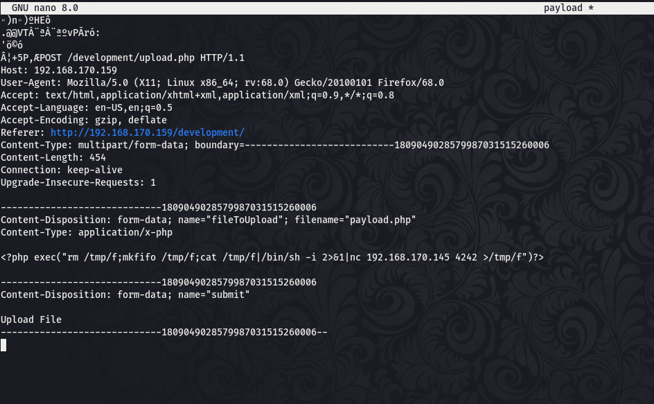

La siguiente pregunta nos pide que introduzcamos la contraseña que el atacante usó para elevar sus privilegios. Para dar con ella seguiremos los pasos que el delincuente siguió tras haber subido correctamente su reverse shell.

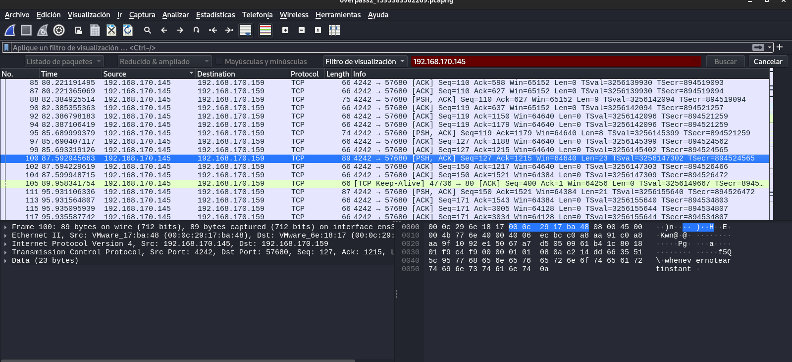

Siguiendo su rastro y su dirección IP conseguimos dar con los movimientos que el atacante realizó estando dentro de la máquina.

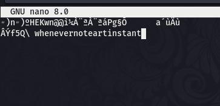

¡Genial! Conseguimos dar con la contraseña que usó el atacante para elevar sus privilegios ya que después de este movimiento utilizó el comando sudo con éxito para leer el archivo /etc/shadow que contiene todas las contraseñas hasheadas de los usuarios de la máquina.

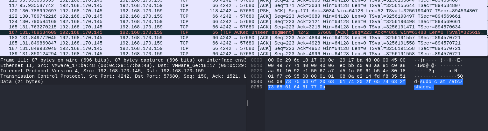

Ahora tenemos que dar con la cadena que le otorgó persistencia al atacante, sigamos recorriendo sus pasos para ver cómo pudo conseguirlo.

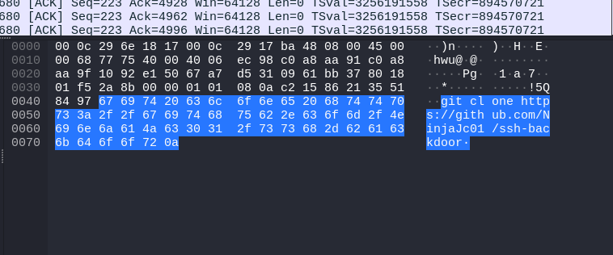

Vemos que el atacante usó el comando git clone para descargar un backdor que funcionaba mediante SSH en la máquina, lo que posiblemente otorgase a éste la persistencia que estaba buscando. 

Para la siguiente pregunta se nos pide que digamos el número exacto de hashes que se pueden crackear con una wordlist concreta. Para relizar esto podemos volver unos pasos atrás al momento en el que el atacante leyó el archivo /etc/shadow y seguir esa misma stream para obtener los hashes de los usuarios.

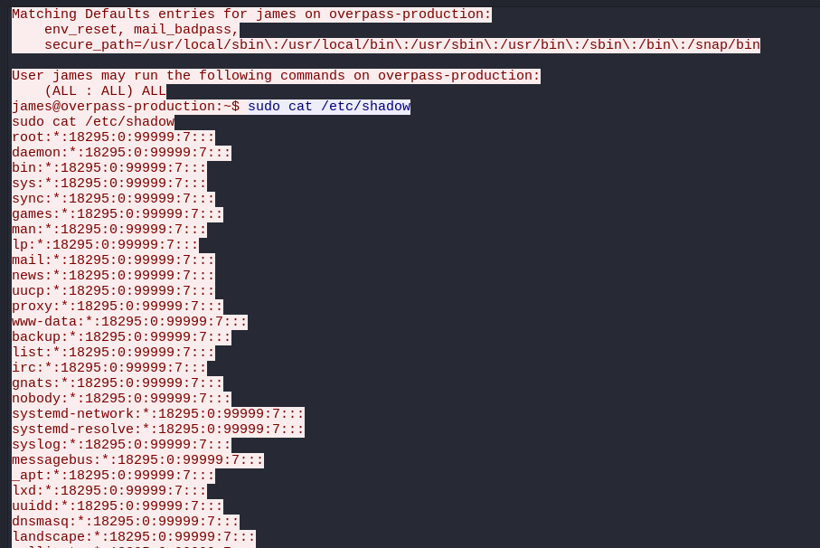

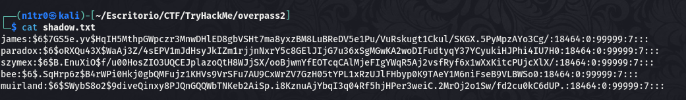

Con los hashes obtenidos correctamente vamos a tratar de crackearlos con la wordlist que nos indica TryHackMe en la pregunta. Si no estamos seguros del tipo de hash podemos usar la herramienta hashid o usar hashcat sin proporcionarle ningún tipo para que intente autodetectar el formato.

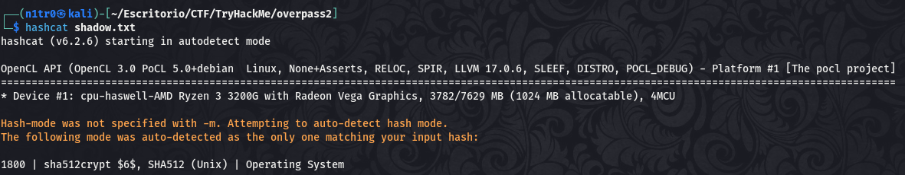

Vamos a tratar de crackear los hashes.

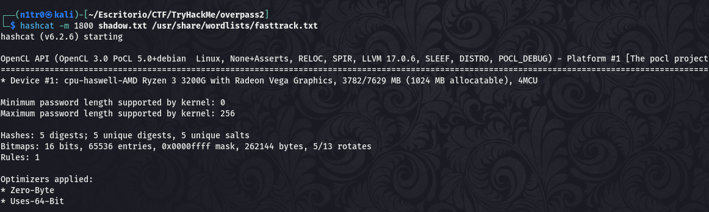

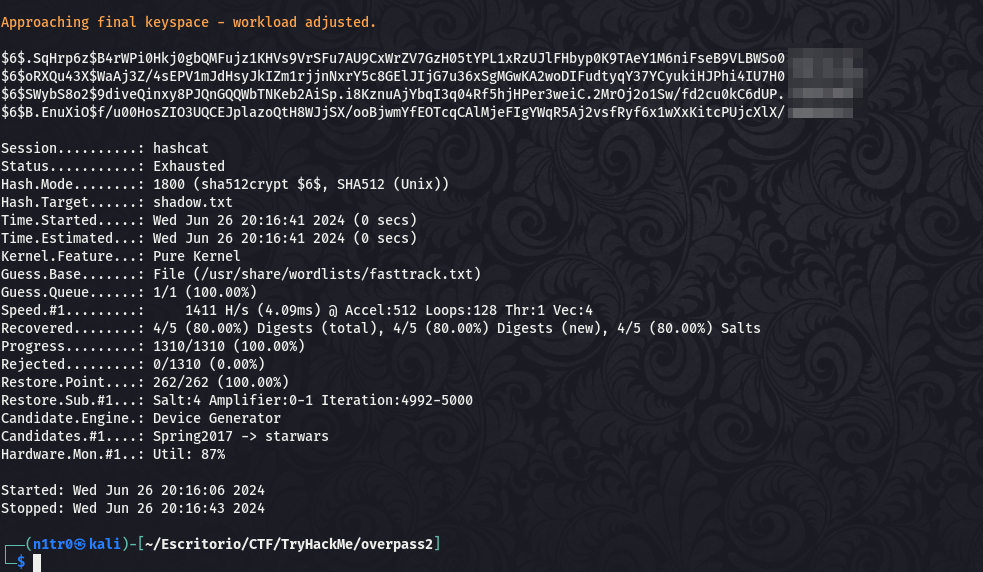

¡Vaya! Conseguimos crackear 4 de 5 hashes, no está nada mal. Lo malo que encontramos aquí es que el atacante pudo hacer exactamente lo mismo y tendría una persistencia asegurada en el sistema, lo cual es algo bastante crítico.

Con este análisis completado podemos pasar a la siguiente tarea del reto, en la que tendremos que hacer un análisis del código del backdoor.

# Análisis de Código

Para comenzar este análisis lo que tendremos que hacer es descargar el archivo que el atacante descargó en el sistema afectado, pero esta vez lo descargaremos en nuestra máquina local para poder observarlo detenidamente. Para esto usaremos exactamente el mismo comando que usó el atacante.

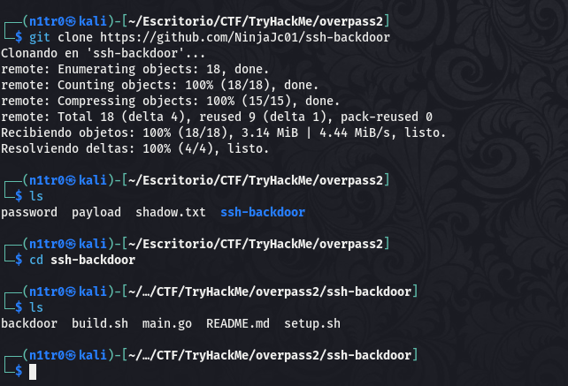

Vamos a analizar esta carpeta y vamos a tratar de localizar el hash por defecto que utiliza.

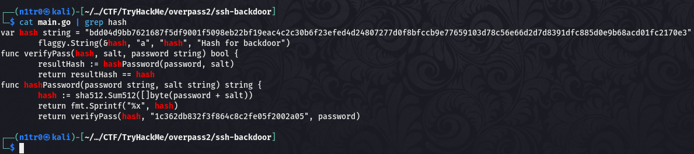

Perfecto, localizamos el hash que estábamos buscando. Para la siguiente pregunta tendremos que localizar una clave hardcodeada. 

Localizamos lo que estábamos buscando, de hecho ya dimos con ello al grepear por la palabra "hash".

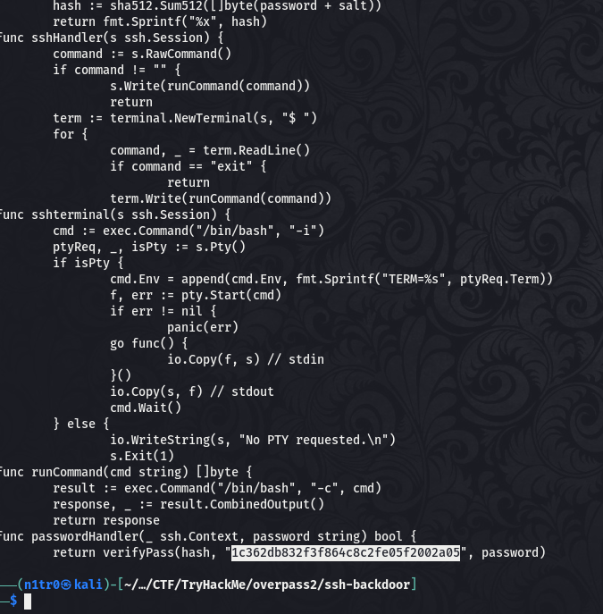

La siguiente pregunta nos pide el hash que el atacante utilizó junto al backdoor, para encontrar ésto tendremos que volver a Wireshark para ver los comandos que utilizó.

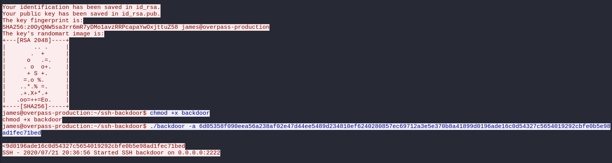

¡Ahí está! Ese es el comando concreto que usó el atacante y el hash que estábamos buscando.

Para la última pregunta de este análisis de código tenemos que tratar de crackear este mismo hash, así que seguiremos el mismo procedimiento que seguimos anteriormente con los hashes de usuario. Usaremos hashcat, esto es preferencia personal, también se podría usar John The Ripper.

Antes de empezar a crackear la contraseña  tendremos que volver al código para comprender cómo se ha encodeado. 

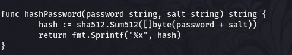

Sabiendo que el formato es SHA512 y la estructura que tiene el hash podemos crear nuestro hash usando el hash que utilizó el atacante seguido de dos puntos y el hash del salt que encontramos previamente.

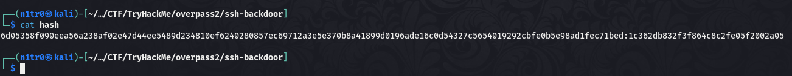

Usamos el manual de hashcat para filtrar por el formato que ya sabemos que tiene este hash.

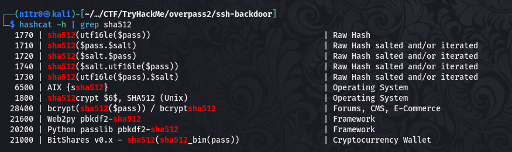

Estamos listos para crackear la contraseña, vamos a ello.

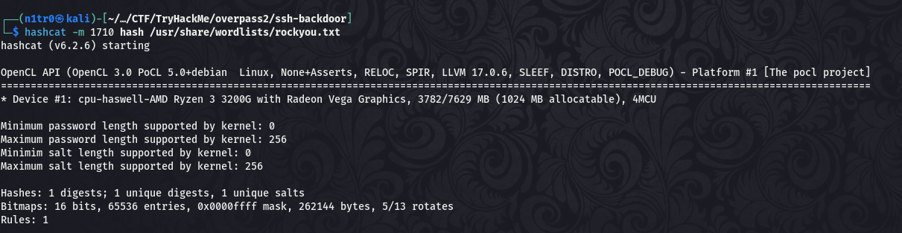

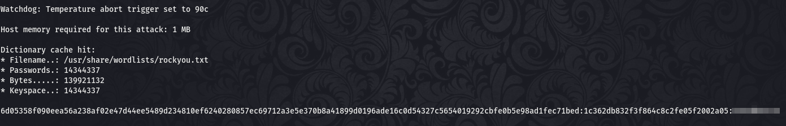

¡Bien! Conseguimos crackear el hash y podemos dar por concluida esta parte del reto.

# Hackeando de vuelta

Nuestro último objetivo es recrear los pasos del atacante así que iniciamos la máquina y nos ponemos manos a la obra. En este caso nos saltaremos la fase de enumeración ya que tenemos el camino abierto y sabemos los pasos concretos que tenemos que dar para lograr acceder al sistema, además tenemos contraseñas de varios usuarios.

Para la primera pregunta nos servirá con simplemente acceder al servidor web para ver el mensaje que dejó el atacante.

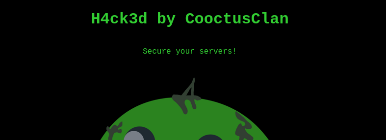

Para conseguir acceder al sistema antes tendremos que pasar un segundo por el stream que teníamos en Wireshark para localizar el puerto en el que el atacante abrió el backdoor que le otorgó persistencia.

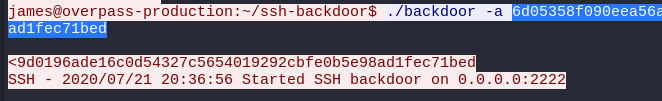

Vemos que fue el puerto 2222, así que vamos a tratar de acceder al mismo.

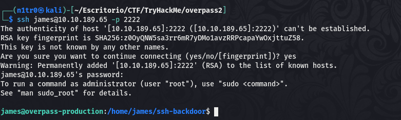

Estamos dentro, vamos a tratar de localizar la primera flag de esta última parte del reto. 

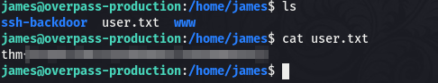

Genial, una vez hemos conseguido la primera flag sólo nos quedaría localizar la forma de elevar nuestros privilegios. Dentro del directorio de nuestro usuario podemos ver que hay un archivo oculto llamado .suid_bash, el cual es bastante interesante, sinceramente, sobre todo porque tiene los permisos suid habilitados y si el binario hace lo que dice el nombre tendríamos una shell como root. 

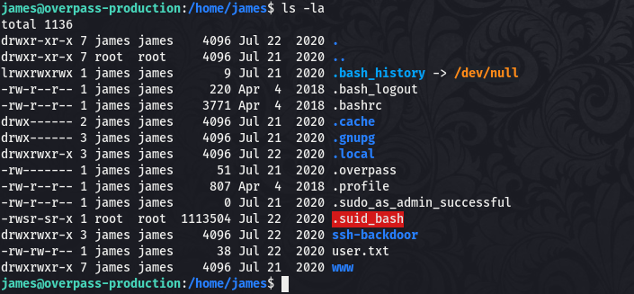

Vamos a probar suerte y ejecutarlo.

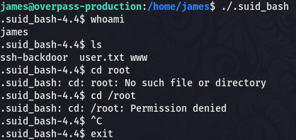

Podemos ver que en principio no ha hecho lo que esperábamos, vamos a añadirle el parámetro -p para indicar que queremos una shell con permisos de usuario root.

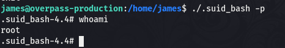

¡Eso es! Tenemos nuestra shell como usuario root y el sistema está comprometido, pudiendo leer la última flag y dando por concluido este divertido reto, el cual ha sido muy distinto a lo habitual.

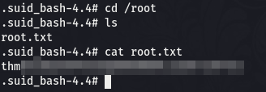

Espero que os haya gustado esta máquina tanto como a mí, espero veros en la siguiente. Si os gusta lo que hago podéis seguirme en [LinkedIn](https://www.linkedin.com/in/abraham-moya-g%C3%B3mez-730180bb) y en [GitHub](https://github.com/NytroMG), os espero :)

