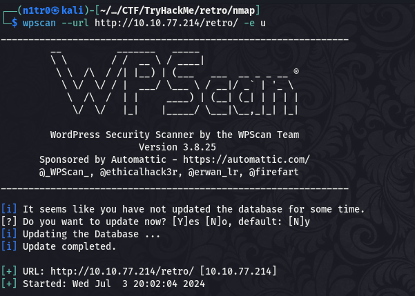
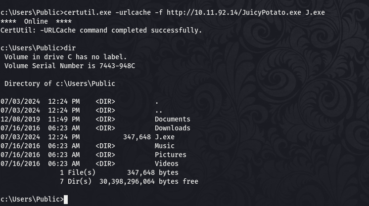

Hola de nuevo y gracias por leerme. Hoy resolveremos una máquina de TryHackMe llamada Retro así que no vamos a perder el tiempo y nos ponemos manos a la obra, espero que os guste y que todos aprendamos mucho juntos. Recordad que todo lo que veremos en el día de hoy se está utilizando en un entorno de pruebas controlado y que su uso fuera de este ámbito no es ético y podría conllevar problemas penales.

---------------------------------------------------------------------------------------------------------------------------------------------------

Como siempre empezaremos conectando nuestra máquina atacante a la VPN de TryHackMe e iniciando la máquina, lo cual no debería llevarnos más de 2 minutos, una vez hecho esto estamos listos para comenzar nuestra aventura.


En este caso TryHackMe nos avisa de que esta máquina no responde al ping, por lo que saltaremos este paso. Procederemos entonces directamente con la fase de enumeración del sistema.

# Enumeración

Como siempre hacemos, comenzaremos escaneando nuestro objetivo para ver qué puertos hay abiertos, guardaremos el output en un archivo para tenerlo a mano si nos hace falta en algún momento.

``` sudo nmap -p- --min-rate 5000 10.10.77.214 -Pn -n -oN escaneo ```


Vemos que tenemos dos puertos abiertos, el 80 haciendo referencia a un servidor web y el 3389 que se relaciona con el servicio RDP de Windows, así que ya sabemos a qué tipo de objetivo nos estamos enfrentando. Vamos a realizar un escaneo más exhaustivo de los puertos abiertos y tratar de enumerar las versiones de los servicios en funcionamiento.

``` sudo nmap -p 80,3389 -sCV 10.10.77.214 -Pn -n -oN escaneoSC ```


No vemos nada revelador en este output más allá del nombre de la máquina, así que como no disponemos de credenciales con las que conectarnos por RDP iremos al puerto 80 a echar un vistazo.


Vemos la página por defecto de Microsoft IIS, vamos a realizar un fuzzeo para descubrir archivos y directorios que no podemos ver a simple vista.

``` wfuzz -u http://10.10.77.214/FUZZ -w /usr/share/seclists/Discovery/Web-Content/directory-list-lowercase-2.3-medium.txt --hc 404,403 -c ```


Encontramos un directorio llamado retro, vamos a ver qué contiene.


Parece que estamos ante una web para los fanáticos de los videojuegos retro, bastante agradable por cierto (gusto personal). Si nos fijamos bien hay algo que nos llama la atención nada más entrar.


Parece que estamos ante un blog, y vemos que Wade es uno de los autores del mismo. Con estas dos cosas en mente podemos empezar a pensar que este blog puede estar alojado en algún CMS, usemos Wappalyzer para ver si estamos en lo correcto.


Eso es, estamos ante un Wordpress y tenemos un posible usuario, si damos con el panel de login podríamos tratar de realizar un ataque de fuerza bruta. Vamos a volver a fuzzear en este caso a partir del directorio en el que nos encontramos, paralelamente usaremos la herramienta WPScan para enumerar el CMS.




Efectivamente, el usuario wade es válido dentro del CMS, vamos a ver qué tal va nuestra búsqueda de directorios.


Genial, encontramos el panel de login, podemos atacarlo por fuerza bruta para lograr un inicio de sesión exitoso y obtener unas credenciales válidas.


Vemos un error, vamos a añadir el nombre de la máquina que encontramos en nuestro escaneo de puertos al archivo /etc/hosts para que la resolución se haga correctamente.


Sigue dando un error, para solucionarlo simplemente navegamos por el sitio para dar con el panel de login.


Lo tenemos, ahora podemos realizar el ataque para intentar conseguir la contraseña del usuario wade, usaré hydra por preferencia personal. Antes verificaremos que el usuario existe ya que Wordpress permite enumerar usuarios manualmente por el output que nos da.


# Explotación

Genial, el usuario existe, vamos a conseguir su contraseña.


Mientras se realiza el ataque me doy un paseo por el blog y veo algo que llama realmente mi atención. El usuario wade habla de la película Ready Player One y comenta que aún se equivoca al hacer login con el nombre del avatar del protagonista, ¿en serio? Vamos a hacer una pequeña investigación.


Vamos a probar a hacer login usando este nombre como contraseña.


Bueno... Esto es algo que no me esperaba xD 

Como ya hemos visto en otras ocasiones si podemos acceder al panel de administrador de un Wordpress podemos editar las plantillas para conseguir una reverse shell y enviar una conexión a nuestra máquina atacante. Vamos a hacerlo.


Accedemos a la pestaña de edición de plantillas de Wordpress y añadimos una reverse shell a la página 404.php. Esta tendremos que editarla para añadir nuestra IP y el puerto en el que nos vamos a poner a escuchar para recibir la shell.


¡Bien! Tenemos nuestro primer acceso a la máquina, ahora tenemos que tratar de elevar nuestros privilegios dentro del sistema.

# Post-Explotación

Una vez dentro de la máquina trataremos de listar nuestros permisos de usuario en busca de alguno que nos de la posibilidad de escalar privilegios. Para esto usaremos el comando ``` whoami /priv ```.


Vemos que el usuario tiene habilitado el permiso 'SeImpersonatePrivilege', el cual se puede aprovechar para escalar dentro del sistema gracias al ataque Juicy Potato. Podéis encontrar más información acerca de la misma [aquí](https://book.hacktricks.xyz/v/es/windows-hardening/windows-local-privilege-escalation/juicypotato).

Con esto en mente vamos a tratar de explotar la vulnerabilidad. Descargaremos el exploit y lo subiremos a un servidor python que levantaremos en nuestra máquina atacante para descargarlo desde la máquina víctima.





Genial, tenemos nuestro ejecutable en la máquina víctima y podemos usarlo, vamos a escalar dentro de la máquina para hacernos con el control absoluto. Tendremos que tener otro archivo para ejecutar como un usuario privilegiado gracias a este exploit, en nuestro caso será una shell que enviará una conexión a nuestra máquina atacante como el usuario nt authority\system.

Para crear la shell usaremos msfvenom.


Repetiremos el proceso anterior para descargar la shell en la máquina víctima.


Con todo preparado podemos lanzar nuestro ejecutable para aprovecharnos del privilegio 'SeImpersonatePrivilege' y elevar nuestros privilegios. Nos pondremos en escucha mediante metasploit para recibir la conexión.


Recibimos nuestra conexión y verificamos nuestro usuario.


¡Genial! Hemos conseguido comprometer la máquina por completo y podemos leer las dos flags dando por concluida esta máquina.


Espero que os haya gustado tanto como a mí y espero veros en la siguiente. :)


